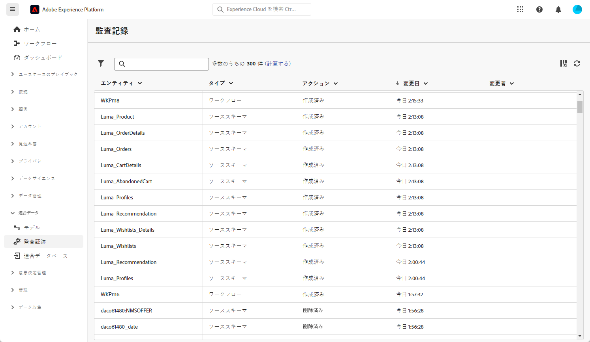

# 監査証跡 {#audit-trail}

>[!CONTEXTUALHELP]
>id="dc_audit_trail"
>title="監査記録"
>abstract="監査記録機能は、Adobe Experience Platform Federated Audience Composition 環境に対して実行されたすべてのアクションとイベントの詳細な時系列の記録をリアルタイムで提供します。"

監査記録機能は、環境に対して実行されたすべてのアクションとイベントの詳細な時系列の記録をリアルタイムで提供します

**[!UICONTROL 監査記録]** 機能は、Adobeの Federated Composition インスタンス内で発生したアクションとイベントの詳細なログを常にリアルタイムで記録します。 データの時系列の記録にアクセスする便利な方法を提供し、ワークフローのステータス、ワークフローを変更した直近のユーザー、インスタンス内でユーザーが実行したアクティビティなどのクエリに対処します。

+++ 監査記録が使用可能なエンティティについて説明します

* **Source スキーマ監査証跡** を使用すると、Adobeの Federated Audience Composition インスタンス内のスキーマに対して行われたアクティビティと最近の変更を監視できます。

  スキーマについて詳しくは、この [ ページ ](../customer/schemas.md) を参照してください。

* **ワークフロー監査証跡**&#x200B;を使用すると、アクティビティとワークフローに対して行った最近の変更とを追跡できます。その例として、次のような現在の状態があります。

   * 開始
   * 一時停止
   * 停止
   * 再度開始
   * クリーンアップ（「履歴をパージ」アクションと同じ）
   * シミュレーション（「シミュレーションモードで開始」アクションと同じ）
   * ウェイクアップ（「保留中のタスクを今すぐ実行」アクションと同じ）
   * 無条件停止

  ワークフローについて詳しくは、この[ページ](../compositions/gs-compositions.md)を参照してください。

* **外部アカウント** を使用すると、Adobeオーディエンス構成インスタンスで外部アカウントに加えられた変更を確認できます。

  外部アカウントについて詳しくは、この[ページ](../connections/federated-db.md)を参照してください。

+++

## 監査記録へのアクセス {#accessing-audit-trail}

インスタンスの&#x200B;**[!UICONTROL 監査記録]**&#x200B;にアクセスするには：

1. **[!UICONTROL Federated data]** メニューで、「**[!UICONTROL 監査記録]**」を選択します。

1. **[!UICONTROL 監査記録]**&#x200B;ウィンドウが開き、エンティティのリストが表示されます。Federated Audience Composition は、ワークフロー、オプション、配信およびスキーマの作成、編集および削除アクションを監査します。

   

1. **[!UICONTROL エンティティを監査]**&#x200B;ウィンドウには、選択したエンティティに関する次のような詳細情報が表示されます。

   * **[!UICONTROL タイプ]**：ワークフロー、オプション、配信、スキーマ。
   * **[!UICONTROL エンティティ]**：アクティビティの内部名。
   * **[!UICONTROL 変更者]**：このエンティティを最後に変更したユーザーのユーザー名。
   * **[!UICONTROL アクション]**：このエンティティで最後に実行されたアクション（作成済み、変更済み、削除済み）。
   * **[!UICONTROL 変更日]**：このエンティティで最後に実行されたアクションの日付。
