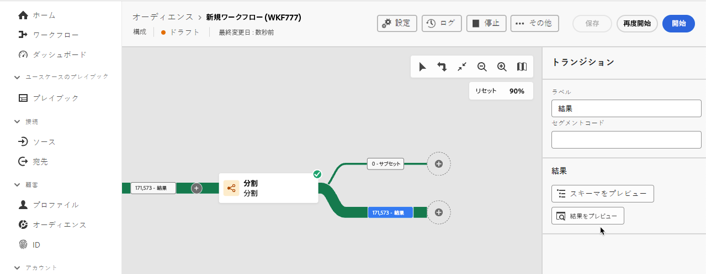

# アクティビティの概要

Federated Audience Composition では、オーディエンスの定義に役立つアクティビティとトランジションを追加できます。

## アクティビティ {#activities}

アクティビティを使用すると、オーディエンス内のコンポーネントを定義できます。

Federated Audience Composition 内で使用するアクティビティには、ターゲティングアクティビティとフロー制御アクティビティの **2 種類** あります。

### ターゲティングアクティビティ {#targeting}

ターゲティングアクティビティを使用すると、コンポジションのオーディエンスを構成する要素を定義できます。

#### オーディエンスを作成

>[!CONTEXTUALHELP]
>id="dc_orchestration_build_audience_audienceselector"
>title="オーディエンス"
>abstract="オーディエンスを選択します。"

**オーディエンスを作成** アクティビティでは、コンポジションのターゲット母集団を定義できます。 既存のオーディエンスを選択するか、クエリモデラーを使用して独自のクエリを定義できます。

+++ 設定の詳細

**オーディエンスを作成** アクティビティをコンポジションキャンバスに追加した後、オーディエンスに名前を付けます。 オーディエンスを作成するか、既存のオーディエンスを使用するかを指定できるようになりました。

>[!BEGINTABS]

>[!TAB  新しいオーディエンスを作成 ]

**オーディエンスを作成** を選択した後、オーディエンスの **スキーマ** を選択します。 スキーマを使用すると、受信者、契約の受益者、オペレーター、購読者など、操作のターゲットとなる母集団を定義できます。 デフォルトでは、スキーマは受信者から選択されます。

スキーマを選択したら、「**続行**」を選択します。 これで、クエリModeler内でオーディエンスの定義を定義できます。 クエリModelerの使用について詳しくは、[&#x200B; クエリModelerの概要 &#x200B;](../query/home.md) を参照してください。

>[!TAB  既存のオーディエンスを使用 ]

**オーディエンスを読み取り** を選択した後、「**続行** を選択します。

コンポジションに使用するオーディエンスを選択できるようになりました。

>[!ENDTABS]

オプションを選択したら、「アウトバウンドトランジションを生成 **を選択でき** す。 これを選択すると、オーディエンス母集団が空の場合に、アクティビティの実行の最後にアクティベートされるアウトバウンドトランジションを追加できます。

+++

#### データソースを変更

**データソースを変更** アクティビティを使用すると、コンポジションで使用されているデータソースを変更できます。

+++ 設定の詳細

コンポジションキャンバスに **データソースを変更** アクティビティを追加したら、コンポジションに使用するデータソースを定義できます。

{zoomable="yes"}{width="70%"}

| ソース | 説明 |
| ------ | ----------- |
| FDA 外部アカウント | 連合オーディエンス構成に接続された外部クラウドデータベース。 |

**[!UICONTROL FDA 外部アカウント]**&#x200B;を選択したら、接続する外部アカウントを選択できます。

{zoomable="yes"}{width="70%"}

+++

#### ディメンションを変更

>[!CONTEXTUALHELP]
>id="dc_orchestration_dimension_complement"
>title="補集合の生成"
>abstract="重複として除外された残りの母集団を使用して、追加のアウトバウンドトランジションを生成できます。 これを行うには、「**[!UICONTROL 補集合を生成]**」オプションの切替スイッチをオンにします。"

>[!CONTEXTUALHELP]
>id="dc_orchestration_change_dimension"
>title="ディメンションを変更アクティビティ"
>abstract="このアクティビティを使用すると、オーディエンスの作成時にスキーマ（ターゲティングディメンションとも呼ばれる）を変更できます。データテンプレートと入力スキーマに応じて軸を移動します。例えば、「契約」スキーマから「クライアント」スキーマに切り替えることができます。"

「**ディメンションを変更**」アクティビティを使用すると、コンポジションのスキーマ（ターゲティングディメンションとも呼ばれます）を変更できます。

+++ 設定の詳細

**ディメンションを変更** アクティビティをコンポジションキャンバスに追加した後、新しいスキーマを定義して、以前のスキーマを置き換えることができます。 このスキーマの変更中、すべてのレコードが保持されます。

コンポジションを実行すると、結果が更新されます。

+++

#### 結合

>[!CONTEXTUALHELP]
>id="dc_orchestration_combine"
>title="アクティビティを結合"
>abstract="**結合**&#x200B;アクティビティを使用すると、インバウンド母集団でセグメント化を実行できます。したがって、いくつもの母集団を組み合わせて、一部を除外したり、複数のターゲットに共通するデータのみを保持したりできます。"

>[!CONTEXTUALHELP]
>id="dc_orchestration_intersection_merging_options"
>title="「積集合」結合オプション"
>abstract="「**積集合**」を使用すると、アクティビティ内の様々なインバウンド母集団に共通の要素のみを保持できます。 「**結合するセット**」セクションで、結合するすべての前のアクティビティをオンにします。"

>[!CONTEXTUALHELP]
>id="dc_orchestration_exclusion_merging_options"
>title="「除外結合」オプション"
>abstract="**除外** を使用すると、特定の条件に従って、ある母集団から要素を除外できます。 「**結合するセット**」セクションで、結合するすべての前のアクティビティをオンにします。"

>[!CONTEXTUALHELP]
>id="dc_orchestration_combine_options"
>title="セグメント化タイプの選択"
>abstract="オーディエンスを組み合わせる方法（和集合、積集合、除外）を選択します。"

>[!CONTEXTUALHELP]
>id="dc_orchestration_intersection_reconciliation_options"
>title="積集合の紐付けオプション"
>abstract="紐付けタイプを選択して、重複の処理方法を定義します。"

>[!CONTEXTUALHELP]
>id="dc_orchestration_combine_reconciliation"
>title="紐付けオプション"
>abstract="「**紐付けタイプ**」を選択して、重複の処理方法を定義します。"

>[!CONTEXTUALHELP]
>id="dc_orchestration_exclusion_options"
>title="除外ルール"
>abstract="必要に応じて、インバウンドテーブルを操作できます。別のスキーマ（ターゲティングディメンションとも呼ばれる）からターゲットを除外するには、このターゲットが同じスキーマをメインターゲットとして返す必要があります。それには、「E **xclusion rules**」セクションの **ルールを追加** を選択し、スキーマの変更条件を指定します。 データの紐付けは、属性または結合を使用して実行されます。"

>[!CONTEXTUALHELP]
>id="dc_orchestration_combine_sets"
>title="結合するセットを選択"
>abstract="「**結合の設定**」セクションで、インバウンドトランジションから「**プライマリセット**」を選択します。 これは、要素の除外元のセットです。 これ以外のセットは、プライマリセットから除外する前の要素に一致します。"

>[!CONTEXTUALHELP]
>id="dc_orchestration_combine_exclusion"
>title="除外ルール"
>abstract="必要に応じて、インバウンドテーブルを操作できます。別のスキーマ（ターゲティングディメンションとも呼ばれる）からターゲットを除外するには、このターゲットが同じスキーマをメインターゲットとして返す必要があります。それには、「**除外ルール**」セクションで **ルールを追加** を選択し、スキーマの変更条件を指定します。 データの紐付けは、属性または結合を使用して実行されます。"

>[!CONTEXTUALHELP]
>id="dc_orchestration_combine_complement"
>title="結合で補集合を生成"
>abstract="「**補集合を生成**」オプションの切替スイッチをオンにして、追加のトランジションで残りの母集団を処理します。"

>[!NOTE]
>
>**結合** アクティビティ **必須** は別のアクティビティの後に配置し、**指定できません** はコンポジションの先頭に配置します。

**結合** アクティビティを使用すると、和集合、積集合、除外など、様々な方法で複数のオーディエンスを結合できます。

- **和集合**：和集合は、様々なオーディエンスを 1 つのオーディエンスに結合します。 これは OR 演算と同じです。
- **積集合**：積集合は、**共有** コンテンツのみが保持された状態で、様々なオーディエンスを 1 つのオーディエンスに結合します。 これは AND 演算と同じです。
- **除外**：除外は、指定された除外ルールなしで、様々なオーディエンスを 1 つのオーディエンスに結合します。 これは XOR 演算と同じです。

+++ 設定の詳細

複数のアクティビティを追加して **2 つ** 以上の異なる分岐を形成した後、**結合** アクティビティをいずれかの分岐の最後に追加します。 結合オプションの 1 つ（和集合、積集合、除外）を選択できるようになりました。

>[!BEGINTABS]

>[!TAB 和集合]

**和集合** を選択した場合は、結合アクティビティで **紐付けタイプ** を選択する必要があります。 紐付けタイプでは、重複エントリの処理方法を定義できます。

- **キーのみ**: **キーのみ** を選択すると、複数の要素が同じキーを持つ場合に **1** 要素が保持されます。 このオプションは、受け取る母集団が同種の場合にのみ使用できます。
- **列の選択**：選択 **列の選択** を使用すると、データの紐付けが適用される列のリストを定義できます。 ソースデータを含むデータのプライマリセットを選択し、その後に結合に使用する列を選択できます。

>[!TAB 積集合]

**積集合** を選択した場合は、結合アクティビティで **紐付けタイプ** を選択する必要があります。 紐付けタイプでは、重複エントリの処理方法を定義できます。

- **キーのみ**: **キーのみ** を選択すると、複数の要素が同じキーを持つ場合に **1** 要素が保持されます。 このオプションは、受け取る母集団が同種の場合にのみ使用できます。
- **列の選択**：選択 **列の選択** を使用すると、データの紐付けが適用される列のリストを定義できます。

紐付けタイプを設定した後、「**補集合を生成**」オプションを選択することもできます。 補集合を生成すると、残りの母集団が処理され、積集合の一部として含まれる **含まない** データが含まれます。 追加のアウトバウンドトランジションがアクティビティに追加されます。

>[!TAB 除外]

**除外** を選択した場合は、インバウンドトランジションから **プライマリセット** を選択する必要があります。 要素の除外元となるセットを表します。

プライマリセットを選択した後、**除外ルール** を設定できます。 **属性による一致** または **結合** を選択できます。

除外ルールを設定したら、「**補集合を生成**」オプションを選択することもできます。 補集合を生成すると、残りの母集団が処理され、除外の一部として含まれる **含まない** データが含まれます。 追加のアウトバウンドトランジションがアクティビティに追加されます。

+++

#### 重複の除外

>[!CONTEXTUALHELP]
>id="dc_orchestration_deduplication_fields"
>title="重複を識別するためのフィールド"
>abstract="「**[!UICONTROL 重複を識別するフィールド]**」セクションで、「**[!UICONTROL 属性を追加]**」ボタンを選択して、メールアドレス、名、姓など、同一の値で重複を識別できるフィールドを指定します。 フィールドの順序によって、最初に処理するフィールドを指定できます。"

>[!CONTEXTUALHELP]
>id="dc_orchestration_deduplication"
>title="重複排除アクティビティ"
>abstract="**重複排除 - 重複**&#x200B;アクティビティでは、インバウンドアクティビティの結果から重複を削除できます。 主に、ターゲティングアクティビティの後と、ターゲティングデータを使用できるアクティビティの前に使用されます。"

>[!CONTEXTUALHELP]
>id="dc_orchestration_deduplication_complement"
>title="補集合の生成"
>abstract="重複として除外された残りの母集団を使用して、追加のアウトバウンドトランジションを生成できます。 これを行うには、「**[!UICONTROL 補集合を生成]**」オプションの切替スイッチをオンにします。"

>[!CONTEXTUALHELP]
>id="dc_orchestration_deduplication_settings"
>title="重複排除設定"
>abstract="受信データ内の重複を削除するには、以下のフィールドで「重複排除 - 重複」メソッドを定義します。 デフォルトでは、1 つのレコードのみが保持されます。 また、式または属性に基づいて「重複排除 - 重複」モードを選択する必要があります。 デフォルトでは、重複から除外するレコードはランダムに選択されます。"

**重複排除** アクティビティは、オーディエンス内の重複結果を削除します。

+++ 設定の詳細

>[!NOTE]
>
>複数のインバウンドトランジションがある場合は、まずドロップダウンから **0&rbrace;プライマリセット &rbrace; を選択する必要があります。**

**重複排除** アクティビティを追加した後、重複を識別するためのフィールドを選択できます。 **属性を追加** を選択して、重複が発生する可能性のあるフィールドを識別します。

フィールドを識別したら、重複排除設定を設定できます。

| 設定 | 説明 |
| ------- | ----------- |
| 保持する複製 | 保持する重複レコードの数。 値を 0 に設定すると、重複した **すべて** レコードが保持されます。 |
| 重複排除方法 | 重複レコードを削除するメソッド。 <ul><li>**ランダム選択**：削除されたレコードがランダムに選択されます。</li><li>**式の使用**：削除されたレコードは、送信された式に基づきます。 削除する値に応じて、昇順または降順に並べ替えることができます。</li><li>**空でない値**：削除されたレコードは送信された式に基づいています。 式に値がないレコードは削除されます。</li><li>**値のリストの使用**：削除されたレコードは、送信されたフィールドまたは式に基づきます。 残りの値は、ランダム、昇順または降順で並べ替えることができます。</li></ul> |

さらに、「**補集合を生成**」オプションを選択できます。 補集合を生成すると、残りの母集団が処理され、重複排除の一部として含まれる **含まない** データが含まれます。 追加のアウトバウンドトランジションがアクティビティに追加されます。

+++

#### エンリッチメント

>[!CONTEXTUALHELP]
>id="dc_orchestration_enrichment"
>title="エンリッチメントアクティビティ"
>abstract="**エンリッチメント**&#x200B;アクティビティでは、データベースからの追加情報を使用してターゲットデータを強化できます。 一般的に、セグメント化アクティビティ後の構成で使用されます。"

>[!CONTEXTUALHELP]
>id="dc_orchestration_enrichment_data"
>title="「エンリッチメント」アクティビティ"
>abstract="エンリッチメントデータを構成に追加すると、「**エンリッチメント**」アクティビティの後に追加したアクティビティでこのデータを使用して、行動、環境設定、選択に基づいてプロファイルを個別のグループにセグメント化できます。"

>[!CONTEXTUALHELP]
>id="dc_orchestration_enrichment_simplejoin"
>title="リンク定義"
>abstract="作業テーブルデータと連合データベースの間にリンクを作成します。"

>[!CONTEXTUALHELP]
>id="dc_orchestration_enrichment_reconciliation"
>title="エンリッチメントの紐付け"
>abstract="紐付けパラメーターを設定します。"

>[!CONTEXTUALHELP]
>id="dc_targetdata_personalization_enrichmentdata"
>title="エンリッチメントデータ"
>abstract="構成の強化に使用するデータを選択します。 2 種類のエンリッチメントデータを選択できます。スキーマの単一のエンリッチメント属性（ターゲティングディメンションとも呼ばれる）、またはテーブル間の基数が 1-N のリンクであるコレクションリンクです。"

**エンリッチメント** アクティビティを使用すると、連合データベースから追加のデータを追加して、コンポジションを強化できます。

連合オーディエンス構成の宛先への接続を設定している場合は、エンリッチメントアクティビティを使用すると、外部データベースからの属性を使用して Adobe Experience Platform から受信するデータを強化できます。[詳しくは、外部データを使用して Adobe Experience Platform オーディエンスを強化する方法を参照してください](../connections/destinations.md)

+++ 設定の詳細

>[!NOTE]
>
>複数のインバウンドトランジションがある場合は、まずドロップダウンから **0&rbrace;プライマリセット &rbrace; を選択する必要があります。**

**エンリッチメント** アクティビティをコンポジションに追加した後、**エンリッチメントデータを追加** を選択して、コンポジションを充実させるために使用する属性を選択できます。 **式を編集** を選択して、属性を選択する高度な式を作成できます。

+++

#### 紐付け

>[!CONTEXTUALHELP]
>id="dc_orchestration_reconciliation"
>title="紐付けアクティビティ"
>abstract="「**紐付け**」アクティビティを使用すると、データベース内のデータとワークテーブル内のデータ間のリンクを定義できます。"

>[!CONTEXTUALHELP]
>id="dc_orchestration_reconciliation_field"
>title="紐付け選択フィールド"
>abstract="紐付け選択フィールド"

>[!CONTEXTUALHELP]
>id="dc_orchestration_reconciliation_condition"
>title="紐付け作成条件"
>abstract="紐付け作成条件"

>[!CONTEXTUALHELP]
>id="dc_orchestration_reconciliation_complement"
>title="紐付けで補集合を生成"
>abstract="紐付けで補集合を生成"

>[!CONTEXTUALHELP]
>id="dc_orchestration_reconciliation_targeting"
>title="スキーマ"
>abstract="データに適用する新しいスキーマを選択します。スキーマ（ターゲティングディメンションとも呼ばれる）を使用すると、ターゲット母集団（受信者、アプリのサブスクライバー、オペレーター、サブスクライバーなど）を定義できます。デフォルトでは、現在の構成スキーマが選択されています。"

>[!CONTEXTUALHELP]
>id="dc_orchestration_reconciliation_rules"
>title="紐付けルール"
>abstract="重複排除 - 重複に使用する紐付けルールを選択します。 属性を使用するには、「**単純な属性**」オプションを選択し、ソースフィールドと宛先フィールドを選択します。 クエリモデラーを使用して独自の紐付け条件を作成するには、「**高度な紐付け条件**」オプションを選択します。"

>[!CONTEXTUALHELP]
>id="dc_orchestration_reconciliation_targeting_selection"
>title="ターゲティングディメンションの選択"
>abstract="紐付けするインバウンドデータのスキーマ（ターゲティングディメンションとも呼ばれる）を選択します。"

>[!CONTEXTUALHELP]
>id="dc_orchestration_keep_unreconciled_data"
>title="紐付けられていないデータの保持"
>abstract="デフォルトでは、紐付けされていないデータは、アウトバウンドトランジションに保持され、後で使用するためにワークテーブルで使用できます。 紐付けられていないデータを削除するには、「**紐付けされていないデータを保持**」オプションを非アクティブ化します。"

>[!CONTEXTUALHELP]
>id="dc_orchestration_reconciliation_attribute"
>title="紐付け属性"
>abstract="データの紐付けに使用する属性を選択し、確認します。"

>[!NOTE]
>
>デフォルトでは、紐付けされていないデータはアウトバウンドトランジションに保持され、今後の使用のためにワークテーブルで使用できます。 紐付けされたデータを使用し **い** い場合は、「**紐付けられていないデータを保持** オプションを非アクティブにします。

**紐付け** アクティビティでは、連合データベース内のデータとワークテーブル内のデータとのリンクを定義できます。

+++ 設定の詳細

**紐付け** アクティビティをコンポジションに追加した後、紐付けに使用するスキーマを選択できます。

スキーマを選択したら、紐付けルールを設定する必要があります。 **単純属性** または **高度な紐付け条件** から選択できます。

>[!BEGINTABS]

>[!TAB  シンプルな属性 ]

**単純属性** を選択した後、「**ルールを追加**」を選択します。 **Source** および **宛先** フィールドを追加して、紐付けを設定できるようになりました。 「**宛先**」フィールドは、選択したスキーマのフィールドに対応します。

ソースと宛先が等しい場合、データは紐付けされます。 「**ルールを追加**」を選択して、紐付け条件をさらに追加できます。 複数の結合条件を指定する場合は、データをリンクできるように、それらの **すべて** を検証する必要があります。

>[!TAB  高度な紐付け条件 ]

「**詳細な紐付け条件**」を選択した後、「**条件の作成**」を選択します。 クエリモデラーを使用して、独自の紐付け条件を作成できるようになりました。 クエリModelerの使用について詳しくは、[&#x200B; クエリModelerの概要 &#x200B;](../query/home.md) を参照してください

>[!ENDTABS]

紐付けられたデータをフィルタリングすることもできます。 **フィルターを作成** を選択し、クエリ Modelerを使用してカスタム条件を作成します。 クエリModelerの使用について詳しくは、[&#x200B; クエリModelerの概要 &#x200B;](../query/home.md) を参照してください

+++

#### オーディエンスの保存

>[!CONTEXTUALHELP]
>id="dc_orchestration_save_audience"
>title="オーディエンスの保存"
>abstract="このアクティビティを使用して、構成のアップストリームで計算された母集団から新しいオーディエンスを作成します。作成したオーディエンスはオーディエンスのリストに追加され、**オーディエンス**&#x200B;メニューから使用できます。"

>[!CONTEXTUALHELP]
>id="dc_orchestration_saveaudience_outbound"
>title="アウトバウンドトランジションを生成"
>abstract="「**オーディエンスを保存**」アクティビティの後にトランジションを追加する場合は、このオプションを使用します。"

>[!CONTEXTUALHELP]
>id="dc_orchestration_save_audience_primary_identity"
>title="プライマリ ID フィールド"
>abstract="プロファイルに使用するプライマリ ID を選択します。"
>additional-url="https://experienceleague.adobe.com/ja/docs/experience-platform/xdm/ui/fields/identity#define-a-identity-field" text="詳しくは、Experience Platform のドキュメントを参照してください"

>[!CONTEXTUALHELP]
>id="dc_orchestration_saveaudience_namespace"
>title="ID 名前空間"
>abstract="プロファイルに使用する名前空間を選択します。"
>additional-url="https://experienceleague.adobe.com/ja/docs/experience-platform/identity/features/namespaces" text="詳しくは、Experience Platform のドキュメントを参照してください"

>[!IMPORTANT]
>
>サンドボックスで&#x200B;**データセットの優先順位**&#x200B;結合ポリシーを使用している場合は、アドビカスタマーケアに連絡して、`Halos UPS` のデータセットを結合ポリシーに追加してください。
>
>結合ポリシーについて詳しくは、[結合ポリシーの概要](https://experienceleague.adobe.com/ja/docs/experience-platform/profile/merge-policies/overview)を参照してください。

**オーディエンスを保存** アクティビティを使用すると、コンポジションからオーディエンスを作成できます。 オーディエンスを作成したら、Adobe Experience Platformのオーディエンスポータル内で使用できます。 Federated Audience Composition でのオーディエンスの使用について詳しくは、[&#x200B; オーディエンスの概要 &#x200B;](../start/audiences.md) を参照してください。 Experience Platformのオーディエンスについて詳しくは、[&#x200B; オーディエンスポータルの概要 &#x200B;](https://experienceleague.adobe.com/ja/docs/experience-platform/segmentation/ui/audience-portal){target="_blank"} を参照してください。

+++ 設定の詳細

>[!IMPORTANT]
>
>オーディエンスの名前 **必須** は、現在のサンドボックス内で一意である必要があり、既存のオーディエンスと同じ名前を持つことはできません。

**オーディエンスを保存** アクティビティをコンポジションに追加した後、新しく作成したオーディエンスの名前を指定できます。

これで、マッピングを指定して、新しく作成されたオーディエンスに転送するフィールドを選択できます。 「**オーディエンスマッピングを追加**」を選択し、「ソースオーディエンス」フィールドと「ターゲットオーディエンス」フィールドを選択します。これは、必要な回数だけ繰り返されます。

マッピングを追加したら、プライマリ ID と名前空間を選択して、データベース内のターゲットプロファイルを識別できます。 プライマリ ID フィールドはプロファイルの識別に使用され、ID 名前空間は ID を識別するキーとして機能します。

+++

#### 分割

>[!CONTEXTUALHELP]
>id="dc_orchestration_split"
>title="分割アクティビティ"
>abstract="**分割**&#x200B;アクティビティを使用すると、フィルタリングルールや母集団サイズなどの様々な選択条件に基づいて、流入母集団を複数のサブセットにセグメント化できます。"

>[!CONTEXTUALHELP]
>id="dc_orchestration_split_segments"
>title="分割アクティビティのセグメント"
>abstract="入力母集団をセグメント化するのに必要な数のサブセットを追加します。  「**分割**」アクティビティを実行すると、母集団はアクティビティに追加された順序で様々なサブセットに分割されます。 構成を開始する前に、矢印ボタンを使用して、必要に応じてサブセットを順番に並べ替えておきます。"

>[!CONTEXTUALHELP]
>id="dc_orchestration_split_filter"
>title="分割アクティビティのフィルター"
>abstract="サブセットにフィルター条件を適用するには、「**[!UICONTROL フィルターを作成]** を選択し、クエリモデラーを使用して目的のフィルタールールを設定します。 例えば、データベースにメールアドレスが存在する入力母集団のプロファイルを含めます。"

>[!CONTEXTUALHELP]
>id="dc_orchestration_split_limit"
>title="分割アクティビティの制限"
>abstract="サブセットで選択するプロファイル数を制限するには、「**[!UICONTROL 制限を有効にする]**」オプションの切替スイッチをオンにし、含める母集団の数または割合を指定します。"

>[!CONTEXTUALHELP]
>id="dc_orchestration_split_sorting"
>title="分割アクティビティの並べ替え"
>abstract="サブセットの母集団制限を設定する場合、特定のプロファイル属性に基づいて、選択したプロファイルを昇順または降順にランク付けできます。 これを行うには、「**並べ替えを有効にする**」オプションの切替スイッチをオンにします。 例えば、購入金額が最も高い上位 50 のプロファイルのみを含むようにサブセットを制限できます。"

>[!CONTEXTUALHELP]
>id="dc_orchestration_split_complement"
>title="分割で補集合を生成"
>abstract="すべてのサブセットを設定したら、どのサブセットにも一致しなかった残りの母集団を選択し、追加のアウトバウンドトランジションに含めることができます。 これを行うには、「**補集合を生成**」オプションの切替スイッチをオンにします。"

>[!CONTEXTUALHELP]
>id="dc_orchestration_split_generatesubsets"
>title="同じテーブルにすべてのサブセットを生成"
>abstract="このオプションをオンに切り替えると、すべてのサブセットが 1 つの出力トランジションにグループ化されます。"

>[!CONTEXTUALHELP]
>id="dc_orchestration_split_emptytransition"
>title="空のトランジションをスキップ"
>abstract="「**[!UICONTROL 空のトランジションをスキップ]**」オプションをオンに切り替えると、入力母集団が空の場合に、このサブセットの出力トランジションが無効になります。"

>[!CONTEXTUALHELP]
>id="dc_orchestration_split_enable_overlapping"
>title="出力母集団の重複を有効にする"
>abstract="「**[!UICONTROL 出力母集団の重複を有効にする]**」オプションにより、複数のサブセットに属している母集団を管理できます。このオプションを選択していない場合、サブセットの条件を複数満たす場合でも、複数の出力トランジションに受信者が表示されません。受信者は、一致した基準の 1 番目のタブのターゲットになります。チェックボックスをオンにすると、受信者がフィルター条件を満たす場合、複数のサブセットで受信者を検索できます。 "

**分割** アクティビティでは、指定された条件に応じて、入力母集団を複数の部分に分割します。

+++ 設定の詳細

>[!IMPORTANT]
>
>**分割** アクティビティを実行すると、母集団は、異なるサブセット間で **追加された順序** に分割されます。 例えば、最初のサブセットが初期母集団の 70% を分割した場合、次のサブセットは残りの 30% に選択条件を適用します。
>
>コンポジションを実行する前に、分割を実行する順序でサブセットを並べ替えていることを確認してください。

**分割** アクティビティをコンポジションに追加した後、オーディエンスのサブセット化方法を決定できるようになりました。 「**セグメントを追加**」を選択して、様々な分岐パスを作成します。

これらのサブパスそれぞれの詳細を指定できるようになりました。 サブパスに名前を付け、フィルター条件を指定できます。 フィルター条件を作成するには、「**フィルターを作成** を選択し、クエリ Modelerを使用してフィルタールールを設定します。 クエリModelerの使用について詳しくは、[&#x200B; クエリModelerの概要 &#x200B;](../query/home.md) を参照してください。

フィルター条件を作成したら、次の追加ルールを適用できます。

- **制限を有効にする**：サブセットに分割できるプロファイルの数を制限します。 これは、数値または母集団の割合で設定できます。
   - 制限を有効にすると、特定のプロファイル属性に基づいて、選択したプロファイルをランク付けすることもできます。 **並べ替えを有効にする** をオンにすると、属性を昇順または降順で並べ替えることができます。
- **空のトランジションをスキップ**：入力母集団が空の場合、トランジションを無効にします。

これでサブセットが設定されたので、設定可能なその他のオプションがいくつか用意されています。

| オプション | 説明 |
| ------- | ----------- |
| **補集合を生成** | 残りの母集団を含むアウトバウンドトランジションを作成します。 |
| **出力母集団の重複を有効にする** | 有効にすると、受信者 **できません** は複数のアウトバウンドトランジションに存在し、最初のアウトバウンドトランジションに **のみ** 存在します。 無効にした場合、受信者 **can** は複数のアウトバウンドトランジションに表示されます。 |
| **同じテーブルにすべてのサブセットを生成** | すべてのサブセットを 1 つのアウトバウンドトランジションにグループ化します。 |

+++

### フロー制御アクティビティ {#flow-control}

フロー制御アクティビティを使用すると、コンポジションの組織と調整を定義できます。

#### AND 結合

>[!CONTEXTUALHELP]
>id="dc_orchestration_and-join"
>title="「AND 結合」アクティビティ"
>abstract="「**AND 結合**」アクティビティを使用すると、構成の複数の実行分岐を同期させることができます。 先行するアクティビティがすべて完了すると、トリガーされます。これにより、構成の実行を続ける前に、特定のアクティビティを確実に完了させることができます。"

**AND 結合** アクティビティを使用すると、コンポジションの複数のブランチを組み合わせることができます。 このアクティビティは、インバウンドトランジションが有効化された **すべて** 1 回だけトリガーされます。

+++ 設定の詳細

複数のアクティビティを追加して 2 つ以上の異なる分岐を形成した後、**AND 結合** アクティビティを任意の分岐の最後に追加できます。

「**結合オプション**」セクション内では、同期するすべてのアクティビティを選択できます。 さらに、どのインバウンドトランジションを **プライマリセット** ドロップダウン内に保持するかを選択できます。

+++

#### 終了

**終了** アクティビティは、コンポジションの終了を視覚的に示し、機能には影響しません。

#### 分岐

>[!CONTEXTUALHELP]
>id="dc_orchestration_fork"
>title="「分岐」アクティビティ"
>abstract="**分岐**&#x200B;アクティビティを使用すると、アウトバウンドトランジションを作成して、複数のアクティビティを同時に開始できます。"

>[!CONTEXTUALHELP]
>id="dc_orchestration_fork_transitions"
>title="分岐アクティビティのトランジション"
>abstract="デフォルトでは、**分岐**&#x200B;アクティビティで 2 つのトランジションが作成されます。 **トランジションを追加** ボタンを選択して、追加のアウトバウンドトランジションを定義し、そのラベルを入力します。"

**分岐** アクティビティを使用すると、複数のアクティビティを同時に開始する複数のアウトバウンドトランジションを作成できます。

+++ 設定の詳細

コンポジションに **分岐** アクティビティを追加すると、2 つのアウトバウンドトランジションが自動的に生成されます。 これらのアウトバウンドトランジションに名前を付けることができます。 さらに、**トランジションを追加** を選択して、別のアウトバウンドトランジションを追加することもできます。

+++

#### スケジューラー

>[!CONTEXTUALHELP]
>id="dc_orchestration_scheduler"
>title="スケジューラーアクティビティ"
>abstract="**スケジューラー**&#x200B;アクティビティを使用すると、オーディエンス構成の開始日時をスケジュールできます。このアクティビティはスケジュール済みの開始として考慮する必要があります。構成の最初のアクティビティとしてのみ使用できます。"

>[!CONTEXTUALHELP]
>id="dc_orchestration_schedule_validity"
>title="スケジューラーの有効性"
>abstract="スケジューラーの有効期間を定義できます。永続的（デフォルト）にすることも、特定の日付まで有効にすることもできます。"

>[!CONTEXTUALHELP]
>id="dc_orchestration_schedule_options"
>title="スケジューラーオプション"
>abstract="スケジューラーの頻度を定義します。特定の時点で、1 日、1 週間、1 か月に 1 回または数回実行できます。"

**スケジューラー** アクティビティを使用すると、コンポジションの実行を開始するタイミングをスケジュールできます。 こ **をコンポジションの最初のアクティビティとして使用する** 必要があります。

+++ 設定の詳細

コンポジションに **スケジューラー** アクティビティを追加したら、コンポジションの **実行頻度** を設定できます。 オプションには、**1 回**、**毎日**、**1 日に数回**、**毎週**、**毎月** があります。

>[!BEGINTABS]

>[!TAB 1 回]

>[!NOTE]
>
>時間は UTC に設定されています。

**1 回** を選択した場合、コンポジションは 1 回だけ実行されます。 コンポジションが実行される日時を選択できます。

>[!TAB  毎日 ]

**毎日** を選択した場合、コンポジションは 1 日に 1 回実行されます。 ただし、「月の日 **セクションでは、コンポジションを実行する月の日を指定でき** す。 取り得る値は **毎日**、**平日**、**選択した期間を通して**、および **選択した曜日** です。

| 日付 | 説明 |
| ---------------- | ----------- |
| Every day | コンポジションは毎日実行されます。 |
| 平日 | コンポジションは毎週実行されます。 |
| 選択した期間 | コンポジションは、選択した期間を通じて毎日実行されます。 繰り返し期間の長さと、期間の開始日を設定できます。 |
| 選択した曜日 | コンポジションは、選択した曜日に毎日実行されます。 |

スケジュールを実行する日付を選択したら、**起動時間をプレビュー** を選択して、コンポジションの次の 10 回の実行のスケジュールを確認できます。

>[!TAB 1 日に数回 ]

「**1 日に数回** を選択すると、コンポジションが 1 日に複数回実行されます。 コンポジションを 1 日の特定の時間に実行するか、設定された時間に定期的に実行するかを選択できます。

**選択した時間** を選択した場合、コンポジションの実行時間を選択できます。 「**定期的**」を選択した場合は、コンポジションの実行頻度（時間または分）と実行時間の間を選択できます。 すべての時間は UTC です。

時間を選択したら、「日 **セクションで実行する頻度を選択** きます。

| 日付 | 説明 |
| ---------------- | ----------- |
| 曜日ごと | コンポジションは毎日実行されます。 |
| 特定の曜日に | コンポジションは、選択した曜日に毎日実行されます。 |

スケジュールを実行する日付を選択したら、**起動時間をプレビュー** を選択して、コンポジションの次の 10 回の実行のスケジュールを確認できます。

>[!TAB  毎週 ]

「**毎週** を選択した場合、コンポジションは設定された毎週の頻度で実行されます。 毎週の頻度を 1 より大きい数に設定した場合は、実行を開始する日付も選択できます。

評価頻度を選択したら、「**日** セクションで実行を実行する頻度を選択できます。

| 日付 | 説明 |
| ---------------- | ----------- |
| 曜日ごと | コンポジションは毎日実行されます。 |
| 特定の曜日に | コンポジションは、選択した曜日に毎日実行されます。 |

スケジュールを実行する日付を選択したら、**起動時間をプレビュー** を選択して、コンポジションの次の 10 回の実行のスケジュールを確認できます。

>[!TAB  毎月 ]

**月** を選択した場合、コンポジションは設定された月の頻度で実行されます。 毎月または特定の月に設定できます。

毎月の頻度を選択した後、実行が実行される **月の日** を選択できます。

| 日付 | 説明 |
| ---------------- | ----------- |
| Every day | コンポジションは毎日実行されます。 |
| 平日 | コンポジションは毎週実行されます。 |
| 選択した期間 | コンポジションは、選択した期間を通じて毎日実行されます。 繰り返し期間の長さと、期間の開始日を設定できます。 |
| 選択した曜日 | コンポジションは、選択した曜日に毎日実行されます。 |

**日** を設定したら、開始時刻を選択できます。 すべての時間は UTC です。

>[!ENDTABS]

実行頻度を選択したら、スケジュールの **有効期間** を選択できます。

| 有効期間 | 説明 |
| --------------- | ----------- |
| **永続的（無期限）** | コンポジションは期限切れになりません。 |
| **有効期間** | コンポジションは、指定された日付の間に実行されます。 |

+++

#### 待機

>[!CONTEXTUALHELP]
>id="dc_orchestration_wait"
>title="待機アクティビティ"
>abstract="**待機**&#x200B;アクティビティは、アクティビティ間のトランジションを遅延させるために使用します。"

**待機** アクティビティは、指定された時間、コンポジションの実行を一時停止します。

+++ 設定の詳細

**待機** アクティビティをコンポジションに追加した後は、**期間** または **固定時間** 待機させることができます。

期間を選択した場合は、待機する期間を設定できます。 この期間は、秒、分、時間、日で指定できます。

「固定時間」を選択した場合は、指定した日時まで待機するようにコンポジションを設定できます。 時間は **ローカルタイムゾーン** に設定されます。

+++

## トランジション {#transitions}

コンポジションでは、トランジションは、データがアクティビティ間でどのように転送されるかを示します。 トランジションは、データを一時ワークテーブルに保存します。 トランジションを選択すると、次の情報を表示できます。

- **スキーマをプレビュー**：これを選択して、ワークテーブルのスキーマを表示できます。
- **結果をプレビュー**：これを選択して、選択したトランジションで転送されたデータを視覚化できます。 このオプションは、「2 つの実行間の中間母集団の結果を保持 **が有効になっている場合にのみ使用でき** す。

## 次の手順 {#next-steps}

このガイドを読むことで、コンポジション内で使用できるアクティビティとトランジションについて、理解を深めることができました。 一般的なコンポジションについて詳しくは、[&#x200B; コンポジションの概要 &#x200B;](./create-composition.md) を参照してください。
