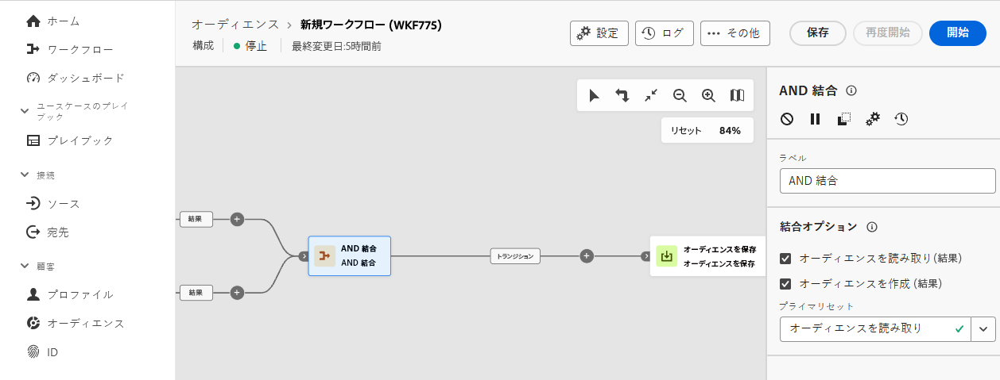

# AND 結合 {#join}

>[!CONTEXTUALHELP]
>id="dc_orchestration_and-join"
>title="「AND 結合」アクティビティ"
>abstract="「**AND 結合**」アクティビティを使用すると、構成の複数の実行分岐を同期させることができます。 先行するアクティビティがすべて完了すると、トリガーされます。 これにより、構成の実行を続ける前に、特定のアクティビティを確実に完了させることができます。"

この **AND 結合** アクティビティを使用すると、コンポジションの複数の実行分岐を同期できます。

このアクティビティは、すべてのインバウンドトランジションが有効化された（つまり、前のアクティビティがすべて終了した）ときにのみ、アウトバウンドトランジションをトリガーします。これにより、コンポジションの実行を続行する前に、特定のアクティビティを確実に完了させることができます。

## AND 結合アクティビティの設定 {#and-join-configuration}

>[!CONTEXTUALHELP]
>id="dc_orchestration_and-join_merging"
>title="AND 結合アクティビティの設定"
>abstract="結合するアクティビティを選択します。 **プライマリセット**&#x200B;ドロップダウンで、保持するインバウンドトランジションの母集団を選択します。"

**AND 結合**&#x200B;アクティビティを設定するには、次の手順に従います。

1. 複数のアクティビティを追加して、2 つ以上の異なる実行分岐を形成します。
1. **AND 結合**&#x200B;アクティビティを任意の分岐に追加します。

   

1. が含まれる **結合オプション** セクションで、同期する前のアクティビティをすべてオンにします。
1. **プライマリセット**&#x200B;ドロップダウンで、保持するインバウンドトランジションの母集団を選択します。アウトバウンドトランジションには、インバウンドトランジションの母集団の 1 つのみを含むことができます。アクティビティが設定されていない場合、アウトバウンドトランジションにより、インバウンド母集団のいずれかがランダムに選択されます。
