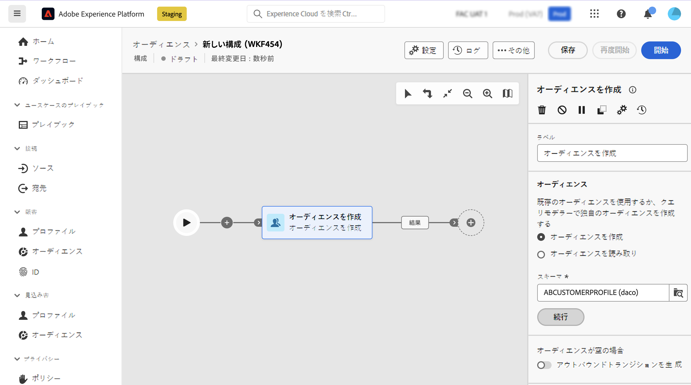
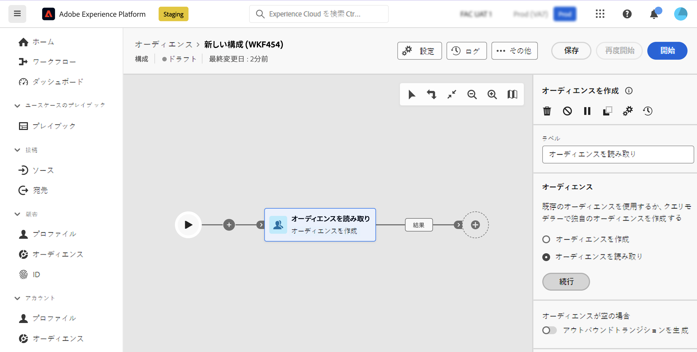

# オーディエンスを作成 {#build-audience}

>[!CONTEXTUALHELP]
>id="dc_orchestration_build_audience"
>title="オーディエンスを作成アクティビティ"
>abstract="「**オーディエンスを作成**」アクティビティを使用すると、構成にエントリするオーディエンスを定義できます。"

**オーディエンスを作成**&#x200B;アクティビティを使用すると、構成にエントリするオーディエンスを定義できます。オーディエンス母集団を定義するには、次の操作を実行します。

* 既存の Adobe Experience Platform オーディエンスを選択します。
* フィルタリング基準を定義および組み合わせて、クエリモデラーを使用して新しいオーディエンスを作成します。

## オーディエンスを作成アクティビティの設定 {#build-audience-configuration}

>[!CONTEXTUALHELP]
>id="dc_orchestration_build_audience_audienceselector"
>title="オーディエンス"
>abstract="オーディエンスを選択します。"

**オーディエンスを作成**&#x200B;アクティビティを設定するには、次の手順に従います。

1. **オーディエンスを作成**&#x200B;アクティビティを追加します。
1. ラベルを定義します。
1. オーディエンスを作成するか、既存のオーディエンスを選択するかを指定します。
1. 以下のタブに示す手順に従って、オーディエンスを設定します。

>[!BEGINTABS]

>[!TAB オーディエンスの作成]

独自のオーディエンスを作成するには、次の手順に従います。

1. 「**オーディエンスを作成**」を選択します。
1. **スキーマ**（ターゲティングディメンションとも呼ばれる）を選択します。スキーマを使用すると、受信者、契約の受益者、オペレーター、サブスクライバーなど、操作のターゲットとなる母集団を定義できます。デフォルトでは、スキーマは受信者から選択されます。

   

1. 「**続行**」をクリックします。
1. クエリモデラーを使用してクエリを定義し、確認します。[詳しくは、クエリモデラーの操作方法を参照してください。](../../query/query-modeler-overview.md)

>[!TAB オーディエンスの閲覧]

既存のオーディエンスを選択するには、次の手順に従います。

1. 「**オーディエンスを読み取り**」を選択します。
1. 「**続行**」をクリックします。

   

1. オーディエンスを選択します。

>[!ENDTABS]

>[!NOTE]
>
>「**アウトバウンドトランジションを生成**」オプションを使用すると、オーディエンス母集団が空の場合に、アクティビティの実行の終了時にアクティベートするアウトバウンドトランジションを追加できます。

<!--
## Examples{#build-audience-examples}

Here is an example of a workflow with two **Build audience** activities. The first one targets the poker players audience, followed by an email delivery. The second one targets the VIP clients audience, followed by an SMS delivery.

-->
