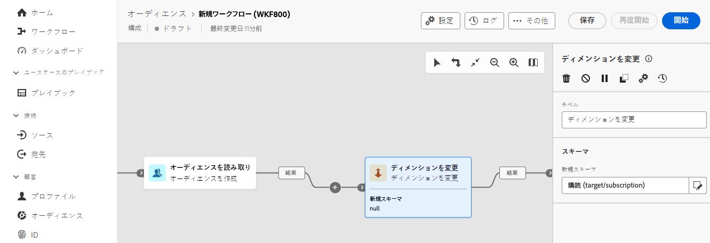

# ディメンションを変更 {#change-dimension}

>[!CONTEXTUALHELP]
>id="dc_orchestration_dimension_complement"
>title="補集合を生成"
>abstract="重複として除外された残りの母集団を使用して、追加のアウトバウンドトランジションを生成できます。 これを行うには、「**[!UICONTROL 補集合を生成]**」オプションの切替スイッチをオンにします。"

>[!CONTEXTUALHELP]
>id="dc_orchestration_change_dimension"
>title="ディメンションを変更アクティビティ"
>abstract="このアクティビティを使用すると、オーディエンスの作成時にスキーマ（ターゲティングディメンションとも呼ばれる）を変更できます。データテンプレートと入力スキーマに応じて軸を移動します。例えば、「契約」スキーマから「クライアント」スキーマに切り替えることができます。"

**ディメンションを変更** アクティビティを使用すると、オーディエンスの作成時にスキーマ（ターゲティングディメンションとも呼ばれます）を変更できます。 データテンプレートと入力スキーマに応じて軸を移動します。

## ディメンションを変更アクティビティの設定 {#configure}

**ディメンションを変更**&#x200B;アクティビティを設定するには、次の手順に従います。

1. **ディメンションを変更** アクティビティをコンポジションに追加します。

   

1. **新規スキーマ** を定義します。 スキーマの変更時には、すべてのレコードが保持されます。

1. コンポジションを実行して結果を表示します。 **ディメンションを変更** アクティビティの前後でテーブル内のデータを比較し、コンポジションテーブルの構造を比較します。

<!--
## Example {#example}

In this example, we want to send an SMS delivery to all the profiles who have made a purchase. To do this, we first use a **[!UICONTROL Build audience]** activity linked to a custom "Purchase" targeting dimension to target all purchases that occurred.

We then use a **[!UICONTROL Change dimension]** activity to switch the workflow targeting dimension to "Recipients". This allows us to be able to target the recipients who match the query.
-->

