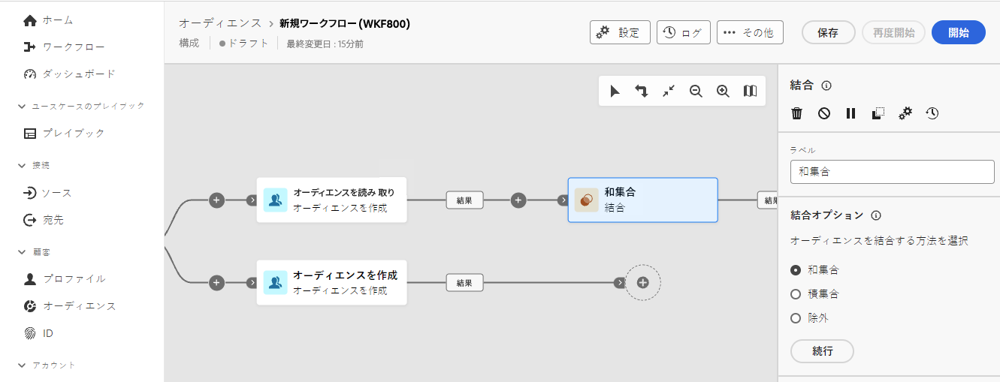
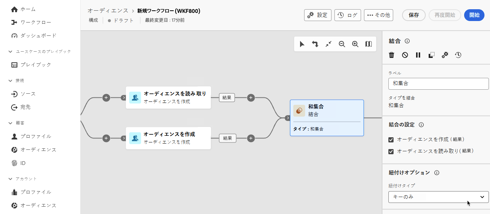
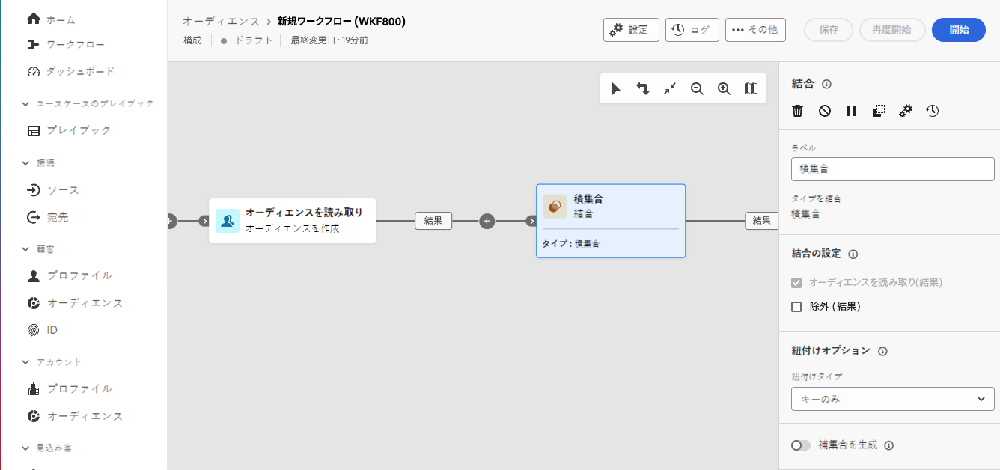
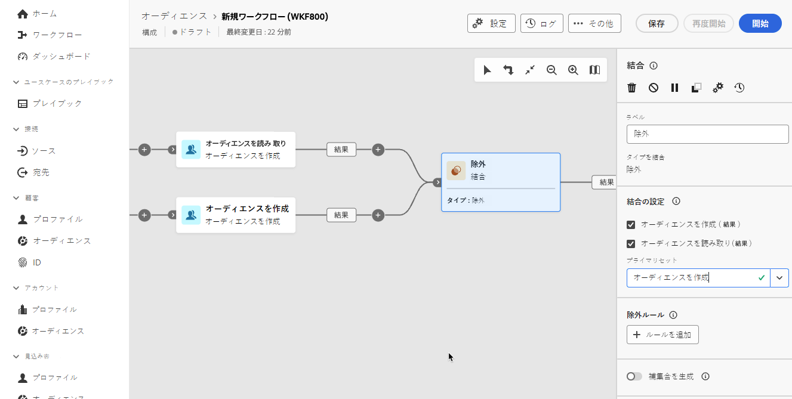

# 結合 {#combine}

>[!CONTEXTUALHELP]
>id="dc_orchestration_combine"
>title="アクティビティを結合"
>abstract="**結合**&#x200B;アクティビティでは、インバウンド母集団に対してセグメント化を実行できます。 したがって、いくつもの母集団を組み合わせて、一部を除外したり、複数のターゲットに共通するデータのみを保持したりできます。"

**結合**&#x200B;アクティビティでは、インバウンド母集団に対してセグメント化を実行できます。 したがって、複数の母集団を組み合わせて、一部を除外したり、複数のターゲットに共通するデータのみを保持したりできます。

この **結合** アクティビティは、他のアクティビティの後に配置できますが、コンポジションの最初には配置できません。 すべてのアクティビティは、の後に配置できます **結合**.

## 結合アクティビティを設定 {#combine-configuration}

>[!CONTEXTUALHELP]
>id="dc_orchestration_intersection_merging_options"
>title="「積集合」結合オプション"
>abstract="「**積集合**」を使用すると、アクティビティ内の様々なインバウンド母集団に共通の要素のみを保持できます。 「**結合するセット**」セクションで、結合するすべての前のアクティビティをオンにします。"

>[!CONTEXTUALHELP]
>id="dc_orchestration_exclusion_merging_options"
>title="「除外」結合オプション"
>abstract="「**除外**」を使用すると、特定の条件に従って、ある母集団から要素を除外することができます。 「**結合するセット**」セクションで、結合するすべての前のアクティビティをオンにします。"

>[!CONTEXTUALHELP]
>id="dc_orchestration_combine_options"
>title="セグメント化タイプを選択"
>abstract="オーディエンスの結合方法として、和集合、積集合、除外のいずれかを選択します。"

**結合**&#x200B;アクティビティの設定を開始するには、次の一般的な手順に従います。

1. 複数のアクティビティを追加して、2 つ以上の異なる実行分岐を形成します。

1. **結合**&#x200B;アクティビティを任意の前の分岐に追加します。

1. セグメント化の種類を選択します。 [結合](#union), [積集合](#intersection) または [除外](#exclusion)を選択し、 **続行**.

   

1. が含まれる **結合に設定** セクションで、結合する前のアクティビティをすべてオンにします。

## 和集合 {#combine-union}

>[!CONTEXTUALHELP]
>id="dc_orchestration_intersection_reconciliation_options"
>title="積集合の紐付けオプション"
>abstract="紐付けタイプを選択して、重複の処理方法を定義します。"

>[!CONTEXTUALHELP]
>id="dc_orchestration_combine_reconciliation"
>title="紐付けオプション"
>abstract="「**紐付けタイプ**」を選択して、重複の処理方法を定義します。"

が含まれる **結合** アクティビティの詳細 **結合**.

このためには、「**紐付けタイプ**」を選択して、重複の処理方法を定義する必要があります。

* **キーのみ**：これはデフォルトのモードです。アクティビティは、異なるインバウンドトランジションの要素が同じキーを持つ場合、1 つの要素のみを保持します。このオプションは、インバウンド母集団が同質である場合にのみ使用できます。
* **列の選択**：データの紐付けが適用される列のリストを定義する際に選択するオプションです。最初に（ソースデータを含む）プライマリセットを選択し、次に結合に使用する列を選択する必要があります。

## Intersection {#combine-intersection}

が含まれる **結合** アクティビティ、以下を設定できます **積集合**.

それには、次の追加の手順に従います。

1. 「**紐付けタイプ**」を選択して、重複の処理方法を定義します。[和集合](#union)の節を参照してください。
1. を確認できます **補集合を生成** 残りの母集団を処理する場合は、「」オプションを選択します。 補集合には、すべてのインバウンドアクティビティから積集合を引いた結果の和集合が含まれます。その後、追加のアウトバウンドトランジションがアクティビティに追加されます。

## 除外 {#combine-exclusion}

>[!CONTEXTUALHELP]
>id="dc_orchestration_exclusion_options"
>title="除外ルール"
>abstract="必要に応じて、インバウンドテーブルを操作できます。 別のスキーマ（ターゲティングディメンションとも呼ばれます）からターゲットを除外するには、このターゲットがメインターゲットと同じスキーマに返される必要があります。 次のボタンをクリックします **ルールを追加** 東部&#x200B;**除外ルール** セクションを使用し、スキーマの変更条件を指定します。 データの紐付けは、属性または結合を使用して実行されます。"

>[!CONTEXTUALHELP]
>id="dc_orchestration_combine_sets"
>title="結合するセットを選択"
>abstract="「**結合の設定**」セクションで、インバウンドトランジションから「**プライマリセット**」を選択します。 これは、要素の除外元のセットです。 これ以外のセットは、プライマリセットから除外する前の要素に一致します。"

>[!CONTEXTUALHELP]
>id="dc_orchestration_combine_exclusion"
>title="除外ルール"
>abstract="必要に応じて、インバウンドテーブルを操作できます。 別のスキーマ（ターゲティングディメンションとも呼ばれます）からターゲットを除外するには、このターゲットがメインターゲットと同じスキーマに返される必要があります。 次のボタンをクリックします **ルールを追加** が含まれる **除外ルール** セクションを使用し、スキーマの変更条件を指定します。 データの紐付けは、属性または結合を使用して実行されます。"

>[!CONTEXTUALHELP]
>id="dc_orchestration_combine_complement"
>title="結合で補集合を生成"
>abstract="「**補集合を生成**」オプションの切替スイッチをオンにして、追加のトランジションで残りの母集団を処理します。"

が含まれる **結合** アクティビティ、以下を設定できます **除外**.

このためには、以下の追加の手順に従う必要があります。

1. 「**結合の設定**」セクションで、インバウンドトランジションから「**プライマリセット**」を選択します。 これは、要素の除外元のセットです。 これ以外のセットは、プライマリセットから除外する前の要素に一致します。

1. 必要に応じて、インバウンドテーブルを操作できます。 別のスキーマからターゲットを除外するには、このターゲットがメインターゲットと同じスキーマに返される必要があります。 次のボタンをクリックします **ルールを追加** が含まれる **除外ルール** セクションを使用し、スキーマの変更条件を指定します。 データの紐付けは、属性または結合を使用して実行されます。 <!-- pas compris-->
1. 残りの母集団を処理するには、「**補集合を生成**」オプションをオンにします。[積集合](#intersection)の節を参照してください。

<!--
## Examples{#combine-examples}

In the following example, we are using a **Combine** activity and we add a **union** to retrieves all the profiles of the two queries: persons between 18 and 27 years old and persons between 34 and 40 years old.

The following example shows the **intersection** between two query activities. It is being used here to retrieve profiles who are between 18 to 27 years old and whose email address has been provided.

The following **exclusion** example shows two queries configured to filter profiles who are between 18 and 27 years old and have an Adobe email domain. The profiles with an Adobe email domain are then excluded from the first set. 

-->
