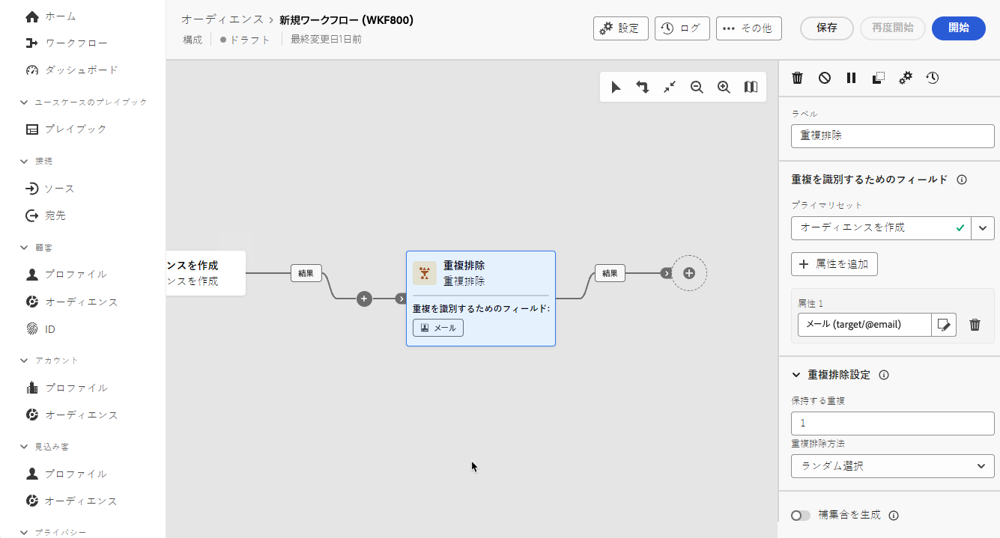

# 重複の除外 {#deduplication}

>[!CONTEXTUALHELP]
>id="dc_orchestration_deduplication_fields"
>title="重複を識別するためのフィールド"
>abstract="「**[!UICONTROL 重複を識別するためのフィールド]**」セクションで、「**[!UICONTROL 属性を追加]**」ボタンをクリックして、メールアドレス、名、姓など、同一の値によって重複を識別できるフィールドを指定します。 フィールドの順序によって、最初に処理するフィールドを指定できます。"

>[!CONTEXTUALHELP]
>id="dc_orchestration_deduplication"
>title="重複排除 - 重複アクティビティ"
>abstract="**重複排除 - 重複**&#x200B;アクティビティでは、インバウンドアクティビティの結果から重複を削除できます。 主に、ターゲティングアクティビティの後と、ターゲティングデータを使用できるアクティビティの前に使用されます。"

>[!CONTEXTUALHELP]
>id="dc_orchestration_deduplication_complement"
>title="補集合を生成"
>abstract="重複として除外された残りの母集団を使用して、追加のアウトバウンドトランジションを生成できます。 これを行うには、「**[!UICONTROL 補集合を生成]**」オプションの切替スイッチをオンにします。"

>[!CONTEXTUALHELP]
>id="dc_orchestration_deduplication_settings"
>title="重複排除設定"
>abstract="受信データ内の重複を削除するには、以下のフィールドで「重複排除 - 重複」メソッドを定義します。 デフォルトでは、1 つのレコードのみが保持されます。 また、式または属性に基づいて「重複排除 - 重複」モードを選択する必要があります。 デフォルトでは、重複から除外するレコードはランダムに選択されます。"

**重複排除 - 重複**&#x200B;アクティビティでは、受信者リストに重複したプロファイルなど、インバウンドアクティビティの結果から重複を削除できます。**重複排除 - 重複**&#x200B;アクティビティは、通常、ターゲティングアクティビティの後と、ターゲットデータを使用できるアクティビティの前に使用されます。

## 重複排除 - 重複アクティビティの設定{#deduplication-configuration}

**重複排除 - 重複**&#x200B;アクティビティを設定するには、次の手順に従います。

1. **重複排除 - 重複**&#x200B;アクティビティを構成に追加します。

1. アクティビティに複数のインバウンドトランジションがある場合は、**[!UICONTROL プライマリセット]**&#x200B;ドロップダウンリストから、重複排除の実行に使用するトランジションを選択します

1. 「**[!UICONTROL 重複を識別するためのフィールド]**」セクションで、「**[!UICONTROL 属性を追加]**」ボタンをクリックして、メールアドレス、名、姓など、同一の値によって重複を識別できるフィールドを指定します。 フィールドの順序によって、最初に処理するフィールドを指定できます。

   

1. 「**[!UICONTROL 重複排除設定]**」セクションで、一意の&#x200B;**[!UICONTROL 保持する重複]**&#x200B;の数を選択します。このフィールドのデフォルト値は **1** です。 値 **0** を使用すると、すべての重複を保持できます。

   例えば、レコード A と B がレコード Y の重複と見なされ、レコード C がレコード Z の重複と見なされる場合：

   * フィールドの値が **1** の場合：Y と Z のレコードのみが保持されます。
   * フィールドの値が **0** の場合、すべてのレコードが保持されます。
   * フィールドの値が **2** の場合：レコード C と Z が保持され、A、B、Y からの 2 つのレコードが、偶然に、または後で選択した重複排除方法によって保持されます。

1. 使用する&#x200B;**[!UICONTROL 重複排除 - 重複メソッド]**&#x200B;を選択します。

   * **[!UICONTROL ランダム選択]**：重複から除外するレコードをランダムに選択します。
   * **[!UICONTROL 式の使用]**：入力した式の値が最小または最大であるレコードを保持します。
   * **[!UICONTROL 空でない値]**：式が空でないレコードを保持します。
   * **[!UICONTROL 値のリストの使用]**：1 つまたは複数のフィールドの優先度の値を定義します。値を定義するには、「**[!UICONTROL 属性]**」をクリックしてフィールドを選択するか、式を作成し、適切なテーブルに値を追加します。新しいフィールドを定義するには、値のリストの上にある「**[!UICONTROL 追加]**」ボタンをクリックします。

1. 残りの母集団を利用するには、「**[!UICONTROL 補集合を生成]**」オプションをチェックします。補集合はすべての重複から構成されます。その後、追加のトランジションがアクティビティに追加されます。

<!--
## Example{#deduplication-example}

In the following example, use a deduplication activity to exclude duplicates from the target before sending a delivery. The identified duplicated profiles are added to a dedicated audience that can be reused if necessary. Choose the **Email** address to identify the duplicates. Keep 1 entry and select the **Random** deduplication method.

-->
