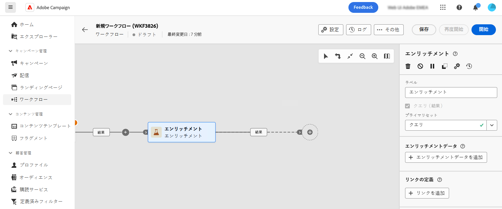
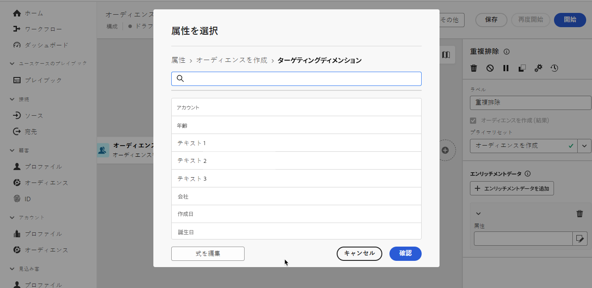

# エンリッチメント {#enrichment}

>[!CONTEXTUALHELP]
>id="dc_orchestration_enrichment"
>title="「エンリッチメント」アクティビティ"
>abstract="**エンリッチメント**&#x200B;アクティビティでは、データベースからの追加情報を使用してターゲットデータを強化できます。 一般的に、セグメント化アクティビティ後の構成で使用されます。"

>[!CONTEXTUALHELP]
>id="dc_orchestration_enrichment_data"
>title="「エンリッチメント」アクティビティ"
>abstract="エンリッチメントデータを構成に追加すると、「**エンリッチメント**」アクティビティの後に追加したアクティビティでこのデータを使用して、行動、環境設定、選択に基づいてプロファイルを個別のグループにセグメント化できます。"

>[!CONTEXTUALHELP]
>id="dc_orchestration_enrichment_simplejoin"
>title="リンク定義"
>abstract="作業テーブルデータと連合データベースの間にリンクを作成します。"

>[!CONTEXTUALHELP]
>id="dc_orchestration_enrichment_reconciliation"
>title="エンリッチメントの紐付け"
>abstract="紐付けパラメーターを設定します。"

>[!CONTEXTUALHELP]
>id="dc_targetdata_personalization_enrichmentdata"
>title="エンリッチメントデータ"
>abstract="構成の強化に使用するデータを選択します。 エンリッチメントデータには、スキーマから単一エンリッチメント属性（ターゲティングディメンションとも呼ばれる）と、テーブル間で 1-N カーディナリティを持つリンクであるコレクションリンクの 2 種類を選択できます。"

この **エンリッチメント** アクティビティを使用すると、連合データベースからの追加情報でターゲットデータを強化できます。 一般的に、セグメント化アクティビティ後のコンポジションで使用されます。

エンリッチメントデータは次のいずれかを実行できます。

* **同じ作業用テーブルから** コンポジションにターゲット設定されているものとして、次に示します。

  *顧客のグループをターゲットに設定し、「生年月日」フィールドを現在の作業用テーブルに追加*

* **別の作業用テーブルから**：

  *顧客のグループをターゲットにし、「購入」テーブルから取得した「金額」フィールドと「製品のタイプ」フィールドを追加します*。

エンリッチメントデータをコンポジションに追加したら、 **エンリッチメント** 行動、好み、選択肢に基づいて顧客を個別のグループにセグメント化するアクティビティ。

<!--For instance, you can add to the working table information related to customers' purchases and use this data to personalize emails with their latest purchase or the amount spent on these purchases.-->

## エンリッチメントアクティビティを設定します。 {#enrichment-configuration}

次の手順に従って、**エンリッチメント**&#x200B;アクティビティを設定します。

1. **オーディエンスを作成**&#x200B;および&#x200B;**結合**&#x200B;アクティビティを追加します。
1. **エンリッチメント**&#x200B;アクティビティを追加します。

   

1. コンポジションに複数のトランジションが設定されている場合は、 **[!UICONTROL プライマリセット]** データを充実させるために、どのトランジションをプライマリセットとして使用するかを定義するフィールド。

1. 「**エンリッチメントデータを追加**」をクリックし、データのエンリッチメントに使用する属性を選択します。

   

   >[!NOTE]
   >
   >この **式を編集ボタン** 属性選択画面では、属性を選択するための高度な式を作成できます。

<!--PAS VU SUR INSTANCE: You can select two types of enrichment data: a single enrichment attribute from the target dimension, or a collection link. Each of these types is detailed in the examples below:

    * [Single enrichment attribute](#single-attribute)
    * [Collection lnk](#collection-link)-->

## 例 {#example}

### 単一エンリッチメント属性 {#single-attribute}

ここでは、生年月日など、単一エンリッチメント属性を追加します。次の手順に従います。

1. 「**属性**」フィールド内をクリックします。
1. スキーマからシンプルなフィールド（ターゲティングディメンションとも呼ばれます）を選択します（この例では生年月日）。
1. 「**確認**」をクリックします。

<!--### Collection link {#collection-link}

In this more complex use case, we will select a collection link which is a link with a 1-N cardinality between tables. Let's retrieve the three latest purchases that are less than 100$. For this you need to define:

* an enrichment attribute: the **Total amount** field
* the number of lines to retrieve: 3
* a filter: filter out items that are greater than 100$
* a sorting: descendant sorting on the **Order date** field. 

#### Add the attribute {#add-attribute}

This is where you select the collection link to use as enrichment data.

1. Click inside the **Attribute** field.
1. Click **Display advanced attributes**.
1. Select the **Total amount** field from the **Purchases** table. 

#### Define the collection settings{#collection-settings}

Then, define how the data is collected and the number of records to retrieve.

1. Select **Collect data** in the **Select how the data is collected** drop-down.
1. Type "3" in the **Lines to retrieve (Columns to create)** field. 

If you want, for example, to get the average amount of purchases for a customer, select **Aggregated data** instead, and select **Average** in the **Aggregate function** drop-down.

#### Define the filters{#collection-filters}

Here, we define the maximum value for the enrichment attribute. We filter out items that are greater than 100$. [Learn how to work with the query modeler](../../query/query-modeler-overview.md)

1. Click **Edit filters**.
1. Add the two following filters: **Total amount** exists AND **Total amount** is less than 100. The first one filters NULL values as they would appear as the greatest value.
1. Click **Confirm**.

#### Define the sorting{#collection-sorting}

We now need to apply sorting in order to retrieve the three **latest** purchases.

1. Activate the **Enable sorting** option.
1. Click inside the **Attribute** field.
1. Select the **Order date** field.
1. Click **Confirm**. 
1. Select **Descending** from the **Sort** drop-down.-->
