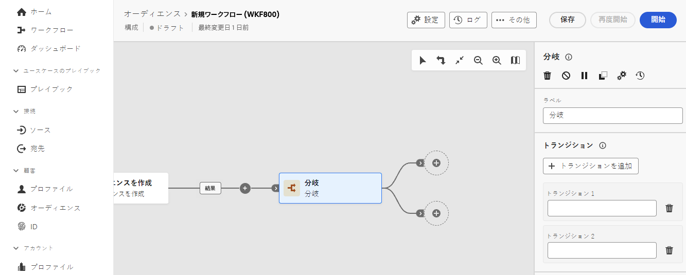

# 分岐 {#fork}

>[!CONTEXTUALHELP]
>id="dc_orchestration_fork"
>title="「分岐」アクティビティ"
>abstract="**分岐**&#x200B;アクティビティを使用すると、アウトバウンドトランジションを作成して、複数のアクティビティを同時に開始できます。"

>[!CONTEXTUALHELP]
>id="dc_orchestration_fork_transitions"
>title="分岐アクティビティのトランジション"
>abstract="デフォルトでは、**分岐**&#x200B;アクティビティで 2 つのトランジションが作成されます。 「**トランジションを追加**」ボタンをクリックして追加のアウトバウンドトランジションを定義し、そのラベルを入力します。"

**分岐**&#x200B;アクティビティを使用すると、アウトバウンドトランジションを作成して、複数のアクティビティを同時に開始できます。

## 分岐アクティビティの設定 {#fork-configuration}

次の手順に従って、**分岐**&#x200B;アクティビティを設定します。

1. **分岐** アクティビティをコンポジションに追加します。
1. **トランジションを追加**&#x200B;をクリックし、新しいアウトバウンドトランジションを追加します。デフォルトでは、2 つのトランジションが定義されています。
1. 各トランジションにラベルを追加します。

   
