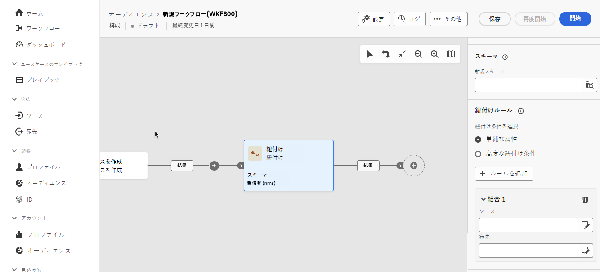
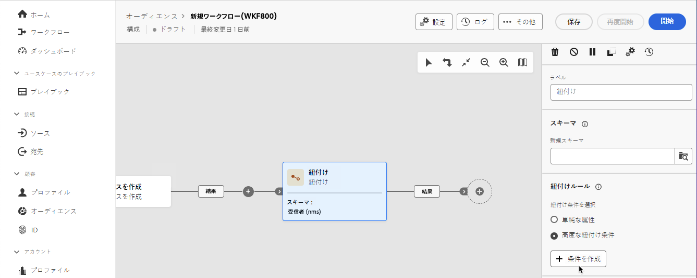

# 紐付け {#reconciliation}

>[!CONTEXTUALHELP]
>id="dc_orchestration_reconciliation"
>title="紐付けアクティビティ"
>abstract="「**紐付け**」アクティビティを使用すると、データベース内のデータと作業テーブル内のデータ間のリンクを定義できます。"

>[!CONTEXTUALHELP]
>id="dc_orchestration_reconciliation_field"
>title="紐付け選択フィールド"
>abstract="紐付け選択フィールド"

>[!CONTEXTUALHELP]
>id="dc_orchestration_reconciliation_condition"
>title="紐付け作成条件"
>abstract="紐付け作成条件"

>[!CONTEXTUALHELP]
>id="dc_orchestration_reconciliation_complement"
>title="紐付けで補集合を生成"
>abstract="紐付けで補集合を生成"

**紐付け**&#x200B;アクティビティを使用すると、データベース内のデータと作業用テーブル内のデータ（外部システムから読み込まれたデータなど）間のリンクを定義できます。

<!--For example, the **Reconciliation** activity can be placed after a **Load file** activity to import non-standard data into the database. In this case, the **Reconciliation** activity lets you define the link between the data in the Adobe Campaign database and the data in the work table.-->

これにより、識別されていないデータを既存のリソースにリンクできます。紐付け操作を行うには、結合するデータが既にデータベース内に存在する必要があります。例えば、購入された製品、時刻、クライアントなどを示す購入情報を調整する場合、製品とクライアントが既にデータベースに存在している必要があります。

## 紐付けアクティビティの設定 {#reconciliation-configuration}

>[!CONTEXTUALHELP]
>id="dc_orchestration_reconciliation_targeting"
>title="スキーマ"
>abstract="データに適用する新しいスキーマを選択します。スキーマ（ターゲティングディメンションとも呼ばれる）を使用すると、ターゲット母集団（受信者、アプリのサブスクライバー、オペレーター、サブスクライバーなど）を定義できます。デフォルトでは、現在の構成スキーマが選択されています。"

>[!CONTEXTUALHELP]
>id="dc_orchestration_reconciliation_rules"
>title="紐付けルール"
>abstract="重複排除 - 重複に使用する紐付けルールを選択します。 属性を使用するには、「**単純な属性**」オプションを選択し、ソースフィールドと宛先フィールドを選択します。 クエリモデラーを使用して独自の紐付け条件を作成するには、「**高度な紐付け条件**」オプションを選択します。"

>[!CONTEXTUALHELP]
>id="dc_orchestration_reconciliation_targeting_selection"
>title="ターゲティングディメンションの選択"
>abstract="紐付けするインバウンドデータのスキーマ（ターゲティングディメンションとも呼ばれる）を選択します。"

>[!CONTEXTUALHELP]
>id="dc_orchestration_keep_unreconciled_data"
>title="紐付けられていないデータの保持"
>abstract="デフォルトでは、紐付けされていないデータは、アウトバウンドトランジションに保持され、後で使用するために作業用テーブルで使用できます。 紐付けされていないデータを削除するには、「**紐付けされていないデータを保持**」オプションを非アクティブ化します。"

>[!CONTEXTUALHELP]
>id="dc_orchestration_reconciliation_attribute"
>title="紐付け属性"
>abstract="データの紐付けに使用する属性を選択し、確認します。"

**紐付け**&#x200B;アクティビティを設定するには、次の手順に従います。

1. **紐付け**&#x200B;アクティビティを構成に追加します。

1. 「**新規スキーマ**」を選択します。スキーマ（ターゲティングディメンションとも呼ばれる）を使用すると、ターゲット母集団（受信者、アプリのサブスクライバー、オペレーター、サブスクライバーなど）を定義できます。

1. 紐付けに使用するフィールドを選択します。1 つまたは複数の紐付け条件を使用できます。

   1. 属性を使用してデータを紐付けするには、「**単純な属性**」オプションを選択し、「**ルールを追加**」ボタンをクリックします。
   1. 紐付けの「**ソース**」フィールドと「**宛先**」フィールドを選択します。「**ソース**」フィールド。「**宛先**」フィールドは、選択したスキーマのフィールドに対応します。

      データは、ソースと宛先が等しい場合に紐付けされます。例えば、メールアドレスに基づいてプロファイルの重複を排除するには、「**メール**」フィールドを選択します。

      別の紐付け条件を追加するには、「**ルールを追加**」ボタンをクリックします。複数の結合条件が指定される場合、データを相互にリンクさせるには、すべての条件が検証される必要があります。

      

   1. 他の属性を使用してデータを紐付けする場合は、「**高度な紐付け条件**」オプションを選択し、「**条件を作成**」ボタンをクリックします。その後、クエリモデラーを使用して独自の紐付け条件を作成できます。[詳しくは、クエリモデラーの操作方法を参照してください。](../../query/query-modeler-overview.md)

      

1. 「**フィルターの作成** ボタンを使用して、データをフィルタリングして紐付けることができます。 これにより、クエリモデラーを使用してカスタム条件を作成できます。

デフォルトでは、紐付けされていないデータは、アウトバウンドトランジションに保持され、後で使用するために作業用テーブルで使用できます。紐付けされていないデータを削除するには、「**紐付けされていないデータを保持**」オプションを非アクティブ化します。

<!--
## Example {#reconciliation-example}

The following example demonstrates a workflow that creates an audience of profiles directly from an imported file containing new clients. It is made up of the following activities:

The workflow is designed as follows:


 
It is built with the following activities:

* A [Load file](load-file.md) activity uploads a file containing profiles data that were extracted from an external tool.

    For example:

    ```
    lastname;firstname;email;birthdate;
    JACKMAN;Megan;megan.jackman@testmail.com;07/08/1975;
    PHILLIPS;Edward;phillips@testmail.com;09/03/1986;
    WEAVER;Justin;justin_w@testmail.com;11/15/1990;
    MARTIN;Babe;babeth_martin@testmail.net;11/25/1964;
    REESE;Richard;rreese@testmail.com;02/08/1987;
    ```

* A **Reconciliation** activity which identifies the incoming data as profiles, by using the **email** and **Date of birth** fields as reconciliation criteria.

    

* A [Save audience](save-audience.md) activity to create a new audience based on these updates. You can also replace the **Save audience** activity by an **End** activity if no specific audience needs to be created or updated. Recipient profiles are updated in any case when you run the workflow.


## Compatibility {#reconciliation-compat}

The **Reconciliation** activity does not exist in the Client console. All **Enrichments** activities created in the Client console with the reconciliation options enabled are displayed as **Reconciliation** activities in Campaign Web user interface.
-->
