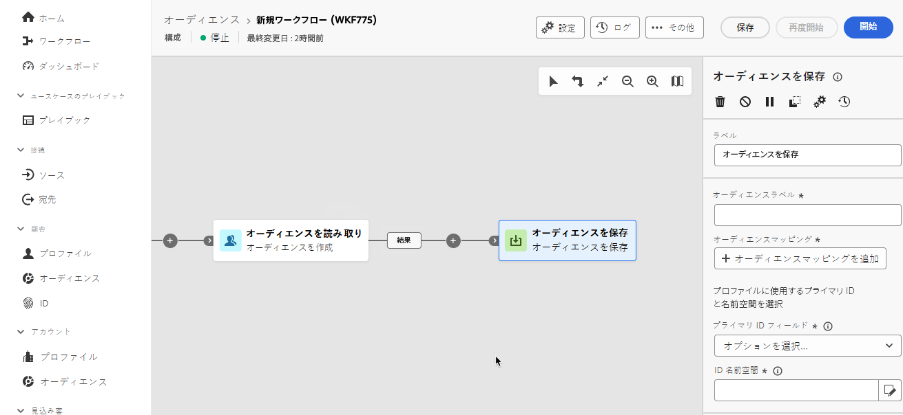

# オーディエンスを保存 {#save-audience}

>[!CONTEXTUALHELP]
>id="dc_orchestration_save_audience"
>title="オーディエンスの保存"
>abstract="このアクティビティを使用して、構成のアップストリームで計算された母集団から新しいオーディエンスを作成します。作成したオーディエンスはオーディエンスのリストに追加され、**オーディエンス**&#x200B;メニューから使用できます。"

>[!CONTEXTUALHELP]
>id="dc_orchestration_saveaudience_outbound"
>title="アウトバウンドトランジションを生成"
>abstract="「**オーディエンスを保存**」アクティビティの後にトランジションを追加する場合は、このオプションを使用します。"

>[!CONTEXTUALHELP]
>id="dc_orchestration_save_audience_primary_identity"
>title="プライマリ ID フィールド"
>abstract="プロファイルに使用するプライマリ ID を選択します。"
>additional-url="https://experienceleague.adobe.com/ja/docs/experience-platform/xdm/ui/fields/identity#define-a-identity-field" text="詳しくは、Experience Platform のドキュメントを参照してください"

>[!CONTEXTUALHELP]
>id="dc_orchestration_saveaudience_namespace"
>title="ID 名前空間"
>abstract="プロファイルに使用する名前空間を選択します。"
>additional-url="https://experienceleague.adobe.com/ja/docs/experience-platform/identity/features/namespaces" text="詳しくは、Experience Platform のドキュメントを参照してください"

**オーディエンスを保存**&#x200B;アクティビティは、構成のアップストリームで計算された母集団から新しいオーディエンスを作成します。作成したオーディエンスは Adobe Experience Platform オーディエンスのリストに追加され、**オーディエンス**&#x200B;メニューから使用できるようになります。[詳しくは、オーディエンスの操作方法を参照してください](../../start/audiences.md)

このアクティビティは基本的に、同じ構成で計算された母集団グループを再利用可能なオーディエンスに変換することで、このグループを維持するために使用されます。**オーディエンスを作成**&#x200B;アクティビティや&#x200B;**結合**&#x200B;アクティビティなどの他のターゲティングアクティビティに接続します。

>[!IMPORTANT]
>
>**オーディエンスを保存**&#x200B;アクティビティには、プロファイル対応のスキーマとデータセットが必要です。[詳細情報](https://experienceleague.adobe.com/ja/docs/experience-platform/catalog/datasets/user-guide#enable-profile){target="_blank"}。

## オーディエンスを保存アクティビティの設定 {#save-audience-configuration}

**オーディエンスを保存**&#x200B;アクティビティを設定するには、次の手順に従います。

1. **オーディエンスを保存**&#x200B;アクティビティを構成に追加します。

   

1. 作成するオーディエンスのラベルを指定します。

   >[!IMPORTANT]
   >
   >オーディエンスラベルは、現在のサンドボックス内で一意にする必要があります。既存のオーディエンスと同じラベルにすることはできません。

1. 「オーディエンスマッピング」セクションを使用して、新しく作成したオーディエンスに取り込むフィールドを選択します。これを行うには、「**オーディエンスマッピングを追加**」をクリックし、ソースオーディエンスフィールドとターゲットオーディエンスフィールドを選択します。

   操作を繰り返して、必要な数のオーディエンスマッピングを追加します。

1. データベース内のターゲットプロファイルの識別に使用するプライマリ ID と名前空間を選択します。

   * **プライマリ ID フィールド**：プロファイルの識別に使用するフィールドを選択します。例えば、メールアドレスや電話番号などです。
   * **ID 名前空間**：プロファイルの識別に使用する名前空間、つまり ID キーとして使用するデータのタイプを選択します。例えば、メールアドレスをプライマリ ID フィールドとして選択した場合は、ID 名前空間の&#x200B;**メール**&#x200B;を選択する必要があります。一意の ID が電話番号の場合は、ID 名前空間の&#x200B;**電話**&#x200B;を選択する必要があります。

## Adobe Experience Platform でのオーディエンスへのアクセス {#access-audience}

構成を実行すると、結果のオーディエンスが外部オーディエンスとして Adobe Experience Platform に保存され、Adobe Real-time Customer Data Platform や Adobe Journey Optimizer で使用できるようになります。**オーディエンス**&#x200B;メニューでアクセスできます。[詳細情報](https://experienceleague.adobe.com/ja/docs/experience-platform/segmentation/ui/audience-portal){target="_blank"}

作成したオーディエンスには、「オーディエンスマッピング」セクションで選択したすべてのフィールドが含まれます。Journey Optimizer でこのオーディエンスをターゲットにするか、Adobe Experience Platform でサポートされる任意の宛先に対してアクティブ化できます。

[詳しくは、Adobe Experience Platform ドキュメントを参照してください](https://experienceleague.adobe.com/ja/docs/experience-platform/segmentation/ui/audience-portal){target="_blank"}

<!--

## Example{#save-audience-example}

The following example illustrates a simple audience update from targeting. A scheduler is added to run the workflow once a month. A query recovers all the profiles subscribed to the different application services available. The **Save audience** activity updates the audience by deleting profiles that have unsubscribed from the service since the last workflow execution and by adding the newly subscribed profiles.
-->
