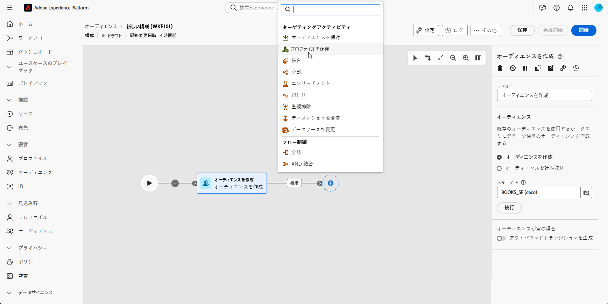
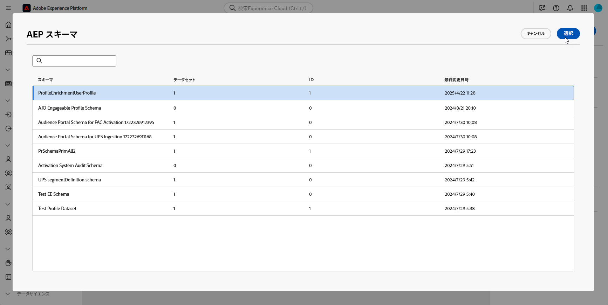
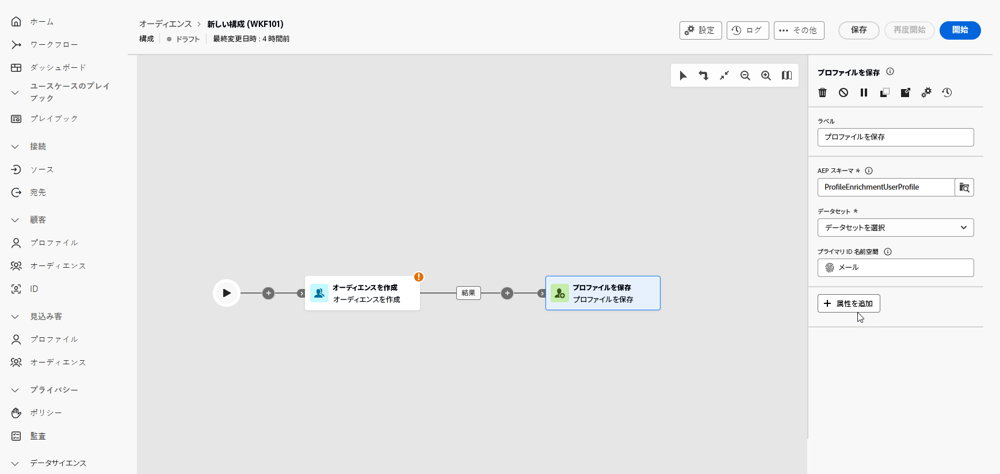

# プロファイルの保存 {#save-profile}

>[!CONTEXTUALHELP]
>id="dc_orchestration_saveprofile"
>title="プロファイルを保存"
>abstract="プロファイルを保存アクティビティを使用すると、外部ウェアハウスのデータを統合してExperience Platform プロファイルを強化し、追加の属性で顧客プロファイルを強化できます。 "

>[!CONTEXTUALHELP]
>id="dc_orchestration_saveprofile_aepschemalist"
>title="AEP スキーマを選択"
>abstract="プロファイルのExperience Platform スキーマを選択します。"

>[!CONTEXTUALHELP]
>id="dc_orchestration_saveprofile_primaryidentitynamespace"
>title="「プライマリ ID」フィールドを選択します"
>abstract="データベースでターゲットプロファイルを識別するために使用するプライマリ ID を選択します。"

>[!CONTEXTUALHELP]
>id="dc_orchestration_saveprofile_selectaepschema"
>title="AEP スキーマを選択"
>abstract="プロファイルのExperience Platform スキーマを選択します。"

**プロファイルを保存** アクティビティを使用すると、外部ウェアハウスからのデータがフェデレーションされたAdobe Experience Platform プロファイルをエンリッチメントできます。

このアクティビティは、通常、データをプラットフォームに物理的に移動または複製せずに、追加の属性やインサイトを取り込むことで、顧客プロファイルを強化するために使用されます

## プロファイルを保存アクティビティの設定 {#save-profile-configuration}

次の手順に従って、**プロファイルを保存** アクティビティを設定します。

1. **プロファイルを保存** アクティビティをコンポジションに追加します。

   

1. 作成するプロファイルのラベルを指定します。

   >[!IMPORTANT]
   >
   >オーディエンスラベルは、現在のサンドボックス内で一意にする必要があります。既存のオーディエンスと同じラベルにすることはできません。

1. 使用するAdobe Experience Platform スキーマを選択します。

   

1. データベースでプロファイルを識別するために使用するプライマリ ID フィールドを選択します。

1. 追加のデータ属性を調整する場合は、「**属性を追加**」をクリックします。

   次に、マッピングする各属性の **Source** フィールド（外部データ）と **宛先** フィールド（スキーマフィールド）を指定します。

   

1. 設定が完了したら、「**開始**」をクリックします。
