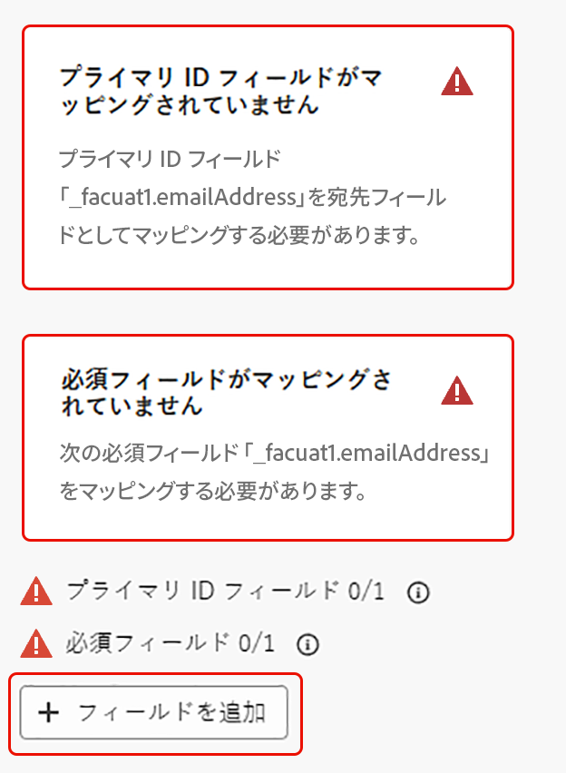

# プロファイルを保存 {#save-profile}

>[!CONTEXTUALHELP]
>id="dc_orchestration_saveprofile"
>title="プロファイルを保存"
>abstract="プロファイルを保存アクティビティを使用すると、外部ウェアハウスのデータを統合して Experience Platform プロファイルを強化し、追加の属性で顧客プロファイルを強化できます。 "

>[!CONTEXTUALHELP]
>id="dc_orchestration_saveprofile_aepschemalist"
>title="Experience Platform スキーマを選択"
>abstract="プロファイルの Experience Platform スキーマを選択します。"

>[!CONTEXTUALHELP]
>id="dc_orchestration_saveprofile_primaryidentitynamespace"
>title="プライマリ識別フィールドの選択"
>abstract="データベース内のターゲットプロファイルの識別に使用するプライマリ ID を選択します。"

>[!CONTEXTUALHELP]
>id="dc_orchestration_saveprofile_selectaepschema"
>title="Experience Platform スキーマを選択"
>abstract="プロファイルの Experience Platform スキーマを選択します。"

>[!CONTEXTUALHELP]
>id="dc_orchestration_saveprofile_updatemode"
>title="プロファイルを保存更新モード"
>abstract="プロファイルを保存アクティビティで使用できる更新モードには、完全更新と増分更新が含まれます。"

>[!CONTEXTUALHELP]
>id="dc_orchestration_saveprofile_updatemode_full"
>title="完全更新"
>abstract="完全更新モードでは、エンリッチメントのプロファイルの完全なセットが更新されます。"

>[!CONTEXTUALHELP]
>id="dc_orchestration_saveprofile_updatemode_incremental"
>title="増分更新"
>abstract="増分更新モードでは、前回のエンリッチメントの実行以降に変更したプロファイルが更新されます。"

>[!CONTEXTUALHELP]
>id="dc_orchestration_saveprofile_primaryidentityfield"
>title="プライマリ ID フィールド"
>abstract="プライマリ ID フィールドは、エンリッチメントのためにプロファイルを結合する際の信頼できるソースを示します。"

>[!CONTEXTUALHELP]
>id="dc_orchestration_saveprofile_requiredfieldscheck"
>title="必須フィールドの条件"
>abstract="必須フィールドは、データをエクスポートする際に、すべてのプロファイルまたはレコードに入力する必要がある属性です。必須フィールドが欠落している場合、エクスポートは完了または有効になりません。"

>[!CONTEXTUALHELP]
>id="dc_orchestration_saveprofile_primaryidentitycheck"
>title="プライマリ ID フィールドの条件"
>abstract="各プロファイルまたはレコードの一意の ID。これにより、すべてのレコードを明確に認識して一致させることができ、データの重複を防ぐことができます。"

**[!UICONTROL プロファイルを保存]**&#x200B;アクティビティを使用すると、外部ウェアハウスから統合されたデータを使用して Adobe Experience Platform プロファイルを強化できます。

このアクティビティは通常、データを物理的にプラットフォームに移動または複製せずに、追加の属性とインサイトを取り込むことで、顧客プロファイルを強化するために使用されます。

## [!UICONTROL プロファイルを保存]アクティビティの設定 {#save-profile-configuration}

>[!IMPORTANT]
>
>**プロファイルを保存**&#x200B;アクティビティには、プロファイル対応のスキーマとデータセットが必要です。データセットをプロファイル対応にする方法について詳しくは、[データセットユーザーガイド](https://experienceleague.adobe.com/ja/docs/experience-platform/catalog/datasets/user-guide#enable-profile){target="_blank"}を参照してください。
>
>さらに、選択したデータセットでアップサートが有効になってい&#x200B;**ない**&#x200B;場合、プロファイルのデータが&#x200B;**置き換え**&#x200B;られます。データセットのアップサートを有効にする方法について詳しくは、[アップサートの有効化ガイド](https://experienceleague.adobe.com/ja/docs/experience-platform/catalog/datasets/enable-upsert)を参照してください。

**[!UICONTROL プロファイルを保存]**&#x200B;アクティビティを設定するには、次の手順に従います。

1. **[!UICONTROL プロファイルを保存]**&#x200B;アクティビティを構成に追加します。

   {width="1500" zoomable="yes"}

1. 作成するプロファイルのラベルを指定します。

   >[!IMPORTANT]
   >
   >オーディエンスラベルは、現在のサンドボックス内で一意にする必要があります。既存のオーディエンスと同じラベルにすることはできません。

1. 使用する Adobe Experience Platform スキーマを選択します。

   {width="1500" zoomable="yes"}

1. エンリッチメントの保存先となるデータセットを選択します。

   {width="300" zoomable="yes"}

1. データセットを選択したら、データベース内のプロファイルの識別に使用するプライマリ ID フィールドを選択します。

1. 「**[!UICONTROL フィールドを追加]**」を選択して、プライマリ ID フィールドと必須 ID フィールドを追加します。

   {width="300" zoomable="yes"}

   マッピングする属性ごとに、「**ソース**」フィールド（外部データ）と「**宛先**」フィールド（スキーマフィールド）を指定できます。

   {width="300" zoomable="yes"}

1. また、エンリッチメントの更新モードを指定することもできます。

   {width="300" zoomable="yes"}

   | 更新モード | 説明 |
   | ----------- | ----------- |
   | 完全更新 | プロファイルの完全なセットが、エンリッチメントに対して更新されます。 |
   | 増分更新 | 前回のエンリッチメントの実行以降に変更したプロファイルのみが、そのエンリッチメントに対して更新されます。 |

   [!UICONTROL 増分更新]を選択する場合は、送信するデータを決定するために最終変更日も選択する必要があります。

1. 設定が完了したら、「**開始**」を選択します。
