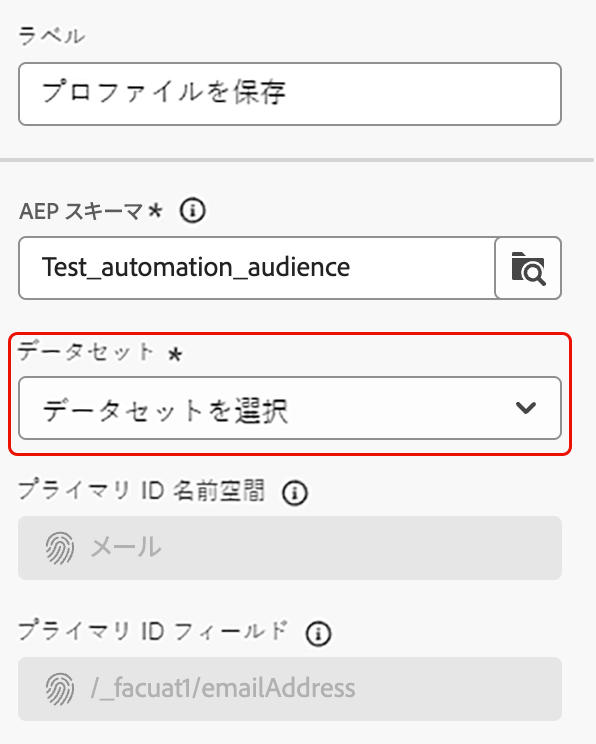

# プロファイルを保存 {#save-profile}

>[!CONTEXTUALHELP]
>id="dc_orchestration_saveprofile"
>title="プロファイルを保存"
>abstract="プロファイルを保存アクティビティを使用すると、外部ウェアハウスのデータを統合して Experience Platform プロファイルを強化し、追加の属性で顧客プロファイルを強化できます。 "

>[!CONTEXTUALHELP]
>id="dc_orchestration_saveprofile_aepschemalist"
>title="Experience Platform スキーマを選択"
>abstract="プロファイルの Experience Platform スキーマを選択します。"

>[!CONTEXTUALHELP]
>id="dc_orchestration_saveprofile_primaryidentitynamespace"
>title="プライマリ識別フィールドの選択"
>abstract="データベース内のターゲットプロファイルの識別に使用するプライマリ ID を選択します。"

>[!CONTEXTUALHELP]
>id="dc_orchestration_saveprofile_selectaepschema"
>title="Experience Platform スキーマを選択"
>abstract="プロファイルの Experience Platform スキーマを選択します。"

>[!CONTEXTUALHELP]
>id="dc_orchestration_saveprofile_updatemode"
>title="プロファイル更新モードの保存"
>abstract="プロファイルを保存アクティビティで使用できる更新モードには、完全更新と増分更新があります。"

>[!CONTEXTUALHELP]
>id="dc_orchestration_saveprofile_updatemode_full"
>title="完全更新"
>abstract="完全更新モードは、プロファイルの完全なセットを更新して充実させます。"

>[!CONTEXTUALHELP]
>id="dc_orchestration_saveprofile_updatemode_incremental"
>title="増分更新"
>abstract="増分更新モードは、最後にエンリッチメントが実行されてから変更されたプロファイルを更新します。"

>[!CONTEXTUALHELP]
>id="dc_orchestration_saveprofile_primaryidentityfield"
>title="プライマリ ID フィールド"
>abstract="プライマリ ID フィールドは、エンリッチメントのためにプロファイルを結合する際の信頼できるソースを示します。"

>[!CONTEXTUALHELP]
>id="dc_orchestration_saveprofile_requiredfieldscheck"
>title="必須フィールドの条件"
>abstract="必須フィールドは、データを書き出す際に、すべてのプロファイルまたはレコードに入力する必要がある属性です。 必須フィールドがない場合、書き出しは完了または有効になりません。"

>[!CONTEXTUALHELP]
>id="dc_orchestration_saveprofile_primaryidentitycheck"
>title="プライマリ ID フィールドの条件"
>abstract="各プロファイルまたはレコードの一意の ID。 これにより、すべてのレコードを明確に認識して一致させることができ、データの重複を防ぐことができます。"

**[!UICONTROL プロファイルを保存]** アクティビティを使用すると、外部ウェアハウスからのデータがフェデレーションされたAdobe Experience Platform プロファイルをエンリッチメントできます。

このアクティビティは、通常、データをプラットフォームに物理的に移動または複製せずに、追加の属性やインサイトを取り込むことで、顧客プロファイルを強化するために使用されます。

## [!UICONTROL  プロファイルの保存 ] アクティビティの設定 {#save-profile-configuration}

>[!IMPORTANT]
>
>**プロファイルを保存** アクティビティには、プロファイル対応のスキーマとデータセットが必要です。 データセットをプロファイル対応にする方法については、[ データセットユーザーガイド ](https://experienceleague.adobe.com/ja/docs/experience-platform/catalog/datasets/user-guide#enable-profile){target="_blank"} を参照してください。
>
>さらに、選択したデータセットでアップサートが有効 **されていない** 場合、プロファイルのデータは **置き換え** されます。 データセットのアップサートを有効にする方法については、[ アップサートガイドを有効にする ](https://experienceleague.adobe.com/en/docs/experience-platform/catalog/datasets/enable-upsert) を参照してください。

次の手順に従って、**[!UICONTROL プロファイルを保存]** アクティビティを設定します。

1. **[!UICONTROL プロファイルを保存]** アクティビティをコンポジションに追加します。

   {width="1500" zoomable="yes"}

1. 作成するプロファイルのラベルを指定します。

   >[!IMPORTANT]
   >
   >オーディエンスラベルは、現在のサンドボックス内で一意にする必要があります。既存のオーディエンスと同じラベルにすることはできません。

1. 使用する Adobe Experience Platform スキーマを選択します。

   {width="1500" zoomable="yes"}

1. エンリッチメントの保存先データセットを選択します。

   {width="300" zoomable="yes"}

1. データセットを選択したら、データベース内のプロファイルを識別するために使用される「プライマリ ID」フィールドを確認できます。

1. **[!UICONTROL フィールドを追加]** を選択して、プライマリ ID フィールドと必須 ID フィールドを追加します。

   {width="300" zoomable="yes"}

   マッピングする各属性の **Source** フィールド（外部データ）と **宛先** フィールド（スキーマフィールド）を指定できます。

   {width="300" zoomable="yes"}

1. エンリッチメントの更新モードを指定することもできます。

   {width="300" zoomable="yes"}

   | 更新モード | 説明 |
   | ----------- | ----------- |
   | 完全更新 | プロファイルの完全なセットが更新され、エンリッチメントが図られます。 |
   | 増分更新 | エンリッチメント用に更新されるのは、前回エンリッチメントを実行した後に変更されたプロファイルのみです。 |

   [!UICONTROL  増分更新 ] を選択する場合は、最終変更日を選択して、送信するデータを決定する必要もあります。

1. 設定が完了したら、「**開始**」を選択します。
