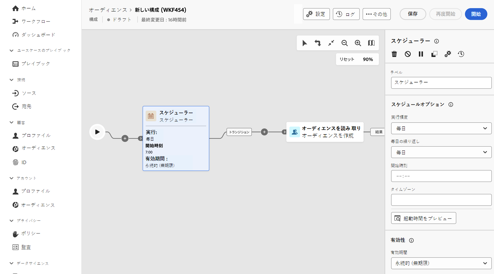

# スケジューラー {#scheduler}

>[!CONTEXTUALHELP]
>id="dc_orchestration_scheduler"
>title="「スケジューラー」アクティビティ"
>abstract="**スケジューラー**&#x200B;アクティビティを使用すると、オーディエンス構成の開始日時をスケジュールできます。このアクティビティはスケジュール済みの開始として考慮する必要があります。構成の最初のアクティビティとしてのみ使用できます。"

**スケジューラー**&#x200B;アクティビティは&#x200B;**フロー制御**&#x200B;アクティビティです。構成の開始日時をスケジュールできます。このアクティビティはスケジュール済みの開始として考慮する必要があります。構成の最初のアクティビティとしてのみ使用できます。

Federated Audience Composition 宛先への接続を設定した場合、このアクティビティを使用すると、Adobe Experience Platform オーディエンスを通常の頻度で送信できます。 [詳しくは、外部データを使用して Adobe Experience Platform オーディエンスを強化する方法を参照してください](../../connections/destinations.md)

## 「スケジューラー」アクティビティの設定 {#scheduler-configuration}

>[!CONTEXTUALHELP]
>id="dc_orchestration_schedule_validity"
>title="スケジューラーの有効性"
>abstract="スケジューラーの有効期間を定義できます。永続的（デフォルト）にすることも、特定の日付まで有効にすることもできます。"

>[!CONTEXTUALHELP]
>id="dc_orchestration_schedule_options"
>title="スケジューラーオプション"
>abstract="スケジューラーの頻度を定義します。特定の時点で、1 日、1 週間、1 か月に 1 回または数回実行できます。"

**スケジューラー**&#x200B;アクティビティを設定するには、次の手順に従います。

1. **スケジューラー**&#x200B;アクティビティを構成に追加します。

1. **実行頻度**&#x200B;を設定します。

   * **1 回**：構成は 1 回実行されます。
   * **毎日**：構成は、特定の時間（1 日 1 回）に実行されます。
   * **1 日に数回**：構成は、1 日に数回定期的に実行されます。特定の時間を指定するか、定期的に実行されるように設定できます。

     >[!NOTE]
     >
     >システム全体のパフォーマンスが低下したり、データベースにブロックが作成されたりする可能性があるので、構成の実行スケジュールは 15 分以上の間隔を空けてください。

   * **毎週**：構成は、指定した日時（週に 1 回または数回）に実行されます。
   * **毎月**：構成は、指定した日時（月に 1 回または数回）に実行されます。構成を実行する必要がある月を選択できます。月の第 2 火曜日など、月の特定の曜日に実行を設定することもできます。

1. 選択した頻度に従って実行の詳細を定義します。詳細フィールドは、指定する頻度（時間、繰り返し頻度、指定した日数など）に応じて異なります。

1. 「**起動時間をプレビュー**」をクリックして、今後 10 回の構成の実行スケジュールを確認します。

1. スケジューラーの有効期間を定義します。

   * **永続的（無期限）**：構成が指定した頻度で実行され、時間枠や反復回数に制限はありません。

   * **有効期間**：構成が指定した頻度で、指定した日付まで実行されます。開始日と終了日を指定する必要があります。

>[!NOTE]
>
>構成をすぐに開始する場合は、スケジューラーの上部のアクションバーにある「**保留中のタスクを実行**」をクリックします。このボタンは、構成を開始した場合にのみ使用できます。

<!--## Example{#scheduler-example}

In the following example, the activity is configured so that the composition runs several times a day at 9 and 12 AM, every day of the week from October 1st, 2023 to January 1st, 2024.-->
