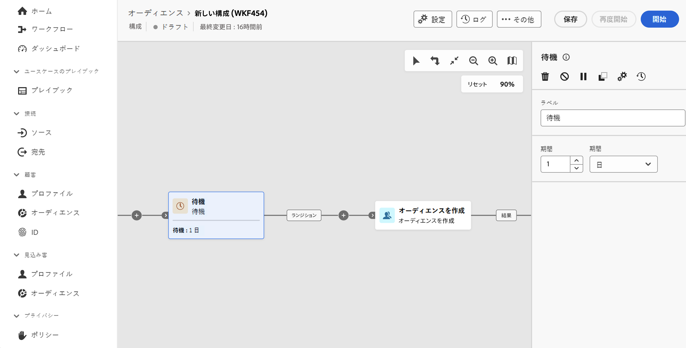

# 待機 {#wait}

>[!CONTEXTUALHELP]
>id="dc_orchestration_wait"
>title="待機アクティビティ"
>abstract="**待機**&#x200B;アクティビティは、アクティビティ間のトランジションを遅延させるために使用します。"

**待機**&#x200B;アクティビティでは、実行する 2 つのアクティビティ間に一定の時間間隔を設定できます。

## 設定{#wait-configuration}

**待機**&#x200B;アクティビティを設定するには、次の手順に従います。

1. **待機**&#x200B;アクティビティを構成に追加します。

1. インバウンドトランジションとアウトバウンドトランジションの間の待機&#x200B;**期間**&#x200B;を指定します。

1. 「**期間**」フィールドで、秒、分、時間、日などの時間単位を選択します。

   
