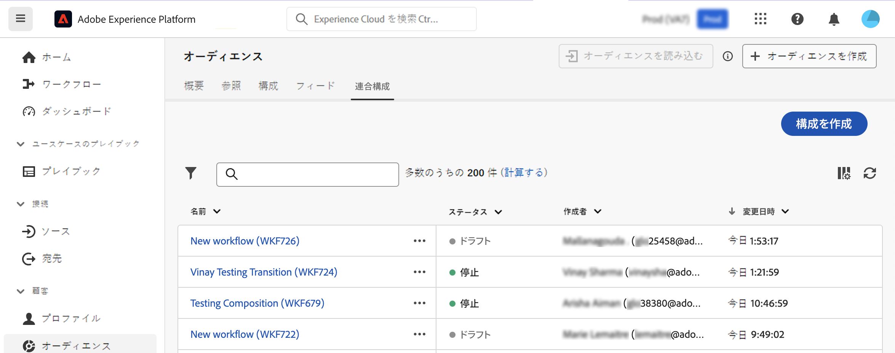
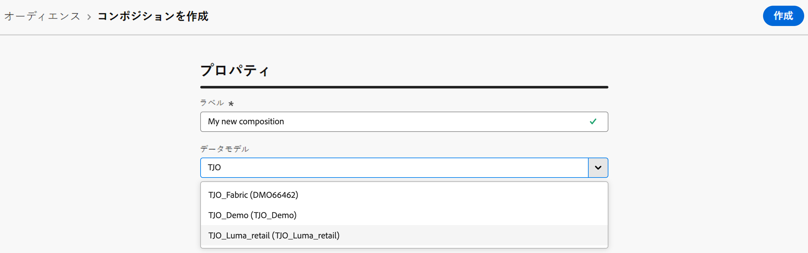
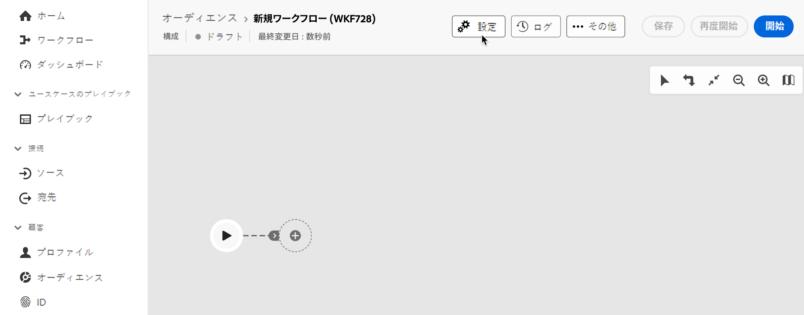

# 構成の作成と設定 {#create}

構成を作成する最初の手順は、ラベルを定義し、必要に応じて追加の設定を指定することです。

## 構成の作成 {#create-the-composition}

1. **[!UICONTROL オーディエンス]**&#x200B;メニューにアクセスし、「**[!UICONTROL 連合構成]**」タブを選択します。

1. 「**[!UICONTROL 構成を作成]**」ボタンをクリックします。

   

1. 「**[!UICONTROL プロパティ]**」セクションで、コンポジションのラベルを指定し、データモデルを選択します。 コンポジションのアクティビティでは、このデータモデルに関連付けられているスキーマのみを使用できます。

   

1. 「**[!UICONTROL 作成]**」をクリックします。構成キャンバスが表示されます。これで、実行する前に、ニーズに合わせて必要な数のアクティビティを追加して、構成を設定できるようになりました。

   * [アクティビティの調整方法を学ぶ](orchestrate-activities.md)
   * [詳しくは、構成を開始および監視する方法を参照してください](start-monitor-composition.md)

## 構成の設定を行います。 {#settings}

>[!CONTEXTUALHELP]
>id="dc_composition_settings_properties"
>title="構成プロパティ"
>abstract="このセクションでは、構成の作成時にもアクセスできる一般的な構成プロパティを提供します。"

>[!CONTEXTUALHELP]
>id="dc_composition_settings_segmentation"
>title="構成のセグメント化"
>abstract="デフォルトでは、構成の最後の実行の作業テーブルのみが保持されます。 このオプションを有効にすると、テスト目的で作業テーブルを保持できます。 開発環境またはステージング環境で&#x200B;**のみ**&#x200B;使用する必要があります。 実稼動環境では絶対にオンにしないでください。"

>[!CONTEXTUALHELP]
>id="dc_composition_settings_error"
>title="エラー管理設定"
>abstract="このセクションでは、実行中のエラーを管理する方法を定義できます。 プロセスの一時停止、一定数のエラーの無視または構成の実行の停止を選択できます。"

構成にアクセスすると、詳細設定にアクセスして、エラーが発生した場合の構成の動作方法を定義するなどの操作を実行できます。これらの追加オプションにアクセスするには、構成作成画面の上部にある「**[!UICONTROL 設定]**」ボタンをクリックします。

使用可能な設定を以下に示します。

* **[!UICONTROL ラベル]**：構成のラベルを変更します。

* **[!UICONTROL 2 つの実行間の中間母集団の結果を保持]**：デフォルトでは、構成の最後の実行の作業用テーブルのみが保持されます。以前の実行からの作業用テーブルは、毎日実行されるテクニカル構成によりパージされます。

  このオプションを有効にした場合、構成を実行した後も作業用テーブルが保持されます。テスト目的で使用できるので、開発環境またはステージング環境で&#x200B;**のみ**&#x200B;使用する必要があります。実稼動環境の構成では絶対にオンにしないでください。

* **[!UICONTROL エラー管理]**：このオプションを使用すると、構成アクティビティにエラーが発生した場合に実行するアクションを定義できます。次の 3 つのオプションが使用可能です。

   * **[!UICONTROL プロセスを中断]**：構成が自動的に一時停止され、構成のステータスは「**[!UICONTROL 失敗]**」に変わります。問題が解決したら、「**[!UICONTROL 再開]**」ボタンを使用して構成を再開します。
   * **[!UICONTROL 無視]**：エラーをトリガーしたタスクのステータスは「**[!UICONTROL 失敗]**」に変わりますが、構成のステータスは「**[!UICONTROL 開始済み]**」のままになります。
   * **[!UICONTROL プロセスを中止]**：構成は自動的に停止し、ステータスが「**[!UICONTROL 失敗]**」に変わります。問題が解決したら、「**[!UICONTROL 開始]**」ボタンを使用して構成を再開します。

* **[!UICONTROL 連続エラー数]**：プロセスが停止する前に無視できるエラーの数を指定します。この数に達すると、構成のステータスが「**[!UICONTROL 失敗]**」に変わります。このフィールドの値が 0 の場合、エラーの数にかかわらず、構成が停止することはありません。
