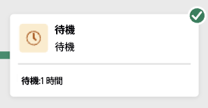
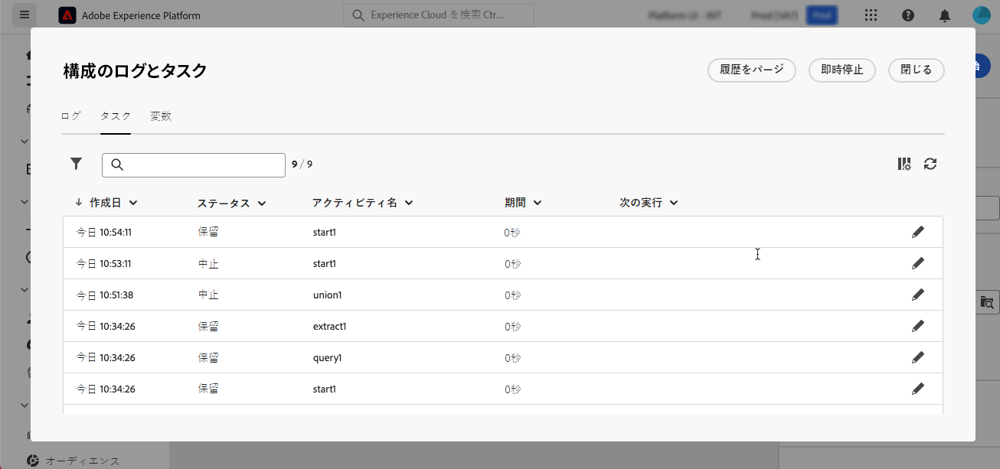
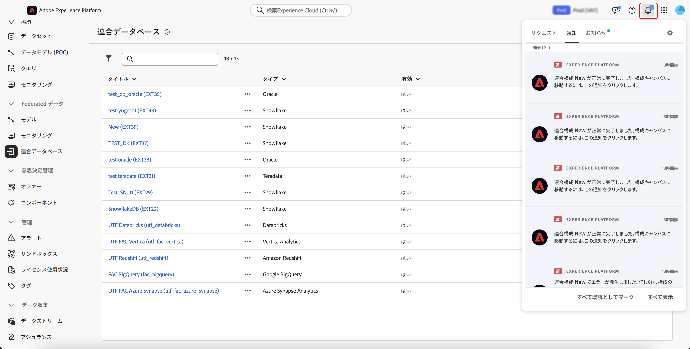

# 構成の作成

連合オーディエンス構成では、構成を作成し、そこから視覚的なキャンバスで様々なアクティビティを活用してオーディエンスを作成できます。構成を作成した後、結果として生成されたオーディエンスは Adobe Experience Platform に保存され、Experience Platform の宛先や Adobe Journey Optimizer で顧客のターゲティングに活用できます。

## コンポジションを定義 {#create}

>[!CONTEXTUALHELP]
>id="dc_composition_creation_properties"
>title="構成プロパティ"
>abstract="この画面では、構成の作成に使用するテンプレートを選択し、ラベルを指定します。「その他のオプション」セクションを展開して、構成の内部名、フォルダー、タイムゾーン、スーパーバイザーグループなどの詳細設定を行います。エラーが発生した場合にオペレーターに警告できるように、スーパーバイザーグループを選択することを強くお勧めします。"

コンポジションを作成するには、まずラベルを定義し、オプションで追加設定を指定する必要があります。

構成を作成するには、「**[!UICONTROL 顧客]**」セクション内の「**[!UICONTROL オーディエンス]**」を選択してから、「**[!UICONTROL 連合構成]**」タブを選択します。

連合構成の参照ページが表示されます。構成作成プロセスを続行するには、「**[!UICONTROL 構成を作成]**」を選択します。

「**[!UICONTROL プロパティ]**」セクションで、コンポジションのラベルを指定し、データモデルを選択します。 構成のアクティビティでは、このデータモデルに関連付けられているスキーマのみを使用できます。

「**[!UICONTROL 作成]**」を選択します。構成キャンバスが表示されます。アクティビティとトランジションをキャンバスに追加して、コンポジションを設定できるようになりました。

## コンポジションキャンバス {#canvas}

キャンバスの上部にあるツールバーには、アクティビティを管理および移動するためのオプションを提供するツールバーにアクセスできます。

次のオプションを使用できます。

* **[!UICONTROL 複数選択]**：複数のアクティビティを選択してすべてを一度に削除するか、コピーして貼り付けます。
* **[!UICONTROL 回転]**：キャンバスを垂直方向に表示するように切り替えます。
* **[!UICONTROL 画面に合わせる]**：キャンバスのズームレベルを画面に合わせて調整します。
* **[!UICONTROL ズームイン]**/**[!UICONTROL ズームアウト]**：キャンバスをズームインまたはズームアウトします。
* **[!UICONTROL マップを表示]**：現在の位置を示すキャンバスのスナップショットを開きます。

## アクティビティを追加 {#add-activities}

コンポジションキャンバスでは、オーディエンスの定義に役立つアクティビティとトランジションを追加できます。 アクティビティでは、オーディエンス内のコンポーネントを *定義* でき、トランジションでは、コンポジションのフローを *整理* できます。

使用可能なアクティビティとトランジションの詳細については、[&#x200B; アクティビティの概要 &#x200B;](./activities.md) を参照してください。

## アクティビティの管理 {#manage-activities}

追加したアクティビティに対する操作は、プロパティ ペインで実行できます。

次のようなオプションがあります。

* **[!UICONTROL 削除]**：キャンバスからアクティビティを削除します。
* **[!UICONTROL Disable]/[!UICONTROL Enable]**：アクティビティを無効にするか有効にします。 構成を実行すると、無効になっているアクティビティと、同じパス上にある後続のアクティビティは実行されず、構成が停止します。
* **[!UICONTROL 一時停止 &#x200B;]/[!UICONTROL &#x200B; 再開]**：アクティビティを一時停止または再開します。 構成を実行すると、一時停止したアクティビティで一時停止します。対応するタスクと、同じパス内でそのタスクに続くすべてのタスクが実行されません。
* **[!UICONTROL コピー]**：アクティビティをコピーして、コンポジション内の別の場所に貼り付けます。 これを行うには、トランジションの「**+**」ボタンを選択し、「**[!UICONTROL X アクティビティを貼り付け]**」を選択します。<!-- cannot copy multiple activities ? cannot paste in another composition?-->
* 選択したアクティビティの&#x200B;**[!UICONTROL 実行オプション]**&#x200B;を設定します。使用可能な実行オプションを次に示します。
  +++使用可能な実行オプション

  「**[!UICONTROL プロパティ]**」セクションでは、アクティビティの実行に関する一般的な設定を指定できます。

   * **[!UICONTROL 実行]**：開始時に実行されるアクションを定義します。
   * **[!UICONTROL 最大実行期間]**：「30 秒」や「1 時間」などの期間を指定します。指定した期間が経過してもアクティビティが完了しない場合は、アラートがトリガーされます。このアラートは、構成の機能には影響しません。
   * **[!UICONTROL タイムゾーン]**：アクティビティのタイムゾーンを選択します。連合オーディエンス構成では、同じインスタンス上で複数の国の時差を管理できます。適用される設定は、インスタンスの作成時に設定されます。
   * **[!UICONTROL アフィニティ]**：特定のマシンで構成アクティビティを強制的に実行します。これを行うには、対象のアクティビティに対して 1 つまたは複数のアフィニティを指定する必要があります。
   * **[!UICONTROL 動作]**：非同期タスクが使用された場合に従うべき手順を定義します。

  「**[!UICONTROL エラー管理]**」セクションでは、アクティビティでエラーが発生した場合に実行するアクションを指定できます。

  「**[!UICONTROL 初期化スクリプト]**」セクションでは、変数を初期化したり、アクティビティのプロパティを変更したりできます。「**[!UICONTROL コードを編集]**」ボタンを選択し、実行するコードのスニペットを入力します。 スクリプトは、アクティビティの実行時に呼び出されます。

  +++
* **ログとタスク**：選択したアクティビティのログとタスクを表示します。

## 構成の開始と監視 {#start-and-monitor}

コンポジションへのアクティビティの追加が完了したら、コンポジションの実行を開始できます。 コンポジションを開始するには、画面の右上隅にある **[!UICONTROL 開始]** ボタンを選択します。

| アクション | 説明 |
| ------ | ----------- |
| **開始** | コンポジションの実行を開始し、**進行中** ステータスに移動します。 |
| **一時停止** | コンポジションの実行を一時停止し、**一時停止** ステータスに設定します。 コンポジションが再開されるまで新しいアクティビティはアクティブ化されませんが、進行中の操作は中断 **されません**。 |
| **再開** | 一時停止したコンポジションの実行を再開し、**処理中** ステータスに設定します。 |
| **停止** | コンポジションの実行を停止し、**完了** 状態に設定します。 コンポジションを停止した場所と同じ場所から再開することは **できません**。 |
| **再起動** | コンポジションの実行を停止して再開します。 |

コンポジションが実行されている場合、コンポジションの最後に達するまで、キャンバス内の各アクティビティが順番に実行されます。 視覚的なフローを使用すると、ターゲットプロファイルの進行状況をリアルタイムで追跡できます。これにより、各アクティビティのステータスと、アクティビティ間で移行中のプロファイルの数をすばやく識別できます。

各アクティビティの右上隅にある視覚的な指標は、実行のステータスを示します。

| 視覚的な指標 | 説明 |
| ---------------- | ------------|
| {zoomable="yes"}{width="70%"} | このアクティビティは現在実行中です。 |
| {zoomable="yes"}{width="70%"} | このアクティビティには注意が必要です。これには、配信の送信確認や、必要なアクションの実行が含まれる場合があります。 |
| {zoomable="yes"}{width="70%"} | アクティビティでエラーが発生しました。この問題を解決するには、構成のログを開いて詳細を確認します。 |
| {zoomable="yes"}{width="70%"} | アクティビティが正常に実行されました。 |

### ログとタスクを監視 {#monitor-logs}

さらに、コンポジションログを表示して、正しく実行されていることを確認できます。 この情報を確認するには、アクションツールバー内の **[!UICONTROL ログ]** を選択します。

**[!UICONTROL コンポジションログとタスク]** 画面が表示されます。 これにより、コンポジションの実行履歴が提供され、すべてのユーザーのアクションと発生したエラーが記録されます。

履歴は、以下のように複数のタブに整理されています。

* 「**[!UICONTROL ログ]**」タブには、すべての構成アクティビティの実行履歴が表示されます。実行された操作と実行エラーのインデックスを時系列の順序で作成します。
* 「**[!UICONTROL タスク]**」タブには、アクティビティの実行順序の詳細が表示されます。各タスクの最後にあるボタンを使用すると、アクティビティを通じて渡されるイベント変数をリストできます。
* 「**[!UICONTROL 変数]**」タブには、構成で渡されるすべての変数が表示されます。構成キャンバスからログとタスクにアクセスする場合にのみ使用できます。アクティビティのプロパティペインからログにアクセスする際に、この機能が使用できるようになりました。

すべてのタブで、表示される列とその順序を選択し、フィルターを適用し、検索フィールドを使用して目的の情報をすばやく見つけることができます。

### アラートの配信を登録 {#alerts}

また、アラートを購読すると、フェデレーションのコンポジション実行が成功または失敗した場合に通知を受け取ることができます。

アラートを登録するには、を選択してから、を選択します。

{zoomable="yes"}{width="70%"}

通知設定ページが表示されます。このページで、「**[!UICONTROL Experience Platform]**」を選択し、必要なアラートのチャネルを選択します。UI 内で通知を確認するには、「**[!UICONTROL アプリ内]**」を選択します。

{zoomable="yes"}{width="50%"}

「**[!UICONTROL アプリ内]**」を選択すると、構成の実行が成功または失敗したかが通知されます。

{zoomable="yes"}{width="70%"}

## 構成の設定を行います。 {#settings}

>[!CONTEXTUALHELP]
>id="dc_composition_settings_properties"
>title="構成プロパティ"
>abstract="このセクションでは、構成の作成時にもアクセスできる一般的な構成プロパティを提供します。"

>[!CONTEXTUALHELP]
>id="dc_composition_settings_segmentation"
>title="構成のセグメント化"
>abstract="デフォルトでは、構成の最後の実行の作業テーブルのみが保持されます。 このオプションを有効にすると、テスト目的で作業テーブルを保持できます。 開発環境またはステージング環境で&#x200B;**のみ**&#x200B;使用する必要があります。 本番環境では絶対にオンにしないでください。"

>[!CONTEXTUALHELP]
>id="dc_composition_settings_error"
>title="エラー管理設定"
>abstract="このセクションでは、実行中のエラーを管理する方法を定義できます。 プロセスの一時停止、一定数のエラーの無視または構成の実行の停止を選択できます。"

構成にアクセスすると、詳細設定にアクセスして、エラーが発生した場合の構成の動作方法を定義するなどの操作を実行できます。

これらの追加オプションにアクセスするには、構成作成画面の上部セクションにある「**[!UICONTROL 設定]**」ボタンをクリックします。

| 設定 | 説明 |
| -------- | ----------- |
| **[!UICONTROL ラベル]** | コンポジションに付けられた名前を更新します。 |
| **[!UICONTROL 2 つの実行間の中間母集団の結果を保持]** | このオプションを有効にした場合、構成を実行した後も作業用テーブルが保持されます。デフォルトでは、構成の最後の実行の作業テーブルのみが保持されます。 それ以前に実行した分の作業用テーブルは毎日削除されます。 この設定は、開発環境またはステージング環境でのみ有効にしてください。 実稼動環境では **この設定を有効にしない** でください。 |
| **[!UICONTROL エラー管理]** | コンポジションにエラーがある場合に実行するアクションを定義します。 次の 3 つのオプションが使用可能です。 <ul><li>**[!UICONTROL プロセスを中断]**：構成が自動的に一時停止され、構成のステータスは「**[!UICONTROL 失敗]**」に変わります。問題が解決したら、「**[!UICONTROL 再開]**」ボタンを使用して構成を再開します。</li><li>**[!UICONTROL 無視]**：エラーをトリガーしたタスクのステータスは「**[!UICONTROL 失敗]**」に変わりますが、構成のステータスは「**[!UICONTROL 開始済み]**」のままになります。</li><li>**[!UICONTROL プロセスを中止]**：構成は自動的に停止し、ステータスが「**[!UICONTROL 失敗]**」に変わります。問題が解決したら、「**[!UICONTROL 開始]**」ボタンを使用して構成を再開します。</li></ul> |
| **[!UICONTROL 連続エラー]** | プロセスを停止するまでに無視するエラーの数を指定します。この数に達すると、構成のステータスが「**[!UICONTROL 失敗]**」に変わります。このフィールドの値が 0 の場合、エラーの数にかかわらず、構成が停止することはありません。 |
