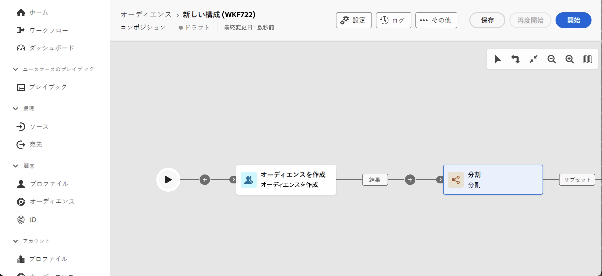

# 構成作成の主な原則 {#gs-composition-creation}

>[!CONTEXTUALHELP]
>id="dc_composition_creation_properties"
>title="構成プロパティ"
>abstract="この画面では、構成の作成に使用するテンプレートを選択し、ラベルを指定します。「その他のオプション」セクションを展開して、構成の内部名、フォルダー、タイムゾーン、スーパーバイザーグループなどの詳細設定を行います。エラーが発生した場合にオペレーターに警告できるように、スーパーバイザーグループを選択することを強くお勧めします。"

## 構成の内容 {#gs-composition-inside}

Experience Platform 連合オーディエンス構成は、様々なアクティビティ（分割、強化など）を活用してオーディエンスを作成できる視覚的なキャンバスを提供します。

構成ダイアグラムは、実行される処理を表したものです。これは、実行される様々なタスクと、タスク同士の関係を示すものです。

{zoomable="yes"} {zoomable="yes"}

各構成には次が含まれます。

* **[!UICONTROL アクティビティ]**：アクティビティとは、実行されるタスクです。各種アクティビティは、ダイアグラム内にアイコンで示されます。各アクティビティには、特定のプロパティと、すべてのアクティビティに共通のその他のプロパティがあります。
* **[!UICONTROL トランジション]**：トランジションは、ソースアクティビティを宛先アクティビティにリンクし、そのシーケンスを定義します。
* **[!UICONTROL 作業用テーブル]**：作業用テーブルには、トランジションによって実行されるすべての情報が含まれます。各構成は、複数の作業用テーブルを使用します。これらのテーブルで伝えられるデータは、構成のライフサイクルを通じて使用できます。

## 構成を作成する主な手順 {#gs-composition-steps}

構成を作成する主な手順は次のとおりです。

1. [構成の作成と設定](../compositions/create-composition.md)
1. [アクティビティを調整](../compositions/orchestrate-activities.md)
1. [構成の実行と、その実行の監視](../compositions/start-monitor-composition.md)
