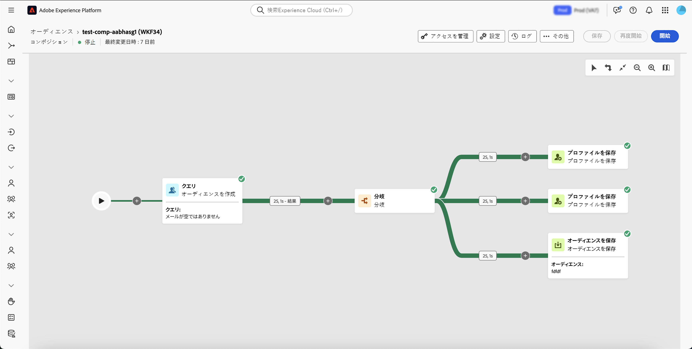
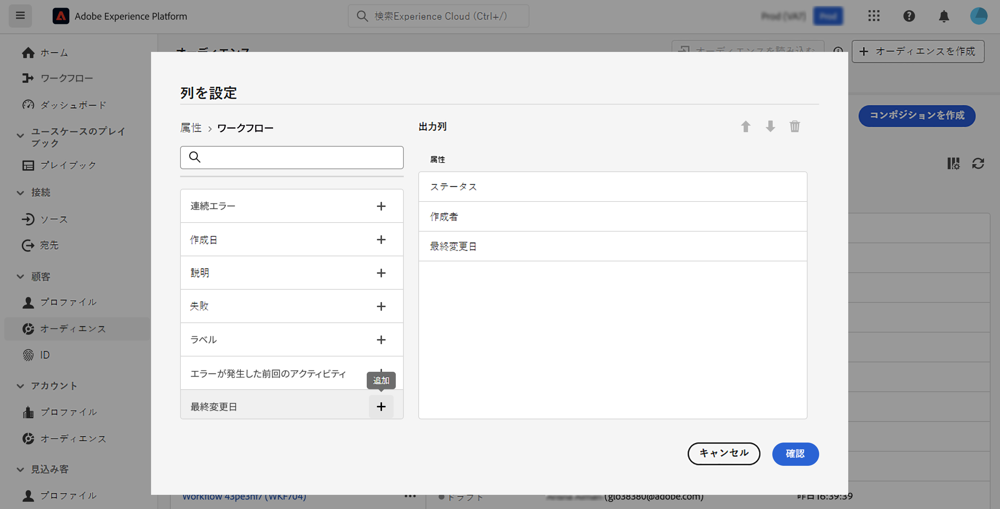
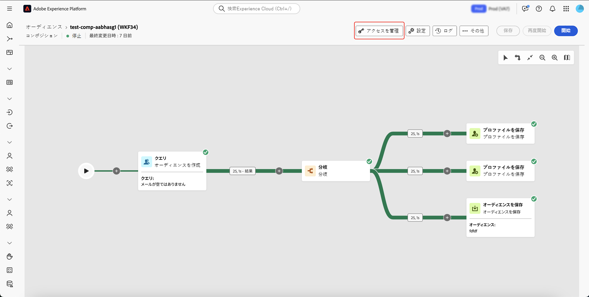
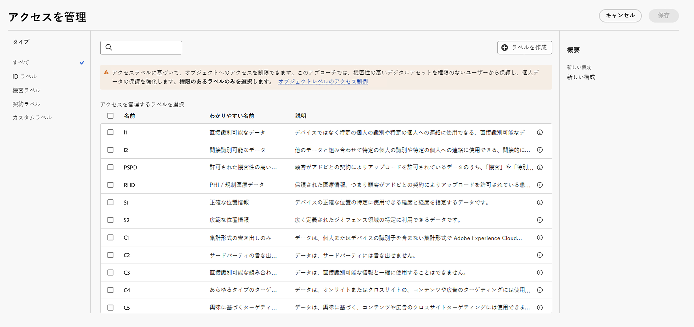

# 構成の基本を学ぶ {#compositions}

>[!AVAILABILITY]
>
>構成にアクセスするには、次のいずれかの権限が必要です。
>
>-**連合構成の管理**
>&#x200B;>-**連合構成の表示**
>
>必要な権限の詳細については、[ アクセス制御ガイド ](/help/governance-privacy-security/access-control.md) を参照してください。

Federated Audience Composition を使用すると、コンポジションを作成できます。様々なアクティビティをビジュアルキャンバスに活用して、オーディエンスを作成できます。 コンポジションを作成した後、結果のオーディエンスはAdobe Experience Platformに保存され、Experience Platformの宛先やAdobe Journey Optimizerで活用して、お客様をターゲットにします。

{zoomable="yes"}{width="70%"}

## 構成へのアクセスと管理 {#access}

>[!CONTEXTUALHELP]
>id="dc_composition_list"
>title="構成"
>abstract="この画面では、構成の完全なリストにアクセスし、現在のステータス、前回／次回の実行日を確認して、新しい構成を作成できます。"

コンポジションには、Adobe Experience Platformの **[!UICONTROL オーディエンス]** メニューから、「**[!UICONTROL 顧客]** セクション内の「**[!UICONTROL Federated コンポジション]** タブでアクセスできます。

この画面から、新しい構成を作成したり、既存の構成にアクセスしたりできます。名前の横にある  ボタンを選択して、既存のコンポジションを複製または削除することもできます。

また、名前、ステータス、作成者、最終更新日など、コンポジションに関する情報も表示できます。

| ステータス | 説明 |
| ------ | ----------- |
| **[!UICONTROL ドラフト]** | コンポジションが作成され、保存されました。 |
| **[!UICONTROL 処理中]** | コンポジションが実行され、現在実行中です。 |
| **[!UICONTROL 停止]** | コンポジションの実行が完了し、停止しました。 |
| **[!UICONTROL 一時停止]** | コンポジションの実行が一時停止されました。 |
| **[!UICONTROL エラー]** | コンポジションの実行でエラーが発生しました。 エラーに関する詳細を表示するには、コンポジションを開き、ログにアクセスします。 |

コンポジションを開始または停止する方法については、[ コンポジションの開始と監視ガイド ](./start-monitor-composition.md) を参照してください。

{zoomable="yes"}{width="70%"}{align="center"}

リストを絞り込んで探しているコンポジションを見つけるには、リストを検索し、ステータスまたは前回の処理日でコンポジションをフィルタリングします。

また、列を追加または削除してリストをカスタマイズすることもできます。これを行うには、「**[!UICONTROL 列を設定]**」ボタンを選択し、目的の出力列を追加または削除します。

{zoomable="yes"}{width="70%"}{align="center"}

### アクセスラベルの適用 {#access-labels}

特定のコンポジションにアクセスラベルを適用するには、コンポジションを選択し、次に **[!UICONTROL アクセスを管理]** します。

{zoomable="yes"}{width="70%"}{align="center"}

**[!UICONTROL アクセスを管理]** ポップオーバーが表示されます。 このページでは、該当するアクセスラベルとデータガバナンスラベルをコンポジションに適用できます。

{zoomable="yes"}{width="70%"}{align="center"}

| ラベルタイプ | 説明 |
| ---------- | ----------- |
| 契約ラベル | 契約ラベル（「C」ラベル）は、契約上の義務があるデータや組織のデータガバナンスポリシーに関連するデータの分類に使用されます。 |
| ID ラベル | ID ラベル（「I」ラベル）は、特定の人物を識別したり、その人物への連絡に使用したりできるデータの分類に使用されます。 |
| 機密ラベル | 機密ラベル（「S」ラベル）は、お客様や組織が機密であると見なした分類に使用されます。 |
| パートナーエコシステムラベル | パートナーエコシステムラベルは、組織外部のソースからのデータを分類するために使用されます。 |

アクセスラベルとデータガバナンスラベルについて詳しくは、[ データ使用ラベルの用語集 ](https://experienceleague.adobe.com/ja/docs/experience-platform/data-governance/labels/reference) を参照してください。

## 次の手順

このガイドを読むことで、コンポジションのアクセスラベルにアクセス、管理、作成する方法を学びました。 オーディエンス全体の操作の詳細については、[ オーディエンスガイド ](../start/audiences.md) を参照してください。
