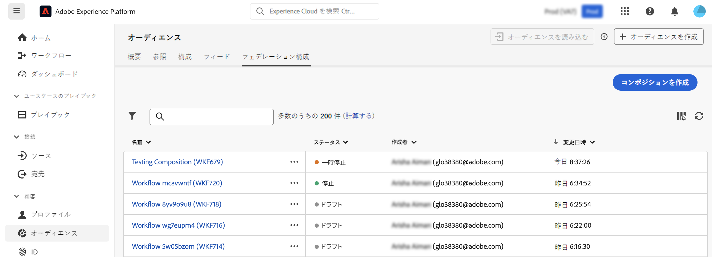
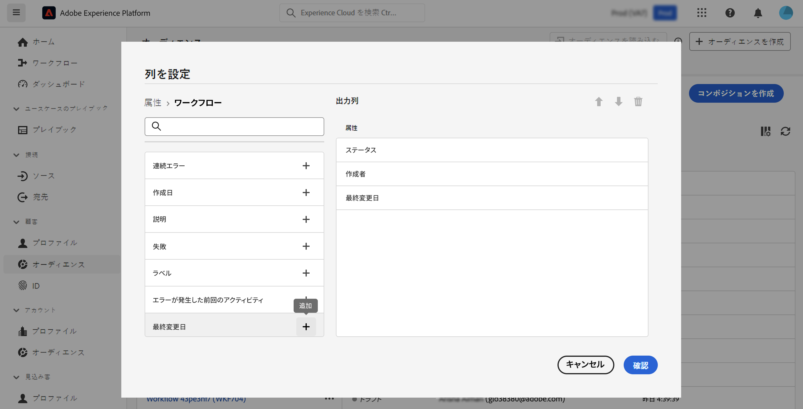

# 構成の基本を学ぶ {#compositions}

## 構成とは {#what}

Adobe Audience Composition を使用すると、構成を作成し、様々なアクティビティ（分割、除外など）を視覚的なキャンバスに活用してオーディエンスを作成できます。完了すると、結果オーディエンスが既存のオーディエンスと共にAdobe Experience Platformに保存され、Adobe Experience Platformの宛先やAdobe Journey Optimizerで活用して、お客様をターゲットできます。 [オーディエンスの使用方法を学ぶ](../start/audiences.md)

## 構成へのアクセスと管理 {#access}

>[!CONTEXTUALHELP]
>id="dc_composition_list"
>title="構成"
>abstract="この画面では、構成の完全なリストにアクセスし、現在のステータス、前回／次回の実行日を確認して、新しい構成を作成できます。"

構成には、Adobe Experience Platform **[!UICONTROL オーディエンス]**&#x200B;メニューの「**[!UICONTROL 連合構成]**」タブからアクセスできます。

この画面から、新しい構成を作成したり、既存の構成にアクセスしたりできます。また、名前の横にある省略記号ボタンをクリックして、既存の構成を複製または削除することもできます。

リストを絞り込み、探している構成を簡単に見つけるには、リストを検索し、ステータスまたは最終処理日で構成をフィルタリングします。

また、列を追加または削除してリストをカスタマイズすることもできます。これを行うには、**[!UICONTROL 列を設定]** ボタンをクリックし、目的の出力列を追加または削除します。

## 構成のステータス {#status}

コンポジションには複数のステータスがあります。

* **[!UICONTROL ドラフト]**：構成が作成され、保存されました。
* **[!UICONTROL 処理中]**：構成が開始され、現在実行中です。
* **[!UICONTROL 停止]**：構成の実行が完了し、停止しています。
* **[!UICONTROL 一時停止]**：構成の実行が一時停止されています。
* **[!UICONTROL エラー]**：構成の実行でエラーが発生しました。構成を開き、ログとタスクにアクセスしてエラーを特定し、解決します。

構成を開始および監視する方法について詳しくは、[この節](../compositions/start-monitor-composition.md)を参照してください。
