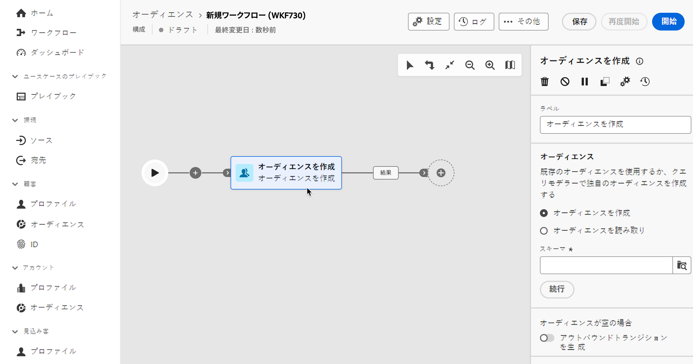
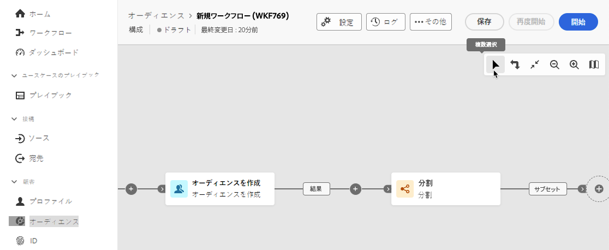
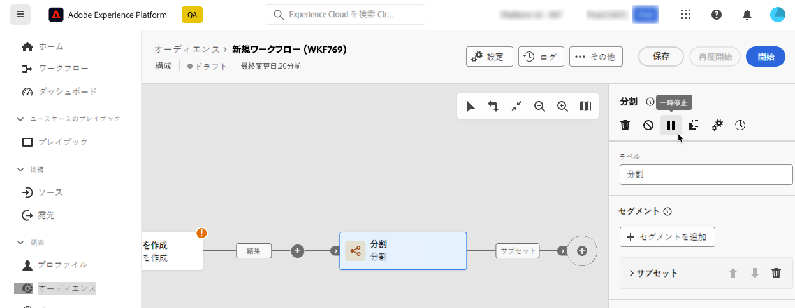

# コンポジションアクティビティの調整 {#activities}

コンポジションを作成したら、実行される様々なタスクの調整を開始できます。 これを行うために、コンポジションダイアグラムを作成できる視覚的なキャンバスが用意されています。 このダイアグラムに様々なアクティビティを追加し、順番に接続できます。

## アクティビティを追加 {#add}

設定のこの段階では、ダイアグラムには、ワークフローの開始を表す「開始」アイコンが表示されます。最初のアクティビティを追加するには、「開始」アイコンに接続されている「**+**」ボタンをクリックします。

ダイアグラムに追加できるアクティビティのリストが表示されます。使用できるアクティビティは、コンポジションダイアグラム内の位置によって異なります。 例えば、最初のアクティビティを追加する際に、オーディエンスをターゲティング、ワークフローパスを分割、ワークフローの実行を遅らせるスケジューラーを設定、またはワークフローの実行を遅らせる **待機** アクティビティを設定して、コンポジションを開始できます。 一方、「**オーディエンスを作成** アクティビティの後に、ターゲティングアクティビティでターゲットを絞り込んだり、フロー制御アクティビティで構成プロセスを整理したりできます。

アクティビティがダイアグラムに追加されると、右側のパネルが表示され、新しく追加されたアクティビティを特定の設定で設定できます。各アクティビティの設定方法について詳しくは、[この節](activities/about-activities.md)を参照してください。

このプロセスを繰り返し、コンポジションで実行するタスクに応じて、必要な数のアクティビティを追加します。 また、2 つのアクティビティの間に新しいアクティビティを挿入することもできます。これを行うには、アクティビティ間のトランジションで「**+**」ボタンをクリックし、目的のアクティビティを選択して、右側のパネルで設定します。

>[!TIP]
>
>各アクティビティ間のトランジションの名前をパーソナライズすることもできます。これを行うには、トランジションを選択し、右側のパネルでそのラベルを変更します。

## キャンバスツールバー {#toolbar}

キャンバスの右上隅にあるツールバーには、アクティビティを簡単に操作し、キャンバス内を移動するためのオプションが用意されています。

使用可能なアクションは次のとおりです。

* **複数選択**：複数のアクティビティを選択してすべてを一度に削除するか、コピーして貼り付けます。 [この節](#copy)を参照してください。
* **回転**：キャンバスを垂直方向に切り替えます。
* **画面に合わせる**：キャンバスのズームレベルを画面に合わせて調整します。
* **ズームアウト**／**ズームイン**：キャンバスをズームアウトまたはズームインします。
* **マップを表示**：現在の位置を示すキャンバスのスナップショットを開きます。

## アクティビティを管理 {#manage}

アクティビティを追加すると、プロパティペインにアクションボタンが表示され、複数の操作を実行できます。

以下が可能です。

* キャンバスからアクティビティを「**削除**」します。
* アクティビティを「**無効／有効**」にします。ワークフローを実行すると、無効になっているアクティビティと、同じパス上にある後続のアクティビティは実行されず、ワークフローが停止します。
* アクティビティを「**一時停止／再開**」します。ワークフローを実行すると、一時停止したアクティビティで一時停止します。対応するタスクと、同じパス内でそのタスクに続くすべてのタスクが実行されません。
* **コピー** アクティビティをコンポジション内の別の場所に貼り付けます。 これを行うには、トランジションの「**+**」ボタンをクリックし、「X アクティビティを貼り付け」を選択します。<!-- cannot copy multiple activities ? cannot paste in another composition?-->
* 選択したアクティビティの **実行オプション** を設定します。 以下のセクションを展開すると、使用可能なオプションの詳細が表示されます。

  +++使用可能な実行オプション

  「**プロパティ**」セクションでは、アクティビティの実行に関する一般的な設定を指定できます。

   * **実行**：の開始時に実行されるアクションを定義します。
   * **最大実行時間**:「30 秒」や「1 時間」などの期間を指定します。 指定した期間が経過してもアクティビティが完了しない場合は、アラートがトリガーされます。このアラートは、ワークフローの機能には影響しません。
   * **タイムゾーン**：アクティビティのタイムゾーンを選択します。 Federated Audience Composition を使用すると、同じインスタンス上の複数の国の時間差を管理できます。 適用される設定は、インスタンスの作成時に設定されます。
   * **アフィニティ**：特定のマシン上でコンポジションアクティビティを強制的に実行します。 それには、対象のアクティビティに 1 つまたは複数のアフィニティを指定する必要があります。
   * **動作**：非同期タスクが使用された場合に実行する手順を定義します。

  「**エラー管理**」セクションでは、アクティビティでエラーが発生した場合に実行するアクションを指定できます。

  「**初期化スクリプト**」セクションでは、変数を初期化したり、アクティビティのプロパティを変更したりできます。 「**コードを編集**」ボタンをクリックし、実行するコードのスニペットを入力します。スクリプトは、アクティビティの実行時に呼び出されます。

+++

* アクティビティの「**ログとタスク**」にアクセスします。
