# 構成の開始と監視 {#start-monitor}

構成を作成し、キャンバスで実行するタスクを設計したら、起動して実行状況を監視できます。

## 構成の開始 {#start}

構成を開始するには、画面の右上隅にある「**[!UICONTROL 開始]**」ボタンをクリックします。構成が実行されると、構成の最後に達するまで、キャンバス内の各アクティビティが順番に実行されます。

視覚的なフローを使用すると、ターゲットプロファイルの進行状況をリアルタイムで追跡できます。これにより、各アクティビティのステータスと、アクティビティ間で移行中のプロファイルの数をすばやく識別できます。

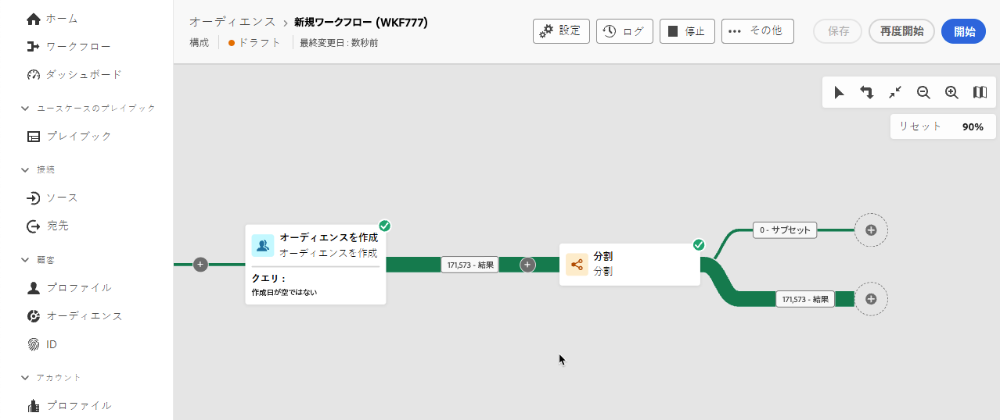

## 構成のトランジション {#transitions}

構成では、トランジションを通じて 1 つのアクティビティから別のアクティビティへ移されたデータは、一時的なワークテーブルに保存されます。このデータは、トランジションごとに表示できます。これを行うには、トランジションを選択して、画面の右側でそのプロパティを開きます。

* 「**[!UICONTROL スキーマをプレビュー]**」をクリックして、ワークテーブルのスキーマを表示します。
* 「**[!UICONTROL 結果をプレビュー]**」をクリックして、選択したトランジションで移されたデータを視覚化します。このオプションは、「**[!UICONTROL 2 つの実行間で中間母集団の結果を保持]**」オプションが有効になっている場合にのみ使用できます。[詳細情報](create-composition.md#settings)

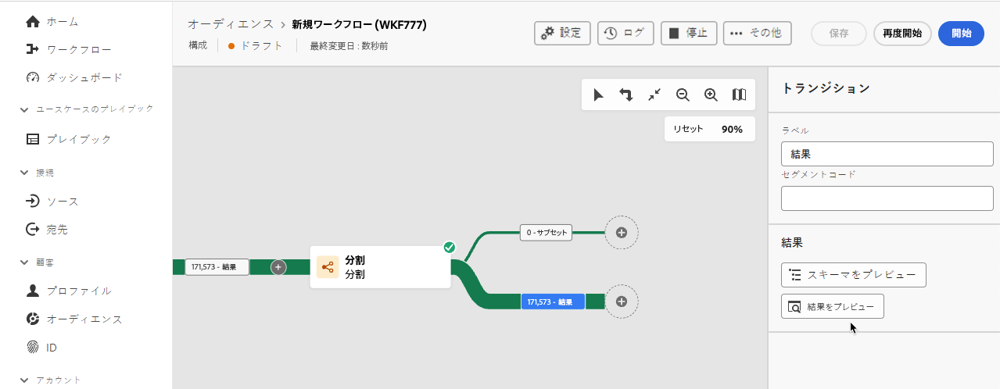

## アクティビティ実行を監視 {#activities}

各アクティビティボックスの右上隅にある視覚的な指標を使用すると、アクティビティの実行を確認できます。

| 視覚的な指標 | 説明 |
|-----|------------|
| 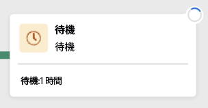{zoomable="yes"}{width="70%"} | このアクティビティは現在実行中です。 |
| 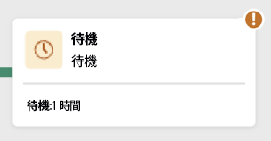{zoomable="yes"}{width="70%"} | このアクティビティには注意が必要です。これには、配信の送信確認や、必要なアクションの実行が含まれる場合があります。 |
| 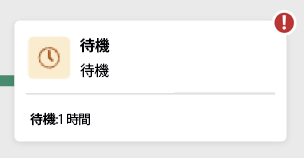{zoomable="yes"}{width="70%"} | アクティビティでエラーが発生しました。この問題を解決するには、構成のログを開いて詳細を確認します。 |
| 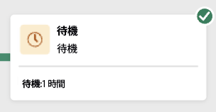{zoomable="yes"}{width="70%"} | アクティビティが正常に実行されました。 |

## ログとタスクを監視 {#logs-tasks}

構成のログとタスクの監視は、構成を分析し、正しく実行されていることを確認する重要な手順です。これらには、アクションツールバーと各アクティビティのプロパティパネルにある「**[!UICONTROL ログ]**」ボタンからアクセスできます。

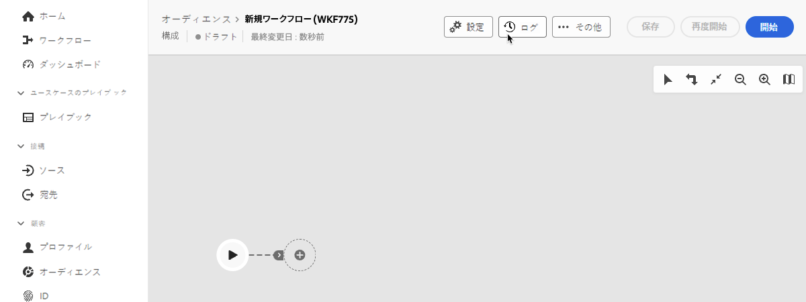

**[!UICONTROL 構成のログとタスク]**&#x200B;画面には、構成の実行履歴が表示され、すべてのユーザーのアクションと発生したエラーが記録されます。

<!-- à confirmer, pas trouvé dans les options = The workflow history is saved for the duration specified in the workflow execution options. During this duration, all the messages are therefore saved, even after a restart. If you do not want to save the messages from a previous execution, you have to purge the history by clicking the  button.-->

履歴は、以下のように複数のタブに整理されています。

* 「**[!UICONTROL ログ]**」タブには、すべての構成アクティビティの実行履歴が表示されます。実行された操作と実行エラーのインデックスを時系列順に作成します。
* 「**[!UICONTROL タスク]**」タブには、アクティビティの実行順序の詳細が表示されます。各タスクの最後にあるボタンを使用すると、アクティビティを通じて渡されるイベント変数をリストできます。
* 「**[!UICONTROL 変数]**」タブには、構成で渡されるすべての変数が表示されます。構成キャンバスからログとタスクにアクセスする場合にのみ使用できます。アクティビティのプロパティパネルからログにアクセスする際に使用できるようになりました。<!-- à confirmer-->

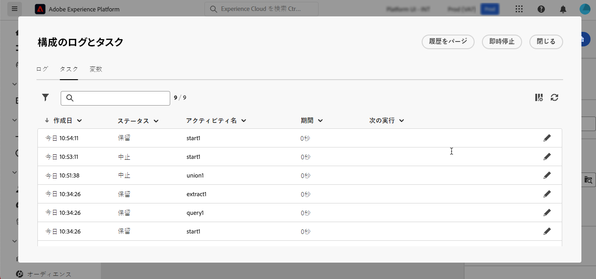

すべてのタブで、表示される列とその順序を選択し、フィルターを適用し、検索フィールドを使用して目的の情報をすばやく見つけることができます。

## アラートの配信を登録 {#alerts}

さらに、アラートを登録すると、連合構成の実行が成功または失敗した場合に通知を受け取ることができます。

アラートを登録するには、を選択してから、を選択します。

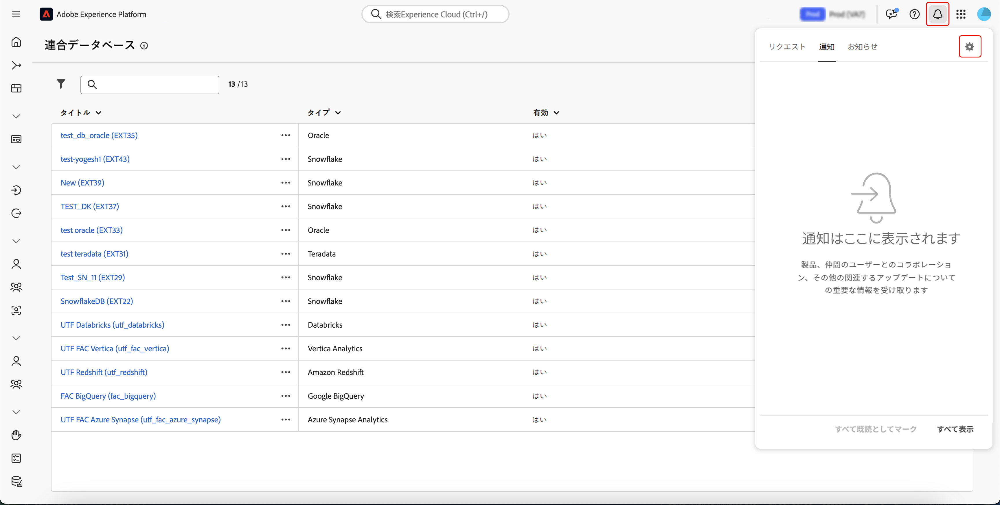{zoomable="yes"}{width="70%"}

通知設定ページが表示されます。このページで、「**[!UICONTROL Experience Platform]**」を選択し、必要なアラートのチャネルを選択します。UI 内で通知を確認するには、「**[!UICONTROL アプリ内]**」を選択します。

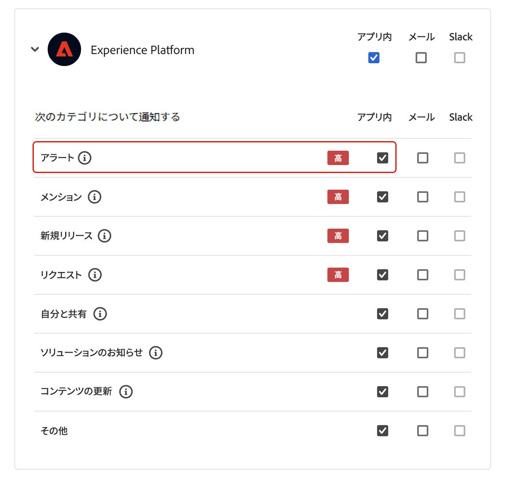{zoomable="yes"}{width="50%"}

「**[!UICONTROL アプリ内]**」を選択すると、構成の実行が成功または失敗したかが通知されます。

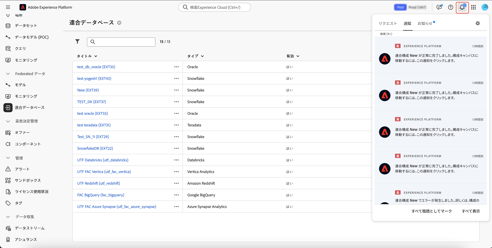{zoomable="yes"}{width="70%"}

## 構成実行コマンド {#execution-commands}

右上隅のアクションバーには、構成の実行を管理できるコマンドが用意されています。

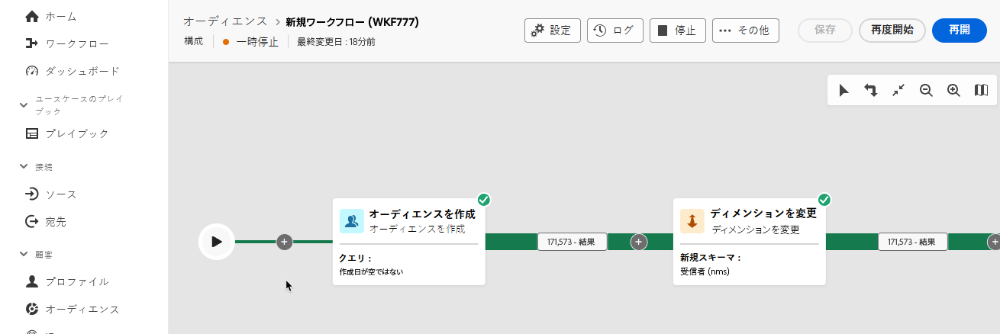

使用可能なアクションは次のとおりです。

* **[!UICONTROL 開始]**：構成の実行を開始すると、**[!UICONTROL 進行中]**&#x200B;ステータスになります。構成が開始され、初期アクティビティがアクティブ化されます。

* **[!UICONTROL 再開]**：一時停止されていた構成の実行を再開します。構成は、**[!UICONTROL 進行中]**&#x200B;ステータスになります。

* 構成の実行を&#x200B;**[!UICONTROL 一時停止]**&#x200B;すると、**[!UICONTROL 一時停止]**&#x200B;ステータスになります。ワークフローが再開されるまでは新しいアクティビティは有効化されません。ただし、進行中の操作は中断されません。

* 実行中の構成を&#x200B;**[!UICONTROL 停止]**&#x200B;すると、**[!UICONTROL 完了済み]**&#x200B;ステータスになります。進行中の操作は、可能であれば中断されます。構成を停止した同じ場所から再開することはできません。

* **[!UICONTROL 再起動]**：構成を停止してから再起動します。ほとんどの場合、停止には一定の時間がかかり、「**[!UICONTROL 開始]**」ボタンは停止が有効な場合にのみ使用できるので、より迅速に再起動できます。

