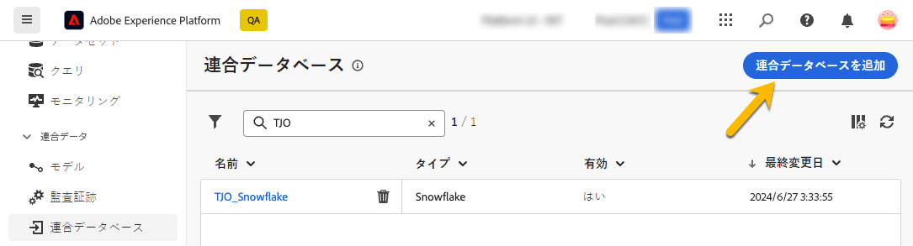
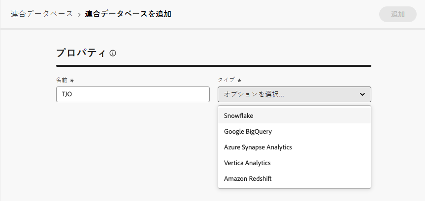
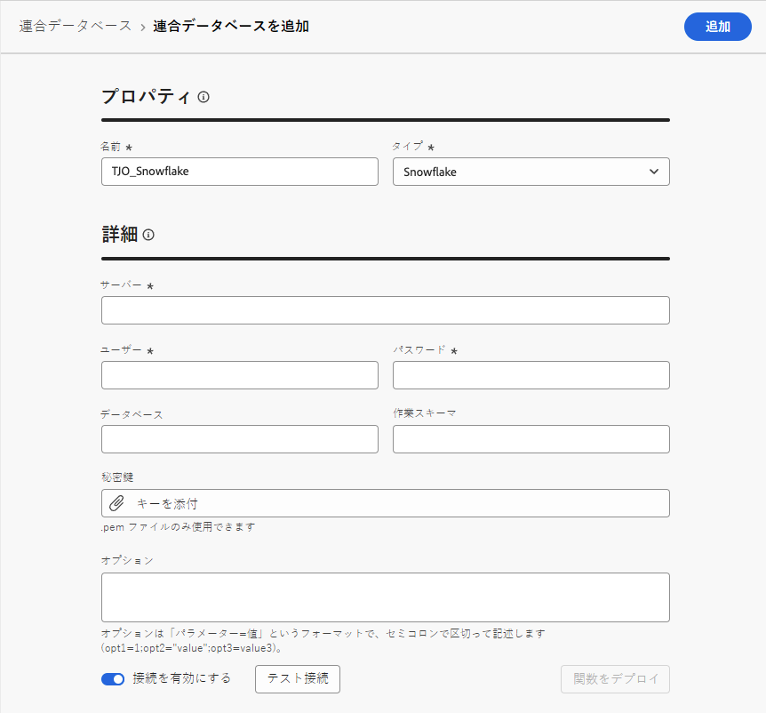
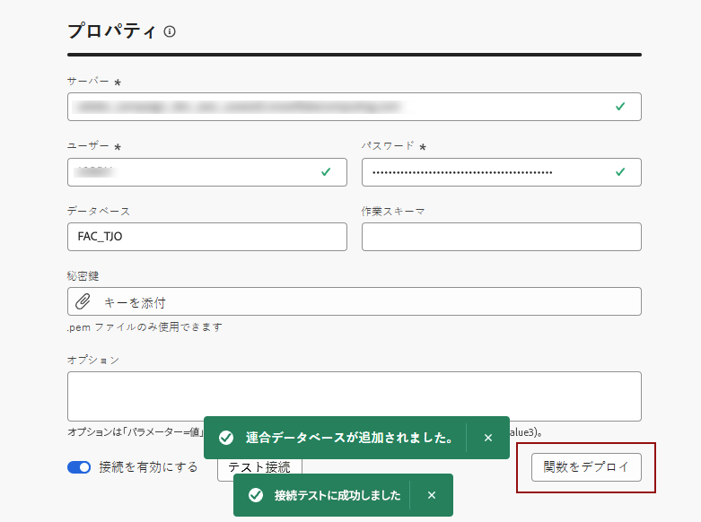
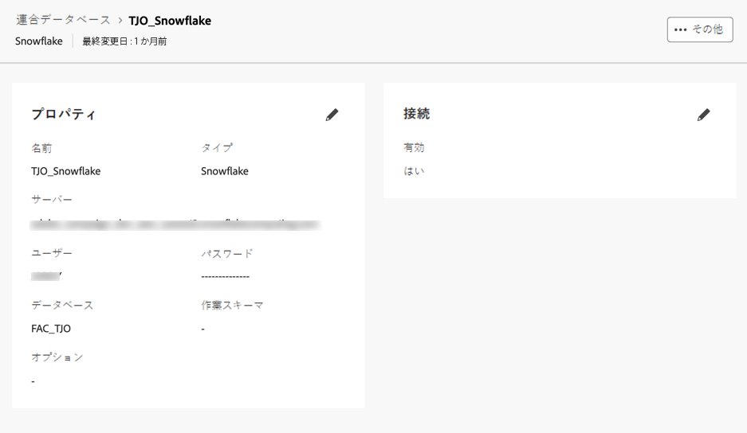

# 接続の作成 {#connections-fdb}

Experience Platform 連合オーディエンス構成を使用すると、お客様はサードパーティのデータウェアハウスからオーディエンスを作成して強化し、このオーディエンスを Adobe Experience Platform に読み込むことができます。

連合データベースと Adobe Experience Platform を操作するには、まず接続を確立する必要があります。この接続は、Adobe Experience Platform ユーザーインターフェイスで使用できる専用のユーザーインターフェイスで設定されます。詳しくは、このページを参照してください。

データベースとの接続を設定するには、次の手順に従います。

1. 左側のパネルの「**[!UICONTROL 連合データ]**」セクションを参照します。

1. **[!UICONTROL 連合データベース]**&#x200B;リンクで、「**[!UICONTROL 連合データベースを追加]**」ボタンをクリックします。

   {zoomable="yes"}

1. データベースの名前とタイプを使用して、接続の&#x200B;**[!UICONTROL プロパティ]**&#x200B;を設定します。

   {zoomable="yes"}

   タイプを選択すると、入力する他のプロパティにアクセスできます。サポートされているデータベースについて詳しくは、[このページ](federated-db.md)を参照してください。

   {zoomable="yes"}

   設定の指定は、データベースのタイプによって異なります。接続を設定するために必要な詳細にアクセスするには、以下のリンクを参照してください。

   * [Amazon Redshift](federated-db.md#amazon-redshift)
   * [Azure Synapse](federated-db.md#azure-synapse-redshift)
   * [Google BigQuery](federated-db.md#google-big-query)
   * [Snowflake](federated-db.md#snowflake)
   * [Vertica Analytics](federated-db.md#vertica-analytics)
   * [Databricks](federated-db.md#databricks)

1. 詳細を入力したら、「**[!UICONTROL 接続をテスト]**」ボタンと「**[!UICONTROL 関数をデプロイ]**」ボタンをクリックします。

   {zoomable="yes"}

1. 「**[!UICONTROL 終了]**」ボタンをクリックして、接続の作成を完了します。

   次に示すように、連合データベース接続の概要が表示されます。

   {zoomable="yes"}
