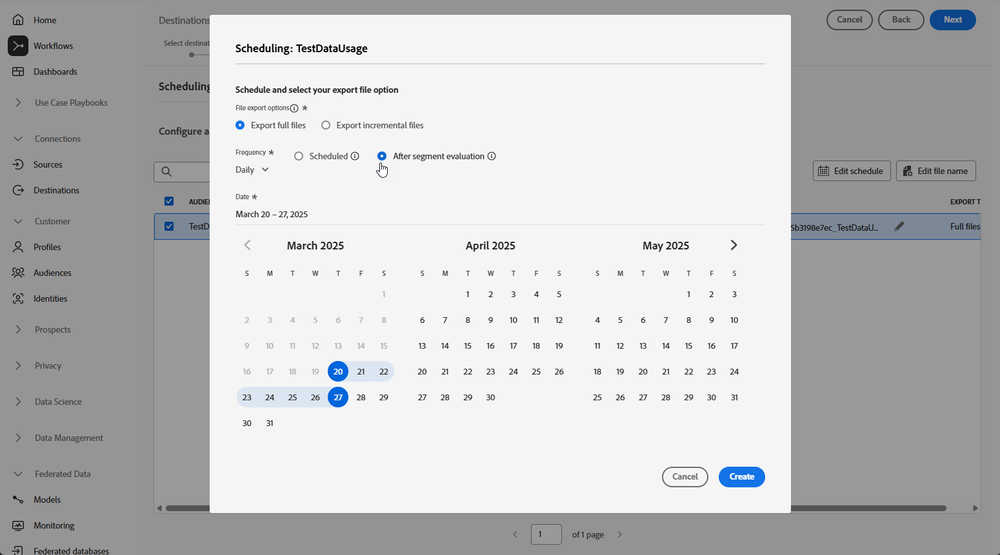

# 外部データを使用して Adobe Experience Platform オーディエンスを強化 {#connect-aep-fac}

>[!CONTEXTUALHELP]
>id="dc_new_destination"
>title="宛先の作成"
>abstract="新しい連合データベースに接続するための設定を入力します。 「**[!UICONTROL 宛先に接続]**」ボタンを使用して、設定を検証します。"

Adobe Experience Platform では、**アドビの連合オーディエンス構成の宛先**&#x200B;を使用して、オーディエンスポータルのオーディエンスと外部データベースをシームレスに統合できます。 この統合により、既存のオーディエンスを構成に活用し、外部データベースのデータを使用して強化または絞り込みを行い、新しいオーディエンスを作成できます。

これを行うには、Adobe Experience Platform で、アドビの連合オーディエンス構成の宛先への新しい接続を設定する必要があります。 スケジューラーを使用すると、特定のオーディエンスを定期的な頻度で送信したり、データ紐付け用の ID などの特定の属性を選択して含めたりすることができます。 オーディエンスにガバナンスポリシーやプライバシーポリシーを適用している場合、これらのポリシーは保持され、オーディエンスを更新するとオーディエンスのポータルに戻されます。

例えば、データウェアハウスに購入情報を保存していて、過去 2 か月以内に特定の製品に興味を示した顧客をターゲティングする Adobe Experience Platform オーディエンスがあるとします。 連合オーディエンス構成の宛先を使用すると、次のことができます。

* 購入情報に基づいてオーディエンスを絞り込む。 例えば、150 ドルを超える購入履歴がある顧客のみをターゲットにするように、オーディエンスをフィルタリングできます。
* 製品名や購入数量など、購入に関連するフィールドを使用してオーディエンスを強化します。

## 宛先に対するオーディエンスのアクティブ化 {#activate}

Adobe Experience Platform Destinations カタログ内で、Federated Audience Compositionの宛先を選択します。 右側のパネルで、「**[!UICONTROL 新しい宛先を設定]**」を選択します。

**[!UICONTROL 新しい宛先の設定]** ページが表示されます。 このページでは、名前、説明、接続タイプ、フェデレーションデータベースなど、宛先の詳細を設定できます。

「**[!UICONTROL アラート]**」セクションでは、アラートを有効にして、宛先へのデータフローのステータスに関する通知を受信できます。 これには、データフローの実行の遅延、実行エラー、実行成功、実行開始、アクティベーションのスキップに関するアラートが含まれます。

アラートについて詳しくは、[UI](https://experienceleague.adobe.com/ja/docs/experience-platform/destinations/ui/alerts){target="_blank"}を使用した宛先アラートの購読に関するAdobe Experience Platformのドキュメントを参照してください。

宛先の詳細の設定が完了したら、**[!UICONTROL 次へ]**&#x200B;を選択します。 **[!UICONTROL ガバナンスポリシーと適用アクション]**&#x200B;の手順が表示されます。 このページでは、データガバナンスポリシーを定義し、オーディエンスが送信され、アクティブな場合に、使用されるデータがコンプライアンスに準拠していることを確認できます。

宛先の目的のマーケティングアクションの選択が完了したら、**[!UICONTROL 作成]**&#x200B;を選択します。

宛先への新しい接続が作成されます。 オーディエンスをアクティベートして、宛先に送信できるようになりました。 オーディエンスをアクティブ化する宛先を選択し、次に&#x200B;**[!UICONTROL 次へ]**&#x200B;を選択します。

**[!UICONTROL スケジュール]**&#x200B;手順が表示されます。 宛先に対してアクティブ化する目的のオーディエンスを選択できます。 スケジュールを設定するには、を選択して、書き出しスケジュールを編集します。

**[!UICONTROL スケジュール]** ポップオーバーが表示されます。 このポップオーバーで、ファイルの書き出しオプション、頻度、スケジュールの設定を定義できます。

>[!NOTE]
>
>オーディエンスをより迅速にアクティベートするには、「**[!UICONTROL セグメントの評価後]**」オプションを選択すると、毎日の Platform バッチセグメント化ジョブが終了した直後にアクティベーションジョブがトリガーされます。
>
>スケジュールとファイル名の設定方法について詳しくは、Adobe Experience Platform ドキュメントの次の節を参照してください。
>
>* [オーディエンスのエクスポートのスケジュール](https://experienceleague.adobe.com/ja/docs/experience-platform/destinations/ui/activate/activate-batch-profile-destinations#scheduling){target="_blank"}
>* [ファイル名の設定](https://experienceleague.adobe.com/ja/docs/experience-platform/destinations/ui/activate/activate-batch-profile-destinations#configure-file-names){target="_blank"}

**[!UICONTROL マッピング]**&#x200B;手順では、オーディエンスにエクスポートする属性フィールドと ID フィールドを選択します。

>[!IMPORTANT]
>
>宛先に対してアクティブ化する際に、システム生成の列を&#x200B;**使用することはできません**。 システム生成の列を選択すると、エラーが発生します。

詳しくは、Adobe Experience Platform ドキュメントの[ マッピングの節](https://experienceleague.adobe.com/ja/docs/experience-platform/destinations/ui/activate/activate-batch-profile-destinations#mapping){target="_blank"}を参照してください。

宛先設定とオーディエンス設定を確認し、「**[!UICONTROL 終了]**」を選択します。

これで、選択したオーディエンスが新しい接続に対してアクティベートされました。 **[!UICONTROL オーディエンスをアクティベート]**&#x200B;ページに戻って、この接続で送信するオーディエンスをさらに追加できます。 アクティベートしたオーディエンスを削除することはできません。
