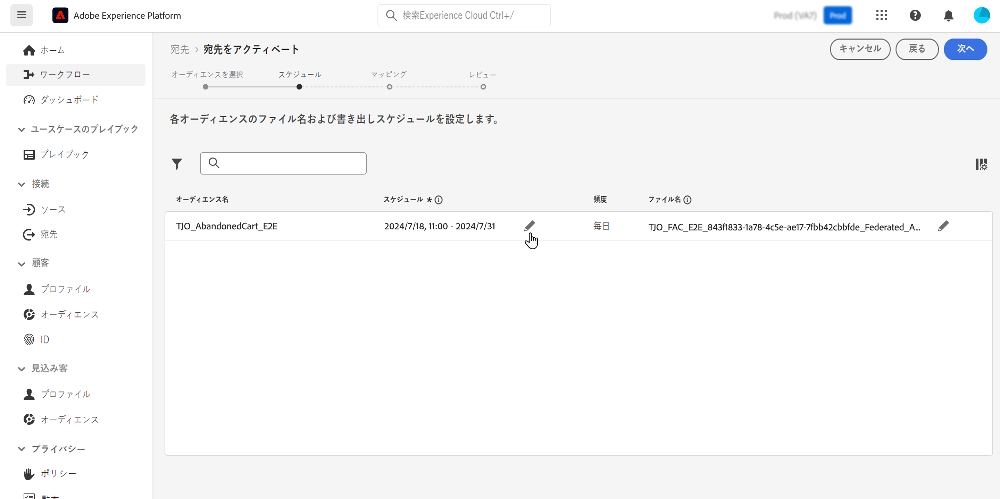

# 外部データを使用して Adobe Experience Platform オーディエンスを強化 {#connect-aep-fac}

>[!CONTEXTUALHELP]
>id="dc_new_destination"
>title="宛先の作成"
>abstract="新しい連合データベースに接続するための設定を入力します。 「**[!UICONTROL 宛先に接続]**」ボタンを使用して、設定を検証します。"

Adobe Experience Platform では、**Adobe Federated Audience Comboposition の宛先**&#x200B;を使用して、オーディエンスポータルのオーディエンスと外部データベースをシームレスに統合できます。この統合により、既存のオーディエンスを構成に活用し、外部データベースのデータを使用して強化または絞り込みを行い、新しいオーディエンスを作成できます。

これを行うには、Adobe Experience Platform で、アドビの連合オーディエンス構成の宛先への新しい接続を設定する必要があります。スケジューラーを使用すると、特定のオーディエンスを定期的な頻度で送信したり、データ紐付け用の ID などの特定の属性を選択して含めたりすることができます。オーディエンスにガバナンスポリシーやプライバシーポリシーを適用している場合、これらのポリシーは保持され、オーディエンスを更新するとオーディエンスのポータルに戻されます。

例えば、購入情報をデータウェアハウスに保存し、過去 2 か月以内に特定の商品に興味を持つ顧客をターゲティングするAdobe Experience Platform オーディエンスがあるとします。 Federated Audience Composition の宛先を使用すると、次のことができます。

* 購入情報に基づいてオーディエンスを絞り込みます。 例えば、オーディエンスをフィルタリングして、150 ドルを超える購入のみを行った顧客をターゲットにすることができます。
* 製品名や購入数量など、購入に関連するフィールドを使用してオーディエンスをエンリッチメントします。

Adobe Experience Platform オーディエンスを連合オーディエンス構成に送信する主な手順を以下に示します。

1. Adobe Experience Platform 宛先カタログにアクセスし、連合オーディエンス構成宛先を選択します。

   右側のパネルで、「**[!UICONTROL 新しい宛先を設定]**」を選択します。

   

1. 新しい接続の名前を指定し、使用する&#x200B;**[!UICONTROL 接続タイプ]**&#x200B;と接続先の&#x200B;**[!UICONTROL 連合データベース]**&#x200B;を選択して、「**[!UICONTROL 次へ]**」をクリックします。

   

   「**[!UICONTROL アラート]**」セクションでは、アラートを有効にして、宛先へのデータフローのステータスに関する通知を受信できます。アラートについて詳しくは、[UI を使用した宛先アラートの購読 ](https://experienceleague.adobe.com/ja/docs/experience-platform/destinations/ui/alerts){target="_blank"} についてのAdobe Experience Platform ドキュメントを参照してください

1. **[!UICONTROL ガバナンスポリシーと実施アクション]**&#x200B;手順では、データガバナンスポリシーを定義し、オーディエンスが送信されてアクティブになった際に、使用されるデータが準拠していることを確認できます。

   宛先に対する目的のマーケティングアクションの選択が完了したら、「**[!UICONTROL 作成]**」をクリックします。

1. 宛先への新しい接続が作成されます。オーディエンスをアクティベートして、宛先に送信できるようになりました。これを行うには、リストから選択して「**[!UICONTROL 次へ]**」をクリックします。

   

1. 送信する目的のオーディエンスを選択し、「**[!UICONTROL 次へ]**」をクリックします。

1. 選択したオーディエンスのファイル名と書き出しスケジュールを設定します。

   

   >[!NOTE]
   >
   >スケジュールとファイル名を設定する方法について詳しくは、Adobe Experience Platform ドキュメントの次の節を参照してください。
   >
   >* [ オーディエンスの書き出しをスケジュール ](https://experienceleague.adobe.com/ja/docs/experience-platform/destinations/ui/activate/activate-batch-profile-destinations#scheduling){target="_blank"}
   >* [ ファイル名の設定 ](https://experienceleague.adobe.com/ja/docs/experience-platform/destinations/ui/activate/activate-batch-profile-destinations#configure-file-names){target="_blank"}

1. **[!UICONTROL マッピング]**&#x200B;手順では、オーディエンスに書き出す属性フィールドと ID フィールドを選択します。詳しくは、Adobe Experience Platform ドキュメントの [ マッピングステップ ](https://experienceleague.adobe.com/ja/docs/experience-platform/destinations/ui/activate/activate-batch-profile-destinations#mapping){target="_blank"} を参照してください。

   

1. 宛先設定とオーディエンス設定を確認し、「**[!UICONTROL 終了]**」をクリックします。

   

これで、選択したオーディエンスが新しい接続に対してアクティベートされました。**[!UICONTROL オーディエンスをアクティベート]**&#x200B;ページに戻って、この接続で送信するオーディエンスをさらに追加できます。アクティベートしたオーディエンスを削除することはできません。
