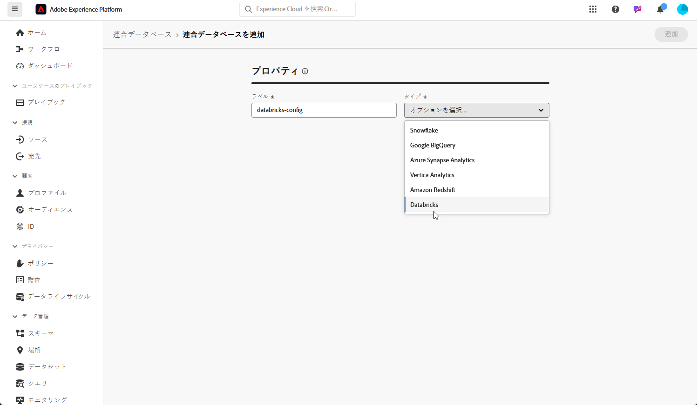

# 連合データベースの設定 {#federated-db}

>[!CONTEXTUALHELP]
>id="dc_connection_federated_database_menu"
>title="連合データベース"
>abstract="この画面には、連合データベースへの既存の接続がリストされます。新しい接続を作成するには、「**[!UICONTROL 連合データベースを追加]**」ボタンをクリックします。"

>[!CONTEXTUALHELP]
>id="dc_connection_federated_database_properties"
>title="連合データベースのプロパティ"
>abstract="新しい連合データベースの名前を入力し、このタイプを選択します。"

>[!CONTEXTUALHELP]
>id="dc_connection_federated_database_details"
>title="連合データベースの詳細"
>abstract="新しい連合データベースに接続するための設定を入力します。「**[!UICONTROL 接続をテスト]**」ボタンを使用して、設定を検証します。"

Experience Platform 連合オーディエンス構成を使用すると、お客様はサードパーティのデータウェアハウスからオーディエンスを作成して強化し、このオーディエンスを Adobe Experience Platform に読み込むことができます。

外部データベースへの接続を作成、設定、テストおよび保存する方法について詳しくは、[このページ](connections.md)を参照してください。サポートされているデータベースのリストと、それぞれのデータベースに対して設定する詳細な設定を以下に示します。

## サポートされているデータベース {#supported-db}

連合オーディエンス構成を使用すると、次のデータベースに接続できます。各データベースの設定について詳しくは、以下を参照してください。

* [Amazon Redshift](#amazon-redshift)
* [Azure Synapse Analytics](#azure-synapse)
* [Google BigQuery](#google-big-query)
* [Snowflake](#snowflake)
* [Vertica Analytics](#vertica-analytics)
* [Databricks](#databricks)
* [Microsoft Fabric](#microsoft-fabric)

## Amazon Redshift {#amazon-redshift}

>[!NOTE]
>
>* Amazon Redshift AWS、Amazon Redshift Spectrum および Amazon Redshift Serverless のみがサポートされています。
>
>* プライベートリンクを介した外部Amazon Redshift データベースへの安全なアクセスがサポートされています。

連合データベースを使用して、外部データベースに保存されている情報を処理します。Amazon Redshift へのアクセスを設定するには、次の手順に従います。

1. **[!UICONTROL 連合データ]**&#x200B;メニューで、「**[!UICONTROL 連合データベース]**」を選択します。

1. 「**[!UICONTROL 連合データベースを追加]**」をクリックします。

   

1. 連合データベースに&#x200B;**[!UICONTROL 名前]**&#x200B;を入力します。

1. **[!UICONTROL タイプ]**&#x200B;ドロップダウンから、「Amazon Redshift」を選択します。

   

1. Amazon Redshift の認証設定を指定します。

   * **[!UICONTROL サーバー]**：DNS の名前を追加します。

   * **[!UICONTROL アカウント]**：ユーザー名を追加します。

   * **[!UICONTROL パスワード]**：アカウントのパスワードを追加します。

   * **[!UICONTROL データベース]**：DSN で指定されていない場合のデータベースの名前。DSN で指定した場合は、空のままにできます

   * **[!UICONTROL 作業スキーマ]**：作業用テーブルに使用するデータベーススキーマの名前。詳しくは、[Amazon ドキュメント](https://docs.aws.amazon.com/ja_jp/redshift/latest/dg/r_Schemas_and_tables.html){target="_blank"}を参照してください

     >[!NOTE]
     >
     >このスキーマへの接続に必要な権限がある限り、一時的なデータ処理に使用するスキーマを含む、データベースの任意のスキーマを使用できます。
     >
     >複数のサンドボックスを同じデータベースに接続する際は、**異なる作業スキーマ**&#x200B;を使用する必要があります。

1. 「**[!UICONTROL 接続をテスト]**」オプションを選択して、設定を検証します。

1. 「**[!UICONTROL 関数をデプロイ]**」ボタンをクリックして、関数を作成します。

1. 設定が完了したら、「**[!UICONTROL 追加]**」をクリックして、連合データベースを作成します。

## Azure Synapse Analytics {#azure-synapse}

連合データベースを使用して、外部データベースに保存されている情報を処理します。Azure Synapse Analytics へのアクセスを設定するには、次の手順に従います。

1. **[!UICONTROL 連合データ]**&#x200B;メニューで、「**[!UICONTROL 連合データベース]**」を選択します。

1. 「**[!UICONTROL 連合データベースを追加]**」をクリックします。

   

1. 連合データベースに&#x200B;**[!UICONTROL 名前]**&#x200B;を入力します。

1. **[!UICONTROL タイプ]**&#x200B;ドロップダウンから、「Azure Synapse Analytics」を選択します。

   

1. Azure Synapse Analytics の認証設定を指定します。

   * **[!UICONTROL サーバー]**：Azure Synapse サーバーの URL を入力します。

   * **[!UICONTROL アカウント]**：ユーザー名を入力します。

   * **[!UICONTROL パスワード]**：アカウントのパスワードを入力します。

   * **[!UICONTROL データベース]**（オプション）：DSN で指定されていない場合は、データベースの名前を入力します。

   * **[!UICONTROL オプション]**：コネクタは、以下の表で説明するオプションをサポートします。

1. 「**[!UICONTROL 接続をテスト]**」オプションを選択して、設定を検証します。

1. 「**[!UICONTROL 関数をデプロイ]**」ボタンをクリックして、関数を作成します。

1. 設定が完了したら、「**[!UICONTROL 追加]**」をクリックして、連合データベースを作成します。

| オプション | 説明 |
|---|---|
| 認証 | コネクタでサポートされている認証のタイプ。現在サポートされている値：ActiveDirectoryMSI。詳しくは、[Microsoft SQL ドキュメント](https://learn.microsoft.com/ja-jp/sql/connect/odbc/using-azure-active-directory?view=sql-server-ver15#example-connection-strings){target="_blank"}（接続文字列 n°8 の例）を参照してください |

## Google BigQuery {#google-big-query}

連合データベースを使用して、外部データベースに保存されている情報を処理します。Google BigQuery へのアクセスを設定するには、次の手順に従います。

1. **[!UICONTROL 連合データ]**&#x200B;メニューで、「**[!UICONTROL 連合データベース]**」を選択します。

1. 「**[!UICONTROL 連合データベースを追加]**」をクリックします。

   

1. 連合データベースに&#x200B;**[!UICONTROL 名前]**&#x200B;を入力します。

1. **[!UICONTROL タイプ]**&#x200B;ドロップダウンから、「Google BigQuery」を選択します。

   

1. Google BigQuery の認証設定を指定します。

   * **[!UICONTROL サービスアカウント]**：**[!UICONTROL サービスアカウント]**&#x200B;のメールアドレスを入力します。詳しくは、[Google Cloud ドキュメント](https://cloud.google.com/iam/docs/creating-managing-service-accounts){target="_blank"}を参照してください。

   * **[!UICONTROL プロジェクト]**：**[!UICONTROL プロジェクト]**&#x200B;の ID を入力します。詳しくは、[Google Cloud ドキュメント](https://cloud.google.com/resource-manager/docs/creating-managing-projects){target="_blank"}を参照してください。

   * **[!UICONTROL データセット]**：**[!UICONTROL データセット]**&#x200B;の名前を入力します。詳しくは、[Google Cloud ドキュメント](https://cloud.google.com/bigquery/docs/datasets-intro){target="_blank"}を参照してください。

   * **[!UICONTROL キーファイルパス]**：キーファイルをサーバーにアップロードします。.json ファイルのみが使用できます。

   * **[!UICONTROL オプション]**：コネクタは、以下の表で説明するオプションをサポートします。

1. 「**[!UICONTROL 接続をテスト]**」オプションを選択して、設定を検証します。

1. 「**[!UICONTROL 関数をデプロイ]**」ボタンをクリックして、関数を作成します。

1. 設定が完了したら、「**[!UICONTROL 追加]**」をクリックして、連合データベースを作成します。

| オプション | 説明 |
|---|---|
| ProxyType | ODBC および SDK コネクタ経由で BigQuery への接続に使用されるプロキシのタイプです。 HTTP（デフォルト）、http_no_tunnel、socks4 および socks5 が現在サポートされています。 |
| ProxyHost | プロキシにアクセスできるホスト名または IP アドレスです。 |
| ProxyPort | プロキシが実行されているポート番号（例：8080）です |
| ProxyUid | 認証済みプロキシに使用するユーザー名 |
| ProxyPwd | ProxyUid パスワード |
| bqpath | これは、一括読み込みツール（Cloud SDK）にのみ適用されます。  PATH 変数の使用を避ける場合や、google-cloud-sdk ディレクトリを別の場所に移動する必要がある場合は、このオプションを使用して、サーバー上の cloud sdk bin ディレクトリへの正確なパスを指定できます。 |
| GCloudConfigName | これは、リリース 7.3.4 以降に適用され、一括読み込みツール（Cloud SDK）にのみ適用されます。  Google Cloud SDK は、設定を使用して、データを BigQuery テーブルに読み込みます。`accfda` という名前の設定は、データを読み込むパラメーターを格納します。ただし、このオプションを使用すると、ユーザーは設定に別の名前を指定できます。 |
| GCloudDefaultConfigName | これは、リリース 7.3.4 以降に適用され、一括読み込みツール（Cloud SDK）にのみ適用されます。  アクティブな Google Cloud SDK 設定は、最初にアクティブなタグを新しい設定に転送しないと、削除できません。データを読み込む主な設定を再作成するには、この一時的な設定が必要です。一時設定のデフォルト名は `default` です。これは必要に応じて変更できます。 |
| GCloudRecreateConfig | これは、リリース 7.3.4 以降に適用され、一括読み込みツール（Cloud SDK）にのみ適用されます。  `false` に設定すると、一括読み込みメカニズムは、Google Cloud SDK 設定の再作成、削除、変更を試みません。代わりに、マシン上の既存の設定を使用してデータの読み込みを続行します。この機能は、他の操作が Google Cloud SDK 設定に依存している場合に役立ちます。  適切な設定を行わないで、このエンジンオプションを有効にすると、一括読み込みメカニズムは警告メッセージ `No active configuration found. Please either create it manually or remove the GCloudRecreateConfig option` を表示します。これ以上のエラーを防ぐには、デフォルトの ODBC 配列の挿入一括読み込みメカニズムの使用に戻ります。 |

## Snowflake {#snowflake}

>[!NOTE]
>
>プライベートリンクを介した外部 Snowflake データウェアハウスへの安全なアクセスがサポートされています。Snowflake アカウントは、Amazon Web Services（AWS）または Azure でホストされ、連合オーディエンス構成環境と同じ地域に配置されている必要があります。Snowflake アカウントへの安全なアクセスの設定について詳しくは、アドビ担当者にお問い合わせください。
>

連合データベースを使用して、外部データベースに保存されている情報を処理します。Snowflake へのアクセスを設定するには、次の手順に従います。

1. **[!UICONTROL 連合データ]**&#x200B;メニューで、「**[!UICONTROL 連合データベース]**」を選択します。

1. 「**[!UICONTROL 連合データベースを追加]**」をクリックします。

   

1. 連合データベースに&#x200B;**[!UICONTROL 名前]**&#x200B;を入力します。

1. **[!UICONTROL タイプ]**&#x200B;ドロップダウンから、「Snowflake」を選択します。

   

1. Snowflake の認証設定を指定します。

   * **[!UICONTROL サーバー]**：サーバー名を入力します。

   * **[!UICONTROL ユーザー]**：ユーザー名を入力します。

   * **[!UICONTROL パスワード]**：アカウントのパスワードを入力します。

   * **[!UICONTROL データベース]**（オプション）：DSN で指定されていない場合は、データベースの名前を入力します。

   * **[!UICONTROL 作業スキーマ]**（オプション）：作業用テーブルに使用するデータベーススキーマの名前を入力します。

     >[!NOTE]
     >
     >このスキーマへの接続に必要な権限がある限り、一時的なデータ処理に使用するスキーマを含む、データベースの任意のスキーマを使用できます。
     >
     >複数のサンドボックスを同じデータベースに接続する際は、**異なる作業スキーマ**&#x200B;を使用する必要があります。

   * **[!UICONTROL 秘密鍵]**：「**[!UICONTROL 秘密鍵]**」フィールドをクリックして、ロケールフォルダーから .pem ファイルを選択します。

   * **[!UICONTROL オプション]**：コネクタは、以下の表で説明するオプションをサポートします。

1. 「**[!UICONTROL 接続をテスト]**」オプションを選択して、設定を検証します。

1. 「**[!UICONTROL 関数をデプロイ]**」ボタンをクリックして、関数を作成します。

1. 設定が完了したら、「**[!UICONTROL 追加]**」をクリックして、連合データベースを作成します。

コネクタは、次のオプションをサポートしています。

| オプション | 説明 |
|---|---|
| workschema | ワークテーブルに使用するデータベーススキーマ  |
| warehouse | 使用するデフォルトのウェアハウスの名前。ユーザーのデフォルト値より優先されます。 |
| TimeZoneName | デフォルトでは空で、アプリサーバーのシステムのタイムゾーンが使用されます。このオプションは、TIMEZONE セッションパラメーターを強制的に指定するために使用できます。 詳しくは、[このページ](https://docs.snowflake.net/manuals/sql-reference/parameters.html#timezone){target="_blank"}を参照してください。 |
| WeekStart | WEEK_START セッションパラメーター。デフォルトでは 0 に設定されています。 詳しくは、[このページ](https://docs.snowflake.com/en/sql-reference/parameters.html#week-start){target="_blank"}を参照してください。 |
| UseCachedResult | USE_CACHED_RESULTS セッションパラメーター。デフォルトでは TRUE に設定されています。このオプションは、Snowflake がキャッシュした結果を無効にする際に使用できます。 詳しくは、[このページ](https://docs.snowflake.net/manuals/user-guide/querying-persisted-results.html){target="_blank"}を参照してください。 |
| bulkThreads | Snowflake バルクローダーに使用するスレッドの数。スレッドが多いほど、大きな一括読み込みのパフォーマンスが向上します。デフォルトでは 1 に設定されています。この数は、マシンスレッド数に応じて調整できます。 |
| chunkSize | バルクローダーチャンクのファイルサイズを決定します。デフォルトでは 128 MB に設定されています。bulkThreads と共に使用する場合は、より最適なパフォーマンスが得られるように変更できます。同時にアクティブなスレッドが多いほど、パフォーマンスが向上します。 詳しくは、[Snowflake ドキュメント](https://docs.snowflake.net/manuals/sql-reference/sql/put.html){target="_blank"}を参照してください。 |
| StageName | 事前プロビジョニングされた内部ステージの名前です。新しい一時ステージを作成する代わりに、一括読み込みで使用されます。 |

## Vertica Analytics {#vertica-analytics}

連合データベースを使用して、外部データベースに保存されている情報を処理します。Vertica Analytics へのアクセスを設定するには、次の手順に従います。

1. **[!UICONTROL 連合データ]**&#x200B;メニューで、「**[!UICONTROL 連合データベース]**」を選択します。

1. 「**[!UICONTROL 連合データベースを追加]**」をクリックします。

   

1. 連合データベースに&#x200B;**[!UICONTROL 名前]**&#x200B;を入力します。

1. **[!UICONTROL タイプ]**&#x200B;ドロップダウンから、「Vertica Analytics」を選択します。

   

1. Vertica Analytics の認証設定を指定します。

   * **[!UICONTROL サーバー]**：[!DNL Vertica Analytics] サーバーの URL を追加します。

   * **[!UICONTROL アカウント]**：ユーザー名を追加します。

   * **[!UICONTROL パスワード]**：アカウントのパスワードを追加します。

   * **[!UICONTROL データベース]**（オプション）：DSN で指定されていない場合は、データベースの名前を入力します。

   * **[!UICONTROL 作業スキーマ]**（オプション）：作業用テーブルに使用するデータベーススキーマの名前を入力します。

     >[!NOTE]
     >
     >このスキーマへの接続に必要な権限がある限り、一時的なデータ処理に使用するスキーマを含む、データベースの任意のスキーマを使用できます。
     >
     >複数のサンドボックスを同じデータベースに接続する際は、**異なる作業スキーマ**&#x200B;を使用する必要があります。

   * **[!UICONTROL オプション]**：コネクタは、以下の表で説明するオプションをサポートします。

1. 「**[!UICONTROL 接続をテスト]**」オプションを選択して、設定を検証します。

1. 「**[!UICONTROL 関数をデプロイ]**」ボタンをクリックして、関数を作成します。

1. 設定が完了したら、「**[!UICONTROL 追加]**」をクリックして、連合データベースを作成します。

コネクターは、次のオプションをサポートしています。

| オプション | 説明 |
|---|---|
| TimeZoneName | デフォルトでは空で、アプリサーバーのシステムのタイムゾーンが使用されます。このオプションは、TIMEZONE セッションパラメーターを強制的に指定するために使用できます。 |

## Databricks {#databricks}

>[!NOTE]
>
>プライベートリンクを介した外部 Databricks データウェアハウスへの安全なアクセスがサポートされています。これには、プライベートリンク経由で Amazon Web Services（AWS）でホストされている Databricks データベースへの安全な接続と、VPN 経由で Microsoft Azure でホストされている Databricks データベースへの安全な接続が含まれます。安全なアクセスの設定について詳しくは、アドビ担当者にお問い合わせください。

連合データベースを使用して、外部データベースに保存されている情報を処理します。Databricks へのアクセスを設定するには、次の手順に従います。

1. **[!UICONTROL 連合データ]**&#x200B;メニューで、「**[!UICONTROL 連合データベース]**」を選択します。

1. 「**[!UICONTROL 連合データベースを追加]**」をクリックします。

   

1. 連合データベースに&#x200B;**[!UICONTROL 名前]**&#x200B;を入力します。

1. **[!UICONTROL タイプ]**&#x200B;ドロップダウンから、「Databricks」を選択します。

   

1. Databricks の認証設定を指定します。

   * **[!UICONTROL サーバー]**：Databricks サーバーの名前を追加します。

   * **[!UICONTROL HTTP パス]**：クラスターまたはウェアハウスへのパスを追加します。[詳細情報](https://docs.databricks.com/ja/integrations/compute-details.html){target="_blank"}

   * **[!UICONTROL パスワード]**：アカウントのアクセストークンを追加します。[詳細情報](https://docs.databricks.com/ja/dev-tools/auth/pat.html){target="_blank"}

   * **[!UICONTROL カタログ]**：Databricks カタログのフィールドを追加します。

   * **[!UICONTROL 作業スキーマ]**：作業用テーブルに使用するデータベーススキーマの名前。

     >[!NOTE]
     >
     >このスキーマへの接続に必要な権限がある限り、一時的なデータ処理に使用するスキーマを含む、データベースの任意のスキーマを使用できます。
     >
     >複数のサンドボックスを同じデータベースに接続する際は、**異なる作業スキーマ**&#x200B;を使用する必要があります。

   * **[!UICONTROL オプション]**：コネクタは、以下の表で説明するオプションをサポートします。

1. 「**[!UICONTROL 接続をテスト]**」オプションを選択して、設定を検証します。

1. 「**[!UICONTROL 関数をデプロイ]**」ボタンをクリックして、関数を作成します。

1. 設定が完了したら、「**[!UICONTROL 追加]**」をクリックして、連合データベースを作成します。

コネクタは、次のオプションをサポートしています。

| オプション | 説明 |
|---|---|
| TimeZoneName | デフォルトでは空で、アプリサーバーのシステムのタイムゾーンが使用されます。このオプションは、TIMEZONE セッションパラメーターを強制的に指定するために使用できます。 |

## Microsoft Fabric {#microsoft-fabric}

連合データベースを使用して、外部データベースに保存されている情報を処理します。Microsoft Fabric へのアクセスを設定するには、次の手順に従います。

1. **[!UICONTROL 連合データ]**&#x200B;メニューで、「**[!UICONTROL 連合データベース]**」を選択します。

1. 「**[!UICONTROL 連合データベースを追加]**」をクリックします。

   

1. 連合データベースに&#x200B;**[!UICONTROL 名前]**&#x200B;を入力します。

1. **[!UICONTROL タイプ]**&#x200B;ドロップダウンから、「Microsoft Fabric」を選択します。

   

1. Microsoft Fabric の認証設定を指定します。

   * **[!UICONTROL サーバー]**：Microsoft Fabric サーバーの URL を入力します。

   * **[!UICONTROL アプリケーション ID]**：Microsoft Fabric アプリケーション ID を入力します。

   * **[!UICONTROL クライアント秘密鍵]**：クライアント秘密鍵を入力します。

   * **[!UICONTROL オプション]**：コネクタは、以下の表で説明するオプションをサポートします。

1. 「**[!UICONTROL サーバー IP]**」をクリックして、認証するサーバー IP を選択します。

1. 「**[!UICONTROL 接続をテスト]**」オプションを選択して、設定を検証します。

1. 「**[!UICONTROL 関数をデプロイ]**」ボタンをクリックして、関数を作成します。

1. 設定が完了したら、「**[!UICONTROL 追加]**」をクリックして、連合データベースを作成します。

| オプション | 説明 |
|---|---|
| 認証 | コネクタでサポートされている認証のタイプ。現在サポートされている値：ActiveDirectoryMSI。詳しくは、[Microsoft SQL ドキュメント](https://learn.microsoft.com/ja-jp/sql/connect/odbc/using-azure-active-directory?view=sql-server-ver15#example-connection-strings){target="_blank"}（接続文字列 n°8 の例）を参照してください |

