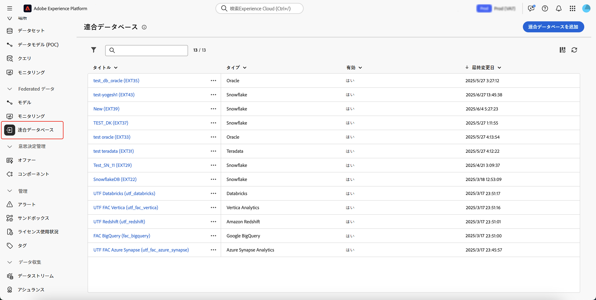
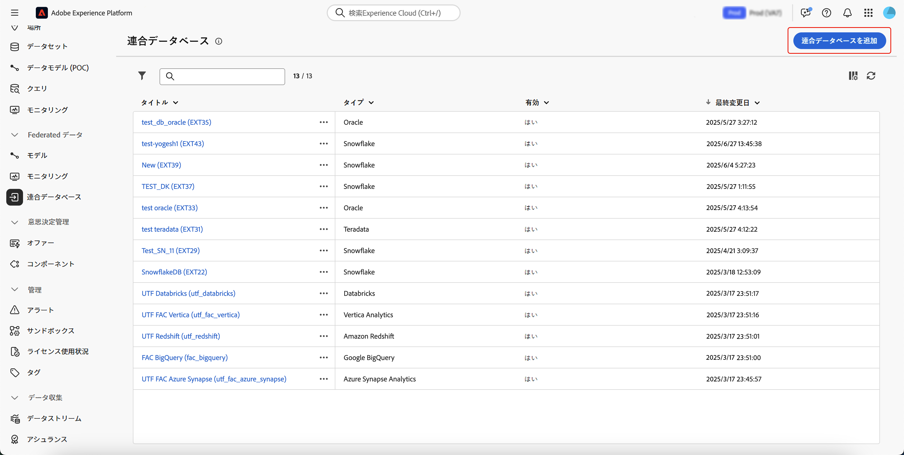
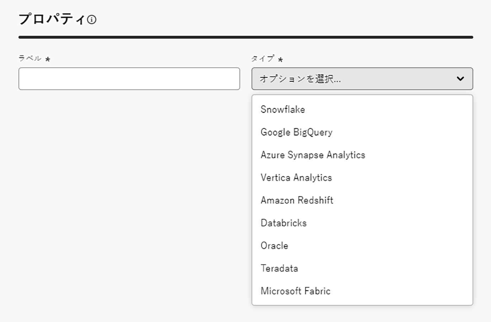

# 接続の作成 {#connections-fdb}

>[!AVAILABILITY]
>
>接続にアクセスするには、次のいずれかの権限が必要です。
>
>-**連合データベースを管理**
>-**連合データベースを表示**
>
>必要な権限について詳しくは、[アクセス制御ガイド](/help/governance-privacy-security/access-control.md)を参照してください。

Experience Platform 連合オーディエンス構成を使用すると、ユーザーはサードパーティのデータウェアハウスからオーディエンスを作成して強化し、このオーディエンスを Adobe Experience Platform に読み込むことができます。

## サポートされているデータベース {#supported-databases}

連合データベースと Adobe Experience Platform を連携させるには、まず 2 つのソース間の接続を確立する必要があります。 連合オーディエンス構成を使用すると、次のデータベースに接続できます。

- Amazon Redshift
- Azure Synapse Analytics
- Databricks
- Google BigQuery
- Microsoft Fabric
- Oracle
- Snowflake
- Teradata
- Vertica Analytics

## 接続を作成 {#create}

接続を作成するには、「連合データ」セクション内で「**[!UICONTROL 連合データベース]**」を選択します。

{zoomable="yes" width="70%" align="center"}

「連合データベース」セクションが表示されます。 「**[!UICONTROL 連合データベースを追加]**」を選択して、接続を作成します。

{zoomable="yes" width="70%" align="center"}

>[!NOTE]
>
>プライベートリンクまたは VPN を使用した安全な接続をリクエストするには、Privacy and Security Shield または Healthcare Shield のライセンスを取得している&#x200B;**必要**&#x200B;があります。

接続のプロパティのポップオーバーが表示されます。 接続に名前を付けたり、作成するデータベースのタイプを選択したりできます。

{zoomable="yes" width="70%" align="center"}

タイプを選択すると、「**[!UICONTROL 詳細]**」セクションが表示されます。 このセクションは、以前に選択したデータベースのタイプによって異なります。

>[!BEGINTABS]

>[!TAB Amazon Redshift]

>[!AVAILABILITY]
>
>Amazon Redshift AWS、Amazon Redshift Spectrum および Amazon Redshift Serverless のみがサポートされています。
>
>また、プライベートリンクを介した外部 Amazon Redshift データウェアハウスへの安全なアクセスもサポートされています。

Amazon Redshift を選択した後に、次の詳細を追加できます。

| フィールド | 説明 |
| ----- | ----------- |
| サーバー | データソースの名前 |
| アカウント | アカウントのユーザー名。 |
| パスワード | アカウントのパスワード。 |
| データベース | データベースの名前。 サーバー名でこの名前が指定されている場合は、このフィールドを空白のままにすることができます。 |
| 作業スキーマ | ワークテーブルに使用するデータベーススキーマの名前。 この機能について詳しくは、[Amazon スキーマドキュメント](https://docs.aws.amazon.com/ja_jp/redshift/latest/dg/r_Schemas_and_tables.html){target="_blank"}を参照してください。  **メモ：**&#x200B;このスキーマへの接続に必要な権限がある限り、一時的なデータ処理に使用するスキーマを含め、データベースから任意のスキーマを使用できます。 ただし、複数のサンドボックスを同じデータベースに接続する場合は、異なる作業スキーマを使用する&#x200B;**必要**&#x200B;があります。 |

>[!TAB Azure Synapse Analytics]

>[!NOTE]
>
>Azure Synapse Analytics を使用して安全な接続を作成する場合は、アドビカスタマーケア担当者にお問い合わせください。

Azure Synapse Analytics を選択した後に、次の詳細を追加できます。

| フィールド | 説明 |
| ----- | ----------- |
| サーバー | Azure Synapse サーバーの URL。 |
| アカウント | Azure アプリ登録のアプリケーション ID（**クライアント ID**）。 |
| パスワード | Azure アプリケーションの&#x200B;**クライアント秘密鍵**&#x200B;の値。 |
| データベース | データベースの名前。 サーバー名でこの名前が指定されている場合は、このフィールドを空白のままにすることができます。 |
| オプション | その他の接続オプション。 Azure Synapse Analytics では、コネクタでサポートされている認証タイプを指定できます。 現在、連合オーディエンス構成は `ActiveDirectoryMSI` をサポートしています。 接続文字列について詳しくは、[Microsoft のドキュメントの接続文字列の例](https://learn.microsoft.com/ja-jp/sql/connect/odbc/using-azure-active-directory?view=sql-server-ver15#example-connection-strings){target="_blank"}を参照してください。 |

または、サービスプリンシパル認証を使用して、Azure Synapse Analytics への接続を安全に設定することもできます。 本番環境レベルの統合と自動化シナリオには、サービスプリンシパル認証を使用する必要があります。

+++ 前提条件

サービスプリンシパル認証を設定する前に、次の前提条件に注意してください。

- Microsoft Entra ID へのアクセス権を持つ Azure サブスクリプション
- Azure Synapse のワークスペースとデータベース
- アプリ登録を作成する権限
- Azure Synapse データベースの役割を管理する権限
- 連合データベース設定を更新する権限

+++

Azure Portal 内で、最初に新しいアプリ登録を作成する必要があります。 アプリケーションに一意の名前を付けた後、「**登録**」を選択します。 **概要**&#x200B;ページが表示されます。 **アプリケーション（クライアント） ID** と&#x200B;**ディレクトリ（テナント） ID** の値に注意してください。

新しく登録されたアプリケーション内で、「**証明書とシークレット**」を選択します。 ここから、「**クライアントシークレット**」セクション内の「**新しいクライアントシークレット**」を選択して、新しいクライアント秘密鍵を作成します。 説明と有効期限を指定した後、「**追加**」を選択してクライアント秘密鍵を生成します。

>[!IMPORTANT]
>
>クライアント秘密鍵を生成したら、**クライアント秘密鍵の値**&#x200B;をコピーして安全に保存します。 この値は再度表示され&#x200B;**ません**。

クライアント秘密鍵を生成したら、**サービスプリンシパル** ID をリソースに付与したことを確認する必要があります。

リソースへの ID の割り当てについて詳しくは、[Azure Synapse Analytics のマネージド ID ガイド](https://learn.microsoft.com/ja-jp/azure/synapse-analytics/synapse-service-identity)を参照してください。

Azure 側の設定がすべて完了したので、連合オーディエンス構成側の設定を行うことができるようになりました。

Azure Synapse 接続内で、次の設定の詳細を指定します。

| フィールド | 説明 |
| ----- | ----------- |
| サーバー | Azure Synapse サーバーの URL。 |
| アカウント | Azure アプリ登録のアプリケーション ID（**クライアント ID**）。 |
| パスワード | Azure アプリケーションの&#x200B;**クライアント秘密鍵**&#x200B;の値。 |
| データベース | データベースの名前。 サーバー名でこの名前が指定されている場合は、このフィールドを空白のままにすることができます。 |
| オプション | その他の接続オプション。 サービスプリンシパル認証を使用するには、`Authentication="ActiveDirectoryServicePrincipal"` を設定する必要があります。 |

>[!TAB Databricks]

>[!NOTE]
>
>プライベートリンクを介した外部 Databricks データウェアハウスへの安全なアクセスがサポートされています。 これには、プライベートリンク経由で Amazon Web Services（AWS）でホストされている Databricks データベースへの安全な接続と、VPN 経由で Microsoft Azure でホストされている Databricks データベースへの安全な接続が含まれます。 安全なアクセスの設定について詳しくは、アドビ担当者にお問い合わせください。

Databricks を選択した後、連合オーディエンス構成に接続する際に使用する認証方法を選択できます。

「**アカウント／パスワード認証**」を選択した場合は、次のログイン詳細を追加できます。

| フィールド | 説明 |
| ----- | ----------- |
| サーバー | Databricks サーバーの名前。 |
| パスワード | Databricks サーバーのアクセストークン。 この値について詳しくは、[個人用アクセストークンに関する Databricks ドキュメント](https://docs.databricks.com/aws/ja/dev-tools/auth/pat){target="_blank"}を参照してください。 |

「**サービスプリンシパル認証**」を選択した場合は、次の詳細を追加できます。

| フィールド | 説明 |
| ----- | ----------- |
| サーバー | Databricks サーバーの名前。 |
| クライアント ID | Databricks サーバーのクライアント ID。 このフィールドは、プロジェクトのユーザー名のように機能します。 |
| クライアント秘密鍵 | Databricks サーバーのクライアント秘密鍵。 このフィールドは、プロジェクトのパスワードのように機能します。 |

「**OAuth 2.0**」を選択した場合は、次の詳細を追加できます。

| フィールド | 説明 |
| ----- | ----------- |
| サーバー | Databricks サーバーの名前。 |
| クライアント ID | Databricks サーバーのクライアント ID。 このフィールドは、OAuth 2.0 認証中にアプリケーションを特定するために使用され、プロジェクトのユーザー名のように機能します。 |
| クライアント秘密鍵 | Databricks サーバーのクライアント秘密鍵。 この機密資格情報はクライアント ID と共に発行され、プロジェクトのパスワードのように機能します。 |
| アクセス範囲 | Databricks サーバー内で OAuth トークンが認証されている範囲を示す事前入力済みの情報。 |

ログイン詳細を入力した後に、次の情報を追加できます。

| フィールド | 説明 |
| ----- | ----------- |
| HTTP パス | クラスターまたはウェアハウスへのパス。 パスについて詳しくは、[接続の詳細に関する Databricks ドキュメント](https://docs.databricks.com/aws/ja/integrations/compute-details){target="_blank"}を参照してください。 |
| カタログ | Databricks のカタログの名前。 Databricks のカタログについて詳しくは、[カタログに関する Databricks ドキュメント](https://docs.databricks.com/aws/ja/catalogs/){target="_blank"}を参照してください |
| 作業スキーマ | ワークテーブルに使用するデータベーススキーマの名前。   **メモ：**&#x200B;このスキーマへの接続に必要な権限がある限り、一時的なデータ処理に使用するスキーマを含め、データベースから&#x200B;**任意の**&#x200B;スキーマを使用できます。 ただし、複数のサンドボックスを同じデータベースに接続する場合は、異なる作業スキーマを使用する&#x200B;**必要**&#x200B;があります。 |
| オプション | その他の接続オプション。 使用可能なオプションを次の表に示します。 |

Databricks では、以下の追加オプションを設定できます。

| オプション | 説明 |
| ------- | ----------- |
| TimeZoneName | 使用するタイムゾーンの名前。 この値は、`TIMEZONE` セッションパラメーターを表します。 タイムゾーンについて詳しくは、[タイムゾーンに関する Databricks ドキュメント](https://docs.databricks.com/aws/ja/sql/language-manual/parameters/timezone#:~:text=The%20system%20default%20is%20UTC%20.){target="_blank"}を参照してください。 |

>[!TAB Google BigQuery]

>[!NOTE]
>
>VPN を介した外部 Google BigQuery データウェアハウスへの安全なアクセスがサポートされています。

Google BigQuery を選択した後、連合オーディエンス構成に接続する際に使用する認証方法を選択できます。

「**[!UICONTROL アカウント／パスワード認証]**」を選択した場合は、次のログイン情報を追加できます。

| フィールド | 説明 |
| ----- | ----------- |
| サービスアカウント | サービスアカウントのメールアドレス。 詳しくは、[Google Cloud サービスアカウント関するドキュメント](https://cloud.google.com/iam/docs/service-accounts-create){target="_blank"}を参照してください。 |

「**[!UICONTROL OAuth 2.0]**」を選択した場合は、次のログイン情報を追加できます。

>[!NOTE]
>
>OAuth 2.0 を使用して Google BigQuery に接続する前に、Google Cloud プロジェクトでリダイレクト URL を設定する必要があります。 OAuth 2.0 クライアント ID 設定の下にある Google Cloud プロジェクトにリダイレクト URL `https://fac-oauth.adobe.io/oauth` を追加します。

| フィールド | 説明 |
| ----- | ----------- |
| クライアント ID | Google BigQuery プロジェクトのクライアント ID。 このフィールドは、プロジェクトのユーザー名のように機能します。 |
| クライアント秘密鍵 | Google BigQuery プロジェクトのクライアント秘密鍵。 このフィールドは、プロジェクトのパスワードのように機能します。 |
| アクセス範囲 | Google Cloud リソース内で OAuth トークンが認証されている範囲を示す事前入力済みの情報。 |

認証を終了するには、「**[!UICONTROL ログイン]**」を選択します。

「**[!UICONTROL WIF]**」を選択した場合、ログイン情報を入力する必要は&#x200B;**ありません**。 ただし、**[!UICONTROL キーファイルパス]**&#x200B;としてクライアントライブラリの設定を追加する&#x200B;**必要**&#x200B;があります。 クライアントライブラリの設定について詳しくは、[Google BigQuery（Workload Identity Federation）の設定の節](#wif-configuration)を参照してください。

ログイン詳細を入力した後に、次の詳細を追加できます。

| フィールド | 説明 |
| ----- | ----------- |
| プロジェクト | プロジェクトの ID。 詳しくは、[Google Cloud プロジェクトに関するドキュメント](https://cloud.google.com/resource-manager/docs/creating-managing-projects){target="_blank"}を参照してください。 |
| データセット | データセットの名前。 詳しくは、[Google Cloud データセットに関するドキュメント](https://cloud.google.com/bigquery/docs/datasets-intro){target="_blank"}を参照してください。 |
| Google バケットの場所 | Google バケットの場所。 このフィールドを追加するのは、コンポジションで「**ディメンションを変更**」アクティビティを使用している場合のみです。 詳しくは、[Google Cloud バケットの場所に関するドキュメント &#x200B;](https://docs.cloud.google.com/storage/docs/locations){target="_blank"}を参照してください。 |
| キーファイルのパス | サーバーに対するキーファイル。 `json` ファイルのみがサポートされています。 |
| オプション | その他の接続オプション。 使用可能なオプションを次の表に示します。 |

Google BigQuery では、以下の追加オプションを設定できます。

| オプション | 説明 |
| ------- | ----------- |
| ProxyType | BigQuery への接続に使用するプロキシのタイプ。 サポートされる値には、`HTTP`、`http_no_tunnel`、`socks4`および`socks5` などがあります。 |
| ProxyHost | プロキシにアクセスできるホスト名または IP アドレス。 |
| ProxyUid | プロキシが実行されているポート番号。 |
| ProxyPwd | プロキシのパスワード。 |
| bgpath | **メモ：**&#x200B;これは、**一括読み込みツール**（Cloud SDK）にのみ適用されます。   サーバー上の Cloud SDK bin ディレクトリへのパス。 `google-cloud-sdk` ディレクトリを別の場所に移動した場合や、PATH 変数の使用を回避する場合にのみ、これを設定する必要があります。 |
| GCloudConfigName | **メモ：**&#x200B;これは、バージョン 7.3.4 以降の&#x200B;**一括読み込みツール**（Cloud SDK）にのみ適用されます。   データを読み込むためのパラメーターを保存する設定の名前です。 デフォルトでは、この値は `accfda` です。 |
| GCloudDefaultConfigName | **メモ：**&#x200B;これは、バージョン 7.3.4 以降の&#x200B;**一括読み込みツール**（Cloud SDK）にのみ適用されます。   データを読み込むためのメイン設定を再作成する一時設定の名前です。 デフォルトでは、この値は `default` です。 |
| GCloudRecreateConfig | **メモ：**&#x200B;これは、バージョン 7.3.4 以降の&#x200B;**一括読み込みツール**（Cloud SDK）にのみ適用されます。   一括読み込みメカニズムが Google Cloud SDK 設定を自動的に再作成、削除、変更するかどうかを決定できるブール値です。 この値を `false` に設定した場合、一括読み込みメカニズムはマシン上の既存の設定を使用してデータを読み込みます。 この値を `true` に設定した場合、設定が適切に設定されていることを確認します。適切に設定されていない場合、`No active configuration found. Please either create it manually or remove the GCloudRecreateConfig option` エラーが表示され、読み込みメカニズムがデフォルトの読み込みメカニズムに戻ります。 |
| **restEndpoint** | Apigee プロキシのエンドポイント。 Apigee プロキシでREST-API コネクタを使用している場合にのみ、これを使用する必要があります。 Apigee プロキシを使用している場合は、**REST API コネクタを使用**&#x200B;設定を有効にします。 設定について詳しくは、[Google BigQuery Apigee Gateway サポートの節](#apigee)を参照してください。 |

>[!TAB Microsoft Fabric]

Microsoft Fabric を選択した後に、次の詳細を追加できます。

| フィールド | 説明 |
| ----- | ----------- |
| サーバー | Microsoft Fabric サーバーの URL。 |
| アプリケーション ID | Microsoft Fabric のアプリケーション ID。 アプリケーション ID について詳しくは、[アプリケーション設定に関する Microsoft Fabric ドキュメント](https://learn.microsoft.com/ja-jp/fabric/workload-development-kit/create-entra-id-app){target="_blank"}を参照してください。 |
| クライアントシークレット | アプリケーションのクライアント秘密鍵。 クライアント秘密鍵について詳しくは、[アプリケーション設定に関するMicrosoft Fabric ドキュメント](https://learn.microsoft.com/ja-jp/fabric/workload-development-kit/create-entra-id-app#step-8-generate-a-secret-for-your-application){target="_blank"}を参照してください。 |
| オプション | その他の接続オプション。 使用可能なオプションを次の表に示します。 |

Microsoft Fabric では、以下の追加オプションを設定できます。

| オプション | 説明 |
| ------ | ----------- |
| 認証 | コネクタで使用されている認証のタイプ。 サポートされている値には、`ActiveDirectoryMSI` が含まれます。 詳しくは、[ウェアハウス接続に関する Microsoft ドキュメント](https://learn.microsoft.com/ja-jp/fabric/data-warehouse/connectivity){target="_blank"}を参照してください。 |

>[!TAB Oracle]

>[!NOTE]
>
>連合オーディエンス構成では、AWS、Azure、Exadata、プライベートクラウド（外部ネットワークからアクセス可能であること）でホストされているバージョン 11g 以降の Oracle データベースとの連合接続の設定をサポートしています。 Oracle データベースの設定に関してさらに質問がある場合や、Oracle への安全な接続を作成する必要がある場合は、アドビカスタマーケア担当者にお問い合わせください。

Oracle を選択した後に、次の詳細を追加できます。

| フィールド | 説明 |
| ----- | ----------- |
| サーバー | Oracle サーバーの URL。 |
| アカウント | アカウントのユーザー名。 |
| パスワード | アカウントのパスワード。 |

>[!TAB Snowflake]

>[!NOTE]
>
>プライベートリンクを介した外部 Snowflake データウェアハウスへの安全なアクセスがサポートされています。 Snowflake アカウントは、Amazon Web Services（AWS）または Azure でホストされ、連合オーディエンス構成環境と同じ地域に配置されている必要があります。 Snowflake アカウントへの安全なアクセスの設定について詳しくは、アドビ担当者にお問い合わせください。

Snowflake を選択した後、連合オーディエンス構成に接続する際に使用する認証方法を選択できます。

「**[!UICONTROL アカウント／パスワード認証]**」を選択した場合は、次のログイン情報を追加できます。

| フィールド | 説明 |
| ----- | ----------- |
| サーバー | サーバーの名前。 |
| ユーザー | アカウントのユーザー名。 |
| パスワード | アカウントのパスワード。 |

または、パスワードを指定する代わりに秘密鍵を指定することもできます。 秘密鍵を追加する場合は、次の情報を指定する必要があります。

| フィールド | 説明 |
| ----- | ----------- |
| サーバー | サーバーの名前。 |
| ユーザー | アカウントのユーザー名。 |
| 秘密鍵 | アカウントの秘密鍵。 `.pem` ファイルのみがサポートされています。 |
| パスワード | （オプション）アカウントのパスワード。 |

「**[!UICONTROL OAuth 2.0]**」を選択した場合は、次のログイン情報を追加できます。

>[!NOTE]
>
>OAuth 2.0 を使用して Snowflake に接続する前に、Snowflake OAuth 統合オブジェクトでリダイレクト URL を設定する必要があります。 Snowflake OAuth 統合設定にリダイレクト URL `https://fac-oauth.adobe.io/oauth` を追加します。

| フィールド | 説明 |
| ----- | ----------- |
| サーバー | サーバーの名前。 |
| クライアント ID | Snowflake プロジェクトのクライアント ID。 このフィールドは、プロジェクトのユーザー名のように機能します。 |
| クライアント秘密鍵 | Snowflake プロジェクトのクライアント秘密鍵。 このフィールドは、プロジェクトのパスワードのように機能します。 |

認証を終了するには、「**[!UICONTROL ログイン]**」を選択します。

ログイン詳細を入力した後に、次の詳細を追加できます。

| フィールド | 説明 |
| ----- | ----------- |
| データベース | データベースの名前。 サーバー名でこの名前が指定されている場合は、このフィールドを空白のままにすることができます。 |
| 作業スキーマ | ワークテーブルに使用するデータベーススキーマの名前。   **メモ：**&#x200B;このスキーマへの接続に必要な権限がある限り、一時的なデータ処理に使用するスキーマを含め、データベースから&#x200B;**任意の**&#x200B;スキーマを使用できます。 ただし、複数のサンドボックスを同じデータベースに接続する場合は、異なる作業スキーマを使用する&#x200B;**必要**&#x200B;があります。 |
| 秘密鍵 | データベース接続の秘密鍵。 ローカルシステムから `.pem` ファイルをアップロードできます。 |
| オプション | その他の接続オプション。 使用可能なオプションを次の表に示します。 |

Snowflake では、以下の追加オプションを設定できます。

| オプション | 説明 |
| ------- | ----------- |
| workschema | ワークテーブルに使用するデータベーススキーマの名前。 |
| TimeZoneName | 使用するタイムゾーンの名前。 この値は、`TIMEZONE` セッションパラメーターを表します。 デフォルトでは、システムのタイムゾーンが使用されます。 タイムゾーンについて詳しくは、[タイムゾーンに関する Snowflake ドキュメント](https://docs.snowflake.com/ja/sql-reference/parameters#timezone){target="_blank"}を参照してください。 |
| WeekStart | 週を開始する曜日。 この値は、`WEEK_START` セッションパラメーターを表します。 週の開始について詳しくは、[週の開始パラメーターに関する Snowflake ドキュメント](https://docs.snowflake.com/ja/sql-reference/parameters#week-start){target="_blank"}を参照してください。 |
| UseCachedResult | Snowflake のキャッシュされた結果を使用するかどうかを決定するブール値。 この値は、`USE_CACHED_RESULTS` セッションパラメーターを表します。 デフォルトでは、この値は true に設定されています。 このパラメーターについて詳しくは、[結果の保持に関する Snowflake ドキュメント](https://docs.snowflake.com/ja/user-guide/querying-persisted-results){target="_blank"}を参照してください。 |
| bulkThreads | Snowflake のバルクローダーに使用するスレッドの数。 追加するスレッドの数が多いほど、大規模な一括読み込みのパフォーマンスが向上します。 デフォルトでは、この値は 1 に設定されています。 |
| chunkSize | 各バルクローダーのチャンクのファイルサイズ。 より多くのスレッドと同時に使用すると、一括読み込みのパフォーマンスを向上させることができます。 デフォルトでは、この値は 128 MB に設定されています。 チャンクサイズについて詳しくは、[データファイルの準備に関する Snowflake ドキュメント](https://docs.snowflake.com/ja/user-guide/data-load-considerations-prepare){target="_blank"}を参照してください。 |
| StageName | 事前にプロビジョニングされた内部ステージング環境の名前。 新しい一時ステージを作成する代わりに、この名前を一括読み込みで使用できます。 |

>[!TAB TeraData]

>[!NOTE]
>
>Teradata に接続するには、データベースドライバーのインストールなど、様々な前提条件を満たす&#x200B;**必要**&#x200B;があります。 詳しくは、アドビカスタマーケア担当者にお問い合わせください。

Teradata を選択した後に、次の詳細を追加できます。

| フィールド | 説明 |
| ----- | ----------- |
| サーバー | Teradata サーバーの URL。 |
| アカウント | データベースが Open Database Connectivity（ODBC）セッションで使用するユーザー名。 |
| パスワード | ODBC セッションへの接続に使用するパスワード。 |
| データベース | データベースの名前。 |
| オプション | その他の接続オプション。 Teradata の場合、リストされているオプションは両方とも追加が&#x200B;**必須**&#x200B;です。 使用可能なオプションを次の表に示します。 |

Teradata では、以下の追加オプションを設定できます。

| オプション | 説明 |
| ------- | ----------- |
| `workTableSchema` | 作業用テーブルのスキーマの名前。 |
| `ODBCLib` | Teradata と別の ODBC を混在させる場合に使用できる、システムの ODBC ライブラリの場所。 |

>[!TAB Vertica Analytics]

Vertica Analytics を選択した後に、次の詳細を追加できます。

| フィールド | 説明 |
| ----- | ----------- |
| サーバー | Vertica Analytics サーバーの URL。 |
| アカウント | アカウントのユーザー名。 |
| パスワード | アカウントのパスワード。 |
| データベース | データベースの名前。 サーバー名でこの名前が指定されている場合は、このフィールドを空白のままにすることができます。 |
| 作業スキーマ | ワークテーブルに使用するデータベーススキーマの名前。   **メモ：**&#x200B;このスキーマへの接続に必要な権限がある限り、一時的なデータ処理に使用するスキーマを含め、データベースから&#x200B;**任意の**&#x200B;スキーマを使用できます。 ただし、複数のサンドボックスを同じデータベースに接続する場合は、異なる作業スキーマを使用する&#x200B;**必要**&#x200B;があります。 |
| オプション | その他の接続オプション。 使用可能なオプションを次の表に示します。 |

Vertica Analytics では、次の追加オプションを設定できます。

| オプション | 説明 |
| ------- | ----------- |
| TimeZoneName | 使用するタイムゾーンの名前。 この値は、`TIMEZONE` セッションパラメーターを表します。 タイムゾーンについて詳しくは、[タイムゾーンに関する Vertica Analytics ドキュメント](https://docs.vertica.com/24.1.x/ja/admin/configuring-db/config-procedure/using-time-zones-with/){target="_blank"}を参照してください。 |

>[!ENDTABS]

接続の詳細を追加したら、次の追加設定に注意してください。

>[!NOTE]
>
>指定されたデータベースに対して連合オーディエンス構成を使用するには、そのデータベースに関連付けられている&#x200B;**すべて**&#x200B;の IP アドレスのリストを許可する必要があります。

| 設定 | 詳細 |
| -------- | ------- |
| 接続を有効化 | 接続を自動的に有効にするかどうかを指定するブール値の切り替えスイッチ。 |
| サーバー IP | データベースへの接続の許可リストに登録されている IP アドレスを表示するポップオーバー。 |
| 接続をテスト | 設定の詳細を確認できます。 |

「**[!UICONTROL 関数をデプロイ]**」を選択し「**[!UICONTROL 追加]**」をクリックすると、連合データベースと Experience Platform 間の接続を確定できます。

## 付録 {#appendix}

次の付録では、外部アカウント側で接続を設定する方法について説明します。

### Google BigQuery（Workload Identity Federation）の設定 {#wif-configuration}

Google Cloud Platform の設定を指定する前に、次の値が必要です。

- AWS アカウント ID
   - この値を取得するには、アドビ担当者にお問い合わせください。
- AWS IAM 役割名
   - AWS IAM 役割名は、`arn:aws:iam::<ADOBE_AWS_ACCOUNT_ID>:role/fac-<CUSTOMER_IMS_ORG_ID>` の形式に従います

Google Cloud Console で、**「IAM &amp; 管理」セクション**&#x200B;に **Workload Identity Pool** を作成します。 これにより、外部 ID を整理および管理できます。

「**プロバイダーを追加**」を選択して、ID プロバイダーを作成します。 これにより、プロバイダーに関する関連メタデータを指定して、Google Cloud の ID プロバイダーと Worker Identity Pool 間の一方向の信頼を設定できます。

プロバイダーを作成する際は、次の情報を指定する必要があります。

| フィールド | 説明 |
| ----- | ----------- |
| 名前 | Workload Identity Pool プロバイダーの名前。 |
| ID | プロバイダーの ID は自動的に生成されます。 |
| AWS アカウント ID | 以前に指定した AWS アカウント ID。 |
| 有効なプロバイダー | プロバイダーが有効か無効かを判断するブール値。 |
| 属性マッピング | 役割に一致するマッピング。 この情報は既に存在します。 |

プロバイダーを作成したら、Workload Identity Pool の ID がサービスアカウントを別のユーザーとして実行できるように、IAM ポリシーを作成する必要があります。 「**アクセス権を付与**」を選択して、サービスアカウントにアクセス権を付与ダイアログを開きます。

ダイアログで、「**サービスアカウントの偽装を使用してアクセス権を付与**」を選択します。 「**プリンシパルを選択**」セクション内で、属性マッピングを作成する必要があります。

**aws_role** を選択し、値として `arn:aws:sts::AWSAccountID:assumed-role/AWSRoleName` を追加します。`AWSAccountID` と `AWSRoleName` は、以前に指定した値に置き換えます。

サービスアカウントにアクセス権を付与したら、クライアントライブラリ設定をダウンロードします。

クライアントライブラリ設定をダウンロードしたら、連合オーディエンス構成で WIF 接続を設定できるようになりました。

### Google BigQuery [!DNL Apigee] Gateway サポート {#apigee}

Google Cloudのネイティブ API管理プラットフォームである[!DNL Apigee]を使用して、API呼び出しをGoogle BigQueryにプロキシできます。

まず[!DNL Apigee] UI内でプロキシを作成する必要があります。 Google Cloudで、**Apigee**&#x200B;に移動し、**Proxy development**、**API プロキシ**、**Create**&#x200B;に移動して、**プロキシの作成** パネルを表示します。 パネルでは、次の詳細を入力できます。

| 詳細 | 説明 |
| ------- | ----------- |
| プロキシテンプレート | 作成するプロキシのタイプ。 この使用例では、**リバースプロキシ（最も一般的）**&#x200B;を選択する必要があります。 |
| プロキシ名 | プロキシの名前。 この値には、英数字、ダッシュ （`-`）、またはアンダースコア （`_`）を含めることができる&#x200B;**のみ**&#x200B;があります。 |
| ベースパス | API プロキシのホストアドレスを示すURI フラグメント。 このベースパスはプロキシ名に基づいています。**一意である必要があります。** |
| 説明 | API プロキシのオプションの説明。 |
| ターゲット | API プロキシが呼び出すバックエンドサービスのURL （HTTPまたはHTTPSのいずれかを含む）。 |

連合オーディエンス構成の場合は、次に示すように、Google BigQuery コネクタが使用する&#x200B;**各** エンドポイントのプロキシエンドポイントルールを作成します。

| ベースパス | ターゲットエンドポイント | 説明 |
| --------- | --------------- | ----------- |
| `/bigquery` | `https://bigquery.googleapis.com/bigquery` | Google BigQueryのメインエンドポイント。 このエンドポイントは、クエリやリストテーブルなどのデータを取得するために使用されます。 |
| `/token` | `https://oauth2.googleapis.com/token` | このエンドポイントは、サービスアカウントの認証に使用されます。 |
| `/storage` | `https://storage.googleapis.com/storage` | このストレージエンドポイントは、一時的な一括読み込みファイルの削除に使用されます。 |
| `/upload` | `https://storage.googleapis.com/upload` | このストレージエンドポイントは、ファイルの一括読み込みに使用されます。 |
| `/v1/token` | `https://sts.googleapis.com/v1/token` | このエンドポイントは、トークンを取得するためのWorkload Identity Federation （WIF）フローに使用されます。 |
| `/v1/projects` | `https://iamcredentials.googleapis.com/v1/projects` | このエンドポイントは、Workload Identity Federation （WIF）フローでサービスアカウントを偽装するために使用されます。 |

プロキシを作成したら、それを使用して連合オーディエンス構成に接続します。 プロキシをデプロイすると、**管理者** セクション内で&#x200B;**環境**&#x200B;と&#x200B;**グループ**&#x200B;を選択すると、**ホスト名**&#x200B;に記載されているプロキシの完全なURLを見つけることができます。
