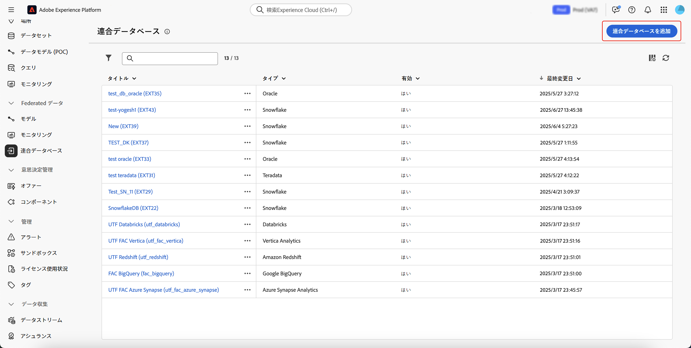

# 接続の作成 {#connections-fdb}

>[!AVAILABILITY]
>
>接続にアクセスするには、次のいずれかの権限が必要です。
>
>-**連合データベースの管理**
>>-**連合データベースの表示**
>
>必要な権限について詳しくは、[アクセス制御ガイド](/help/governance-privacy-security/access-control.md)を参照してください。

Experience Platform 連合オーディエンス構成を使用すると、ユーザーはサードパーティのデータウェアハウスからオーディエンスを作成して強化し、このオーディエンスを Adobe Experience Platform に読み込むことができます。

## サポートされているデータベース {#supported-databases}

連合データベースと Adobe Experience Platform を連携させるには、まず 2 つのソース間の接続を確立する必要があります。連合オーディエンス構成を使用すると、次のデータベースに接続できます。

* Amazon Redshift
* Azure Synapse Analytics
* Databricks
* Google BigQuery
* Microsoft Fabric
* Oracle
* Snowflake
* Vertica Analytics

## 接続を作成 {#create}

接続を作成するには、「連合データ」セクション内で「**[!UICONTROL 連合データベース]**」を選択します。

{zoomable="yes" width="70%" align="center"}

「連合データベース」セクションが表示されます。「**[!UICONTROL 連合データベースを追加]**」を選択して、接続を作成します。

{zoomable="yes" width="70%" align="center"}

接続のプロパティのポップオーバーが表示されます。接続に名前を付けたり、作成するデータベースのタイプを選択したりできます。

{zoomable="yes" width="70%" align="center"}

タイプを選択すると、「**[!UICONTROL 詳細]**」セクションが表示されます。このセクションは、以前に選択したデータベースのタイプによって異なります。

>[!BEGINTABS]

>[!TAB Amazon Redshift]

>[!AVAILABILITY]
>
>Amazon Redshift AWS、Amazon Redshift Spectrum および Amazon Redshift Serverless のみがサポートされています。

Amazon Redshift を選択した後に、次の詳細を追加できます。

| フィールド | 説明 |
| ----- | ----------- |
| サーバー | データソースの名前 |
| アカウント | アカウントのユーザー名。 |
| パスワード | アカウントのパスワード。 |
| データベース | データベースの名前。サーバー名でこの名前が指定されている場合は、このフィールドを空白のままにすることができます。 |
| 作業スキーマ | ワークテーブルに使用するデータベーススキーマの名前。この機能ついて詳しくは、[Amazon スキーマのドキュメント](https://docs.aws.amazon.com/ja_jp/redshift/latest/dg/r_Schemas_and_tables.html){target="_blank"}を参照してください。  **メモ：**&#x200B;このスキーマへの接続に必要な権限がある限り、一時的なデータ処理に使用するスキーマを含め、データベースから任意のスキーマを使用できます。ただし、複数のサンドボックスを同じデータベースに接続する場合は、異なる作業スキーマを使用する&#x200B;**必要**&#x200B;があります。 |

>[!TAB Azure Synapse Analytics]

Azure Synapse Analytics を選択した後に、次の詳細を追加できます。

| フィールド | 説明 |
| ----- | ----------- |
| サーバー | Azure Synapse サーバーの URL。 |
| アカウント | Azure Synapse アカウントのユーザー名。 |
| パスワード | Azure Synapse アカウントのパスワード。 |
| データベース | データベースの名前。サーバー名でこの名前が指定されている場合は、このフィールドを空白のままにすることができます。 |
| オプション | その他の接続オプション。Azure Synapse Analytics では、コネクタでサポートされている認証タイプを指定できます。現在、連合オーディエンス構成は `ActiveDirectoryMSI` をサポートしています。接続文字列について詳しくは、[Microsoft のドキュメントの接続文字列の例](https://learn.microsoft.com/ja-jp/sql/connect/odbc/using-azure-active-directory?view=sql-server-ver15#example-connection-strings){target="_blank"}を参照してください。 |

>[!TAB Databricks]

>[!NOTE]
>
>プライベートリンクを介した外部 Databricks データウェアハウスへの安全なアクセスがサポートされています。これには、プライベートリンク経由で Amazon Web Services（AWS）でホストされている Databricks データベースへの安全な接続と、VPN 経由で Microsoft Azure でホストされている Databricks データベースへの安全な接続が含まれます。安全なアクセスの設定について詳しくは、アドビ担当者にお問い合わせください。

Databricks を選択した後に、次の詳細を追加できます。

| フィールド | 説明 |
| ----- | ----------- |
| サーバー | Databricks サーバーの名前。 |
| HTTP パス | クラスターまたはウェアハウスへのパス。パスについて詳しくは、[接続の詳細に関する Databricks ドキュメント](https://docs.databricks.com/aws/ja/integrations/compute-details){target="_blank"}を参照してください。 |
| パスワード | Databricks サーバーのアクセストークン。この値について詳しくは、[個人用アクセストークンに関する Databricks ドキュメント](https://docs.databricks.com/aws/ja/dev-tools/auth/pat){target="_blank"}を参照してください。 |
| カタログ | Databricks のカタログの名前。Databricks のカタログについて詳しくは、[カタログに関する Databricks ドキュメント](https://docs.databricks.com/aws/ja/catalogs/){target="_blank"}を参照してください |
| 作業スキーマ | ワークテーブルに使用するデータベーススキーマの名前。  **メモ：**&#x200B;このスキーマへの接続に必要な権限がある限り、一時的なデータ処理に使用するスキーマを含め、データベースから&#x200B;**任意の**&#x200B;スキーマを使用できます。ただし、複数のサンドボックスを同じデータベースに接続する場合は、異なる作業スキーマを使用する&#x200B;**必要**&#x200B;があります。 |
| オプション | その他の接続オプション。使用可能なオプションを次の表に示します。 |

Databricks では、以下の追加オプションを設定できます。

| オプション | 説明 |
| ------- | ----------- |
| TimeZoneName | 使用するタイムゾーンの名前。この値は、`TIMEZONE` セッションパラメーターを表します。タイムゾーンについて詳しくは、[タイムゾーンに関する Databricks ドキュメント](https://docs.databricks.com/aws/ja/sql/language-manual/parameters/timezone#:~:text=The%20system%20default%20is%20UTC%20.){target="_blank"}を参照してください。 |

>[!TAB Google BigQuery]

Google BigQuery を選択した後に、次の詳細を追加できます。

| フィールド | 説明 |
| ----- | ----------- |
| サービスアカウント | サービスアカウントのメールアドレス。詳しくは、[Google Cloud サービスアカウント関するドキュメント](https://cloud.google.com/iam/docs/service-accounts-create){target="_blank"}を参照してください。 |
| プロジェクト | プロジェクトの ID。詳しくは、[Google Cloud プロジェクトに関するドキュメント](https://cloud.google.com/resource-manager/docs/creating-managing-projects){target="_blank"}を参照してください。 |
| データセット | データセットの名前。詳しくは、[Google Cloud データセットに関するドキュメント](https://cloud.google.com/bigquery/docs/datasets-intro){target="_blank"}を参照してください。 |
| キーファイルのパス | サーバーに対するキーファイル。`json` ファイルのみがサポートされています。 |
| オプション | その他の接続オプション。使用可能なオプションを次の表に示します。 |

Google BigQuery では、以下の追加オプションを設定できます。

| オプション | 説明 |
| ------- | ----------- |
| ProxyType | BigQuery への接続に使用するプロキシのタイプ。サポートされる値には、`HTTP`、`http_no_tunnel`、`socks4`および`socks5` などがあります。 |
| ProxyHost | プロキシにアクセスできるホスト名または IP アドレス。 |
| ProxyUid | プロキシが実行されているポート番号。 |
| ProxyPwd | プロキシのパスワード。 |
| bgpath | **メモ：**&#x200B;このオプションは、**一括読み込みツール**（Cloud SDK）にのみ適用されます。  サーバー上の Cloud SDK bin ディレクトリへのパス。`google-cloud-sdk` ディレクトリを別の場所に移動した場合や、PATH 変数の使用を回避する場合にのみ、これを設定する必要があります。 |
| GCloudConfigName | **メモ：**&#x200B;これは、バージョン 7.3.4 以降の&#x200B;**一括読み込みツール**（Cloud SDK）にのみ適用されます。  データを読み込むためのパラメーターを保存する設定の名前です。デフォルトでは、この値は `accfda` です。 |
| GCloudDefaultConfigName | **メモ：**&#x200B;これは、バージョン 7.3.4 以降の&#x200B;**一括読み込みツール**（Cloud SDK）にのみ適用されます。  データを読み込むためのメイン設定を再作成する一時設定の名前です。デフォルトでは、この値は `default` です。 |
| GCloudRecreateConfig | **メモ：**&#x200B;これは、バージョン 7.3.4 以降の&#x200B;**一括読み込みツール**（Cloud SDK）にのみ適用されます。  一括読み込みメカニズムで Google Cloud SDK 設定を自動的に再作成、削除、変更するかどうかを決定できるブール値です。この値を `false` に設定した場合、一括読み込みメカニズムはマシン上の既存の設定を使用してデータを読み込みます。この値を `true` に設定した場合、設定が適切に設定されていることを確認します。適切に設定されていない場合、`No active configuration found. Please either create it manually or remove the GCloudRecreateConfig option` エラーが表示され、読み込みメカニズムがデフォルトの読み込みメカニズムに戻ります。 |

>[!TAB Microsoft Fabric]

Microsoft Fabric を選択した後に、次の詳細を追加できます。

| フィールド | 説明 |
| ----- | ----------- |
| サーバー | Microsoft Fabric サーバーの URL。 |
| アプリケーション ID | Microsoft Fabric のアプリケーション ID。アプリケーション ID について詳しくは、[アプリケーション設定に関する Microsoft Fabric ドキュメント](https://learn.microsoft.com/ja-jp/fabric/workload-development-kit/create-entra-id-app){target="_blank"}を参照してください。 |
| クライアントシークレット | アプリケーションのクライアント秘密鍵。クライアント秘密鍵について詳しくは、[アプリケーション設定に関するMicrosoft Fabric ドキュメント](https://learn.microsoft.com/ja-jp/fabric/workload-development-kit/create-entra-id-app#step-8-generate-a-secret-for-your-application){target="_blank"}を参照してください。 |
| オプション | その他の接続オプション。使用可能なオプションを次の表に示します。 |

Microsoft Fabric では、以下の追加オプションを設定できます。

| オプション | 説明 |
| ------ | ----------- |
| 認証 | コネクタで使用されている認証のタイプ。サポートされている値には、`ActiveDirectoryMSI` が含まれます。詳しくは、[ウェアハウス接続に関する Microsoft ドキュメント](https://learn.microsoft.com/ja-jp/fabric/data-warehouse/connectivity){target="_blank"}を参照してください。 |

>[!TAB Oracle]

>[!IMPORTANT]
>
>Oracle データベースコネクタは現在、オーディエンスの作成とオーディエンスのエンリッチメントのユースケースに&#x200B;**のみ**&#x200B;使用できます。
>
>また、Oracle データベースを設定する前に、アドビカスタマーケア担当者にお問い合わせください。

Oracle を選択した後に、次の詳細を追加できます。

| フィールド | 説明 |
| ----- | ----------- |
| サーバー | Oracle サーバーの URL。 |
| アカウント | アカウントのユーザー名。 |
| パスワード | アカウントのパスワード。 |

>[!TAB Snowflake]

>[!NOTE]
>
>プライベートリンクを介した外部 Snowflake データウェアハウスへの安全なアクセスがサポートされています。Snowflake アカウントは、Amazon Web Services（AWS）または Azure でホストされ、連合オーディエンス構成環境と同じ地域に配置されている必要があります。Snowflake アカウントへの安全なアクセスの設定について詳しくは、アドビ担当者にお問い合わせください。

Snowflake を選択した後に、次の詳細を追加できます。

| フィールド | 説明 |
| ----- | ----------- |
| サーバー | サーバーの名前。 |
| ユーザー | アカウントのユーザー名。 |
| パスワード | アカウントのパスワード。 |
| データベース | データベースの名前。サーバー名でこの名前が指定されている場合は、このフィールドを空白のままにすることができます。 |
| 作業スキーマ | ワークテーブルに使用するデータベーススキーマの名前。  **メモ：**&#x200B;このスキーマへの接続に必要な権限がある限り、一時的なデータ処理に使用するスキーマを含め、データベースから&#x200B;**任意の**&#x200B;スキーマを使用できます。ただし、複数のサンドボックスを同じデータベースに接続する場合は、異なる作業スキーマを使用する&#x200B;**必要**&#x200B;があります。 |
| 秘密鍵 | データベース接続の秘密鍵。ローカルシステムから `.pem` ファイルをアップロードできます。 |
| オプション | その他の接続オプション。使用可能なオプションを次の表に示します。 |

Snowflake では、以下の追加オプションを設定できます。

| オプション | 説明 |
| ------- | ----------- |
| workschema | ワークテーブルに使用するデータベーススキーマの名前。 |
| TimeZoneName | 使用するタイムゾーンの名前。この値は、`TIMEZONE` セッションパラメーターを表します。デフォルトでは、システムのタイムゾーンが使用されます。タイムゾーンについて詳しくは、[タイムゾーンに関する Snowflake ドキュメント](https://docs.snowflake.com/ja/sql-reference/parameters#timezone){target="_blank"}を参照してください。 |
| WeekStart | 週を開始する曜日。この値は、`WEEK_START` セッションパラメーターを表します。週の開始について詳しくは、[週の開始パラメーターに関する Snowflake ドキュメント](https://docs.snowflake.com/ja/sql-reference/parameters#week-start){target="_blank"}を参照してください。 |
| UseCachedResult | Snowflake のキャッシュされた結果を使用するかどうかを決定するブール値。この値は、`USE_CACHED_RESULTS` セッションパラメーターを表します。デフォルトでは、この値は true に設定されています。このパラメーターについて詳しくは、[結果の保持に関する Snowflake ドキュメント](https://docs.snowflake.com/ja/user-guide/querying-persisted-results){target="_blank"}を参照してください。 |
| bulkThreads | Snowflake のバルクローダーに使用するスレッドの数。追加するスレッドの数が多いほど、大規模な一括読み込みのパフォーマンスが向上します。デフォルトでは、この値は 1 に設定されています。 |
| chunkSize | 各バルクローダーのチャンクのファイルサイズ。より多くのスレッドと同時に使用すると、一括読み込みのパフォーマンスを向上させることができます。デフォルトでは、この値は 128 MB に設定されています。チャンクサイズについて詳しくは、[データファイルの準備に関する Snowflake ドキュメント](https://docs.snowflake.com/ja/user-guide/data-load-considerations-prepare){target="_blank"}を参照してください。 |
| StageName | 事前にプロビジョニングされた内部ステージング環境の名前。新しい一時ステージを作成する代わりに、この名前を一括読み込みで使用できます。 |

>[!TAB Vertica Analytics]

Vertica Analytics を選択した後に、次の詳細を追加できます。

| フィールド | 説明 |
| ----- | ----------- |
| サーバー | Vertica Analytics サーバーの URL。 |
| アカウント | アカウントのユーザー名。 |
| パスワード | アカウントのパスワード。 |
| データベース | データベースの名前。サーバー名でこの名前が指定されている場合は、このフィールドを空白のままにすることができます。 |
| 作業スキーマ | ワークテーブルに使用するデータベーススキーマの名前。  **メモ：**&#x200B;このスキーマへの接続に必要な権限がある限り、一時的なデータ処理に使用するスキーマを含め、データベースから&#x200B;**任意の**&#x200B;スキーマを使用できます。ただし、複数のサンドボックスを同じデータベースに接続する場合は、異なる作業スキーマを使用する&#x200B;**必要**&#x200B;があります。 |
| オプション | その他の接続オプション。使用可能なオプションを次の表に示します。 |

Vertica Analytics では、次の追加オプションを設定できます。

| オプション | 説明 |
| ------- | ----------- |
| TimeZoneName | 使用するタイムゾーンの名前。この値は、`TIMEZONE` セッションパラメーターを表します。タイムゾーンについて詳しくは、[タイムゾーンに関する Vertica Analytics ドキュメント](https://docs.vertica.com/24.1.x/ja/admin/configuring-db/config-procedure/using-time-zones-with/){target="_blank"}を参照してください。 |

>[!ENDTABS]

接続の詳細を追加したら、次の追加設定に注意してください。

>[!NOTE]
>
>指定されたデータベースに対して連合オーディエンス構成を使用するには、そのデータベースに関連付けられている&#x200B;**すべて**&#x200B;の IP アドレスのリストを許可する必要があります。

| 設定 | 詳細 |
| -------- | ------- |
| 接続を有効化 | 接続を自動的に有効にするかどうかを指定するブール値の切り替えスイッチ。 |
| サーバー IP | データベースへの接続の許可リストに登録されている IP アドレスを表示するポップオーバー。 |
| 接続をテスト | 設定の詳細を確認できます。 |

「**[!UICONTROL 関数をデプロイ]**」を選択し「**[!UICONTROL 追加]**」をクリックすると、連合データベースと Experience Platform 間の接続を確定できます。
