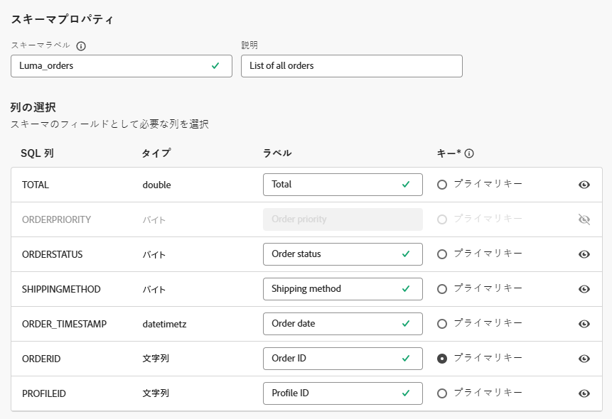
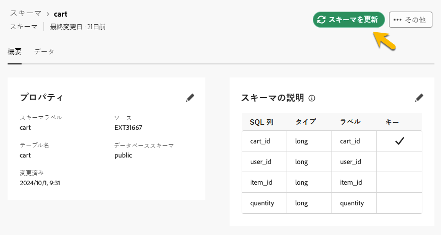

# スキーマの基本を学ぶ {#schemas}

>[!AVAILABILITY]
>
>スキーマにアクセスするには、次のいずれかの権限が必要です。
>
>-**連合スキーマの管理**
>&#x200B;>-**連合スキーマの表示**
>
>必要な権限の詳細については、[ アクセス制御ガイド ](/help/governance-privacy-security/access-control.md) を参照してください。

>[!CONTEXTUALHELP]
>id="dc_schema_create_select_tables"
>title="テーブルの選択"
>abstract="データモデルに追加するテーブルを選択します。"

>[!CONTEXTUALHELP]
>id="dc_schema_create_key"
>title="キー"
>abstract="データ紐付けのキーを選択します。"

>[!CONTEXTUALHELP]
>id="dc_schema_create_schema_name"
>title="スキーマの名前"
>abstract="スキーマの名前を入力します。"

>[!CONTEXTUALHELP]
>id="dc_schema_edit_description"
>title="スキーマの説明"
>abstract="スキーマの説明には、列、タイプ、ラベルがリストされます。 また、スキーマの紐付けキーを確認することもできます。 スキーマ定義を更新するには、鉛筆アイコンをクリックします。"

>[!CONTEXTUALHELP]
>id="dc_schema_filter_sources"
>title="フィルタリングするソースデータベースの選択"
>abstract="ソースに基づいてスキーマをフィルタリングできます。 1 つまたは複数の連合データベースを選択して、このスキーマを表示します。"

## スキーマとは {#schema-start}

スキーマは、データベースのテーブルの表現です。これは、データをデータベーステーブルに関連付ける方法を定義するアプリケーション内のオブジェクトです。

スキーマを作成することにより、Experience Platform 連合オーディエンス構成でテーブルの表現を定義できます。

* ユーザーが理解しやすいように、わかりやすい名前と説明を指定します
* 実際の用途に応じて各フィールドの表示を決定します
* [データモデル](../data-management/gs-models.md#data-model-start)で必要に応じて、このプライマリキー間のスキーマをリンクするために、プライマリキーを選択します

>[!CAUTION]
>
>複数のサンドボックスを同じデータベースに接続する際は、異なる作業スキーマを使用する必要があります。
>

## スキーマの作成 {#schema-create}

連合オーディエンス構成でスキーマを作成するには、次の手順に従います。

1. 「**[!UICONTROL 連合データ]**」セクションで、**[!UICONTROL モデル]**&#x200B;メニューにアクセスします。「**[!UICONTROL スキーマ]**」タブを参照し、「**[!UICONTROL スキーマを作成]**」をクリックします。

   {zoomable="yes"}

   この手順では、ドロップダウンリストを備えた新しい画面にアクセスして、環境に接続されているデータベースを検索できます。データベース接続について詳しくは、[この節](../connections/connections.md#connections-fdb)を参照してください。

1. リストでソースデータベースを選択し、「**[!UICONTROL 次へ]**」をクリックします。

   {zoomable="yes"}

   その後、データベース内のすべてのテーブルのリストが表示されます。

1. スキーマを作成するテーブルを選択します。

1. 選択した各テーブルでは、選択した列を含むスキーマが生成されます。必要に応じて、スキーマとその列を設定します。

   {zoomable="yes"}

   テーブルごとに、次の操作を実行できます。

   * スキーマのラベルを変更する
   * 説明を追加する
   * すべてのフィールドラベルの名前を変更し、表示を設定する
   * スキーマのプライマリキーを選択する

   スキーマは、次のように定義できます。

   

1. 設定が完了したら、「**[!UICONTROL 完了]**」をクリックします。

## スキーマの編集 {#schema-edit}

スキーマを編集するには、次の手順に従います。

1. 以前に作成したスキーマにアクセスします。

1. 「**[!UICONTROL 編集]**」ボタンをクリックします。

   {zoomable="yes"}

1. **[!UICONTROL スキーマを編集]**&#x200B;ウィンドウから、[スキーマの作成](#schema-create)時と同じオプションにアクセスして設定できます。

   {zoomable="yes"}

## スキーマ内のデータのプレビュー {#schema-preview}

スキーマで表現されたテーブル内のデータをプレビューするには、以下のように「**[!UICONTROL データ]**」タブを参照します。

レコードの合計数をプレビューするには、**[!UICONTROL 計算]**&#x200B;リンクをクリックします。

{zoomable="yes"}

データの表示を変更するには、「**[!UICONTROL 列を設定]**」ボタンをクリックします。

{zoomable="yes"}

## スキーマの更新 {#schema-refresh}

連合データベース内のテーブルは、更新、追加、削除できます。その場合、最新の変更内容に合わせて Adobe Experience Platform のスキーマを更新する必要があります。これを実行するには、更新するスキーマの名前の横にある 3 つのドットをクリックし、「**スキーマを更新**」を選択します。

また、編集時にスキーマ定義を更新することもできます。

{zoomable="yes"}

## スキーマの削除 {#schema-delete}

スキーマを削除するには、「**[!UICONTROL その他]**」ボタンをクリックし、「**[!UICONTROL 削除]**」を選択します。

{zoomable="yes"}
