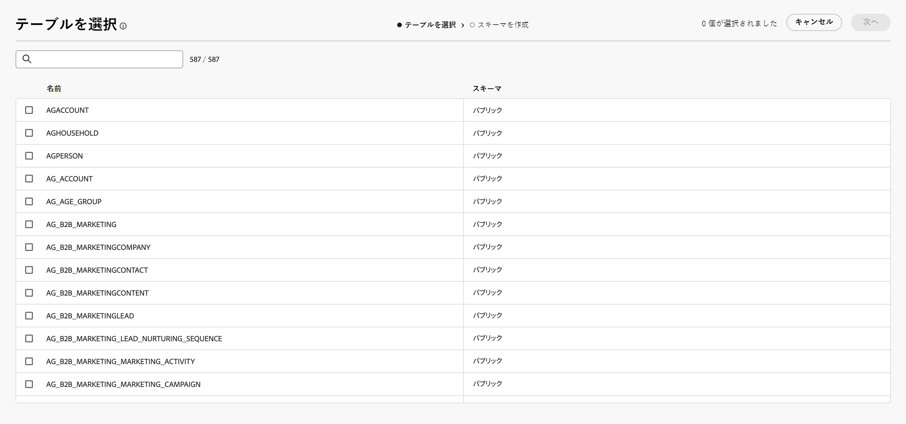
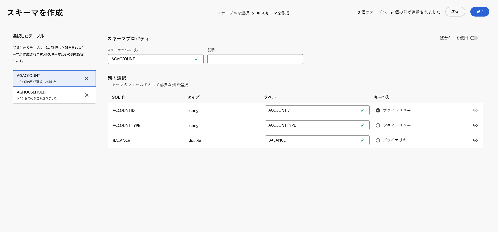
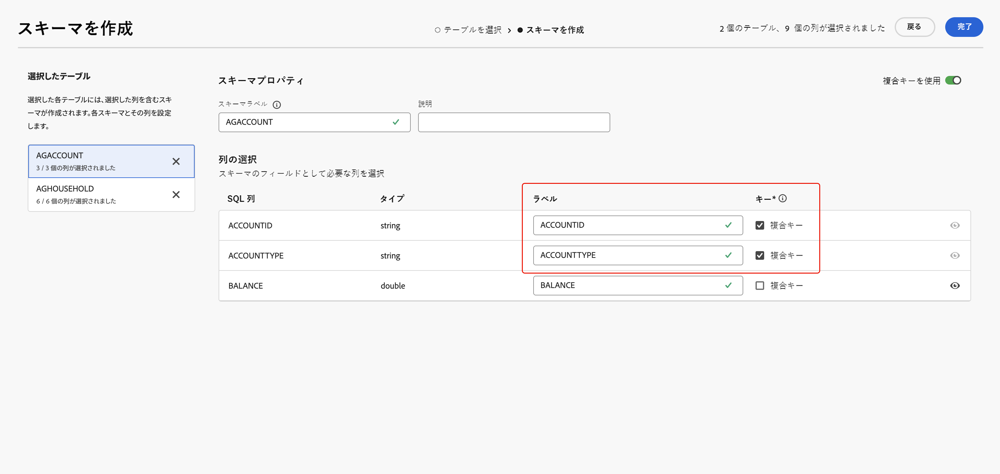

# スキーマの基本を学ぶ {#schemas}

>[!AVAILABILITY]
>
>スキーマにアクセスするには、次のいずれかの権限が必要です。
>
>-**連合スキーマの管理**
>&#x200B;>-**連合スキーマの表示**
>
>必要な権限について詳しくは、[アクセス制御ガイド](/help/governance-privacy-security/access-control.md)を参照してください。

>[!CONTEXTUALHELP]
>id="dc_schema_create_select_tables"
>title="テーブルの選択"
>abstract="データモデルに追加するテーブルを選択します。"

>[!CONTEXTUALHELP]
>id="dc_schema_create_key"
>title="キー"
>abstract="データ紐付けのキーを選択します。"

>[!CONTEXTUALHELP]
>id="dc_schema_create_schema_name"
>title="スキーマの名前"
>abstract="スキーマの名前を入力します。"

>[!CONTEXTUALHELP]
>id="dc_schema_edit_description"
>title="スキーマの説明"
>abstract="スキーマの説明には、列、タイプ、ラベルがリストされます。 また、スキーマの紐付けキーを確認することもできます。 スキーマ定義を更新するには、鉛筆アイコンをクリックします。"

>[!CONTEXTUALHELP]
>id="dc_schema_filter_sources"
>title="フィルタリングするソースデータベースの選択"
>abstract="ソースに基づいてスキーマをフィルタリングできます。 1 つまたは複数の連合データベースを選択して、このスキーマを表示します。"

## スキーマとは {#schema-start}

スキーマは、データベースのテーブルの表現です。これは、データをデータベーステーブルに関連付ける方法を定義するアプリケーション内のオブジェクトです。

スキーマを作成することにより、Experience Platform 連合オーディエンス構成でテーブルの表現を定義できます。

* ユーザーが理解しやすいように、わかりやすい名前と説明を指定します
* 実際の用途に応じて各フィールドの表示を決定します
* [データモデル](../data-management/gs-models.md#data-model-start)で必要に応じて、このプライマリキー間のスキーマをリンクするために、プライマリキーを選択します

>[!CAUTION]
>
>複数のサンドボックスを同じデータベースに接続する際は、異なる作業スキーマを使用する必要があります。

## スキーマの作成 {#schema-create}

Federated Audience 構成でスキーマを作成するには、「**[!UICONTROL Federated Data]**」セクションで **[!UICONTROL モデル]** を選択します。 「**[!UICONTROL スキーマ]**」タブ内で、「**[!UICONTROL スキーマを作成]**」を選択します。

{zoomable="yes"}

**[!UICONTROL 連合データベースを選択]** ポップオーバーが表示されます。 このポップオーバーで、「[ ソースデータベース ](/help/connections/home.md)」に続いて「**[!UICONTROL 次へ]**」を選択できます。

{zoomable="yes"}

**テーブルを選択** ポップオーバーが表示されます。 このポップオーバーで、スキーマの作成に使用するテーブルを選択できます。

{zoomable="yes"}

選択した各テーブルでは、選択した列を含むスキーマが生成されます。各テーブルでは、スキーマのラベルの変更、説明の追加、フィールドラベルの名前の変更、フィールドラベルの表示の設定、スキーマのプライマリキーの選択を行うことができます。

{zoomable="yes"}

>[!NOTE]
>
>**[!UICONTROL 複合キーを使用]** を有効にして、使用するキーを 1 つだけ選択した場合、そのキーは標準スキーマのプライマリキーとして扱われます。

さらに、複数のスキーマ列で構成されるキーを作成できます。 **[!UICONTROL 合成キーを使用]** をオンにして、合成キーとして使用するキーをマークします。

{zoomable="yes"}

設定が完了したら、「**[!UICONTROL 完了]**」を選択してスキーマの作成を完了します。

## スキーマの編集 {#schema-edit}

スキーマを編集するには、以前に作成したスキーマを **スキーマ** ページで選択します。

スキーマの詳細ページが表示されます。  を選択して、スキーマを編集します。

{zoomable="yes"}

**[!UICONTROL スキーマを編集]** ウィンドウで、[ スキーマを作成 ](#schema-create) 時と同じオプションにアクセスして設定できます。

{zoomable="yes"}

## スキーマ内のデータのプレビュー {#schema-preview}

スキーマで表現されたテーブル内のデータをプレビューするには、以下のように「**[!UICONTROL データ]**」タブを参照します。

**[!UICONTROL 計算]** リンクを選択して、録画の合計数をプレビューします。

{zoomable="yes"}

「**[!UICONTROL 列を設定]**」ボタンを選択して、データの表示を変更します。

{zoomable="yes"}

## スキーマの更新 {#schema-refresh}

連合データベース内のテーブルは、更新、追加、削除できます。その場合、最新の変更内容に合わせて Adobe Experience Platform のスキーマを更新する必要があります。これを実行するには、スキーマ名の横にある  を選択し、「スキーマを更新 **[!UICONTROL を選択し]** す。

また、編集時にスキーマ定義を更新することもできます。

{zoomable="yes"}

## スキーマの削除 {#schema-delete}

スキーマを削除するには、「」に続いて「**[!UICONTROL 削除]**」を選択します。

{zoomable="yes"}
