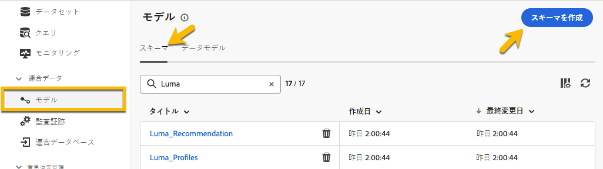
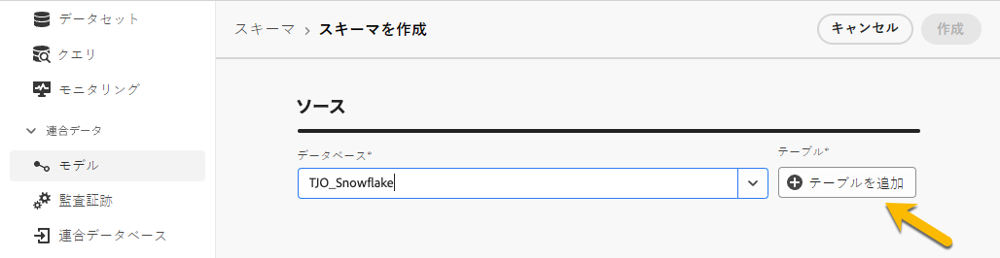
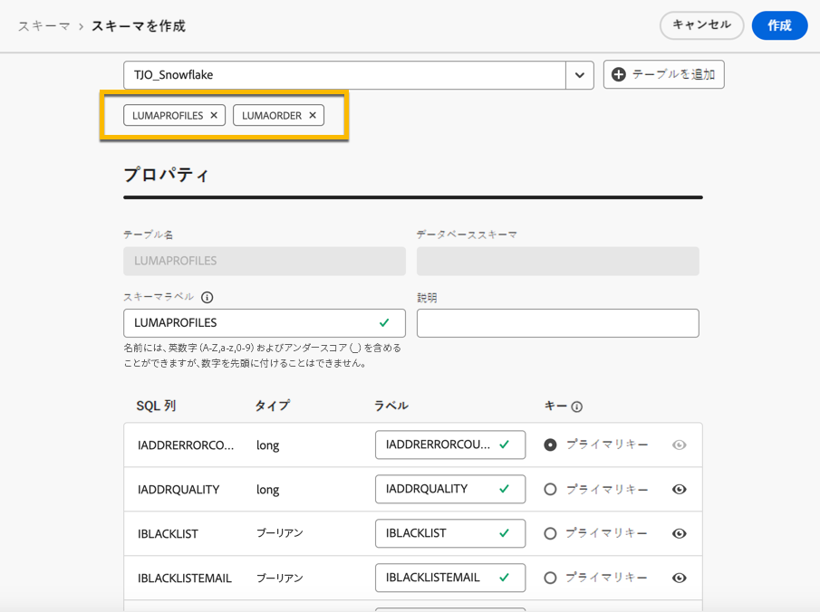
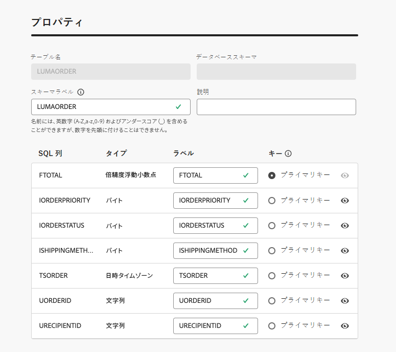
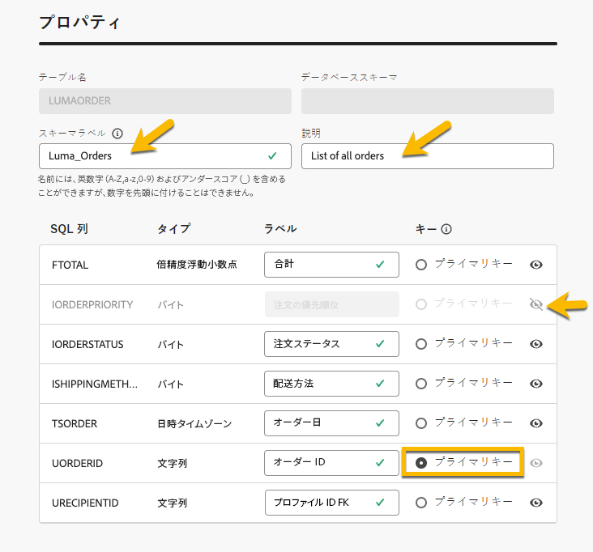
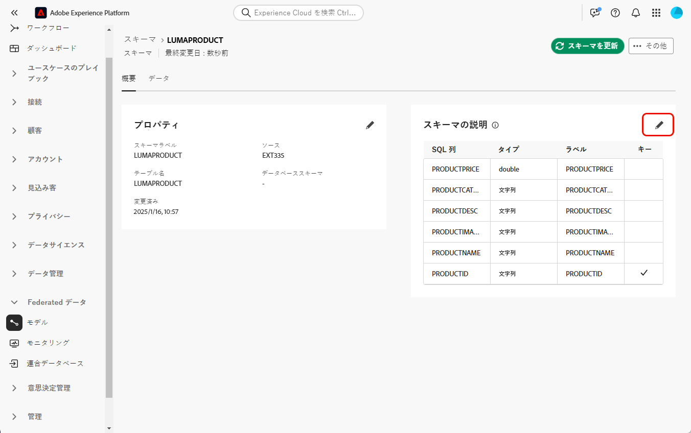
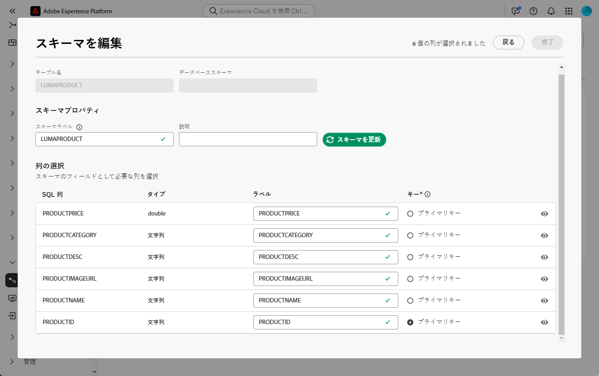
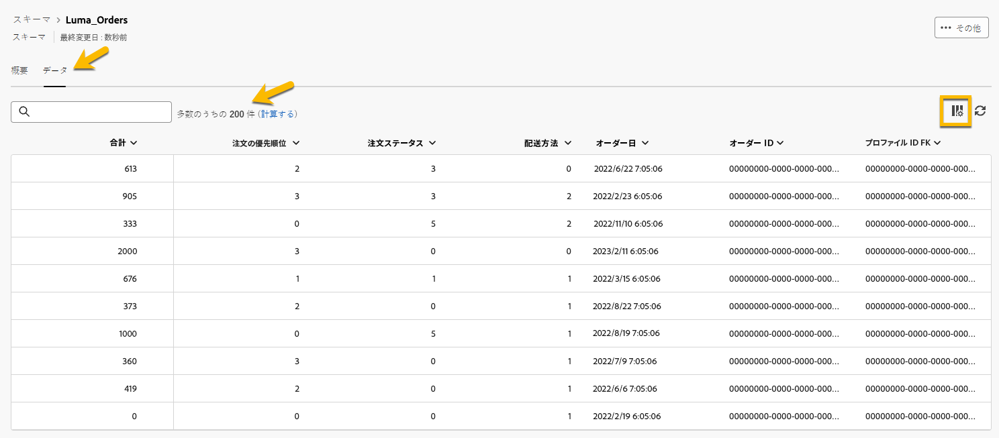
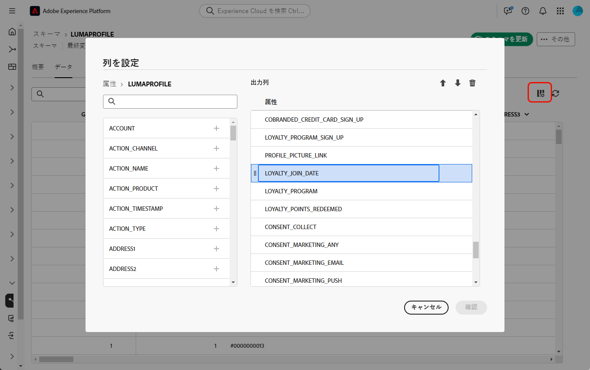
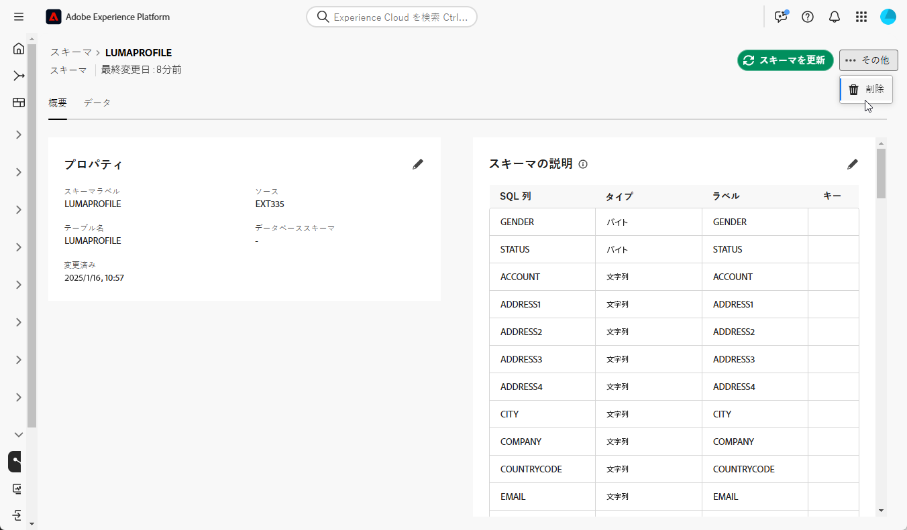

# スキーマの基本を学ぶ {#schemas}

>[!CONTEXTUALHELP]
>id="dc_schema_create_select_tables"
>title="テーブルの選択"
>abstract="データモデルに追加するテーブルを選択します。"

>[!CONTEXTUALHELP]
>id="dc_schema_create_key"
>title="キー"
>abstract="データ紐付けのキーを選択します。"

>[!CONTEXTUALHELP]
>id="dc_schema_create_schema_name"
>title="スキーマの名前"
>abstract="スキーマの名前を入力します。"

>[!CONTEXTUALHELP]
>id="dc_schema_edit_description"
>title="スキーマの説明"
>abstract="スキーマの説明には、列、タイプ、ラベルがリストされます。 また、スキーマの紐付けキーを確認することもできます。 スキーマ定義を更新するには、鉛筆アイコンをクリックします。"

>[!CONTEXTUALHELP]
>id="dc_schema_filter_sources"
>title="フィルタリングするソースデータベースの選択"
>abstract="ソースに基づいてスキーマをフィルタリングできます。 1 つまたは複数の連合データベースを選択して、このスキーマを表示します。"

## スキーマとは {#schema-start}

スキーマは、データベースのテーブルを表すものです。 これは、データがデータベーステーブルにどのように関連付けられているかを定義するアプリケーション内のオブジェクトです。

スキーマを作成すると、FAC でテーブルの表現を操作できます。

- わかりやすい名前と説明を指定して、ユーザーが理解しやすいようにします
- 各フィールドの実際の用途に応じた表示を決定する
- [ データモデル ](../data-management/gs-models.md#data-model-start) の必要に応じて、プライマリキーを選択して、スキーマ間をリンクします

## スキーマの作成 {#schema-create}

FAC でスキーマを作成するには、次の手順に従います。
「**[!UICONTROL FEDERATED DATA]**」セクションで、「**[!UICONTROL モデル]** リンクに移動します。 「**[!UICONTROL スキーマ]**」タブがあります。
「**[!UICONTROL スキーマを作成]**」ボタンをクリックします。

{zoomable="yes"}

次の場所にあるドロップダウンリストを使用して、新しいインターフェイスにアクセスできます
アプリケーションに接続されているすべてのデータベース。 詳しくは、[ データベース接続 ](../connections/connections.md#connections-fdb) を参照してください。
リストでソースデータベースを選択し、「**[!UICONTROL テーブルを追加]** タブをクリックします

{zoomable="yes"}

データベース内のすべてのテーブルのリストにアクセスできます。

スキーマを作成するテーブルを追加すると、以下のようにフィールドにアクセスできます。

{zoomable="yes"}

テーブルごとに、次の操作を実行できます。

- 指定されたスキーマラベルの名前を変更
- 説明を追加
- すべてのフィールドの名前を変更し、表示を決定します。
- スキーマのプライマリキーを選択

例えば、追加したテーブルの直後に、次のようにテーブルが読み込まれているとします。

{zoomable="yes"}

スキーマは、次のように定義できます。

{zoomable="yes"}

## スキーマの編集 {#schema-edit}

スキーマを編集するには、スキーマフォルダーでスキーマの名前をクリックします。 以下のページにアクセスできます。
「**[!UICONTROL 編集]** ボタンをクリックします。

{zoomable="yes"}

スキーマを作成する場合と同じ方法でアクセスできます。

- 指定されたスキーマラベルの名前を変更
- 説明を追加
- すべてのフィールドの名前を変更し、表示を決定します。
- スキーマのプライマリキーを選択

{zoomable="yes"}

## スキーマ内のデータのプレビュー {#schema-preview}

スキーマが表すテーブルのデータをプレビューするには、次のように「**[!UICONTROL データ]**」タブに移動します。
**[!UICONTROL 計算]** リンクをクリックすると、録画の合計数を確認できます。

{zoomable="yes"}

「**[!UICONTROL 列を設定]**」ボタンをクリックして、データの概要を変更できます。

{zoomable="yes"}

## スキーマの削除 {#schema-delete}

スキーマを削除するには、「**[!UICONTROL 詳細]**」ボタン、「**[!UICONTROL 削除]** の順にクリックします。

{zoomable="yes"}
