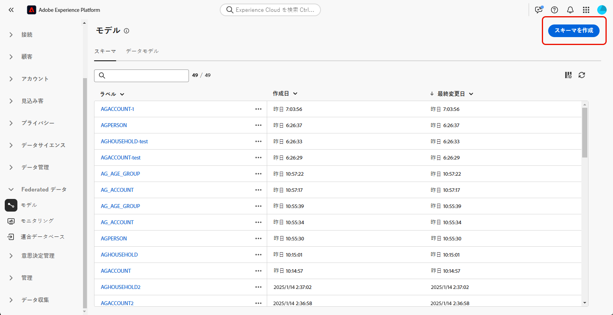

# スキーマの基本を学ぶ {#schemas}

>[!CONTEXTUALHELP]
>id="dc_schema_create_select_tables"
>title="テーブルの選択"
>abstract="データモデルに追加するテーブルを選択します。"

>[!CONTEXTUALHELP]
>id="dc_schema_create_key"
>title="キー"
>abstract="データ紐付けのキーを選択します。"

>[!CONTEXTUALHELP]
>id="dc_schema_create_schema_name"
>title="スキーマの名前"
>abstract="スキーマの名前を入力します。"

>[!CONTEXTUALHELP]
>id="dc_schema_edit_description"
>title="スキーマの説明"
>abstract="スキーマの説明には、列、タイプ、ラベルがリストされます。 また、スキーマの紐付けキーを確認することもできます。 スキーマ定義を更新するには、鉛筆アイコンをクリックします。"

>[!CONTEXTUALHELP]
>id="dc_schema_filter_sources"
>title="フィルタリングするソースデータベースの選択"
>abstract="ソースに基づいてスキーマをフィルタリングできます。 1 つまたは複数の連合データベースを選択して、このスキーマを表示します。"

## スキーマとは {#schema-start}

スキーマは、データベースのテーブルを表すものです。 これは、データがデータベーステーブルにどのように関連付けられているかを定義するアプリケーション内のオブジェクトです。

スキーマを作成すると、Experience Platform Federated Audience Composition でテーブルの表現を定義できます。

* わかりやすい名前と説明を指定して、ユーザーが理解しやすいようにします
* 実際の用途に応じて、各フィールドの表示/非表示を決定します
* [ データモデル ](../data-management/gs-models.md#data-model-start) の必要に応じて、プライマリキーを選択して、スキーマ間をリンクします

## スキーマの作成 {#schema-create}

Federated Audience Composition でスキーマを作成するには、次の手順に従います。

1. 「**[!UICONTROL FEDERATED DATA]**」セクションで、「**[!UICONTROL モデル]** リンクに移動します。 「**[!UICONTROL スキーマ]**」タブを参照し、「**[!UICONTROL スキーマを作成]**」ボタンをクリックします。

   {zoomable="yes"}

   この手順では、環境に接続されているデータベースを検索できるドロップダウンリストを含む新しい画面にアクセスできます。 データベース接続について詳しくは、[ この節 ](../connections/connections.md#connections-fdb) を参照してください。

1. リストでソースデータベースを選択し、「**[!UICONTROL テーブルを追加]** タブをクリックします。

   {zoomable="yes"}

   データベース内のすべてのテーブルのリストが表示されます。

1. スキーマを作成するテーブルを追加すると、次のようにフィールドにアクセスできます。

   {zoomable="yes"}

   テーブルごとに、次の操作を実行できます。

   * スキーマのラベルの変更
   * 説明を追加
   * すべてのフィールドの名前を変更し、表示を設定する
   * スキーマのプライマリキーを選択

   例えば、以下のテーブルの場合、インポートはされます。

   {zoomable="yes"}

   スキーマは次のように定義できます。

   {zoomable="yes"}

## スキーマの編集 {#schema-edit}

スキーマを編集するには：

1. スキーマフォルダーでスキーマの名前をクリックします。

1. 「**[!UICONTROL 編集]** ボタンをクリックします。

   {zoomable="yes"}

   [ スキーマの作成 ](#schema-create) 時と同じオプションにアクセスできます。

   {zoomable="yes"}

## スキーマ内のデータのプレビュー {#schema-preview}

スキーマが表すテーブルのデータをプレビューするには、次のように「**[!UICONTROL データ]**」タブを参照します。

**[!UICONTROL 計算]** リンクをクリックして、録画の合計数をプレビューします。

{zoomable="yes"}

「**[!UICONTROL 列を設定]**」ボタンをクリックして、データの表示を変更します。

{zoomable="yes"}

## スキーマの削除 {#schema-delete}

スキーマを削除するには、「**[!UICONTROL 詳細]**」ボタンをクリックして「**[!UICONTROL 削除]**」を選択します。

{zoomable="yes"}
