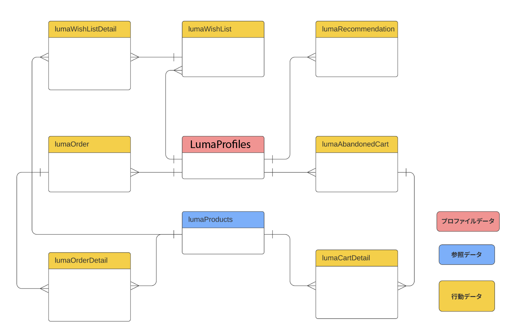
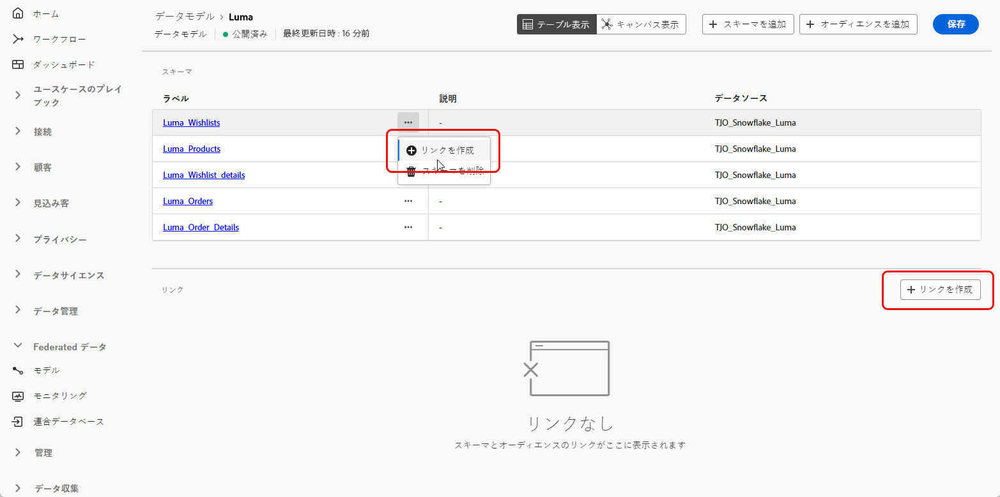
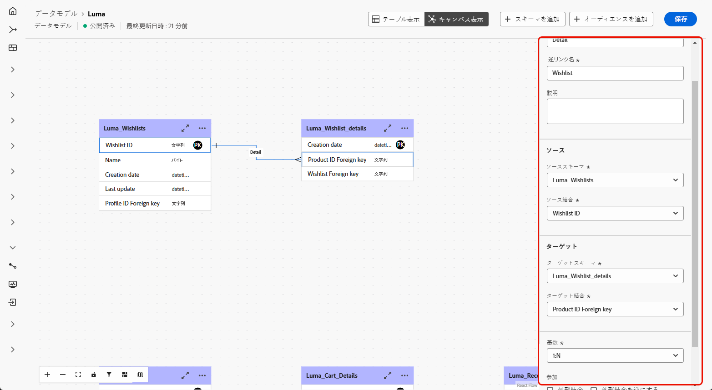

# データモデルの基本を学ぶ {#data-model-beta}

>[!AVAILABILITY]
>
>キャンバスビューを使用したデータモデルは、現在、一部のユーザーのみがベータ版として利用できます。

## データモデルとは {#data-model-start}

データモデルは、スキーマ、オーディエンスおよびこれらの間のリンクのセットです。オーディエンスとデータベースデータを連合するために使用されます。

[ スキーマ ](../customer/schemas.md#schema-start) および [ オーディエンス ](../start/audiences.md) の詳細情報。

例えば、データモデルの表現を以下に示します。テーブルおよびこの名前と、テーブル間のリンクです。

{zoomable="yes"}

連合オーディエンス構成では、多くのデータモデルを作成できます。

作成は、ユースケースに基づいて行います。必要なテーブルを選択し、必要に応じてテーブルをリンクします。

## データモデルの作成 {#data-model-create}

データモデルを作成するには、次の手順に従います。

1. 「**[!UICONTROL Federated Data]**」セクションで、「**[!UICONTROL モデル]** メニューにアクセスし、「**[!UICONTROL データモデル]**」タブを参照します。

   「**[!UICONTROL データモデルを作成]**」ボタンをクリックします。

   {zoomable="yes"}

1. データモデルに名前を付け、「作成 **[!UICONTROL ボタンをクリックし]** す。

1. データモデルダッシュボードで「**[!UICONTROL スキーマを追加]**」をクリックして、データモデルに関連付けられているスキーマを選択します。

   {zoomable="yes"}

1. 「**[!UICONTROL オーディエンスを追加]**」をクリックして、ターゲットグループを定義します。

1. データモデルのテーブル間の接続を確立して、正確なデータ関係を確保します。 [詳細情報](#data-model-links)

1. 設定が完了したら、「**[!UICONTROL 保存]**」をクリックして変更を適用します。

## リンクを作成 {#data-model-links}

>[!BEGINTABS]

>[!TAB  テーブル表示 ]

「テーブル表示」タブからデータモデルのテーブル間にリンクを作成するには、次の手順に従います。

1. 1 つのテーブルの&#x200B;**[!UICONTROL リンクを作成]**&#x200B;メニューをクリックするか、「**[!UICONTROL リンクを作成]**」ボタンをクリックして、2つのテーブルを選択します。

   {zoomable="yes"}

1. 指定されたフォームに入力して、リンクを定義します。

   {zoomable="yes"}

   **カーディナリティ**

   * **1-N**：ソーステーブルの 1 つのオカレンスを、ターゲットテーブルの複数のオカレンスに対応させることができますが、ターゲットテーブルの 1 つのオカレンスは、最大でソーステーブルの 1 つのオカレンスに対応させることができます。

   * **N-1**：ターゲットテーブルの 1 つのオカレンスを、ソーステーブルの複数のオカレンスに対応させることができますが、ソーステーブルの 1 つのオカレンスは、最大でターゲットテーブルの 1 つのオカレンスに対応させることができます。

   * **1-1**：ソーステーブルの 1 つのオカレンスを、ターゲットテーブルの最大 1 つのオカレンスに対応させることができます。

データモデルに対して定義されたすべてのリンクが、次のようにリストされます。

{zoomable="yes"}

>[!TAB  キャンバスビュー ]

「キャンバスビュー」タブからデータモデルのテーブル間にリンクを作成するには、次の手順に従います。

1. データモデルのキャンバスビューにアクセスし、リンクする 2 つのテーブルを選択します

1. Source結合の横にある「」ボタンをクリックし、矢印をドラッグしてターゲット結合に向かって誘導し、接続を確立します。

   {zoomable="yes"}

1. 指定されたフォームに入力してリンクを定義し、設定が完了したら **[!UICONTROL 適用]** をクリックします。

   {zoomable="yes"}

   **カーディナリティ**

   * **1-N**：ソーステーブルの 1 つのオカレンスを、ターゲットテーブルの複数のオカレンスに対応させることができますが、ターゲットテーブルの 1 つのオカレンスは、最大でソーステーブルの 1 つのオカレンスに対応させることができます。

   * **N-1**：ターゲットテーブルの 1 つのオカレンスを、ソーステーブルの複数のオカレンスに対応させることができますが、ソーステーブルの 1 つのオカレンスは、最大でターゲットテーブルの 1 つのオカレンスに対応させることができます。

   * **1-1**：ソーステーブルの 1 つのオカレンスを、ターゲットテーブルの最大 1 つのオカレンスに対応させることができます。

1. データモデルで定義されたリンクはすべて、キャンバスビューでは矢印で表されます。 必要に応じて、2 つのテーブルの間にある矢印をクリックして、詳細の表示、編集、リンクの削除を行います。

   {zoomable="yes"}

1. ツールバーを使用して、キャンバスをカスタマイズおよび調整します。

   

   * **[!UICONTROL ズームイン]**：キャンバスを拡大して、データモデルの詳細をより明確に表示します。
   * **[!UICONTROL ズームアウト]**：データモデルを幅広く表示するために、キャンバスのサイズを小さくします。
   * **[!UICONTROL ビューに合わせる]**：表示される領域内のすべてのスキーマやオーディエンスに合わせてズームを調整します。
   * **[!UICONTROL インタラクティブ機能を切り替え]**：キャンバスとのユーザー操作を有効または無効にします。
   * **[!UICONTROL フィルター]**：キャンバス内に表示するスキーマを選択します。
   * **[!UICONTROL 自動レイアウトを強制]**：スキーマやオーディエンスを自動的に整理し、整理を強化します。

>[!ENDTABS]

## ハウツービデオ {#data-model-video}

データモデルの作成方法については、次のビデオをご覧ください。

>[!VIDEO](https://video.tv.adobe.com/v/3432020)
