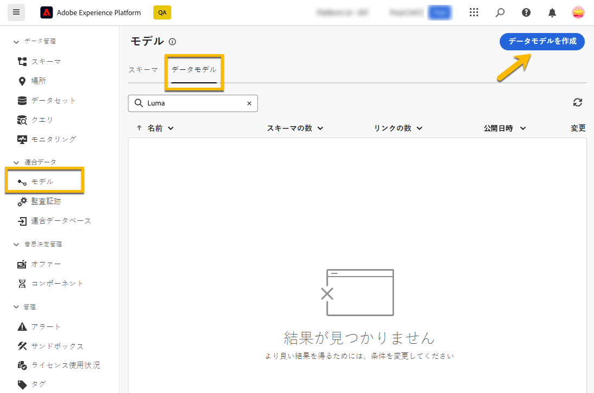
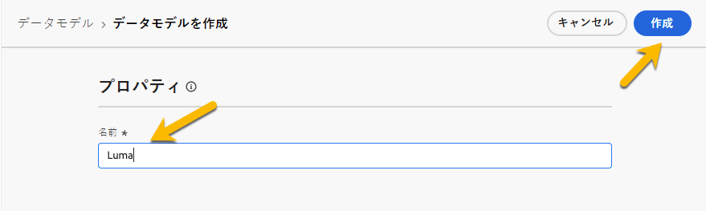
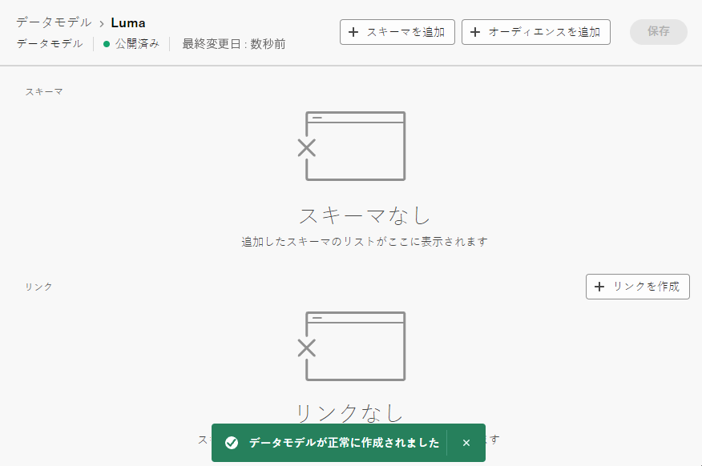
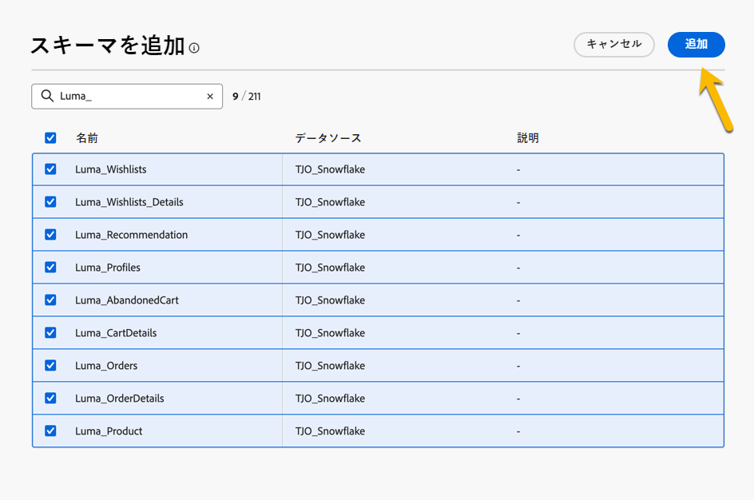

# データモデルの基本を学ぶ {#data-model}

>[!CONTEXTUALHELP]
>id="dc_model_menu"
>title="モデルの操作"
>abstract="この画面には、スキーマとデータモデルが一覧表示されます。 からスキーマとデータモデルを作成できます **作成** ボタン。"

>[!CONTEXTUALHELP]
>id="dc_datamodel_add_schema"
>title="スキーマを選択"
>abstract="データモデルのスキーマを選択します。"

>[!CONTEXTUALHELP]
>id="dc_datamodel_add_audience"
>title="オーディエンスを選択"
>abstract="データモデルのオーディエンスを選択します。"

>[!CONTEXTUALHELP]
>id="dc_datamodel_properties"
>title="データモデルのプロパティ"
>abstract="データモデルのラベルを入力します。"

## データモデルとは {#data-model-start}

データモデルは、スキーマ、オーディエンスおよびこれらの間のリンクのセットです。

の詳細情報 [スキーマ](customer/schemas.md).

の詳細情報 [オーディエンス](customer/audiences.md).

## データモデルの作成方法 {#data-model-create}

対象： **[!UICONTROL 連合データ]** セクションに移動 **[!UICONTROL モデル]** リンク。 そこには **[!UICONTROL データモデル]** タブ。

{zoomable="yes"}

をクリックする **[!UICONTROL データモデルを作成]** ボタンをクリックすると、データモデルに名前を付け、 **[!UICONTROL 作成]** ボタン。

{zoomable="yes"}

スキーマ、オーディエンスおよびデータモデルのリンクを追加できるウィンドウにアクセスします。

{zoomable="yes"}

{zoomable="yes"}

