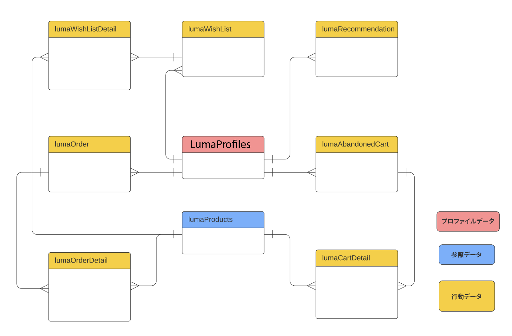
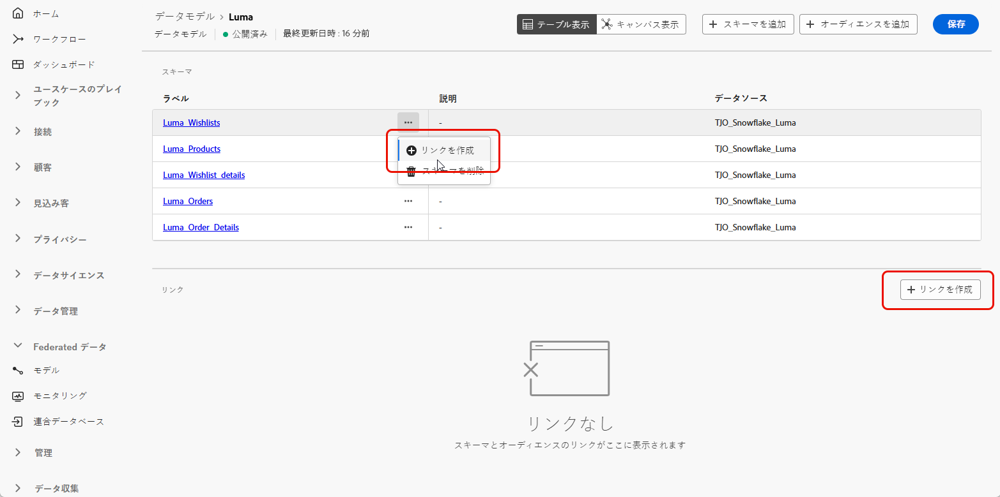
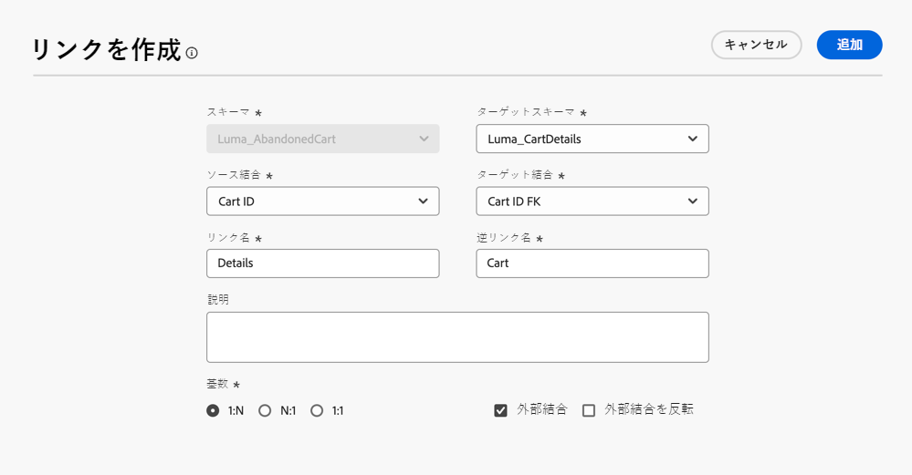
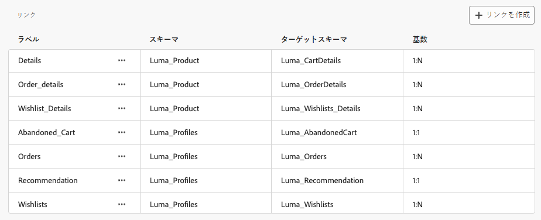

# データモデルの基本を学ぶ {#data-model}

>[!CONTEXTUALHELP]
>id="dc_model_menu"
>title="モデルの操作"
>abstract="この画面には、スキーマとデータモデルがリストされます。 「**作成**」ボタンからスキーマとデータモデルを作成できます。"

>[!CONTEXTUALHELP]
>id="dc_datamodel_add_schema"
>title="スキーマの選択"
>abstract="データモデルのスキーマを選択します。"

>[!CONTEXTUALHELP]
>id="dc_datamodel_add_audience"
>title="オーディエンスの選択"
>abstract="データモデルのオーディエンスを選択します。"

>[!CONTEXTUALHELP]
>id="dc_datamodel_properties"
>title="データモデルのプロパティ"
>abstract="データモデルのラベルを入力します。"

## データモデルとは {#data-model-start}

データモデルは、スキーマ、オーディエンスおよびこれらの間のリンクのセットです。オーディエンスとデータベースデータを連合するために使用されます。

詳しくは、[スキーマ](../customer/schemas.md#schema-start)を参照してください。

詳しくは、[オーディエンス](../start/audiences.md)を参照してください。

例えば、データモデルの表現を以下に示します。テーブルおよびこの名前と、テーブル間のリンクです。

{zoomable="yes"}

連合オーディエンス構成では、多くのデータモデルを作成できます。

作成は、ユースケースに基づいて行います。必要なテーブルを選択し、必要に応じてテーブルをリンクします。

## データモデルの作成 {#data-model-create}

データモデルを作成するには、次の手順に従います。

1. 「**[!UICONTROL 連合データ]**」セクションで、**[!UICONTROL モデル]**&#x200B;リンクに移動し、「**[!UICONTROL データモデル]**」タブを参照します。

   {zoomable="yes"}

1. 「**[!UICONTROL データモデルを作成]**」ボタンをクリックして、データモデルの名前を定義し、「**[!UICONTROL 作成]**」ボタンをクリックします。

   {zoomable="yes"}

1. 次に、データモデルのスキーマ、オーディエンおよびリンクを追加します。

   {zoomable="yes"}

### リンクを作成 {#data-model-links}

データモデルのテーブル間にリンクを作成するには、次の手順に従います。

1. 1 つのテーブルの&#x200B;**[!UICONTROL リンクを作成]**&#x200B;メニューをクリックするか、「**[!UICONTROL リンクを作成]**」ボタンをクリックして、2つのテーブルを選択します。

   {zoomable="yes"}

1. 指定されたフォームに入力して、リンクを定義します。

   {zoomable="yes"}

   **カーディナリティ**

   * 一対多：ソーステーブルの 1 つのオカレンスは、ターゲットテーブルの複数のオカレンスに対応させることができますが、ターゲットテーブルの 1 つのオカレンスは、ソーステーブルの最大 1 つのオカレンスにのみ対応させることができます。

   * 多対一：ターゲットテーブルの 1 つのオカレンスは、ソーステーブルの複数のオカレンスに対応させることができますが、ソーステーブルの 1 つのオカレンスは、ターゲットテーブルの最大 1 つのオカレンスにのみ対応させることができます。

   * 一対一：ソーステーブルの 1 つのオカレンスは、最大でターゲットテーブルの 1 つのオカレンスに対応させることができます。

データモデルに対して定義されたすべてのリンクが、次のようにリストされます。

{zoomable="yes"}

## ハウツービデオ {#data-model-video}

データモデルの作成方法については、次のビデオをご覧ください。

>[!VIDEO](https://video.tv.adobe.com/v/3432020)
