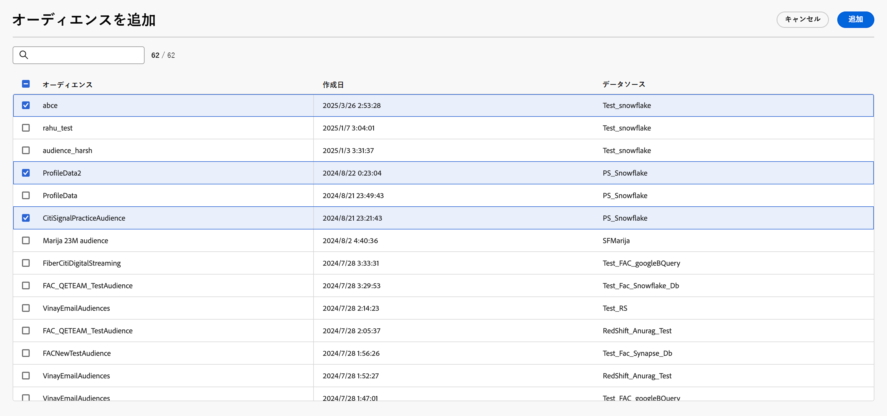
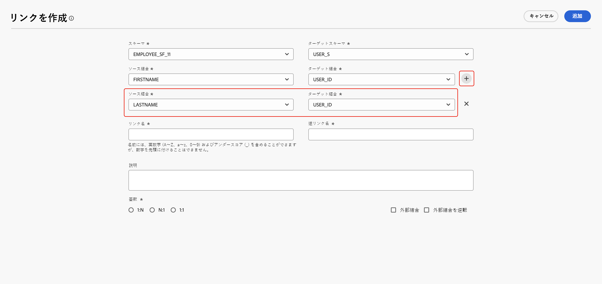
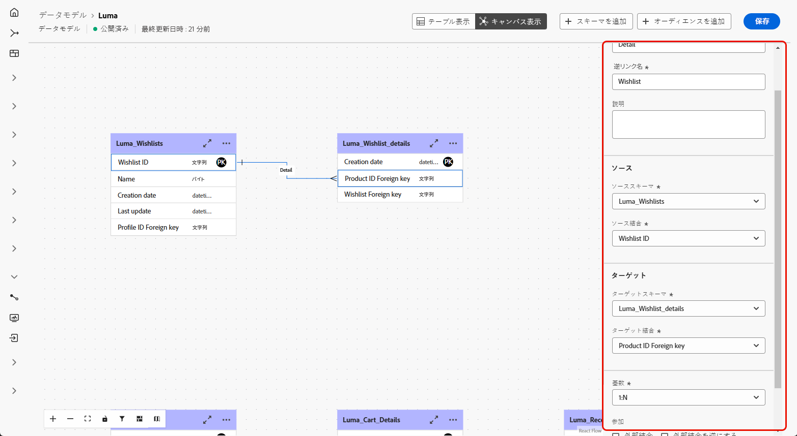
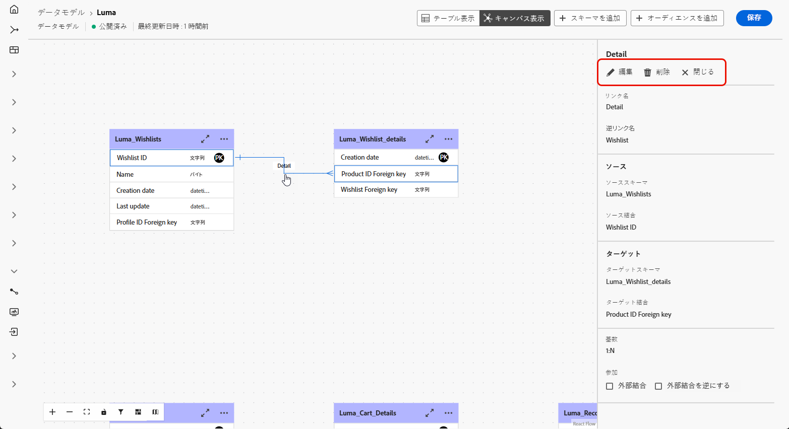

# データモデルの基本を学ぶ {#data-model-beta}

>[!AVAILABILITY]
>
>データモデルにアクセスするには、次のいずれかの権限が必要です。
>
>-**連合データモデルの管理**
>>-**連合データモデルの表示**
>
>必要な権限について詳しくは、[アクセス制御ガイド](/help/governance-privacy-security/access-control.md)を参照してください。

## データモデルとは {#data-model-start}

データモデルは、スキーマ、オーディエンスおよびこれらの間のリンクのセットです。オーディエンスとデータベースデータを連合するために使用されます。

連合オーディエンス構成では、キャンバスビューでデータモデルを直接作成および管理できます。これには、スキーマとオーディエンスの追加と、ユースケースに基づいてこれらの間のリンクの定義が含まれます。

詳しくは、[スキーマ](../customer/schemas.md#schema-start)および[オーディエンス](../start/audiences.md)を参照してください。

例えば、以下の図はデータモデル（テーブルおよびその名前と、テーブル間のリンク）を表しています。

{zoomable="yes"}

## データモデルの作成 {#data-model-create}

データモデルを作成するには、次の手順に従います。

1. 「**[!UICONTROL 連合データ]**」セクションで、**[!UICONTROL モデル]**&#x200B;メニューにアクセスし、「**[!UICONTROL データモデル]**」タブを参照します。

   「**[!UICONTROL データモデルを作成]**」ボタンを選択します。

   {zoomable="yes"}

2. データモデルの名前を定義し、「**[!UICONTROL 作成]** ボタンを選択します。

3. データモデルダッシュボードで「**[!UICONTROL スキーマを追加]**」を選択して、データモデルに関連付けられているスキーマを選択します。

   {zoomable="yes"}

4. さらに、データモデルにオーディエンスを追加できます。「**[!UICONTROL オーディエンスを追加]**」を選択してターゲットグループを定義します。

   {zoomable="yes"}

5. データモデルのテーブル間の接続を確立し、正確なデータ関係を確保します。詳しくは、[ リンクの作成 ](#data-model-links) を参照してください。

6. 設定が完了したら、「**[!UICONTROL 保存]**」を選択して変更を適用します。

## リンクの作成 {#data-model-links}

>[!NOTE]
>
>複数の結合を含むリンクを作成する場合、ソーススキーマとターゲットスキーマの同じ組み合わせを一度だけ使用できます。

>[!BEGINTABS]

>[!TAB テーブル表示]

「テーブル表示」タブからデータモデルのテーブル間のリンクを作成するには、次の手順に従います。

1. テーブルの横にある  アイコンに続いて **[!UICONTROL リンクを作成]** を選択するか、「**[!UICONTROL リンク]**」セクション内の **[!UICONTROL リンクを作成]** を選択します。

   {zoomable="yes"}

2. 指定されたフォームに入力して、リンクを定義します。

   {zoomable="yes"}

   **カーディナリティ**

   * **一対多**：ソーステーブルの 1 つのオカレンスは、ターゲットテーブルの複数のオカレンスに対応させることができますが、ターゲットテーブルの 1 つのオカレンスは、ソーステーブルの最大 1 つのオカレンスにのみ対応させることができます。

   * **多対一**：ターゲットテーブルの 1 つのオカレンスは、ソーステーブルの複数のオカレンスに対応させることができますが、ソーステーブルの 1 つのオカレンスは、ターゲットテーブルの最大 1 つのオカレンスにのみ対応させることができます。

   * **一対一**：ソーステーブルの 1 つのオカレンスは、最大でターゲットテーブルの 1 つのオカレンスに対応させることができます。

   複数結合リンクを作成するには、プラスアイコンを選択します。 スキーマフィールド間に複数の結合を作成できるようになりました。

   {zoomable="yes"}

データモデルに定義されているすべてのリンクを次に示します。

{zoomable="yes"}

>[!TAB キャンバス表示]

「キャンバスビュー」タブからデータモデルのテーブル間のリンクを作成するには、次の手順に従います。

1. データモデルのキャンバス表示にアクセスし、リンクする 2 つのテーブルを選択します

2. Source結合の横にある「」ボタンを選択し、矢印をドラッグしてターゲット結合に向かって誘導し、接続を確立します。

   {zoomable="yes"}

3. 指定したフォームに入力してリンクを定義し、設定したら **[!UICONTROL 適用]** を選択します。

   {zoomable="yes"}

   **カーディナリティ**

   * **一対多**：ソーステーブルの 1 つのオカレンスは、ターゲットテーブルの複数のオカレンスに対応させることができますが、ターゲットテーブルの 1 つのオカレンスは、ソーステーブルの最大 1 つのオカレンスにのみ対応させることができます。

   * **多対一**：ターゲットテーブルの 1 つのオカレンスは、ソーステーブルの複数のオカレンスに対応させることができますが、ソーステーブルの 1 つのオカレンスは、ターゲットテーブルの最大 1 つのオカレンスにのみ対応させることができます。

   * **一対一**：ソーステーブルの 1 つのオカレンスは、最大でターゲットテーブルの 1 つのオカレンスに対応させることができます。

4. データモデルで定義されたすべてのリンクは、キャンバス表示では矢印として表されます。必要に応じて、2 つのテーブルの間にある矢印を選択して、詳細の表示、編集、リンクの削除を行います。

   {zoomable="yes"}

5. ツールバーを使用して、キャンバスをカスタマイズおよび調整します。

   

   * **[!UICONTROL ズームイン]**：データモデルの詳細がより明確に表示するには、キャンバスを拡大します。
   * **[!UICONTROL ズームアウト]**：データモデルをより広く表示するには、キャンバスサイズを縮小します。
   * **[!UICONTROL 表示に合わせる]**：すべてのスキーマやオーディエンスを表示領域内に合わせるには、ズームを調整します。
   * **[!UICONTROL インタラクティブ機能を切り替え]**：キャンバスとのユーザーインタラクションを有効または無効にします。
   * **[!UICONTROL フィルター]**：キャンバス内に表示するスキーマを選択します。
   * **[!UICONTROL 自動レイアウトを適用]**：スキーマやオーディエンスを自動的に整理して、より適切に整理します。

>[!ENDTABS]

## ハウツービデオ {#data-model-video}

データモデルの作成方法については、次のビデオをご覧ください。

>[!VIDEO](https://video.tv.adobe.com/v/3432020)
