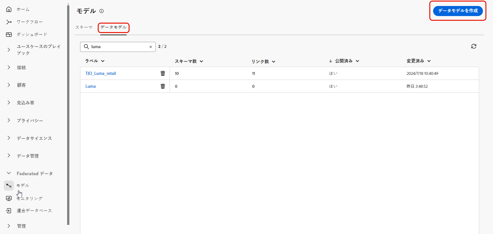

# データモデルの基本を学ぶ {#data-model}

>[!CONTEXTUALHELP]
>id="dc_model_menu"
>title="モデルの操作"
>abstract="この画面には、スキーマとデータモデルがリストされます。 「**作成**」ボタンからスキーマとデータモデルを作成できます。"

>[!CONTEXTUALHELP]
>id="dc_datamodel_add_schema"
>title="スキーマの選択"
>abstract="データモデルのスキーマを選択します。"

>[!CONTEXTUALHELP]
>id="dc_datamodel_add_audience"
>title="オーディエンスの選択"
>abstract="データモデルのオーディエンスを選択します。"

>[!CONTEXTUALHELP]
>id="dc_datamodel_properties"
>title="データモデルのプロパティ"
>abstract="データモデルのラベルを入力します。"

## データモデルとは {#data-model-start}

データモデルは、スキーマ、オーディエンスおよびこれらの間のリンクのセットです。

詳しくは、[ スキーマ ](../customer/schemas.md#schema-start) を参照してください。

詳細情報 [ オーディエンス ](../start/audiences.md)。

## データモデルの作成 {#data-model-create}

「**[!UICONTROL FEDERATED DATA]**」セクションで、「**[!UICONTROL モデル]** リンクに移動します。 そこには、「**[!UICONTROL データモデル]** タブがあります。

{zoomable="yes"}

「**[!UICONTROL データモデルを作成]**」ボタンをクリックすると、データモデルに名前を付け、「**[!UICONTROL 作成]**」ボタンをクリックできます。

{zoomable="yes"}

スキーマ、オーディエンスおよびデータモデルのリンクを追加できるウィンドウにアクセスします。

{zoomable="yes"}

{zoomable="yes"}

### リンクを作成 {#data-model-links}

データモデルのテーブル間のリンクの作成は、次の 2 つの方法で実行できます。

- テーブルのいずれかの **[!UICONTROL リンクを作成]** メニューを直接クリックします
- **[!UICONTROL リンクを作成]** ボタンをクリックし、2 つのテーブルを選択します

{zoomable="yes"}

指定したフォームに入力して、リンクを定義します。

{zoomable="yes"}

データモデルに対して定義されたリンクは、すべて次のように表示されます。

{zoomable="yes"}
