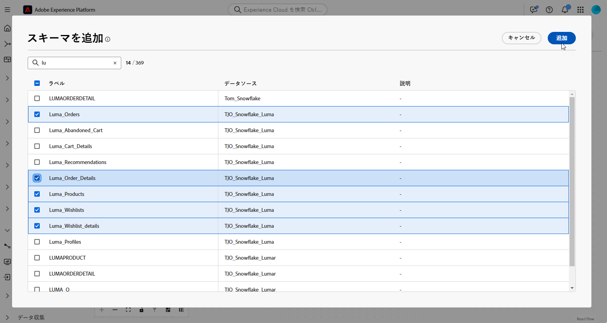

# データモデルの基本を学ぶ {#data-model}

>[!CONTEXTUALHELP]
>id="dc_model_menu"
>title="モデルの操作"
>abstract="この画面には、スキーマとデータモデルがリストされます。 「**作成**」ボタンからスキーマとデータモデルを作成できます。"

>[!CONTEXTUALHELP]
>id="dc_datamodel_add_schema"
>title="スキーマの選択"
>abstract="データモデルのスキーマを選択します。"

>[!CONTEXTUALHELP]
>id="dc_datamodel_add_audience"
>title="オーディエンスの選択"
>abstract="データモデルのオーディエンスを選択します。"

>[!CONTEXTUALHELP]
>id="dc_datamodel_properties"
>title="データモデルのプロパティ"
>abstract="データモデルのラベルを入力します。"

## データモデルとは {#data-model-start}

データモデルは、スキーマ、オーディエンスおよびこれらの間のリンクのセットです。 オーディエンスをデータベースデータと統合するために使用されます。

詳しくは、[ スキーマ ](../customer/schemas.md#schema-start) を参照してください。

詳細情報 [ オーディエンス ](../start/audiences.md)。

例えば、データモデルの表現を以下に示します。名前の付いたテーブルとそれらの間のリンクです。

{zoomable="yes"}

Federated Audience Composition では、多くのデータモデルを作成できます。

作成はユースケースに基づいて行われます。必要なテーブルを選択し、必要に応じてリンクします。

## データモデルの作成 {#data-model-create}

データモデルを作成するには、次の手順に従います。

1. 「**[!UICONTROL FEDERATED DATA]**」セクションで、「**[!UICONTROL モデル]**」リンクに移動し、「**[!UICONTROL データモデル]**」タブを参照します。

   {zoomable="yes"}

1. 「**[!UICONTROL データモデルを作成]**」ボタンをクリックしてデータモデルの名前を定義し、「**[!UICONTROL 作成]**」ボタンをクリックします。

   {zoomable="yes"}

1. 次に、スキーマ、オーディエンス、データモデルのリンクを追加します。

   {zoomable="yes"}

### リンクを作成 {#data-model-links}

データモデルのテーブル間にリンクを作成するには、次の手順に従います。

1. テーブルの 1 つの **[!UICONTROL リンクを作成]** メニューをクリックするか、**[!UICONTROL リンクを作成]** ボタンをクリックして、2 つのテーブルを選択します。

   {zoomable="yes"}

1. 指定したフォームに入力して、リンクを定義します。

   {zoomable="yes"}

   **カーディナリティ**

   * 1-N：ソーステーブルの 1 つのオカレンスを、ターゲットテーブルの複数のオカレンスに対応させることができますが、ターゲットテーブルの 1 つのオカレンスは、最大でソーステーブルの 1 つのオカレンスに対応させることができます。

   * N-1：ターゲットテーブルの 1 つのオカレンスを、ソーステーブルの複数のオカレンスに対応させることができますが、ソーステーブルの 1 つのオカレンスは、最大でターゲットテーブルの 1 つのオカレンスに対応させることができます。

   * 1-1：ソーステーブルの 1 つのオカレンスを、ターゲットテーブルの最大 1 つのオカレンスに対応させることができます。

データモデルに定義されているすべてのリンクを次に示します。

{zoomable="yes"}

## ビデオガイド、チュートリアル {#data-model-video}

データモデルを作成する方法については、次のビデオを参照してください。

>[!VIDEO](https://video.tv.adobe.com/v/3432020)
