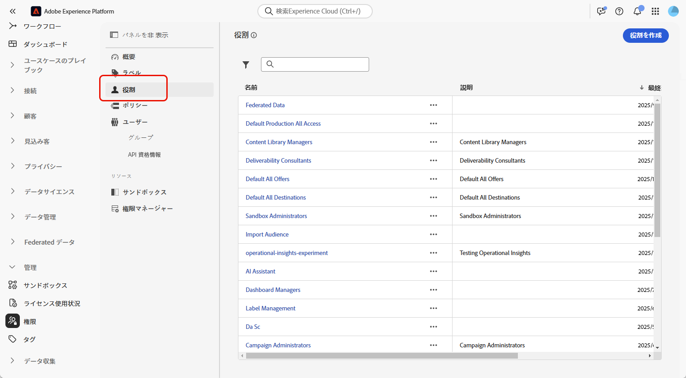
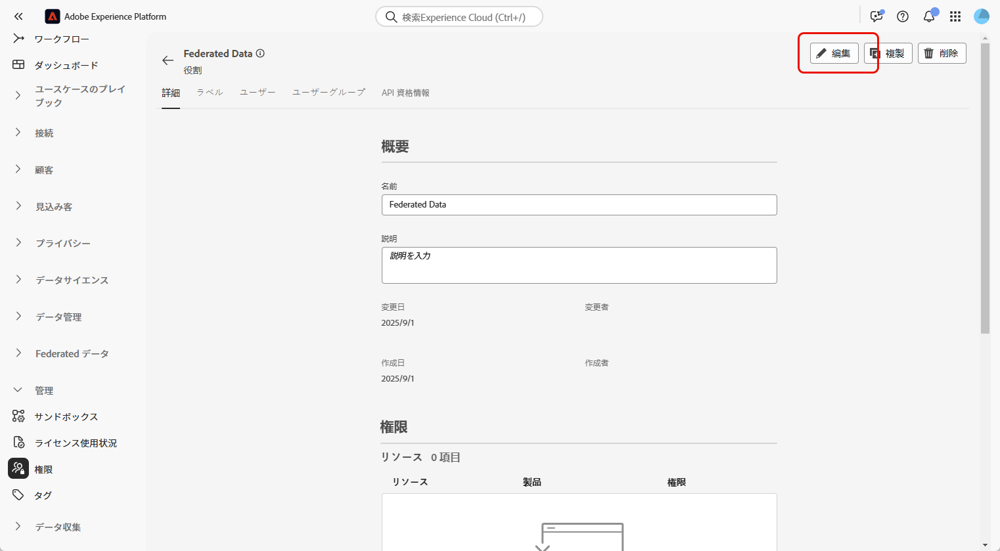
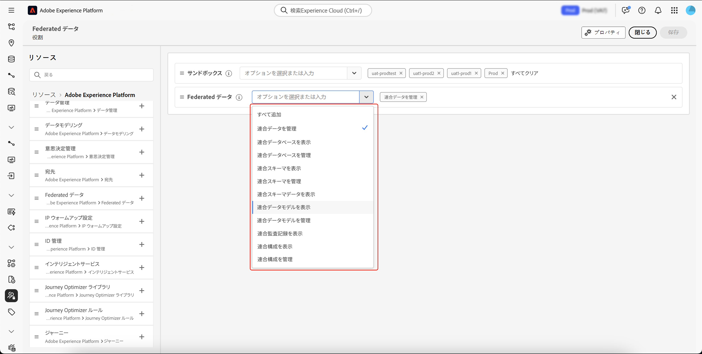
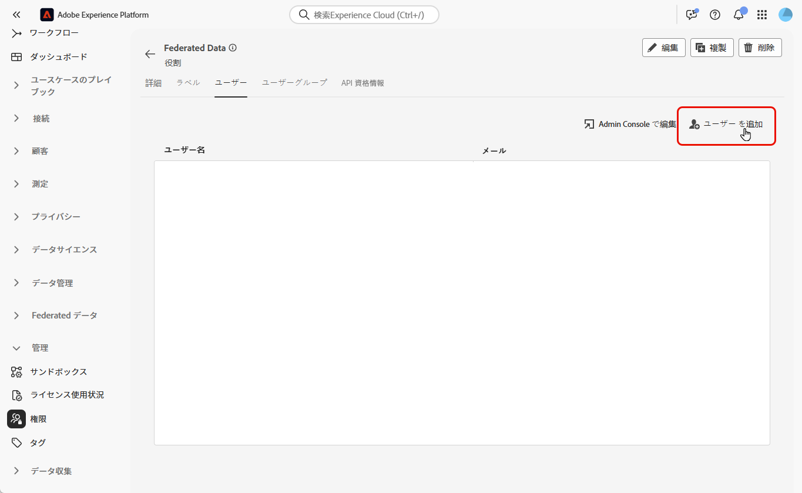

# 連合オーディエンス構成でのアクセス制御

アクセス制御を使用すると、サンドボックスおよび連合オーディエンス構成への役割ベースのアクセスを提供できます。

## サンドボックスへのアクセスの管理 {#access-sandboxes}

Adobe Experience Platform 連合オーディエンス構成を購入すると、この時点でアクティブになっているサンドボックスごとに製品プロファイルが作成されます。この製品プロファイルは、Admin Console の **Adobe Experience Platform** 製品カードの下に作成され、次の命名規則に従います。`ACP_FAC - <<SandboxName>> - admin.` 特定のサンドボックスの連合オーディエンス構成にアクセスするには、このサンドボックス用に作成された製品プロファイルにユーザーを追加する必要があります。

例えば、「fac-test」という名前の新しいサンドボックスをアクティブ化すると、対応する製品プロファイル「ACP_FAC - fac-test - admin」が作成されます。このサンドボックスで連合オーディエンス構成にアクセスするには、ユーザーをこの製品プロファイルに追加する必要があります。

## 連合オーディエンス構成へのアクセスの管理

連合オーディエンス構成の様々な側面へのアクセスに必要な権限を割り当てることで、アクセスを管理できます。これらの権限は、**連合オーディエンス構成**&#x200B;へのアクセスが必要なユーザーに対して役割を通じて割り当てられます。

>[!NOTE]
>
>他のユーザーに権限を割り当てることができるのは、管理者のみです。

1. **[!UICONTROL 権限]**&#x200B;メニューに移動します。
1. **[!UICONTROL 役割]**&#x200B;メニューから、更新する&#x200B;**[!UICONTROL 役割]**&#x200B;を選択します。

   

1. 「**[!UICONTROL 編集]**」を選択して、役割の権限を変更します。

   

1. ユーザーに必要な権限を追加します。連合オーディエンス構成へのアクセスに対して、次の権限を追加できます。

   | 権限 | 説明 |
   | ---------- | ----------- |
   | 連合データの管理 | この権限を使用して、連合オーディエンス構成のすべての側面を管理します。この権限には、連合データベースの管理、連合スキーマの管理、連合データモデルの管理、および連合構成の管理が含まれます。 |
   | 連合データベースの管理 | この権限を使用して、連合データベースへの接続を追加、表示、更新、削除します。 |
   | 連合データベースの表示 | この権限を使用して、連合データベースへの接続を表示します。 |
   | 連合スキーマの管理 | この権限を使用して、スキーマを作成、表示、更新、削除、更新します。 |
   | 連合スキーマデータの表示 | この権限を使用して、スキーマセクション内の「データ」タブを表示します。 |
   | 連合スキーマの表示 | この権限を使用して、スキーマテーブルを表示します。 |
   | 連合データモデルの管理 | この権限を使用して、データモデルを作成、表示、更新、削除します。 |
   | 連合データモデルの表示 | この権限を使用して、データモデルを表示します。 |
   | 連合監査記録の表示 | この権限を使用して、連合オーディエンス構成の監査記録を表示します。 |
   | 連合構成の管理 | この権限を使用して、連合構成を作成、表示、更新、削除します。 |
   | 連合構成の表示 | この権限を使用して、連合構成を表示します。 |

   

1. 必要な変更を行ったら、「**[!UICONTROL 保存]**」を選択します。

この役割に既に割り当てられているユーザーは、権限が自動的に更新され、連合オーディエンス構成にアクセスできます。

この役割を新しいユーザーに割り当てるには：

1. 役割ダッシュボード内の「**[!UICONTROL ユーザー]**」タブに移動し、「**[!UICONTROL ユーザーを追加]**」を選択します。

   

1. ユーザーの名前またはメールアドレスを入力するか、使用可能なリストから選択します。完了したら、「**[!UICONTROL 保存]**」を選択します。

または、必要な権限に応じて、既存の役割のいずれかをユーザーに割り当てることもできます。既存の役割をユーザーに割り当てる方法について詳しくは、[製品プロファイルのユーザー管理に関するガイド](https://experienceleague.adobe.com/ja/docs/experience-platform/access-control/ui/users)を参照してください。

| 役割名 | 権限 |
| --------- | ----------- |
| FAC データマネージャー | <ul><li>連合構成の管理</li><li>連合データベースの表示</li><li>連合スキーマの表示</li><li>連合スキーマデータの表示</li><li>連合データモデルの表示</li></ul> |
| FAC 構成マネージャー | <ul><li>連合構成の管理</li></ul> |
| FAC 管理者 | <ul><li>連合データの管理</li></ul> |

次に、ユーザーはインスタンスにアクセスする手順が記載されたメールを受信します。まだユーザーを作成していない場合は、[このドキュメント](https://experienceleague.adobe.com/ja/docs/experience-platform/access-control/abac/permissions-ui/users)を参照してください。

## 特定の構成へのアクセスの管理

アクセスラベルを適用することで、特定の構成へのアクセスを管理できます。

構成にアクセスラベルを適用する方法の詳細については、構成ガイドの[アクセスラベルの適用](/help/compositions/gs-compositions.md#access-labels)の節を参照してください。
