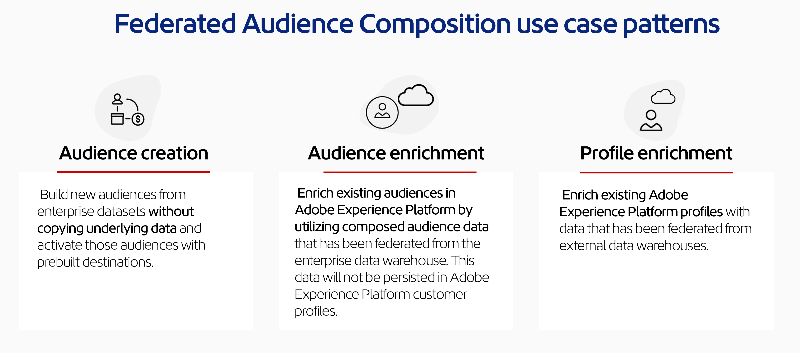

# 連合オーディエンス構成の概要

Federated Audience Compositionにより、サードパーティのデータウェアハウスからオーディエンスを構築および拡充し、そのオーディエンスをAdobe Experience Platformにインポートできます。 これにより、Adobe Real-Time Customer Data PlatformやAdobe Journey Optimizerなどのサービス内で企業のデータウェアハウスを直接接続し、データウェアハウスのテーブルに対してクエリを実行するための、使いやすい強力なソリューションが実現します。 これにより、Amazon RedshiftやAzure Synapse Analyticsなどのデータウェアハウスやクラウドストレージプラットフォームに保存されている顧客データにアクセスすることができます。

## 機能 {#rn-capabilities}

連合オーディエンス構成は、オーディエンスのキュレーションとアクティベーションに対する包括的なアプローチを用いて、Real-time CDP と Journey Optimizer の価値を拡張します。

* **重要なウェアハウスベースのデータセットへのアクセスを拡大して、価値の高いオーディエンスを作成する**：既存のデータウェアハウスを主要な記録システムとして使用すると同時に、クラス最高のアプリケーションを活用して優れた顧客体験を実現できます。

* **エンゲージメントのユースケースを強化するための包括的なサポート**：連合オーディエンス構成をReal-Time CDPまたはJourney Optimizerと組み合わせて使用することで、ブランド主導のパーソナライズされたエクスペリエンスを連合オーディエンスでサポートし、リアルタイムイベントによってトリガーされるリアルタイムのエクスペリエンスを、個人属性と組み合わせて提供して、チーム全体のユースケース要件を満たします。

* **データの移動と重複を最小限に抑える**：基礎となるデータをコピーせずに、エンタープライズデータウェアハウスにあるデータセットからオーディエンスを作成し、実用的なマーケティングプロファイルとオーディエンスを管理できます。

* **エクスペリエンス主導のワークフローに単一のシステムを活用**: Adobe Experience Platformで取り込まれたオーディエンスと連合オーディエンスの両方をキュレートし、あらゆるチャネルをまたいでアウトバウンドエクスペリエンスを調整できます。

* **マルチエディションのサポート**: B2CおよびB2B CDPのお客様は、Federated Audience Compositionを活用して、サポート対象のエンタープライズデータウェアハウスからのデータを統合することで、ピープルベースのオーディエンスを構築できます。 さらに、エンタープライズデータウェアハウスで利用可能な関連属性を組み込むことで、既存のExperience Platformの人物ベースのオーディエンスを強化し、よりパーソナライズされたエンゲージメントを実現するためにオーディエンスプロファイルを強化することができます。

## ユースケース {#use-cases}

連合オーディエンス構成では、オーディエンスの作成、オーディエンスエンリッチメント、顧客プロファイルエンリッチメントという **3 つ**&#x200B;のカテゴリのユースケースをサポートしています。

* **オーディエンスの作成**: データウェアハウスからオーディエンスを作成し、それらのオーディエンスをExperience Platformに統合して、マーケターが使いやすいドラッグ&amp;ドロップのユーザーインターフェイスを通じてReal-Time CDPまたはJourney Optimizerで使用できます。 その結果、基になる機密性の高いデータをコピーしたり、既存のデータを複製したりすることなく、データウェアハウスに対してクエリを実行できます。
   * **例：**&#x200B;ウェアハウス内のトランザクションデータ履歴を使用して、これらのトランザクションを Experience Platform にコピーすることなく、価値の高い過去の購入者のオーディエンスを作成します。

* **オーディエンスのエンリッチメント**: データウェアハウスのデータセットを追加し、そのデータとオーディエンスを重ね合わせることで、Experience Platformの既存のオーディエンスに詳細を追加できます。その際、データをExperience Platformにコピーする必要はありません。 オーディエンスエンリッチメントを使用すると、強化されたオーディエンスを用いて改善されたパーソナライゼーションを提供できます。
   * **例：**&#x200B;買い物かごを放棄したユーザーの Experience Platform オーディエンスを、価値の高い過去の購入者の連合オーディエンス構成オーディエンスで強化し、ターゲットを絞ったオファーを提供します。

* **プロファイルエンリッチメント**: データウェアハウスから個々の顧客属性を選択して、Experience Platform プロファイルを強化できます。 これらのプロファイルに連合データを追加すると、インバウンド顧客シグナルによってトリガーされる即時のエクスペリエンスをより強化できます。
   * **例：**&#x200B;連合オーディエンスからの情報を使用して、Experience Platform プロファイルを強化します。 価値の高い過去の購入者の連合オーディエンスに属するサイト訪問者に対して、サイト上での行動に基づいてトリガーされるターゲットオファーを使用してマーケティングできるようになりました。

{zoomable="yes"}{width="75%" align="center"}

連合オーディエンス構成のユースケースについて詳しくは、[連合オーディエンス構成のホワイトペーパー](https://business.adobe.com/resources/sdk/flexibly-access-enterprise-data-with-federated-audience-composition.html)を参照してください。

## 主な手順 {#gs-steps}

アドビの連合オーディエンス構成を使用すると、取り込みプロセスなしで、データベースから直接 Adobe Experience Platform オーディエンスを作成および更新できます。

<!--{zoomable="yes"}{width="85%" align="center"}-->

1. **接続を作成**：様々なソースからのデータを統合し、統合データセットに結合します。 Adobe Experience Platform アプリケーションをエンタープライズ データウェアハウスに接続する方法、サポートされているデータベースの使用方法、接続の設定について詳しくは、[接続の概要](./connections/home.md)を参照してください。

2. **データのモデル化**: データの構造、関係、制約を定義するスキーマとデータ モデルを設計および作成します。 スキーマについて詳しくは、[&#x200B; スキーマの概要](./data-modelling/schemas.md)を参照してください。 データモデルについて詳しくは、[&#x200B; データモデルの概要](./data-modelling/models.md)を参照してください。

3. **データの変換**: データ操作テクニックを適用して、データ要素の形式、構造、値を変更し、特定の分析やアプリケーションに互換性を持たせたり、適するようにします。

4. **オーディエンスを構成**: オーディエンスを作成、調整、構築します。 オーディエンスの作成について詳しくは、[&#x200B; コンポジションの概要](./compositions/home.md)を参照してください。 また、Adobe Experience Platform オーディエンスポータルと宛先を通じて、既存のオーディエンスを更新または再利用することもできます。 詳しくは、[このページ](./connections/destinations.md)を参照してください。

>[!NOTE]
>
>構成を実行すると、結果のオーディエンスが外部オーディエンスとして Adobe Experience Platform に保存され、Adobe Real-time Customer Data Platform や Adobe Journey Optimizer で使用できるようになります。 **オーディエンス** メニューからアクセスできるようになります。[詳細情報](https://experienceleague.adobe.com/ja/docs/experience-platform/segmentation/ui/audience-portal){target="_blank"}

## ガバナンス、プライバシー、セキュリティ {#governance-privacy-security}

### プライバシーリクエスト {#gov-privacy-requests}

構成を作成すると、結果として得られるオーディエンスは Adobe Experience Platform に保存されます。

その後、Adobe Experience Platform **Privacy Service** を通じて、これらのオーディエンスに対応するプロファイルデータにアクセスしたり、プロファイルデータを削除したりするプライバシーリクエストを行うことができます。このサービスでは、顧客データリクエストの管理に役立つ[ユーザーインターフェイス](https://experienceleague.adobe.com/docs/experience-platform/privacy/ui/user-guide.html?lang=ja){target="_blank"}と [RESTful API](https://experienceleague.adobe.com/ja/docs/experience-platform/privacy/api/overview){target="_blank"} を提供します。

>[!NOTE]
>
>Privacy Service について詳しくは、[Adobe Experience Platform ドキュメント](https://experienceleague.adobe.com/docs/experience-platform/privacy/home.html?lang=ja){target="_blank"}を参照してください。

Adobe 連合オーディエンス構成から顧客データにアクセスし、削除する個別のリクエストを作成および管理できます。 **アクセスリクエスト**&#x200B;および&#x200B;**削除リクエスト**&#x200B;を送信する手順について詳しくは、[リアルタイム顧客プロファイルドキュメント](https://experienceleague.adobe.com/ja/docs/experience-platform/profile/privacy){target="_blank"}を参照してください。

### 監査記録 {#gov-audit-trail}

監査証跡機能は、環境に対してリアルタイムで行われたすべてのアクションとイベントの詳細な記録と時系列の記録を提供します。 監査証跡について詳しくは、[監査証跡の概要](./admin/audit-trail.md)を参照してください。

## 詳細情報 {#learn}

<!-- Workflow + Workflow activities-->

連合オーディエンス構成、ガードレールおよび制限にアクセスする方法について詳しくは、[このページ](./start/access-prerequisites.md)を参照してください。

よくある質問に対する回答については、[Federated Audience Composition FAQ](./faq.md)を参照してください。

>[!CONTEXTUALHELP]
>id="dc_workflow_settings_execution"
>title="実行設定"
>abstract="このセクションでは、構成履歴を保持する日数など、ワークフローの実行に関連する設定を指定できます。"

>[!CONTEXTUALHELP]
>id="dc_orchestration_query_enrichment_noneditable"
>title="編集不可のアクティビティ"
>abstract="コンソールで「**クエリ**」アクティビティまたは「**エンリッチメント**」アクティビティに追加のデータを設定する際、エンリッチメントデータが考慮され、アウトバウンドトランジションに渡されますが、編集はできません。"

<!-- Create a link -->

>[!CONTEXTUALHELP]
>id="dc_federated_database_create_link"
>title="リンクの作成"
>abstract="リンク設定を定義します。"

<!-- incremental query IDs -->

>[!CONTEXTUALHELP]
>id="dc_orchestration_incrementalquery"
>title="増分クエリ"
>abstract="「**増分クエリ**」アクティビティを使用すると、クエリモデラーを使用してデータベースにクエリを実行できます。 このアクティビティが実行されるたびに、以前の実行結果が除外されます。 これにより、新しい要素だけをターゲットにすることができます。"

>[!CONTEXTUALHELP]
>id="dc_orchestration_incrementalquery_history"
>title="増分処理クエリ履歴"
>abstract="増分処理クエリ履歴"

>[!CONTEXTUALHELP]
>id="dc_orchestration_incrementalquery_processeddata"
>title="増分クエリの処理済みデータ"
>abstract="増分クエリの処理済みデータ"

>[!CONTEXTUALHELP]
>id="dc_orchestration_incrementalmode_standard"
>title="増分クエリモード"
>abstract="増分クエリを使用すると、新しい実行ごとに以前の実行結果を除外することで、同じクエリを複数回実行できます。"

>[!CONTEXTUALHELP]
>id="dc_orchestration_incrementalmode_custom"
>title="増分クエリモード"
>abstract="増分クエリを使用すると、日付フィールドが増分クエリアクティビティの最後の実行日以降である結果のみを考慮して、同じクエリを複数回実行できます。"

>[!CONTEXTUALHELP]
>id="dc_orchestration_build_audience_dimension"
>title="ターゲティングディメンションの選択"
>abstract="ターゲティングディメンションは、受信者、契約の受益者、オペレーター、サブスクライバーなど、ターゲットとする母集団を操作ごとに定義します。デフォルトでは、メールや SMS の場合、ターゲットは、「受信者」ビルトインテーブルから選択されます。 プッシュ通知の場合、デフォルトのターゲットディメンションはサブスクライバーのアプリケーションです。"

