# 最初のクエリの作成 {#build-query}

クエリの作成を開始するには、実行するアクションに応じて、選択した場所からクエリモデラーにアクセスします。クエリモデラーが開き、空白のキャンバスが表示されます。「**+**」ボタンをクリックして、クエリの最初のノードを設定します。

次の 2 種類の要素を追加できます。

* **フィルタリングコンポーネント** （カスタム条件、オーディエンスを選択）を使用すると、独自のルールを作成したり、オーディエンスを選択してクエリを絞り込んだりできます。 クエリの開始時および点線のトランジションに追加されます。[詳しくは、コンポーネントフィルタリングの操作方法を参照してください。](#filtering)

  例：*「スポーツ」ニュースレターを購読した受信者*。*ニューヨークに住む受信者*、*サンフランシスコに住む受信者*

  {zoomable="yes"}

* **グループ演算子**（AND、OR、EXCEPT）を使用すると、ダイアグラム内のフィルタリングコンポーネントをグループ化できます。フィルタリングコンポーネントの前の既存のトランジションに追加されます。[詳しくは、演算子の操作方法を参照してください。](#filtering)

  例：*「スポーツ」ニュースレターを購読した受信者&#x200B;**AND**ニューヨーク&#x200B;**OR**サンフランシスコに住む受信者*。

  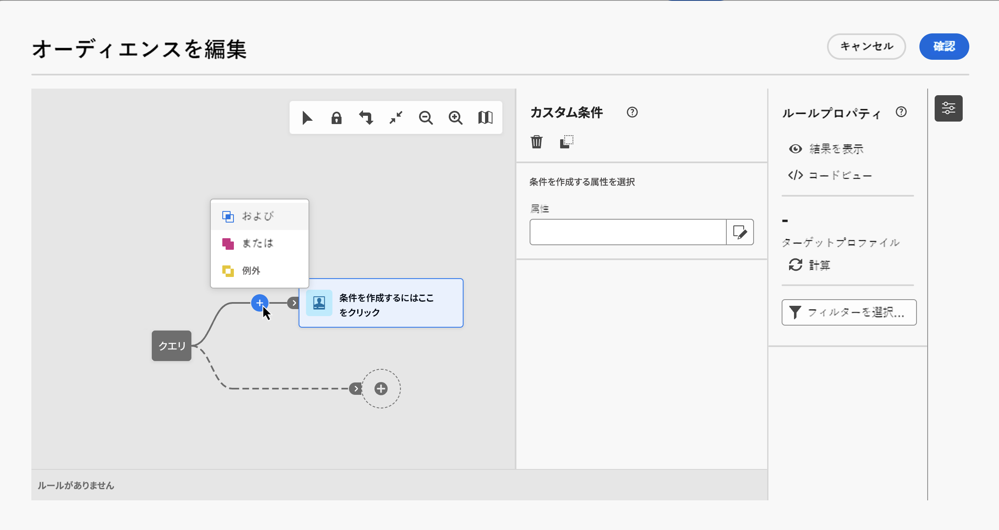{zoomable="yes"}

## フィルタリングコンポーネントの追加 {#filtering}

コンポーネントをフィルタリングすると、次を使用してクエリを絞り込むことができます。

* **[カスタム条件](#custom-condition)**：データベースの属性と高度な式を使用して独自の条件を作成し、クエリをフィルタリングします。
* **[オーディエンス](#audiences)**：既存のオーディエンスを使用してクエリをフィルタリングします。

### カスタム条件の設定 {#custom-condition}

>[!CONTEXTUALHELP]
>id="dc_orchestration_querymodeler_customcondition"
>title="カスタム条件"
>abstract="カスタム条件は、データベースの属性と高度な式を使用して独自の条件を作成し、クエリをフィルタリングできるフィルタリングコンポーネントです。"

カスタム条件を使用してクエリをフィルタリングするには、次の手順に従います。

1. 目的のノードの「**+**」ボタンをクリックし、「**[!UICONTROL カスタム条件]**」を選択します。右側にカスタム条件のプロパティパネルが開きます。

1. 「**属性**」フィールドで、条件の作成に活用するデータベースから属性を選択します。属性リストには、リンクされたテーブルの属性を含む、データベースのすべての属性が表示されます。

   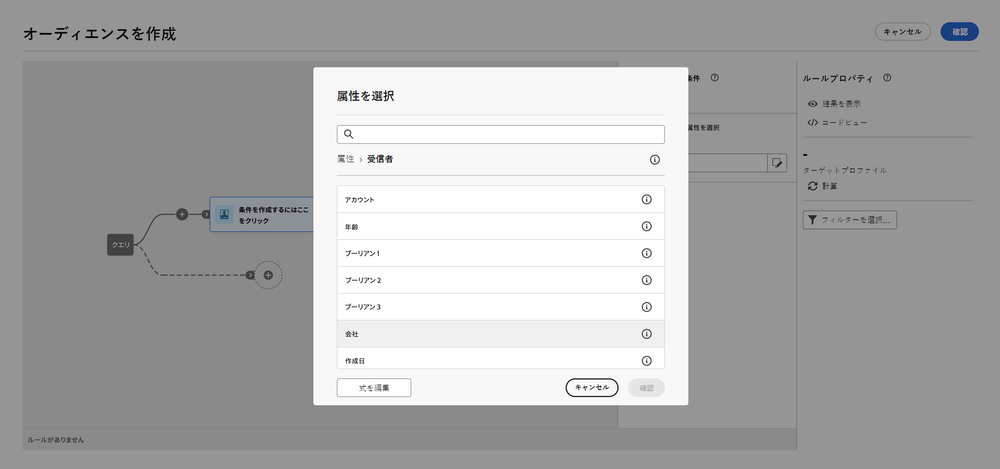{zoomable="yes"}

   >[!NOTE]
   >
   >「**式を編集**」ボタンを使用すると、式エディターを活用し、データベース関数とヘルパー関数のフィールドを使用して式を手動で定義できます。 [式の編集方法を学ぶ](expression-editor.md)

1. 適用する演算子をドロップダウンリストから選択します。様々な演算子が使用可能です。ドロップダウンリストで使用できる演算子は、属性のデータタイプによって異なります。

   +++使用可能な演算子のリスト

   | 演算子 | 目的 | 例 |
   |  ---  |  ---  |  ---  |
   | 次と等しい | 2 番目の「値」列に入力されたデータと同一の結果を返します。 | 姓（@lastName）が「佐藤」と等しいは、姓が佐藤の受信者のみを返します。 |
   | 次と等しくない | 入力された値と等しくないすべての値を返します。 | 言語（@language）が「英語」と等しくない。 |
   | 次より大きい | 入力された値より大きい値を返します。 | 年齢（@age）が 50 より大きい</strong>は、「50」より大きいすべての値（「51」、「52」など）を返します。 |
   | 次より小さい | 入力された値より小さい値を返します。 | 作成日（@created）が「DaysAgo(100)」より小さい</strong>は、過去 100 日以内に作成されたすべての受信者を返します。 |
   | 同じかそれ以上 | 入力された値より大きいか等しいすべての値を返します。 | 年齢（@age）が「30」よりも大きいか等しい</strong>は、30 歳以上のすべての受信者を返します。 |
   | 同じかそれ以下 | 入力された値より小さいか等しいすべての値を返します。 | 年齢（@age）が「60」よりも小さいか等しい</strong>は、60 歳以下のすべての受信者を返します。 |
   | 次に含まれる | 指定された値に含まれる結果を返します。これらの値はコンマで区切る必要があります。 | 生年月日（@birthDate）が「1979/12/10, 1984/12/10」に含まれる範囲は、これらの日付の間に生まれた受信者を返します。 |
   | 次に含まれない | 「次に含まれる」演算子と同様に機能します。ここでは、入力された値に基づいて受信者を除外します。 | 生年月日（@birthDate）が「1972/12/10, 1984/12/10」に含まれない。前の例とは異なり、これらの日付に生まれた受信者は返されません。 |
   | 空である | この場合、検索する結果は、2 番目の「値」列にある空の値と一致します。 | モバイル（@mobilePhone）が空であるは、モバイル番号がないすべての受信者を返します。 |
   | 空でない | 「空である」演算子の逆の機能です。2 番目の「値」列にあるデータを入力する必要はありません。 | メール（@email）は空でない。 |
   | 次で始まる | 入力された値で始まる結果を返します。 | アカウント番号（@account）が「32010」で始まる。 |
   | 次で始まらない | 入力された値で始まらない結果を返します。 | アカウント番号（@account）が「20」で始まらない。 |
   | 次を含む | 入力された値を含む結果を返します。 | メールドメイン（@domain）が「mail」を含む</strong>は、「mail」を含むすべてのドメイン名を返します。したがって、「gmail.com」ドメインも返されます。 |
   | 次を含まない | 入力された値を含まない結果を返します。 | メールドメイン（@domain）が「vo」を含まない</strong>。この場合、「vo」を含むドメイン名は返されません。結果には「voila.jp」ドメイン名は表示されません。 |
   | 類似 | 「次に類似」は、「次を含む」演算子とよく似ています。値に % ワイルドカード文字を挿入できます。 | 姓（@lastName）が「Jon%s」に類似している。ここでは、オペレーターが「n」と「s」の間の欠落している英数字を忘れたので、ワイルドカード文字が「Jones」という名前を検索するための「ジョーカー」として使用されています。 |
   | 次に類似しない | 「次に類似」は、「次を含む」演算子とよく似ています。値に % ワイルドカード文字を挿入できます。 | 姓（@lastName）が「Smi%h」に類似していない。この場合、姓が「Smi%h」の受信者は返されません。 |

+++

1. 「**値**」フィールドで、期待値を定義します。また、式エディターを利用して、データベース関数とヘルパー関数のフィールドを使用して、手動で式を定義することもできます。 それには、「**式を編集**」ボタンをクリックします。[詳しくは、式の編集方法を参照してください](expression-editor.md)

   *21 歳以上のすべてのプロファイルを返すクエリの例：*

   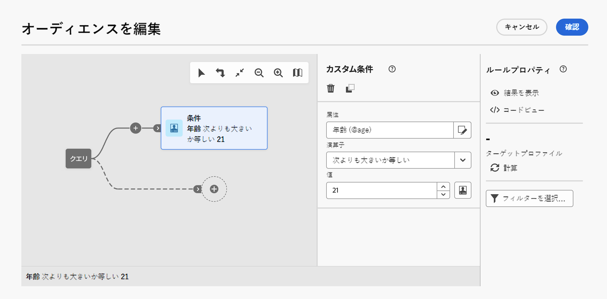{zoomable="yes"}

#### リンクされたテーブルのカスタム条件（1 対 1 および 1 対多リンク）{#links}

カスタム条件を使用すると、ルールで現在使用されているテーブルにリンクされたテーブルに対してクエリを実行できます。これには、1 対 1 の基数リンクを持つテーブルや、コレクションテーブル（1 対多リンク）が含まれます。

**1 対 1 リンク**&#x200B;の場合は、リンクされたテーブルに移動し、目的の属性を選択して、期待される値を定義します。

また、**値**&#x200B;ピッカーでテーブルリンクを直接選択して確認することもできます。その場合、次の例に示すように、専用のピッカーを使用して、選択したテーブルで使用可能な値を選択する必要があります。

+++クエリの例

ここでは、クエリは、ラベルが「実行中」であるブランドをターゲットにしています。

1. **ブランド**&#x200B;テーブル内に移動し、**ラベル**&#x200B;属性を選択します。

   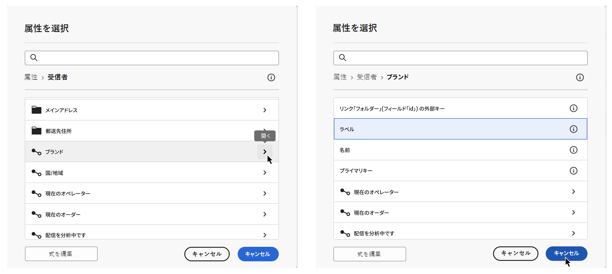{zoomable="yes"}{width="85%" align="center"}

1. 属性の期待値を定義します。

   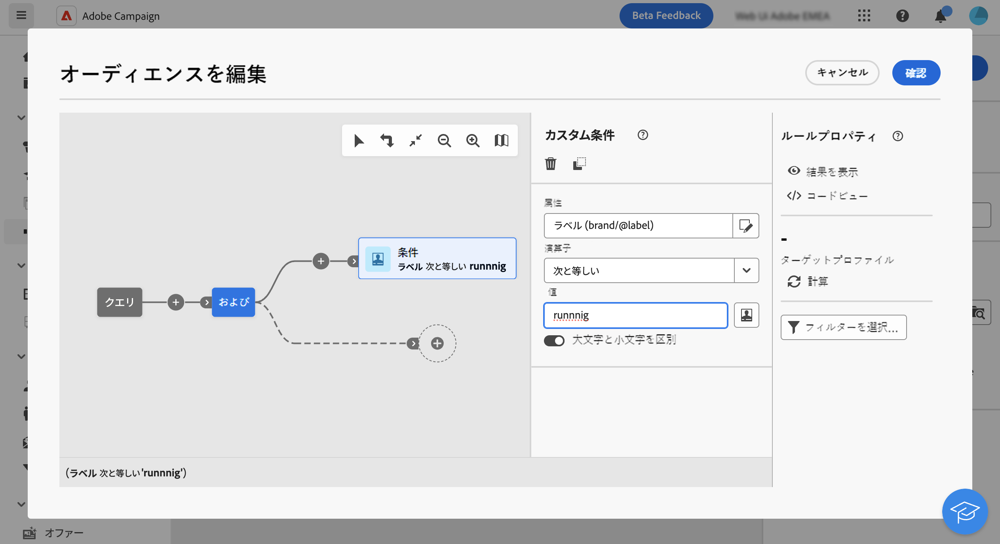{zoomable="yes"}{width="85%" align="center"}

テーブルリンクを直接選択したクエリのサンプルを以下に示します。このテーブルで使用可能な値は、専用のピッカーから選択する必要があります。

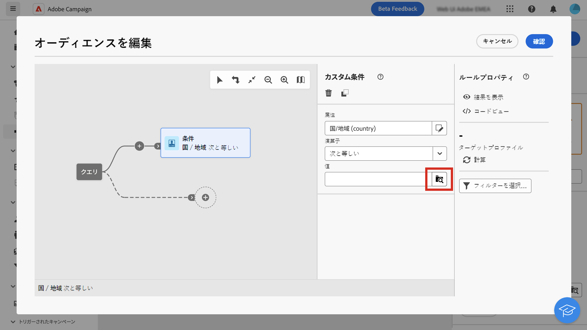{zoomable="yes"}{width="85%" align="center"}

+++

**1 対多リンク**&#x200B;の場合は、次の例に示すように、サブ条件を定義してクエリを絞り込むことができます。

+++クエリの例

ここでは、クエリは、BrewMaster 製品に関連する購入金額の合計が 100 ドル以上の受信者をターゲットにしています。

1. **購入**&#x200B;テーブルを選択し、確定します。

   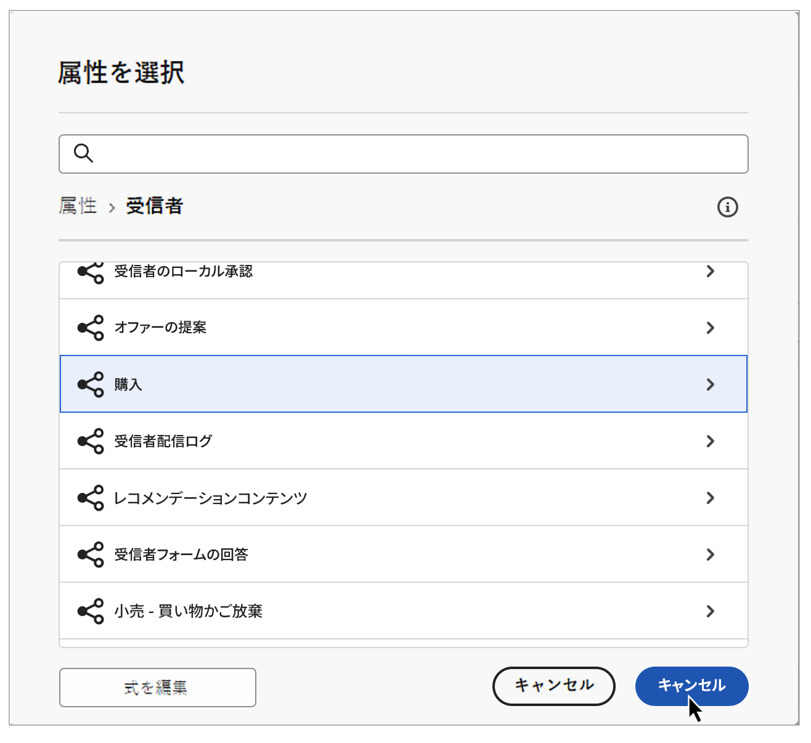{zoomable="yes"}{width="50%" align="center"}

1. アウトバウンドトランジションが追加され、サブ条件を作成できます。

   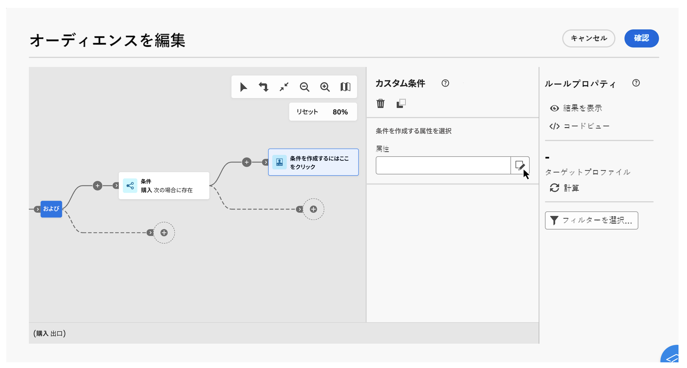{zoomable="yes"}{width="85%" align="center"}

1. **価格**&#x200B;属性を選択し、1,000 ドル以上の購入をターゲットにします

   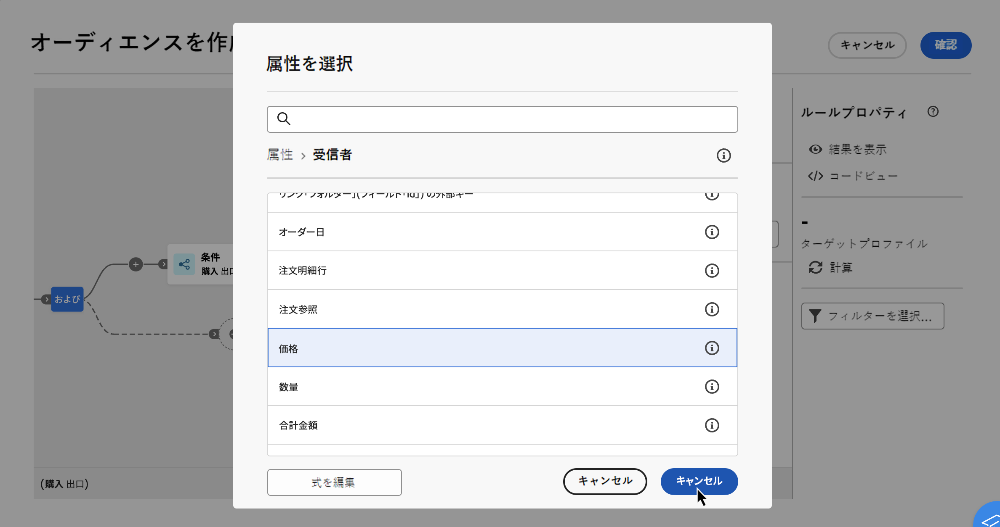{zoomable="yes"}{width="85%" align="center"}

1. ニーズに合わせてサブ条件を追加します。ここでは、BrewMaster 製品を購入したプロファイルをターゲットにする条件を追加しました。

   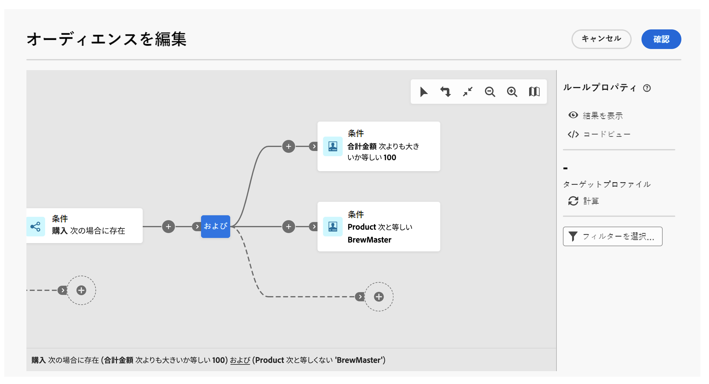{zoomable="yes"}{width="85%" align="center"}

+++

#### 集計データの操作 {#aggregate}

カスタム条件を使用すると、集計操作を実行できます。これを行うには、コレクション テーブルから属性を直接選択する必要があります。

1. 目的のコレクションテーブル内に移動し、集計操作を実行する属性を選択します。

   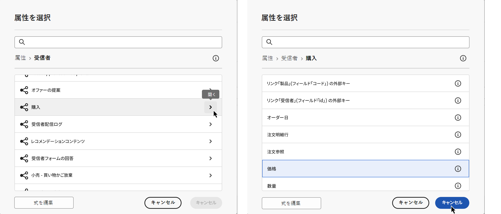{zoomable="yes"}{width="85%" align="center"}

1. プロパティパネルで、「**データを集計**」オプションの切替スイッチをオンにして、目的の集計関数を選択します。

   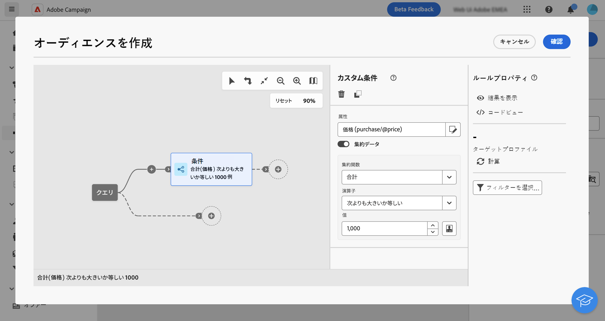{zoomable="yes"}{width="85%" align="center"}

### オーディエンスの選択 {#audiences}

>[!CONTEXTUALHELP]
>id="dc_orchestration_querymodeler_selectaudience"
>title="オーディエンスを選択"
>abstract="「**オーディエンスを選択**」オプションを使用すると、クエリのフィルタリングに使用するオーディエンスを選択できます。"

既存のオーディエンスを使用してクエリをフィルタリングするには、次の手順に従います。

1. 目的のノードの「**+**」ボタンをクリックし、「**[!UICONTROL オーディエンスを選択]**」を選択します。

1. **オーディエンスを選択**&#x200B;プロパティパネルが右側に開きます。クエリのフィルタリングに使用するオーディエンスを選択します。

   *「フェスティバル来場者」オーディエンスに属するすべてのプロファイルを返すクエリの例：*

   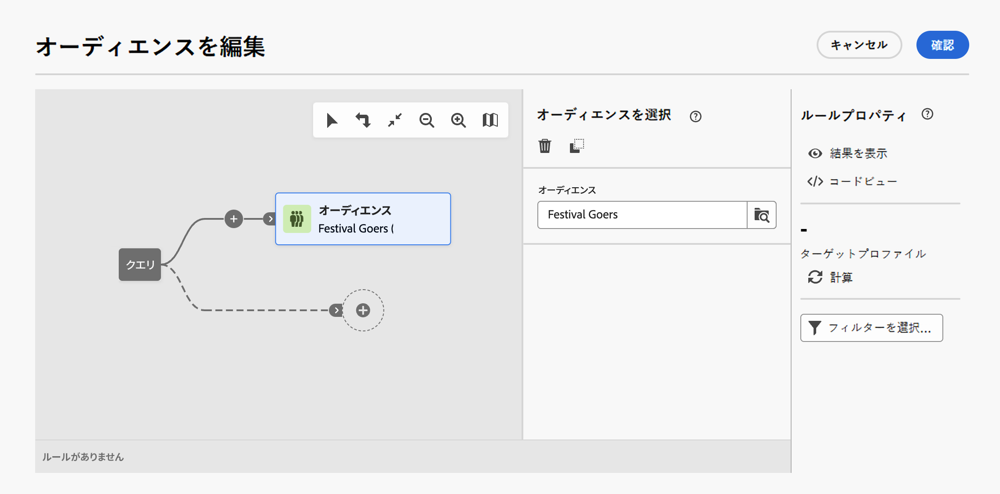{zoomable="yes"}

### 定義済みフィルターを使用 {#predefined-filters}

>[!CONTEXTUALHELP]
>id="dc_orchestration_querymodeler_predefinedfilter"
>title="定義済みフィルター"
>abstract="「**定義済みフィルター**」オプションを使用すると、カスタムフィルターのリストまたはお気に入りから定義済みフィルターを選択できます。"

定義済みフィルターを使用してクエリをフィルタリングするには、次の手順に従います。

1. 目的のノードの「**+**」ボタンをクリックし、「**[!UICONTROL 定義済みフィルター]**」を選択します。

1. **定義済みフィルター**&#x200B;プロパティパネルが右側に開きます。カスタムフィルターのリストまたはお気に入りから定義済みフィルターを選択します。

   *「非アクティブな顧客」定義済みフィルターに対応するすべてのプロファイルを返すクエリの例：*

   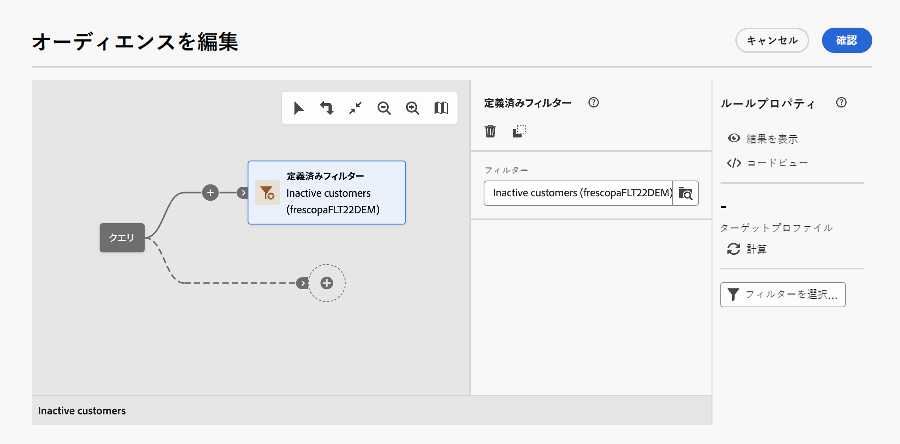{zoomable="yes"}

### コンポーネントのコピー＆ペースト {#copy}

クエリモデラーを使用すると、1 つまたは複数のフィルタリングコンポーネントをコピーし、トランジションの最後にペーストできます。この操作は、現在のクエリキャンバス内や、インスタンス内の任意のキャンバス内で実行できます。

>[!NOTE]
>
>コピーした選択は、インスタンスで操作している限り保持されます。ログオフして再度ログインすると、選択をペーストできなくなります。

フィルタリングコンポーネントをコピー＆ペーストするには、次の手順に従います。

1. コピーするフィルターコンポーネントをクエリキャンバス内でクリックして選択します。複数のコンポーネントを選択するには、キャンバスの右上隅にあるツールバーで使用可能な複数選択ツールを使用します。

1. コンポーネントのプロパティパネルで、または、複数のコンポーネントを選択した場合は、画面下部の青いリボンで「**[!UICONTROL コピー]**」ボタンをクリックします。

   | 単一のコンポーネントのコピー | 複数のコンポーネントのコピー |
   |  ---  |  ---  |
   | 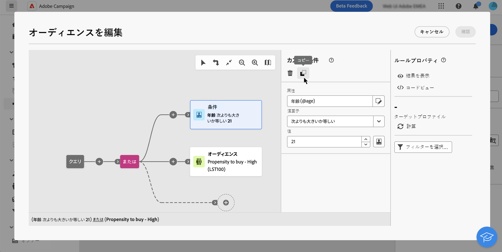{zoomable="yes"}{width="200" align="center" zoomable="yes"} | 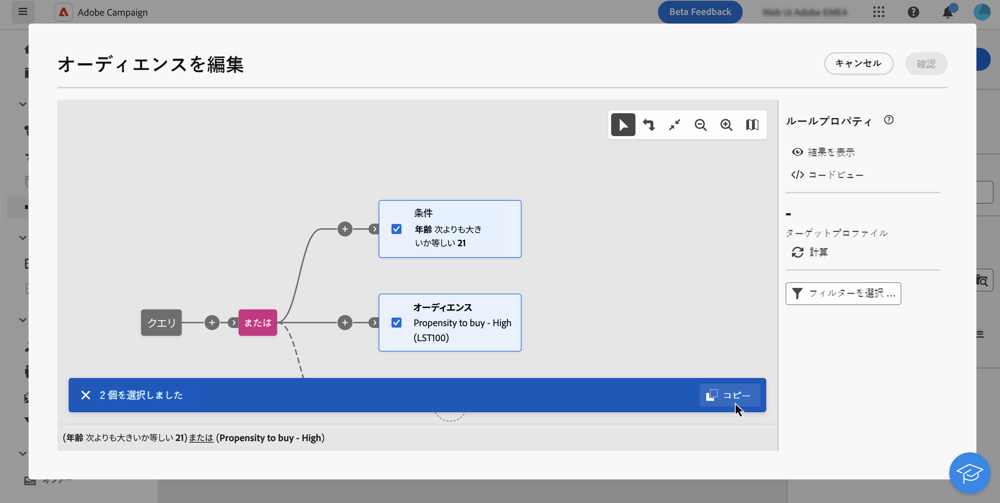{zoomable="yes"}{width="200" align="center" zoomable="yes"} |

1. コンポーネントをペーストするには、目的のトランジションの最後にある「+」ボタンをクリックし、「**n 個の項目をペースト**」を選択します。

   {zoomable="yes"}

## フィルタリングコンポーネントと演算子を結合 {#operators}

>[!CONTEXTUALHELP]
>id="dc_orchestration_querymodeler_group"
>title="グループ"
>abstract="このパネルでは、フィルター条件をリンクするために使用する演算子を変更できます。"

新しいフィルターコンポーネントをクエリに追加するたびに、**AND** 演算子によって他のコンポーネントに自動的にリンクされます。つまり、2 つのフィルタリングコンポーネントの結果が結合されます。

この例では、2 つ目のトランジションに新しいオーディエンスタイプのフィルタリングコンポーネントを追加しました。このコンポーネントは、**AND** 演算子を使用して定義済みフィルターの条件にリンクされています。つまり、クエリ結果には、「マドリード在住」の定義済みフィルターのターゲットであり、かつ「ディスカウントハンター」オーディエンスに属する受信者が含まれます。

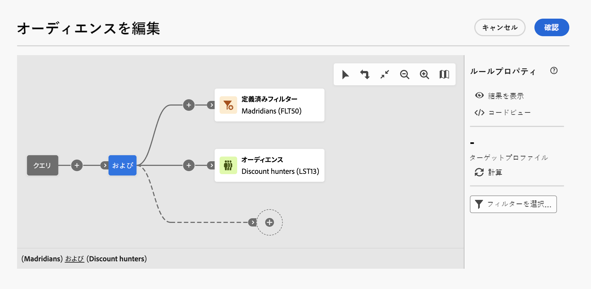{zoomable="yes"}

フィルタリング条件を相互にリンクするために使用する演算子を変更するには、この演算子をクリックし、右側に開く&#x200B;**グループ**&#x200B;パネルで目的の演算子を選択します。

使用可能な演算子を以下に示します。

* **AND（積集合）**：アウトバウンドトランジション内のすべてのフィルタリングコンポーネントと一致する結果を結合します。
* **OR（和集合）**：アウトバウンドトランジション内のフィルタリングコンポーネントの 1 つ以上と一致する結果が含まれます。
* **EXCEPT（除外）**：アウトバウンドトランジションのすべてのフィルタリングコンポーネントと一致する結果を除外します。

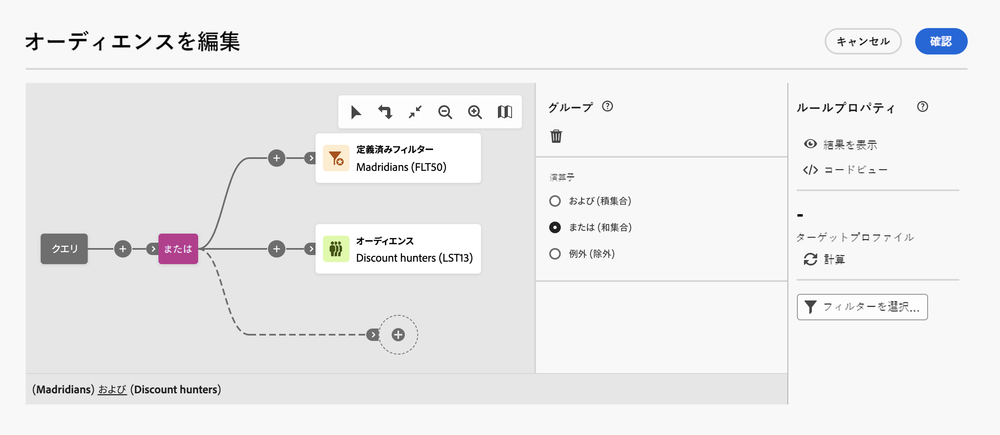{zoomable="yes"}

また、トランジションで「**+**」ボタンをクリックすると、コンポーネントの中間グループを作成できます。これにより、この特定の場所に演算子を追加して、複数のコンポーネントをグループ化し、クエリを絞り込むことができます。

次の例では、「報酬を受ける VIP」または「超 VIP」オーディエンスのいずれかからの結果を含める中間グループを作成しました。

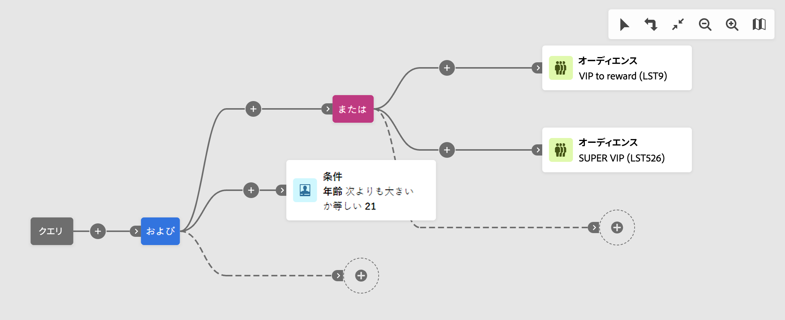{zoomable="yes"}

## クエリを確認および検証

>[!CONTEXTUALHELP]
>id="dc_orchestration_querymodeler_ruleproperties"
>title="ルールプロパティ"
>abstract="キャンバスでクエリを作成したら、右側にある&#x200B;**ルールプロパティ**&#x200B;パネルを使用してクエリを確認できます。 このパネルでは、結果のデータを表示し、クエリの SQL コードバージョンを取得し、ターゲットレコードの数を確認できます。 「**フィルターを選択または保存**」ボタンを使用すると、クエリを定義済みフィルターとして保存するか、キャンバスのコンテンツを既存のフィルターに置き換えることができます。"

キャンバスでクエリを作成したら、右側にある&#x200B;**ルールのプロパティ**&#x200B;パネルを使用してクエリを確認できます。このパネルは、オーディエンスを作成するクエリを作成する際に表示されます。使用可能な操作を以下に示します。

* **結果を表示：**&#x200B;クエリから生成されたデータを表示します。
* **コードビュー**：クエリのコードベースバージョンを SQL で表示します。
* **計算**：クエリのターゲットとなるレコードの数を更新および表示します。
* **フィルターを選択または保存**：キャンバスで使用する既存の定義済みフィルターを選択するか、後で再利用できるようにクエリを定義済みフィルターとして保存します。

  >[!IMPORTANT]
  >
  >ルールのプロパティパネルから定義済みフィルターを選択すると、キャンバスに作成されたクエリが選択したフィルターで置き換えられます。

クエリの準備が整ったら、右上隅にある「**[!UICONTROL 確認]**」ボタンをクリックして保存します。

クエリは、いつでも開いて変更できます。既存のクエリを開くと、「**+**」ボタンが表示されずに簡素化されたビューで表示されます。新しい要素をクエリに追加するには、キャンバス上でコンポーネントまたは演算子を選択して、「**+**」 ボタンを表示します。

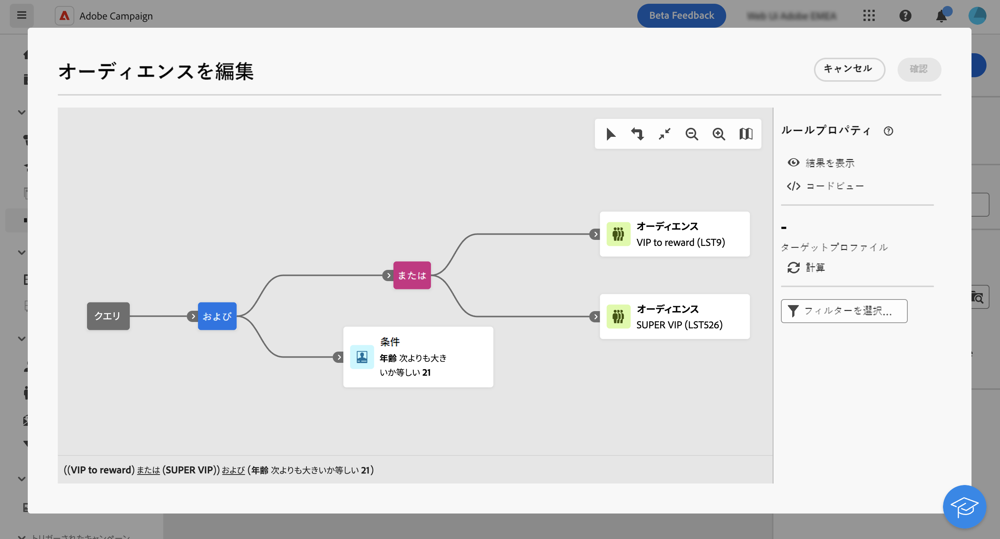{zoomable="yes"}
