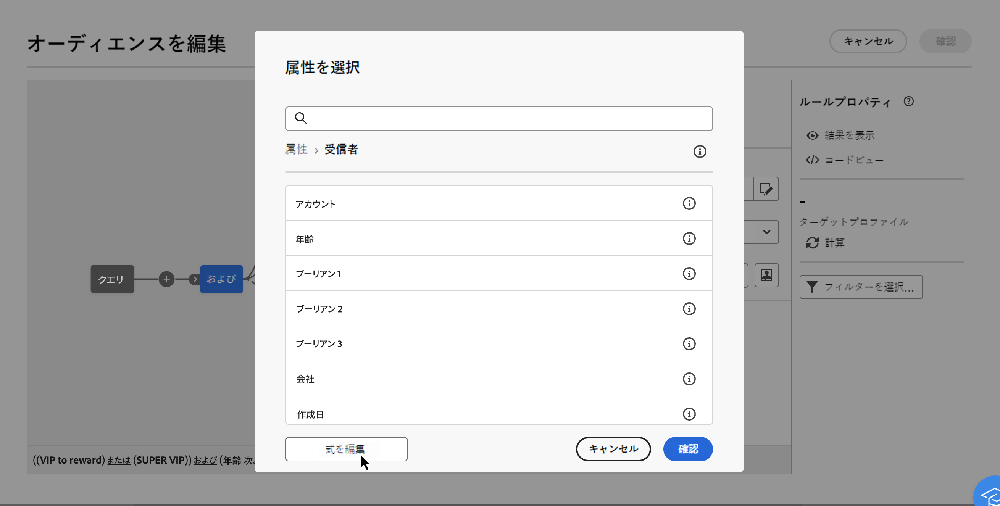
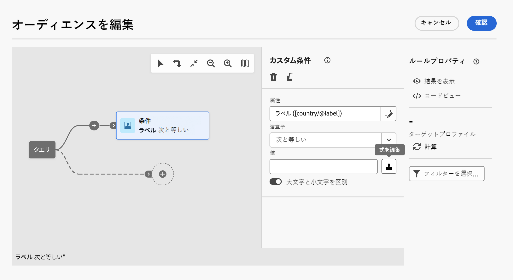
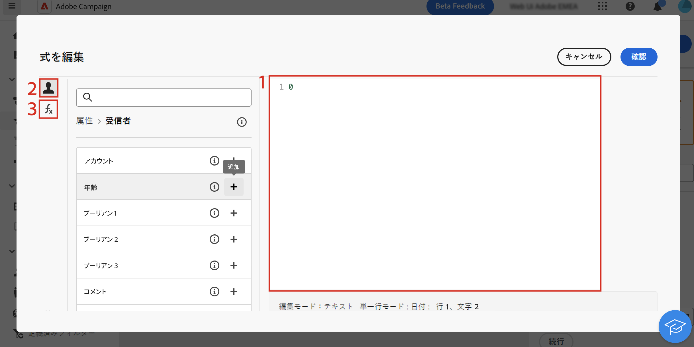
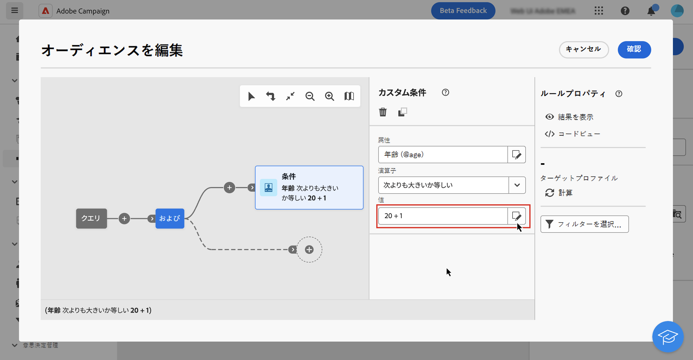

# 式エディターの概要 {#expression}

式を編集する場合は、条件を手動で入力してルールを作成します。このモードでは、日付、文字列、数値の各フィールドの操作や並べ替えなど、具体的なクエリの実行に使用する値を操作する高度な関数を使用できます。

## 式エディターの操作 {#edit}

式エディターは、クエリモデラーの「**[!UICONTROL 式を編集]**」ボタンから実行できます。このボタンは、カスタム条件を設定する際に「**[!UICONTROL 属性]**」フィールドと「**[!UICONTROL 値]**」フィールドで使用できます。

| 「**[!UICONTROL 属性]**」フィールドからのアクセス | 「**[!UICONTROL 値]**」フィールドからのアクセス |
|  ---  |  ---  |
| {zoomable="yes"}{width="200" align="center" zoomable="yes"} | {zoomable="yes"}{width="200" align="center" zoomable="yes"} |

式エディターには、次の内容があります。

* 式を定義するための&#x200B;**入力フィールド（1）**。
* 式で使用でき、クエリのスキーマ（ターゲティングディメンションとも呼ばれる）に対応する使用可能な&#x200B;**フィールド（2）**&#x200B;のリスト。
* カテゴリ別に並べ替えられる&#x200B;**ヘルパー関数（3）**。

式を編集するには、入力フィールドに式を直接入力します。フィールドまたはヘルパー関数を追加するには、式内の追加する場所にカーソルを置き、「+」ボタンを選択します。

{zoomable="yes"}

式の準備が整ったら、「**[!UICONTROL 確認]**」を選択します。式は、選択したフィールドに表示されます。編集するには、式エディターを開き、目的の変更を行います。

次の例は、「**[!UICONTROL 値]**」フィールドに設定された式を示しています。編集するには、「**[!UICONTROL 式を編集]**」ボタンを使用して式エディターを開く必要があります。

{zoomable="yes"}

## ヘルパー関数

クエリ編集ツールを使用すると、高度な関数を使用して、目的の結果や操作対象のデータのタイプに応じて複雑なフィルタリングを実行できます。次の関数を使用できます。

<!-- ### Aggregate

The aggregate functions are used to perform calculations on a set of values.

>[!BEGINTABS]

>[!TAB Google BigQuery]

| Name | Description | Syntax | Example |
| ---- | ----------- | ------ | ------- |
| **StdDev** | Returns the standard deviation of the values given. | StdDev(&lt;VALUE&gt;) | StdDev([0,3,5]) | -->

<!-- 

>[!TAB Databricks]

Aggregate functions are not available.

>[!TAB Fabric]

| Name | Description | Syntax | Example |
| ---- | ----------- | ------ | ------- |
| **StringAgg** | Returns the concatenation of the values of a string type column, separated by the character in the second argument | StringAgg(&lt;Value&gt;, &lt;String&gt;) | StringAgg(column, ",") |

>[!TAB Redshift]

Aggregate functions are not available. -->

<!-- 

>[!TAB Snowflake]

| Name | Description | Syntax | Example |
| ---- | ----------- | ------ | ------- |
| **StringAgg** | Returns the concatenation of the values of a string type column, separated by the character in the second argument | StringAgg(&lt;Value&gt;, &lt;String&gt;) | StringAgg(column, ",") | -->

<!-- 
>[!TAB Vertica]

Aggregate functions are not available. -->

<!-- 
>[!ENDTABS] 
-->

### 日付

日付関数は、日付や時刻の値を操作する場合に使用します。

>[!BEGINTABS]

>[!TAB Google BigQuery]

| 名前 | 説明 | 構文 | 例 |
| ---- | ----------- | ------ | ------- |
| **AddYears** | 指定された年数を指定された日時に加算します。 | AddYears(&lt;日時>, &lt;数値>) | AddYears(&quot;2019-12-25 15:30:00&quot;, 3) |
| **AddMonths** | 指定された月数を指定された日時に加算します。 | AddMonths(&lt;日時>, &lt;数値>) | AddMonths(&quot;2019-12-25 15:30:00&quot;, 6) |
| **AddDays** | 指定された日数を指定された日時に加算します。 | AddDays(&lt;日時>, &lt;数値>) | AddDays(&quot;2019-12-25 15:30:00&quot;, 10) |
| **AddHours** | 指定された時間数を指定された日時に加算します。 | AddHours(&lt;日時>, &lt;数値>) | AddHours(&quot;2019-12-25 15:30:00&quot;, 3) |
| **AddMinutes** | 指定された分数を指定された日時に加算します。 | AddMinutes(&lt;日時>, &lt;数値>) | AddMinutes(&quot;2019-12-25 15:30:00&quot;, 32) |
| **AddSeconds** | 指定された秒数を指定された日時に加算します。 | AddSeconds(&lt;日時>, &lt;数値>) | AddSeconds(&quot;2019-12-25 15:30:00&quot;, 37) |
| **SubYears** | 指定された年数を指定された日時に減算します。 | SubYears(&lt;日時>, &lt;数値>) | SubYears(&quot;2019-12-25 15:30:00&quot;, 3) |
| **SubMonths** | 指定された月数を指定された日時に減算します。 | SubMonths(&lt;日時>, &lt;数値>) | SubMonths(&quot;2019-12-25 15:30:00&quot;, 6) |
| **SubDays** | 指定された日数を指定された日時に減算します。 | SubDays(&lt;日時>, &lt;数値>) | SubDays(&quot;2019-12-25 15:30:00&quot;, 10) |
| **SubHours** | 指定された時間数を指定された日時に減算します。 | SubHours(&lt;日時>, &lt;数値>) | SubHours(&quot;2019-12-25 15:30:00&quot;, 3) |
| **SubMinutes** | 指定された分数を指定された日時に減算します。 | SubMinutes(&lt;日時>, &lt;数値>) | SubMinutes(&quot;2019-12-25 15:30:00&quot;, 32) |
| **SubSeconds** | 指定された秒数を指定された日時に減算します。 | SubSeconds(&lt;日時>, &lt;数値>) | SubSeconds(&quot;2019-12-25 15:30:00&quot;, 37) |
| **Year** | 指定された日時オブジェクトから年を抽出します。 | Year(&lt;日時>) | Year(&quot;2019-12-15 15:30:00&quot;) |
| **Month** | 指定された日時オブジェクトから月を抽出します。 | Month(&lt;日時>) | Month(&quot;2019-12-15 15:30:00&quot;) |
| **Day** | 指定された日時オブジェクトから日を抽出します。 | Day(&lt;日時>) | Day(&quot;2019-12-15 15:30:00&quot;) |
| **DayOfYear** | 指定された日時オブジェクトから年内の日を抽出します。 例えば、指定された日時が 2月2日（PT）である場合、33 が返されます。 | DayOfYear(&lt;日時>) | DayOfYear(&quot;2019-12-15 15:30:00&quot;) |
| **WeekDay** | 指定された日時オブジェクトから曜日を 0～6 の数値として抽出します。0 は日曜日を表します。 | Year(&lt;日時>) | Year(&quot;2019-12-15 15:30:00&quot;) |
| **Hour** | 指定された日時オブジェクトから時間の値を抽出します。 | Year(&lt;日時>) | Year(&quot;2019-12-15 15:30:00&quot;) |
| **Minute** | 指定された日時オブジェクトから分の値を抽出します。 | Year(&lt;日時>) | Year(&quot;2019-12-15 15:30:00&quot;) |
| **Second** | 指定された日時オブジェクトから 2 番目の値を抽出します。 | Year(&lt;日時>) | Year(&quot;2019-12-15 15:30:00&quot;) |
| **YearsDiff** | 指定された日時の違いを年の精度で検索します。 | YearsDiff(&lt;日時>, &lt;日時>) | YearsDiff(&quot;2019-12-25 15:30:00&quot;, &quot;2018-10-14 18:35:27&quot;) |
| **MonthsDiff** | 指定された日時の違いを月の精度で検索します。 | MonthsDiff(&lt;日時>, &lt;日時>) | MonthsDiff(&quot;2019-12-25 15:30:00&quot;, &quot;2018-10-14 18:35:27&quot;) |
| **DaysDiff** | 指定された日時の違いを日の精度で検索します。 | DaysDiff(&lt;日時>, &lt;日時>) | DaysDiff(&quot;2019-12-25 15:30:00&quot;, &quot;2018-10-14 18:35:27&quot;) |
| **HoursDiff** | 指定された日時の違いを時間の精度で検索します。 | HoursDiff(&lt;日時>, &lt;日時>) | HoursDiff(&quot;2019-12-25 15:30:00&quot;, &quot;2018-10-14 18:35:27&quot;) |
| **MinutesDiff** | 指定された日時の違いを分の精度で検索します。 | MinutesDiff(&lt;日時>, &lt;日時E>) | MinutesDiff(&quot;2019-12-25 15:30:00&quot;, &quot;2018-10-14 18:35:27&quot;) |
| **SecondsDiff** | 指定された日時の違いを秒の精度で検索します。 | SecondsDiff(&lt;日時>, &lt;日時>) | SecondsDiff(&quot;2019-12-25 15:30:00&quot;, &quot;2018-10-14 18:35:27&quot;) |
| **YearsOld** | 指定された日時と現在の違いを年の精度で検索します。 | YearsOld(&lt;日時>) | YearsOld(&quot;2019-12-25 15:30:00&quot;) |
| **MonthsOld** | 指定された日時と現在の違いを月の精度で検索します。 | MonthsOld(&lt;日時>) | MonthsOld(&quot;2019-12-25 15:30:00&quot;) |
| **DaysOld** | 指定された日時と現在の違いを日の精度で検索します。 | DaysOld(&lt;日時>) | DaysOld(&quot;2019-12-25 15:30:00&quot;) |
| **GetDate** | サーバーの現在の日付を取得します。 | GetDate() | GetDate() |
| **DateOnly** | 日時を年、月、日のみに切り捨てます。 | DateOnly(&lt;日時>) | DateOnly(&quot;2019-12-25 15:30:00&quot;) |
| **ToDate** | フィールドを日付フィールドに変換します。 | ToDate(&lt;日時>) | ToDate(&quot;2019-12-25 15:30:00&quot;) |
| **ToDateTime** | フィールドを日時フィールドに変換します。 | ToDateTime(&lt;日付>) | ToDateTime(&quot;2019-12-25 15:30:00&quot;) |
| **ToTimestamp** | フィールドをタイムスタンプフィールドに変換します。 | ToTimestamp(&lt;日時>) | ToTimestamp(&quot;2019-12-25 15:30:00&quot;) |
| **Oldest** | 指定された 2 つの日付間の最も古い日付を返します。 | Oldest(&lt;日時>, &lt;日時>) | Oldest(&quot;2015-02-13 11:59:59&quot;, &quot;2016-04-13 19:28:14&quot;) |
| **TruncDate** | 指定された数値に基づいて、日時を最も近い単位に切り捨てます。数値が 60 に等しい場合は、最も近い分に切り捨てられます。 数値が 3600 に等しい場合は、最も近い時間に切り捨てられます。数値が 86400 に等しい場合は、最も近い日に切り捨てられます。それ以外の場合は、最も近い秒に切り捨てられます。 | TruncDate(&lt;日時>, &lt;数値>) | TruncDate(&quot;2016-04-13 19:28:14&quot;, 3600) |
| **TruncDateTZ** | 指定された数値に基づいて、日時を最も近い単位に切り捨て、日時を指定されたタイムゾーンに設定します。数値が 60 に等しい場合は、最も近い分に切り捨てられます。 数値が 3600 に等しい場合は、最も近い時間に切り捨てられます。数値が 86400 に等しい場合は、最も近い日に切り捨てられます。 | TruncDateTZ(&lt;日時>, &lt;数値>, &lt;タイムゾーン>) | TruncDateTZ(&quot;2016-04-13 19:28:14&quot;, 3600, &quot;米国/ロサンゼルス&quot;) |
| **TruncTime** | 日時を 2000年1月1日（PT）に設定し、指定された数値に基づいて、残りの日時を最も近い単位に丸めます。数値が 60 に等しい場合は、最も近い分に切り捨てられます。数値が 3600 に等しい場合は、最も近い時間に切り捨てられます。 | TruncTime(&lt;日時>, &lt;数値>) | TruncTime(&quot;2016-04-13 19:28:14&quot;, 3600) |
| **TruncQuarter** | 日時を最も近い四半期の最初の日付に切り捨てます。 | TruncQuarter(&lt;日時>) | TruncQuarter(&quot;2016-04-13 19:28:14&quot;) |
| **TruncYear** | 日時を最も近い年の最初の日付に切り捨てます。 | TruncYear(&lt;日時>) | TruncYear(&quot;2016-04-13 19:28:14&quot;) |
| **TruncWeek** | 日時を最も近い週の日曜日に切り捨てます。 | TruncWeek(&lt;日時>) | TruncWeek(&quot;2016-04-13 19:28:14&quot;) |

<!-- 
| **YearAndMonth** | Truncates the datetime to just the year and month. | YearAndMonth(&lt;DATETIME&gt;) | YearAndMonth("2019-12-25 15:30:00") | 
-->

<!-- | **DaysAgo** | Calculates the number of days between the current date and the provided timestamp, and returns the value as a datetime. | DaysAgo(&lt;DATETIME&gt;) | DaysAgo("2024-06-24 14:43:49") |
| **DaysAgoInt** | Calculates the number of days between the current date and the provided timestamp, and returns the value as an integer. | DaysAgoInt(&lt;DATETIME&gt;) | DaysAgoInt("2024-06-24 14:43:49") |
| **MonthsAgo** | Calculates the number of months between the current date and the provided timestamp, and returns the value as a datetime. | MonthsAgo(&lt;DATETIME&gt;) | MonthsAgo("2024-06-24 14:43:49") |
| **YearsAgo** | Calculates the number of years between the current date and the provided timestamp, and returns the value as a datetime. | YearsAgo(&lt;DATETIME&gt;) | YearsAgo("2024-06-24 14:43:49") | -->

<!-- 
>[!TAB Databricks]

| Name | Description | Syntax | Example |
| ---- | ----------- | ------ | ------- |
| **AddYears** | Adds the specified number of years to the provided datetime. | AddYears(&lt;DATETIME&gt;, &lt;NUMBER&gt;) | AddYears("2019-12-25 15:30:00", 3) |
| **AddMonths** | Adds the specified number of months to the provided datetime. | AddMonths(&lt;DATETIME&gt;, &lt;NUMBER&gt;) | AddMonths("2019-12-25 15:30:00", 6) |
| **AddDays** | Adds the specified number of days to the provided datetime. | AddDays(&lt;DATETIME&gt;, &lt;NUMBER&gt;) | AddDays("2019-12-25 15:30:00", 10) |
| **AddHours** | Adds the specified number of hours to the provided datetime. | AddHours(&lt;DATETIME&gt;, &lt;NUMBER&gt;) | AddHours("2019-12-25 15:30:00", 3) |
| **AddMinutes** | Adds the specified number of minutes to the provided datetime. | AddMinutes(&lt;DATETIME&gt;, &lt;NUMBER&gt;) | AddMinutes("2019-12-25 15:30:00", 32) |
| **AddSeconds** | Adds the specified number of seconds to the provided datetime. | AddSeconds(&lt;DATETIME&gt;, &lt;NUMBER&gt;) | AddSeconds("2019-12-25 15:30:00", 37) |
| **SubYears** | Subtracts the specified number of years to the provided datetime. | SubYears(&lt;DATETIME&gt;, &lt;NUMBER&gt;) | SubYears("2019-12-25 15:30:00", 3) |
| **SubMonths** | Adds the specified number of months to the provided datetime. | SubMonths(&lt;DATETIME&gt;, &lt;NUMBER&gt;) | SubMonths("2019-12-25 15:30:00", 6) |
| **SubDays** | Adds the specified number of days to the provided datetime. | SubDays(&lt;DATETIME&gt;, &lt;NUMBER&gt;) | SubDays("2019-12-25 15:30:00", 10) |
| **SubHours** | Adds the specified number of hours to the provided datetime. | SubHours(&lt;DATETIME&gt;, &lt;NUMBER&gt;) | SubHours("2019-12-25 15:30:00", 3) |
| **SubMinutes** | Adds the specified number of minutes to the provided datetime. | SubMinutes(&lt;DATETIME&gt;, &lt;NUMBER&gt;) | SubMinutes("2019-12-25 15:30:00", 32) |
| **SubSeconds** | Adds the specified number of seconds to the provided datetime. | SubSeconds(&lt;DATETIME&gt;, &lt;NUMBER&gt;) | SubSeconds("2019-12-25 15:30:00", 37) |
| **Year** | Extracts the year from the given datetime object. | Year(&lt;DATETIME&gt;) | Year("2019-12-15 15:30:00") |
| **Month** | Extracts the month from the given datetime object. | Month(&lt;DATETIME&gt;) | Month("2019-12-15 15:30:00") |
| **Day** | Extracts the day from the given datetime object. | Day(&lt;DATETIME&gt;) | Day("2019-12-15 15:30:00") |
| **DayOfYear** | Extracts the day of year from the given datetime object. For example, if the provided datetime is February 2nd, it would return 33. | DayOfYear(&lt;DATETIME&gt;) | DayOfYear("2019-12-15 15:30:00") |
| **WeekDay** | Extracts the day of the week from the given datetime object, as a number from 1 to 7, with 1 representing Sunday. | Year(&lt;DATETIME&gt;) | Year("2019-12-15 15:30:00") |
| **Hour** | Extracts the hour value from the given datetime object. | Year(&lt;DATETIME&gt;) | Year("2019-12-15 15:30:00") |
| **Minute** | Extracts the minute value from the given datetime object. | Year(&lt;DATETIME&gt;) | Year("2019-12-15 15:30:00") |
| **Second** | Extracts the second value from the given datetime object. | Year(&lt;DATETIME&gt;) | Year("2019-12-15 15:30:00") |
| **YearsDiff** | Finds the difference between the given datetimes, with a granularity of years. | YearsDiff(&lt;DATETIME&gt;, &lt;DATETIME&gt;) | YearsDiff("2019-12-25 15:30:00", "2018-10-14 18:35:27") |
| **MonthsDiff** | Finds the difference between the given datetimes, with a granularity of months. | MonthsDiff(&lt;DATETIME&gt;, &lt;DATETIME&gt;) | MonthsDiff("2019-12-25 15:30:00", "2018-10-14 18:35:27") |
| **DaysDiff** | Finds the difference between the given datetimes, with a granularity of days. | DaysDiff(&lt;DATETIME&gt;, &lt;DATETIME&gt;) | DaysDiff("2019-12-25 15:30:00", "2018-10-14 18:35:27") |
| **HoursDiff** | Finds the difference between the given datetimes, with a granularity of hours. | HoursDiff(&lt;DATETIME&gt;, &lt;DATETIME&gt;) | HoursDiff("2019-12-25 15:30:00", "2018-10-14 18:35:27") |
| **MinutesDiff** | Finds the difference between the given datetimes, with a granularity of minutes. | MinutesDiff(&lt;DATETIME&gt;, &lt;DATETIME&gt;) | MinutesDiff("2019-12-25 15:30:00", "2018-10-14 18:35:27") |
| **SecondsDiff** | Finds the difference between the given datetimes, with a granularity of seconds. | SecondsDiff(&lt;DATETIME&gt;, &lt;DATETIME&gt;) | SecondsDiff("2019-12-25 15:30:00", "2018-10-14 18:35:27") |
| **YearsOld** | Finds the difference between the given datetime and the present, with a granularity of years. | YearsOld(&lt;DATETIME&gt;) | YearsOld("2019-12-25 15:30:00") |
| **MonthsOld** | Finds the difference between the given datetime and the present, with a granularity of months. | MonthsOld(&lt;DATETIME&gt;) | MonthsOld("2019-12-25 15:30:00") |
| **DaysOld** | Finds the difference between the given datetime and the present, with a granularity of days. | DaysOld(&lt;DATETIME&gt;) | DaysOld("2019-12-25 15:30:00") |
| **DaysAgo** | Calculates the number of days between the current date and the provided timestamp, and returns the value as a datetime. | DaysAgo(&lt;DATETIME&gt;) | DaysAgo("2024-06-24 14:43:49") |
| **DaysAgoInt** | Calculates the number of days between the current date and the provided timestamp, and returns the value as an integer. | DaysAgoInt(&lt;DATETIME&gt;) | DaysAgoInt("2024-06-24 14:43:49") |
| **MonthsAgo** | Calculates the number of months between the current date and the provided timestamp, and returns the value as a datetime. | MonthsAgo(&lt;DATETIME&gt;) | MonthsAgo("2024-06-24 14:43:49") |
| **ToDateTime** | Converts the field to a datetime field. | ToDateTime(&lt;DATE&gt;) | ToDateTime("2019-12-25 15:30:00") |
| **ToTimestamp** | Converts the field to a timestamp field. | ToTimestamp(&lt;DATETIME&gt;) | ToTimestamp("2019-12-25 15:30:00") |
| **GetDate** | Get the current date of the server. | GetDate() | GetDate() |
| **DateOnly** | Truncates the datetime to just the year, month, and day. | DateOnly(&lt;DATETIME&gt;) | DateOnly("2019-12-25 15:30:00") |
| **ToDate** | Converts the field to a date field. | ToDate(&lt;DATETIME&gt;) | ToDate("2019-12-25 15:30:00") |
| **YearAndMonth** | Truncates the datetime to just the year and month. | YearAndMonth(&lt;DATETIME&gt;) | YearAndMonth("2019-12-25 15:30:00") |
| **Oldest** | Returns the oldest date between the two provided. | Oldest(&lt;DATETIME&gt;, &lt;DATETIME&gt;) | Oldest("2015-02-13 11:59:59", "2016-04-13 19:28:14") |
| **TruncDate** | Truncates the datetime to the nearest unit, based on the numerical value given. If the numeric value is equal to 60, it truncates to the nearest minute. If the numeric value is equal to 3600, it truncates to the nearest hour. If the numeric value is equal to 86400, it truncates to the nearest day. Otherwise, it truncates to the nearest second. | TruncDate(&lt;DATETIME&gt;, &lt;NUMBER&gt;) | TruncDate("2016-04-13 19:28:14", 3600) |
| **TruncDateTZ** | Truncates the datetime to the nearest unit, based on the numerical value given, and sets the datetime to the specified timezone. If the numeric value is equal to 60, it truncates to the nearest minute. If the numeric value is equal to 3600, it truncates to the nearest hour. If the numeric value is equal to 86400, it truncates to the nearest day. | TruncDateTZ(&lt;DATETIME&gt;, &lt;NUMBER&gt;, &lt;TIMEZONE&gt;) | TruncDateTZ("2016-04-13 19:28:14", 3600, "America/Los_Angeles") |
| **TruncTime** | Sets the datetime to January 1st, 2000 and rounds the rest of the datetime to the nearest unit, based on the numerical value given.If the numeric value is equal to 60, it truncates to the nearest minute. If the numeric value is equal to 3600, it truncates to the nearest hour. | TruncTime(&lt;DATETIME&gt;, &lt;NUMBER&gt;) | TruncTime("2016-04-13 19:28:14", 3600) |
| **TruncQuarter** | Truncates the datetime to the first date in the nearest quarter. | TruncQuarter(&lt;DATETIME&gt;) | TruncQuarter("2016-04-13 19:28:14") |
| **TruncYear** | Truncates the datetime to the first date in the nearest year. | TruncYear(&lt;DATETIME&gt;) | TruncYear("2016-04-13 19:28:14") |
| **TruncWeek** | Truncates the datetime to the Sunday of the nearest week. | TruncWeek(&lt;DATETIME&gt;) | TruncWeek("2016-04-13 19:28:14") |

>[!TAB Fabric]

| Name | Description | Syntax | Example |
| ---- | ----------- | ------ | ------- |
| **AddYears** | Adds the specified number of years to the provided datetime. | AddYears(&lt;DATETIME&gt;, &lt;NUMBER&gt;) | AddYears("2019-12-25 15:30:00", 3) |
| **AddMonths** | Adds the specified number of months to the provided datetime. | AddMonths(&lt;DATETIME&gt;, &lt;NUMBER&gt;) | AddMonths("2019-12-25 15:30:00", 6) |
| **AddDays** | Adds the specified number of days to the provided datetime. | AddDays(&lt;DATETIME&gt;, &lt;NUMBER&gt;) | AddDays("2019-12-25 15:30:00", 10) |
| **AddHours** | Adds the specified number of hours to the provided datetime. | AddHours(&lt;DATETIME&gt;, &lt;NUMBER&gt;) | AddHours("2019-12-25 15:30:00", 3) |
| **AddMinutes** | Adds the specified number of minutes to the provided datetime. | AddMinutes(&lt;DATETIME&gt;, &lt;NUMBER&gt;) | AddMinutes("2019-12-25 15:30:00", 32) |
| **AddSeconds** | Adds the specified number of seconds to the provided datetime. | AddSeconds(&lt;DATETIME&gt;, &lt;NUMBER&gt;) | AddSeconds("2019-12-25 15:30:00", 37) |
| **SubYears** | Subtracts the specified number of years to the provided datetime. | SubYears(&lt;DATETIME&gt;, &lt;NUMBER&gt;) | SubYears("2019-12-25 15:30:00", 3) |
| **SubMonths** | Adds the specified number of months to the provided datetime. | SubMonths(&lt;DATETIME&gt;, &lt;NUMBER&gt;) | SubMonths("2019-12-25 15:30:00", 6) |
| **SubDays** | Adds the specified number of days to the provided datetime. | SubDays(&lt;DATETIME&gt;, &lt;NUMBER&gt;) | SubDays("2019-12-25 15:30:00", 10) |
| **SubHours** | Adds the specified number of hours to the provided datetime. | SubHours(&lt;DATETIME&gt;, &lt;NUMBER&gt;) | SubHours("2019-12-25 15:30:00", 3) |
| **SubMinutes** | Adds the specified number of minutes to the provided datetime. | SubMinutes(&lt;DATETIME&gt;, &lt;NUMBER&gt;) | SubMinutes("2019-12-25 15:30:00", 32) |
| **SubSeconds** | Adds the specified number of seconds to the provided datetime. | SubSeconds(&lt;DATETIME&gt;, &lt;NUMBER&gt;) | SubSeconds("2019-12-25 15:30:00", 37) |
| **DayOfYear** | Extracts the day of year from the given datetime object. For example, if the provided datetime is February 2nd, it would return 33. | DayOfYear(&lt;DATETIME&gt;) | DayOfYear("2019-12-15 15:30:00") |
| **DateOnly** | Truncates the datetime to just the year, month, and day. | DateOnly(&lt;DATETIME&gt;) | DateOnly("2019-12-25 15:30:00") |
| **YearsOld** | Finds the difference between the given datetime and the present, with a granularity of years. | YearsOld(&lt;DATETIME&gt;) | YearsOld("2019-12-25 15:30:00") |
| **YearsDiff** | Finds the difference between the given datetimes, with a granularity of years. | YearsDiff(&lt;DATETIME&gt;, &lt;DATETIME&gt;) | YearsDiff("2019-12-25 15:30:00", "2018-10-14 18:35:27") |
| **MonthsDiff** | Finds the difference between the given datetimes, with a granularity of months. | MonthsDiff(&lt;DATETIME&gt;, &lt;DATETIME&gt;) | MonthsDiff("2019-12-25 15:30:00", "2018-10-14 18:35:27") |
| **DaysDiff** | Finds the difference between the given datetimes, with a granularity of days. | DaysDiff(&lt;DATETIME&gt;, &lt;DATETIME&gt;) | DaysDiff("2019-12-25 15:30:00", "2018-10-14 18:35:27") |
| **HoursDiff** | Finds the difference between the given datetimes, with a granularity of hours. | HoursDiff(&lt;DATETIME&gt;, &lt;DATETIME&gt;) | HoursDiff("2019-12-25 15:30:00", "2018-10-14 18:35:27") |
| **MinutesDiff** | Finds the difference between the given datetimes, with a granularity of minutes. | MinutesDiff(&lt;DATETIME&gt;, &lt;DATETIME&gt;) | MinutesDiff("2019-12-25 15:30:00", "2018-10-14 18:35:27") |
| **SecondsDiff** | Finds the difference between the given datetimes, with a granularity of seconds. | SecondsDiff(&lt;DATETIME&gt;, &lt;DATETIME&gt;) | SecondsDiff("2019-12-25 15:30:00", "2018-10-14 18:35:27") |
| **WeekDay** | Extracts the day of the week from the given datetime object, as a number from 1 to 7, with 1 representing Sunday. | Year(&lt;DATETIME&gt;) | Year("2019-12-15 15:30:00") |
| **Hour** | Extracts the hour value from the given datetime object. | Year(&lt;DATETIME&gt;) | Year("2019-12-15 15:30:00") |
| **Minute** | Extracts the minute value from the given datetime object. | Year(&lt;DATETIME&gt;) | Year("2019-12-15 15:30:00") |
| **Second** | Extracts the second value from the given datetime object. | Year(&lt;DATETIME&gt;) | Year("2019-12-15 15:30:00") |
| **Oldest** | Returns the oldest date between the two provided. | Oldest(&lt;DATETIME&gt;, &lt;DATETIME&gt;) | Oldest("2015-02-13 11:59:59", "2016-04-13 19:28:14") |
| **YearAndMonth** | Truncates the datetime to just the year and month. | YearAndMonth(&lt;DATETIME&gt;) | YearAndMonth("2019-12-25 15:30:00") |
| **ToDate** | Converts the field to a date field. | ToDate(&lt;DATETIME&gt;) | ToDate("2019-12-25 15:30:00") |
| **TruncDate** | Truncates the datetime to the nearest unit, based on the numerical value given. If the numeric value is equal to 60, it truncates to the nearest minute. If the numeric value is equal to 3600, it truncates to the nearest hour. If the numeric value is equal to 86400, it truncates to the nearest day. Otherwise, it truncates to the nearest second. | TruncDate(&lt;DATETIME&gt;, &lt;NUMBER&gt;) | TruncDate("2016-04-13 19:28:14", 3600) |
| **TruncTime** | Sets the datetime to January 1st, 2000 and rounds the rest of the datetime to the nearest unit, based on the numerical value given.If the numeric value is equal to 60, it truncates to the nearest minute. If the numeric value is equal to 3600, it truncates to the nearest hour. | TruncTime(&lt;DATETIME&gt;, &lt;NUMBER&gt;) | TruncTime("2016-04-13 19:28:14", 3600) |
| **TruncQuarter** | Truncates the datetime to the first date in the nearest quarter. | TruncQuarter(&lt;DATETIME&gt;) | TruncQuarter("2016-04-13 19:28:14") |
| **TruncYear** | Truncates the datetime to the first date in the nearest year. | TruncYear(&lt;DATETIME&gt;) | TruncYear("2016-04-13 19:28:14") |
| **TruncWeek** | Truncates the datetime to the Sunday of the nearest week. | TruncWeek(&lt;DATETIME&gt;) | TruncWeek("2016-04-13 19:28:14") |
| **ToTimestamp** | Converts the field to a timestamp field. | ToTimestamp(&lt;DATETIME&gt;) | ToTimestamp("2019-12-25 15:30:00") |

>[!TAB Redshift]

| Name | Description | Syntax | Example |
| ---- | ----------- | ------ | ------- |
| **ConvertTimezone** | Converts the datetime from its timezone to the timezone of the external account. | ConvertTimezone(&lt;DATETIME&gt;) | ConvertTimezone("2019-12-25 15:30:00") |

 -->

>[!TAB Snowflake]

| 名前 | 説明 | 構文 | 例 |
| ---- | ----------- | ------ | ------- |
| **AddYears** | 指定された年数を指定された日時に加算します。 | AddYears(&lt;日時>, &lt;数値>) | AddYears(&quot;2019-12-25 15:30:00&quot;, 3) |
| **AddMonths** | 指定された月数を指定された日時に加算します。 | AddMonths(&lt;日時>, &lt;数値>) | AddMonths(&quot;2019-12-25 15:30:00&quot;, 6) |
| **AddDays** | 指定された日数を指定された日時に加算します。 | AddDays(&lt;日時>, &lt;数値>) | AddDays(&quot;2019-12-25 15:30:00&quot;, 10) |
| **AddHours** | 指定された時間数を指定された日時に加算します。 | AddHours(&lt;日時>, &lt;数値>) | AddHours(&quot;2019-12-25 15:30:00&quot;, 3) |
| **AddMinutes** | 指定された分数を指定された日時に加算します。 | AddMinutes(&lt;日時>, &lt;数値>) | AddMinutes(&quot;2019-12-25 15:30:00&quot;, 32) |
| **AddSeconds** | 指定された秒数を指定された日時に加算します。 | AddSeconds(&lt;日時>, &lt;数値>) | AddSeconds(&quot;2019-12-25 15:30:00&quot;, 37) |
| **SubYears** | 指定された年数を指定された日時に減算します。 | SubYears(&lt;日時>, &lt;数値>) | SubYears(&quot;2019-12-25 15:30:00&quot;, 3) |
| **SubMonths** | 指定された月数を指定された日時に減算します。 | SubMonths(&lt;日時>, &lt;数値>) | SubMonths(&quot;2019-12-25 15:30:00&quot;, 6) |
| **SubDays** | 指定された日数を指定された日時に減算します。 | SubDays(&lt;日時>, &lt;数値>) | SubDays(&quot;2019-12-25 15:30:00&quot;, 10) |
| **SubHours** | 指定された時間数を指定された日時に減算します。 | SubHours(&lt;日時>, &lt;数値>) | SubHours(&quot;2019-12-25 15:30:00&quot;, 3) |
| **SubMinutes** | 指定された分数を指定された日時に減算します。 | SubMinutes(&lt;日時>, &lt;数値>) | SubMinutes(&quot;2019-12-25 15:30:00&quot;, 32) |
| **SubSeconds** | 指定された秒数を指定された日時に減算します。 | SubSeconds(&lt;日時>, &lt;数値>) | SubSeconds(&quot;2019-12-25 15:30:00&quot;, 37) |
| **Year** | 指定された日時オブジェクトから年を抽出します。 | Year(&lt;日時>) | Year(&quot;2019-12-15 15:30:00&quot;) |
| **Month** | 指定された日時オブジェクトから月を抽出します。 | Month(&lt;日時>) | Month(&quot;2019-12-15 15:30:00&quot;) |
| **Day** | 指定された日時オブジェクトから日を抽出します。 | Day(&lt;日時>) | Day(&quot;2019-12-15 15:30:00&quot;) |
| **DayOfYear** | 指定された日時オブジェクトから年内の日を抽出します。 例えば、指定された日時が 2月2日（PT）である場合、33 が返されます。 | DayOfYear(&lt;日時>) | DayOfYear(&quot;2019-12-15 15:30:00&quot;) |
| **WeekDay** | 指定された日時オブジェクトから曜日を 1～7 の数値として抽出します。1 は日曜日を表します。 | Year(&lt;日時>) | Year(&quot;2019-12-15 15:30:00&quot;) |
| **Hour** | 指定された日時オブジェクトから時間の値を抽出します。 | Year(&lt;日時>) | Year(&quot;2019-12-15 15:30:00&quot;) |
| **Minute** | 指定された日時オブジェクトから分の値を抽出します。 | Year(&lt;日時>) | Year(&quot;2019-12-15 15:30:00&quot;) |
| **Second** | 指定された日時オブジェクトから 2 番目の値を抽出します。 | Year(&lt;日時>) | Year(&quot;2019-12-15 15:30:00&quot;) |
| **YearsDiff** | 指定された日時の違いを年の精度で検索します。 | YearsDiff(&lt;日時>, &lt;日時>) | YearsDiff(&quot;2019-12-25 15:30:00&quot;, &quot;2018-10-14 18:35:27&quot;) |
| **MonthsDiff** | 指定された日時の違いを月の精度で検索します。 | MonthsDiff(&lt;日時>, &lt;日時>) | MonthsDiff(&quot;2019-12-25 15:30:00&quot;, &quot;2018-10-14 18:35:27&quot;) |
| **DaysDiff** | 指定された日時の違いを日の精度で検索します。 | DaysDiff(&lt;日時>, &lt;日時>) | DaysDiff(&quot;2019-12-25 15:30:00&quot;, &quot;2018-10-14 18:35:27&quot;) |
| **HoursDiff** | 指定された日時の違いを時間の精度で検索します。 | HoursDiff(&lt;日時>, &lt;日時>) | HoursDiff(&quot;2019-12-25 15:30:00&quot;, &quot;2018-10-14 18:35:27&quot;) |
| **MinutesDiff** | 指定された日時の違いを分の精度で検索します。 | MinutesDiff(&lt;日時>, &lt;日時E>) | MinutesDiff(&quot;2019-12-25 15:30:00&quot;, &quot;2018-10-14 18:35:27&quot;) |
| **SecondsDiff** | 指定された日時の違いを秒の精度で検索します。 | SecondsDiff(&lt;日時>, &lt;日時>) | SecondsDiff(&quot;2019-12-25 15:30:00&quot;, &quot;2018-10-14 18:35:27&quot;) |
| **MonthsOld** | 指定された日時と現在の違いを月の精度で検索します。 | MonthsOld(&lt;日時>) | MonthsOld(&quot;2019-12-25 15:30:00&quot;) |
| **DaysOld** | 指定された日時と現在の違いを日の精度で検索します。 | DaysOld(&lt;日時>) | DaysOld(&quot;2019-12-25 15:30:00&quot;) |
| **GetDate** | サーバーの現在の日付を取得します。 | GetDate() | GetDate() |
| **DateOnly** | 日時を年、月、日のみに切り捨てます。 | DateOnly(&lt;日時>) | DateOnly(&quot;2019-12-25 15:30:00&quot;) |
| **ToDate** | フィールドを日付フィールドに変換します。 | ToDate(&lt;日時>) | ToDate(&quot;2019-12-25 15:30:00&quot;) |
| **ToDateTime** | フィールドを日時フィールドに変換します。 | ToDateTime(&lt;日付>) | ToDateTime(&quot;2019-12-25 15:30:00&quot;) |
| **ToTimestamp** | フィールドをタイムスタンプフィールドに変換します。 | ToTimestamp(&lt;日時>) | ToTimestamp(&quot;2019-12-25 15:30:00&quot;) |
| **Oldest** | 指定された 2 つの日付間の最も古い日付を返します。 | Oldest(&lt;日時>, &lt;日時>) | Oldest(&quot;2015-02-13 11:59:59&quot;, &quot;2016-04-13 19:28:14&quot;) |
| **TruncDate** | 指定された数値に基づいて、日時を最も近い単位に切り捨てます。数値が 60 に等しい場合は、最も近い分に切り捨てられます。 数値が 3600 に等しい場合は、最も近い時間に切り捨てられます。数値が 86400 に等しい場合は、最も近い日に切り捨てられます。それ以外の場合は、最も近い秒に切り捨てられます。 | TruncDate(&lt;日時>, &lt;数値>) | TruncDate(&quot;2016-04-13 19:28:14&quot;, 3600) |
| **TruncDateTZ** | 指定された数値に基づいて、日時を最も近い単位に切り捨て、日時を指定されたタイムゾーンに設定します。数値が 60 に等しい場合は、最も近い分に切り捨てられます。 数値が 3600 に等しい場合は、最も近い時間に切り捨てられます。数値が 86400 に等しい場合は、最も近い日に切り捨てられます。 | TruncDateTZ(&lt;日時>, &lt;数値>, &lt;タイムゾーン>) | TruncDateTZ(&quot;2016-04-13 19:28:14&quot;, 3600, &quot;米国/ロサンゼルス&quot;) |
| **TruncTime** | 日時を 2000年1月1日（PT）に設定し、指定された数値に基づいて、残りの日時を最も近い単位に丸めます。数値が 60 に等しい場合は、最も近い分に切り捨てられます。数値が 3600 に等しい場合は、最も近い時間に切り捨てられます。 | TruncTime(&lt;日時>, &lt;数値>) | TruncTime(&quot;2016-04-13 19:28:14&quot;, 3600) |
| **TruncQuarter** | 日時を最も近い四半期の最初の日付に切り捨てます。 | TruncQuarter(&lt;日時>) | TruncQuarter(&quot;2016-04-13 19:28:14&quot;) |
| **TruncYear** | 日時を最も近い年の最初の日付に切り捨てます。 | TruncYear(&lt;日時>) | TruncYear(&quot;2016-04-13 19:28:14&quot;) |
| **TruncWeek** | 日時を最も近い週の日曜日に切り捨てます。 | TruncWeek(&lt;日時>) | TruncWeek(&quot;2016-04-13 19:28:14&quot;) |
| **ConvertNTZ** | タイムゾーンのないタイムスタンプをタイムゾーンのあるタイムスタンプに変換します。 添付されるタイムゾーンは、外部アカウントのタイムゾーンになります。 | ConvertNTZ(&lt;日時>) | ConvertNTZ(&quot;2024-06-24 14:43:49&quot;) |

<!-- 
| **YearAndMonth** | Truncates the datetime to just the year and month. | YearAndMonth(&lt;DATETIME&gt;) | YearAndMonth("2019-12-25 15:30:00") | 
-->

<!-- 
| **DaysAgo** | Calculates the number of days between the current date and the provided timestamp, and returns the value as a datetime. | DaysAgo(&lt;DATETIME&gt;) | DaysAgo("2024-06-24 14:43:49") |
| **DaysAgoInt** | Calculates the number of days between the current date and the provided timestamp, and returns the value as an integer. | DaysAgoInt(&lt;DATETIME&gt;) | DaysAgoInt("2024-06-24 14:43:49") |
| **MonthsAgo** | Calculates the number of months between the current date and the provided timestamp, and returns the value as a datetime. | MonthsAgo(&lt;DATETIME&gt;) | MonthsAgo("2024-06-24 14:43:49") |
| **YearsAgo** | Calculates the number of years between the current date and the provided timestamp, and returns the value as a datetime. | YearsAgo(&lt;DATETIME&gt;) | YearsAgo("2024-06-24 14:43:49") | 
-->

<!-- 

>[!TAB Vertica]

| Name | Description | Syntax | Example |
| ---- | ----------- | ------ | ------- |
| **AddYears** | Adds the specified number of years to the provided datetime. | AddYears(&lt;DATETIME&gt;, &lt;NUMBER&gt;) | AddYears("2019-12-25 15:30:00", 3) |
| **AddMonths** | Adds the specified number of months to the provided datetime. | AddMonths(&lt;DATETIME&gt;, &lt;NUMBER&gt;) | AddMonths("2019-12-25 15:30:00", 6) |
| **AddDays** | Adds the specified number of days to the provided datetime. | AddDays(&lt;DATETIME&gt;, &lt;NUMBER&gt;) | AddDays("2019-12-25 15:30:00", 10) |
| **AddHours** | Adds the specified number of hours to the provided datetime. | AddHours(&lt;DATETIME&gt;, &lt;NUMBER&gt;) | AddHours("2019-12-25 15:30:00", 3) |
| **AddMinutes** | Adds the specified number of minutes to the provided datetime. | AddMinutes(&lt;DATETIME&gt;, &lt;NUMBER&gt;) | AddMinutes("2019-12-25 15:30:00", 32) |
| **AddSeconds** | Adds the specified number of seconds to the provided datetime. | AddSeconds(&lt;DATETIME&gt;, &lt;NUMBER&gt;) | AddSeconds("2019-12-25 15:30:00", 37) |
| **SubYears** | Subtracts the specified number of years to the provided datetime. | SubYears(&lt;DATETIME&gt;, &lt;NUMBER&gt;) | SubYears("2019-12-25 15:30:00", 3) |
| **SubMonths** | Adds the specified number of months to the provided datetime. | SubMonths(&lt;DATETIME&gt;, &lt;NUMBER&gt;) | SubMonths("2019-12-25 15:30:00", 6) |
| **SubDays** | Adds the specified number of days to the provided datetime. | SubDays(&lt;DATETIME&gt;, &lt;NUMBER&gt;) | SubDays("2019-12-25 15:30:00", 10) |
| **SubHours** | Adds the specified number of hours to the provided datetime. | SubHours(&lt;DATETIME&gt;, &lt;NUMBER&gt;) | SubHours("2019-12-25 15:30:00", 3) |
| **SubMinutes** | Adds the specified number of minutes to the provided datetime. | SubMinutes(&lt;DATETIME&gt;, &lt;NUMBER&gt;) | SubMinutes("2019-12-25 15:30:00", 32) |
| **SubSeconds** | Adds the specified number of seconds to the provided datetime. | SubSeconds(&lt;DATETIME&gt;, &lt;NUMBER&gt;) | SubSeconds("2019-12-25 15:30:00", 37) |
| **Year** | Extracts the year from the given datetime object. | Year(&lt;DATETIME&gt;) | Year("2019-12-15 15:30:00") |
| **Month** | Extracts the month from the given datetime object. | Month(&lt;DATETIME&gt;) | Month("2019-12-15 15:30:00") |
| **Day** | Extracts the day from the given datetime object. | Day(&lt;DATETIME&gt;) | Day("2019-12-15 15:30:00") |
| **DayOfYear** | Extracts the day of year from the given datetime object. For example, if the provided datetime is February 2nd, it would return 33. | DayOfYear(&lt;DATETIME&gt;) | DayOfYear("2019-12-15 15:30:00") |
| **WeekDay** | Extracts the day of the week from the given datetime object, as a number from 1 to 7, with 1 representing Sunday. | Year(&lt;DATETIME&gt;) | Year("2019-12-15 15:30:00") |
| **Hour** | Extracts the hour value from the given datetime object. | Year(&lt;DATETIME&gt;) | Year("2019-12-15 15:30:00") |
| **Minute** | Extracts the minute value from the given datetime object. | Year(&lt;DATETIME&gt;) | Year("2019-12-15 15:30:00") |
| **Second** | Extracts the second value from the given datetime object. | Year(&lt;DATETIME&gt;) | Year("2019-12-15 15:30:00") |
| **YearsDiff** | Finds the difference between the given datetimes, with a granularity of years. | YearsDiff(&lt;DATETIME&gt;, &lt;DATETIME&gt;) | YearsDiff("2019-12-25 15:30:00", "2018-10-14 18:35:27") |
| **MonthsDiff** | Finds the difference between the given datetimes, with a granularity of months. | MonthsDiff(&lt;DATETIME&gt;, &lt;DATETIME&gt;) | MonthsDiff("2019-12-25 15:30:00", "2018-10-14 18:35:27") |
| **DaysDiff** | Finds the difference between the given datetimes, with a granularity of days. | DaysDiff(&lt;DATETIME&gt;, &lt;DATETIME&gt;) | DaysDiff("2019-12-25 15:30:00", "2018-10-14 18:35:27") |
| **HoursDiff** | Finds the difference between the given datetimes, with a granularity of hours. | HoursDiff(&lt;DATETIME&gt;, &lt;DATETIME&gt;) | HoursDiff("2019-12-25 15:30:00", "2018-10-14 18:35:27") |
| **MinutesDiff** | Finds the difference between the given datetimes, with a granularity of minutes. | MinutesDiff(&lt;DATETIME&gt;, &lt;DATETIME&gt;) | MinutesDiff("2019-12-25 15:30:00", "2018-10-14 18:35:27") |
| **SecondsDiff** | Finds the difference between the given datetimes, with a granularity of seconds. | SecondsDiff(&lt;DATETIME&gt;, &lt;DATETIME&gt;) | SecondsDiff("2019-12-25 15:30:00", "2018-10-14 18:35:27") |
| **YearsOld** | Finds the difference between the given datetime and the present, with a granularity of years. | YearsOld(&lt;DATETIME&gt;) | YearsOld("2019-12-25 15:30:00") |
| **MonthsOld** | Finds the difference between the given datetime and the present, with a granularity of months. | MonthsOld(&lt;DATETIME&gt;) | MonthsOld("2019-12-25 15:30:00") |
| **DaysOld** | Finds the difference between the given datetime and the present, with a granularity of days. | DaysOld(&lt;DATETIME&gt;) | DaysOld("2019-12-25 15:30:00") |
| **GetDate** | Get the current date of the server. | GetDate() | GetDate() |
| **DateOnly** | Truncates the datetime to just the year, month, and day. | DateOnly(&lt;DATETIME&gt;) | DateOnly("2019-12-25 15:30:00") |
| **ToDate** | Converts the field to a date field. | ToDate(&lt;DATETIME&gt;) | ToDate("2019-12-25 15:30:00") |
| **ToDateTime** | Converts the field to a datetime field. | ToDateTime(&lt;DATE&gt;) | ToDateTime("2019-12-25 15:30:00") |
| **ToTimestamp** | Converts the field to a timestamp field. | ToTimestamp(&lt;DATETIME&gt;) | ToTimestamp("2019-12-25 15:30:00") |
| **YearAndMonth** | Truncates the datetime to just the year and month. | YearAndMonth(&lt;DATETIME&gt;) | YearAndMonth("2019-12-25 15:30:00") |
| **Oldest** | Returns the oldest date between the two provided. | Oldest(&lt;DATETIME&gt;, &lt;DATETIME&gt;) | Oldest("2015-02-13 11:59:59", "2016-04-13 19:28:14") |
| **TruncDate** | Truncates the datetime to the nearest unit, based on the numerical value given. If the numeric value is equal to 60, it truncates to the nearest minute. If the numeric value is equal to 3600, it truncates to the nearest hour. If the numeric value is equal to 86400, it truncates to the nearest day. Otherwise, it truncates to the nearest second. | TruncDate(&lt;DATETIME&gt;, &lt;NUMBER&gt;) | TruncDate("2016-04-13 19:28:14", 3600) |
| **TruncTime** | Sets the datetime to January 1st, 2000 and rounds the rest of the datetime to the nearest unit, based on the numerical value given.If the numeric value is equal to 60, it truncates to the nearest minute. If the numeric value is equal to 3600, it truncates to the nearest hour. | TruncTime(&lt;DATETIME&gt;, &lt;NUMBER&gt;) | TruncTime("2016-04-13 19:28:14", 3600) |
| **TruncQuarter** | Truncates the datetime to the first date in the nearest quarter. | TruncQuarter(&lt;DATETIME&gt;) | TruncQuarter("2016-04-13 19:28:14") |
| **TruncYear** | Truncates the datetime to the first date in the nearest year. | TruncYear(&lt;DATETIME&gt;) | TruncYear("2016-04-13 19:28:14") |
| **TruncWeek** | Truncates the datetime to the Sunday of the nearest week. | TruncWeek(&lt;DATETIME&gt;) | TruncWeek("2016-04-13 19:28:14") |
| **DaysAgo** | Calculates the number of days between the current date and the provided timestamp, and returns the value as a datetime. | DaysAgo(&lt;DATETIME&gt;) | DaysAgo("2024-06-24 14:43:49") |
| **MonthsAgo** | Calculates the number of months between the current date and the provided timestamp, and returns the value as a datetime. | MonthsAgo(&lt;DATETIME&gt;) | MonthsAgo("2024-06-24 14:43:49") |
| **YearsAgo** | Calculates the number of years between the current date and the provided timestamp, and returns the value as a datetime. | YearsAgo(&lt;DATETIME&gt;) | YearsAgo("2024-06-24 14:43:49") |
-->

>[!ENDTABS]

>[!NOTE]
>
>**Dateonly** 関数はオペレーターのタイムゾーンではなく、サーバーのタイムゾーンを考慮することに注意してください。

### ジオマーケティング

ジオマーケティング関数は、地理に関する値を操作する場合に使用します。

>[!BEGINTABS]

>[!TAB Google BigQuery]

| 名前 | 説明 | 構文 | 例 |
| ---- | ----------- | ------ | ------- |
| **Distance** | 経度と緯度で定義された 2 点間の距離を度単位で double として返します。 | Distance(&lt;数値>, &lt;数値>, &lt;数値>, &lt;数値>) | Distance(40.345, 39.2345, -35.5834, 34.599) |

<!-- 

>[!TAB Databricks]

| Name | Description | Syntax | Example |
| ---- | ----------- | ------ | ------- |
| **Distance** | Returns the distance between two points defined by their longitude and latitude in degrees, as a double. | Distance(&lt;NUMBER&gt;, &lt;NUMBER&gt;, &lt;NUMBER&gt;, &lt;NUMBER&gt;) | Distance(40.345, 39.2345, -35.5834, 34.599) |

>[!TAB Fabric]

| Name | Description | Syntax | Example |
| ---- | ----------- | ------ | ------- |
| **Distance** | Returns the distance between two points defined by their longitude and latitude in degrees, as a double. | Distance(&lt;NUMBER&gt;, &lt;NUMBER&gt;, &lt;NUMBER&gt;, &lt;NUMBER&gt;) | Distance(40.345, 39.2345, -35.5834, 34.599) |

>[!TAB Redshift]

Geomarketing functions are not available.

-->

>[!TAB Snowflake]

| 名前 | 説明 | 構文 | 例 |
| ---- | ----------- | ------ | ------- |
| **Distance** | 経度と緯度で定義された 2 点間の距離を度単位で double として返します。 | Distance(&lt;数値>, &lt;数値>, &lt;数値>, &lt;数値>) | Distance(40.345, 39.2345, -35.5834, 34.599) |

<!-- 

>[!TAB Vertica]

| Name | Description | Syntax | Example |
| ---- | ----------- | ------ | ------- |
| **Distance** | Returns the distance between two points defined by their longitude and latitude in degrees, as a double. | Distance(&lt;NUMBER&gt;, &lt;NUMBER&gt;, &lt;NUMBER&gt;, &lt;NUMBER&gt;) | Distance(40.345, 39.2345, -35.5834, 34.599) |

-->

>[!ENDTABS]

### 数値

数値関数は、テキストを数値に変換する場合に使用します。

>[!BEGINTABS]

>[!TAB Google BigQuery]

| 名前 | 説明 | 構文 | 例 |
| ---- | ----------- | ------ | ------- |
| **Mod** | 最初の数値を 2 番目の数値で割った余りを返します。 | Mod(&lt;数値>, &lt;数値>) | Mod(3, 2) |
| **Percent** | 最初の数値が 2 番目の数値の何パーセントであるかを計算します。 | Percent(&lt;数値>, &lt;数値>) | Percent(1, 2) |
| **Random** | 0（含む）と 1（含まない）の間の乱数を返します。 | Random() | Random() |
| **Round** | 指指定された数値をリクエストされた最も近い小数点以下の桁数に返します。 | Round(&lt;数値>, &lt;数値>) | Round(4.5394, 2) |
| **ToDouble** | 指定された数値を double に変換します。 | ToDouble(&lt;数値>) | ToDouble(5) |
| **ToInteger** | 指定された数値を整数に変換します。 | ToInteger(&lt;数値>) | ToInteger(45) |
| **ToInt64** | 指定された数値を 64 ビットの整数に変換します。 | ToInt64(&lt;数値>) | ToInt64(493) |
| **Trunc** | 指定された数値をリクエストされた小数点以下の桁数に切り捨てます。 | Trunc(&lt;数値>, &lt;数値>) | Trunc(36.9348934, 3) |

<!-- 
| **Ceil** | Rounds up the provided number to the nearest integer. For example, if the provided number is 2.3, it will return 3. | Ceil(&lt;NUMBER&gt;) | Ceil(2.3) |
| **Floor** | Rounds down the provided number to the nearest integer. For example, if the provided number is 3.8, it will return 3. | Floor(&lt;NUMBER&gt;) | Floor(3.8) |
| **Greatest** | Returns the larger number between the two provided numbers. | Greatest(&lt;NUMBER&gt;, &lt;NUMBER&gt;) | Greatest(1, 2) |
| **Least** | Returns the smaller number between the two provided numbers. | Least(&lt;NUMBER&gt;, &lt;NUMBER&gt;) | Least (1,2) |
 -->

<!-- 

>[!TAB Databricks]

| Name | Description | Syntax | Example |
| ---- | ----------- | ------ | ------- |
| **Mod** | Returns the remainder of the first number divided by the second number. | Mod(&lt;NUMBER&gt;, &lt;NUMBER&gt;) | Mod (3, 2) |
| **Percent** | Calculates what percentage the first number is of the second number. | Percent(&lt;NUMBER&gt;, &lt;NUMBER&gt;) | Percent(1, 2) |
| **Random** | Returns a random number between 0 (inclusive) and 1 (exclusive). | Random() | Random () |
| **ToDouble** | Converts the provided number to a double. | ToDouble(&lt;NUMBER&gt;) | ToDouble(5) |
| **ToInteger** | Converts the provided number to an integer. | ToInteger(&lt;NUMBER&gt;) | ToInteger(45) |
| **ToInt64** | Converts the provided number to a 64-bit integer. | ToInt64(&lt;NUMBER&gt;) | ToInt64(493) |
| **Trunc** | Truncates the provided number to the requested number of decimal places. | Trunc(&lt;NUMBER&gt;, &lt;NUMBER&gt;) | Trunc(36.9348934, 3) |

>[!TAB Fabric]

| Name | Description | Syntax | Example |
| ---- | ----------- | ------ | ------- |
| **Ceil** | Rounds up the provided number to the nearest integer. For example, if the provided number is 2.3, it will return 3. | Ceil(&lt;NUMBER&gt;) | Ceil(2.3) |
| **Mod** | Returns the remainder of the first number divided by the second number. | Mod(&lt;NUMBER&gt;, &lt;NUMBER&gt;) | Mod (3, 2) |
| **Percent** | Calculates what percentage the first number is of the second number. | Percent(&lt;NUMBER&gt;, &lt;NUMBER&gt;) | Percent(1, 2) |
| **ToDouble** | Converts the provided number to a double. | ToDouble(&lt;NUMBER&gt;) | ToDouble(5) |
| **ToInteger** | Converts the provided number to an integer. | ToInteger(&lt;NUMBER&gt;) | ToInteger(45) |
| **ToInt64** | Converts the provided number to a 64-bit integer. | ToInt64(&lt;NUMBER&gt;) | ToInt64(493) |
| **Trunc** | Truncates the provided number to the requested number of decimal places. | Trunc(&lt;NUMBER&gt;, &lt;NUMBER&gt;) | Trunc(36.9348934, 3) |

>[!TAB Redshift]

Numeric functions are not available.

--->

>[!TAB Snowflake]

| 名前 | 説明 | 構文 | 例 |
| ---- | ----------- | ------ | ------- |
| **Mod** | 最初の数値を 2 番目の数値で割った余りを返します。 | Mod(&lt;数値>, &lt;数値>) | Mod(3, 2) |
| **Percent** | 最初の数値が 2 番目の数値の何パーセントであるかを計算します。 | Percent(&lt;数値>, &lt;数値>) | Percent(1, 2) |
| **Random** | 0（含む）と 1（含まない）の間の乱数を返します。 | Random() | Random() |
| **ToDouble** | 指定された数値を double に変換します。 | ToDouble(&lt;数値>) | ToDouble(5) |
| **ToInteger** | 指定された数値を整数に変換します。 | ToInteger(&lt;数値>) | ToInteger(45) |
| **ToInt64** | 指定された数値を 64 ビットの整数に変換します。 | ToInt64(&lt;数値>) | ToInt64(493) |
| **Trunc** | 指定された数値をリクエストされた小数点以下の桁数に切り捨てます。 | Trunc(&lt;数値>, &lt;数値>) | Trunc(36.9348934, 3) |

<!-- 

>[!TAB Vertica]

| Name | Description | Syntax | Example |
| ---- | ----------- | ------ | ------- |
| **Mod** | Returns the remainder of the first number divided by the second number. | Mod(&lt;NUMBER&gt;, &lt;NUMBER&gt;) | Mod (3, 2) |
| **Percent** | Calculates what percentage the first number is of the second number. | Percent(&lt;NUMBER&gt;, &lt;NUMBER&gt;) | Percent(1, 2) |
| **Random** | Returns a random number between 0 (inclusive) and 1 (exclusive). | Random() | Random () |
| **ToDouble** | Converts the provided number to a double. | ToDouble(&lt;NUMBER&gt;) | ToDouble(5) |
| **ToInteger** | Converts the provided number to an integer. | ToInteger(&lt;NUMBER&gt;) | ToInteger(45) |
| **ToInt64** | Converts the provided number to a 64-bit integer. | ToInt64(&lt;NUMBER&gt;) | ToInt64(493) |
| **Trunc** | Truncates the provided number to the requested number of decimal places. | Trunc(&lt;NUMBER&gt;, &lt;NUMBER&gt;) | Trunc(36.9348934, 3) |

--->

>[!ENDTABS]

### その他

以下の表には、上記以外の使用可能な関数が記載されています。

>[!BEGINTABS]

>[!TAB Google BigQuery]

| 名前 | 説明 | 構文 | 例 |
| ---- | ----------- | ------ | ------- |
| **Case** | 式が true の場合は最初の値を返します。それ以外の場合は、2 番目の値を返します。 | Case(When(&lt;式> &lt;値>), Else(&lt;値>)) | Case(When(a > b, &quot;はい&quot;), Else(&quot;いいえ&quot;)) |
| **When** | Case 関数の一部として使用されます。Case 内の式を確認するために使用されます。 | When(&lt;式> &lt;値>) | When(a > b, &quot;はい&quot;) |
| **Else** | Case 関数の一部として使用されます。When 式が false の場合に、他のオプションを選択するために使用されます。 | Else(&lt;値>) | Else(&quot;いいえ&quot;) |
| **Coalesce** | 最初の null 以外の値を返します。 | Coalesce(&lt;値>, &lt;値>) | Coalesce (&quot;&quot;, &quot;文字列&quot;) |
| **Decode** | 値が等しい場合は最初のオプションを返します。値が等しくない場合は 2 番目のオプションを返します。 | Decode(&lt;値>, &lt;値>, &lt;値>, &lt;値>) | Decode(1, 2, &quot;true&quot;, &quot;false&quot;) |
| **GetEmailDomain** | 指定されたメールアドレスからドメインを抽出します。 | GetEmailDomain(&lt;文字列>) | GetEmailDomain(&quot;sample@example.com&quot;) |
| **Iif** | 条件が true の場合は最初のオプションを返し、条件が false の場合は 2 番目のオプションを返します。 | Iif(&lt;条件>, &lt;値>, &lt;値>) | Iif(10 &lt; 20, &quot;true&quot;, &quot;false&quot;) |
| **IsEmptyString** | 文字列が空の場合は最初のオプションを返します。それ以外の場合は、2 番目のオプションを返します。 | IsEmptyString(&lt;文字列> ,&lt;値>, &lt;値>) | IsEmptyString(&quot;文字列&quot;, &quot;はい&quot;, &quot;いいえ&quot;) |
| **NewUUID** | 新しい一意の UUID を生成します。 | NewUUID() | NewUUID() |
| **NoNull** | 指定された文字列が空でない場合はその文字列を返し、指定された文字列が空の場合は空の文字列を返します。 | NoNull(&lt;文字列>) | NoNull(&quot;テスト&quot;) |
| **IsBitSet** | 指定された数値に対してビット単位の論理積（&amp;）を実行します。これにより、最初のパラメーター内のビットが 2 番目のパラメーターで指定された位置に設定されているかどうかを確認できます。 | IsBitSet(&lt;数値>, &lt;数値>) | IsBitSet(5, 3) |
| **ClearBit** | これにより、2 番目のパラメーターで指定された位置にある最初のパラメーター内のビットをクリアできます。 | ClearBit(&lt;数値>, &lt;数値>) | |
| **SetBit** | 指定された数値に対してビット単位の論理和（\|）を実行します。これにより、最初のパラメーター内のビットを 2 番目のパラメーターで指定された位置に設定できます。 | SetBit(&lt;数値>, &lt;数値>) | SetBit(5, 3) |
| **RowId** | 行番号を返します。 | RowId() | RowId() |
| **ToBoolean** | 値をブール値に変換します。 | ToBoolean(&lt;値>) | ToBoolean(a=b) |

<!-- 

>[!TAB Databricks]

| Name | Description | Syntax | Example |
| ---- | ----------- | ------ | ------- |
| **Case** | Returns the first value if the expression is true. Otherwise, returns the second value. | Case(When(&lt;EXPRESSION&gt; &lt;VALUE&gt;), Else(&lt;VALUE&gt;)) | Case(When(a > b, "yes"), Else("no")) |
| **When** | Used as part of the Case function. Used to check the expression within Case. | When(&lt;EXPRESSION&gt; &lt;VALUE&gt;) | When(a > b, "yes") |
| **Else** | Used as part of the Case function. Used to choose the other option, if the When expression is false. | Else(&lt;VALUE&gt;) | Else ("no") |
| **GetEmailDomain** | Extracts the domain from the provided email address. | GetEmailDomain(&lt;STRING&gt;) | GetEmailDomain("sample@example.com") |
| **Iif** | Returns the first option if the condition is true and returns the second option if the condition is false. | Iif(&lt;CONDITION&gt;, &lt;VALUE&gt;, &lt;VALUE&gt;) | Iif(10 < 20, "true", "false") |
| **IsBitSet** | Performs a bitwise and (&) on the provided numbers. This lets you check if the bit within the first parameter is set at the position provided in the second parameter. | IsBitSet(&lt;NUMBER&gt;, &lt;NUMBER&gt;) | IsBitSet(5, 3) |
| **ClearBit** | This lets your clear the bit within the first parameter at the position provided in the second parameter. | ClearBit(&lt;NUMBER&gt;, &lt;NUMBER&gt;) | |
| **SetBit** | Performs a bitwise or (\|) on the provided numbers. This lets you set the bit within the first parameter is set at the position provided in the second parameter. | SetBit(&lt;NUMBER&gt;, &lt;NUMBER&gt;) | SetBit(5, 3) |
| **IsEmptyString** | Returns the first option if the string is empty. Otherwise, returns the second option. | IsEmptyString( &lt;STRING&gt; ,&lt;VALUE&gt;, &lt;VALUE&gt;) | IsEmptyString("string", "yes", "no") |
| **NewUUID** | Generates a new unique UUID. | NewUUID() | NewUUID() |
| **NoNull** | Returns the provided string if it's not empty, and returns an empty string if the provided string is empty. | NoNull(&lt;STRING&gt;) | NoNull("test") |
| **RowId** | Returns the line number. | RowId() | RowId() |
| **ToBoolean** | Converts the value to a boolean. | ToBool(&lt;VALUE&gt;) | ToBool(a=b) |

>[!TAB Fabric]

| Name | Description | Syntax | Example |
| ---- | ----------- | ------ | ------- |
| **Case** | Returns the first value if the expression is true. Otherwise, returns the second value. | Case(When(&lt;EXPRESSION&gt; &lt;VALUE&gt;), Else(&lt;VALUE&gt;)) | Case(When(a > b, "yes"), Else("no")) |
| **When** | Used as part of the Case function. Used to check the expression within Case. | When(&lt;EXPRESSION&gt; &lt;VALUE&gt;) | When(a > b, "yes") |
| **Else** | Used as part of the Case function. Used to choose the other option, if the When expression is false. | Else(&lt;VALUE&gt;) | Else ("no") |
| **IsBitSet** | Performs a bitwise and (&) on the provided numbers. This lets you check if the bit within the first parameter is set at the position provided in the second parameter. | IsBitSet(&lt;NUMBER&gt;, &lt;NUMBER&gt;) | IsBitSet(5, 3) |
| **ClearBit** | This lets your clear the bit within the first parameter at the position provided in the second parameter. | ClearBit(&lt;NUMBER&gt;, &lt;NUMBER&gt;) | |
| **SetBit** | Performs a bitwise or (\|) on the provided numbers. This lets you set the bit within the first parameter is set at the position provided in the second parameter. | SetBit(&lt;NUMBER&gt;, &lt;NUMBER&gt;) | SetBit(5, 3) |
| **IsEmptyString** | Returns the first option if the string is empty. Otherwise, returns the second option. | IsEmptyString( &lt;STRING&gt; ,&lt;VALUE&gt;, &lt;VALUE&gt;) | IsEmptyString("string", "yes", "no") |
| **NoNull** | Returns the provided string if it's not empty, and returns an empty string if the provided string is empty. | NoNull(&lt;STRING&gt;) | NoNull("test") |
| **RowId** | Returns the line number. | RowId() | RowId() |
| **GetEmailDomain** | Extracts the domain from the provided email address. | GetEmailDomain(&lt;STRING&gt;) | GetEmailDomain("sample@example.com") |

>[!TAB Redshift]

Other functions are not available.

--->

>[!TAB Snowflake]

| 名前 | 説明 | 構文 | 例 |
| ---- | ----------- | ------ | ------- |
| **Case** | 式が true の場合は最初の値を返します。それ以外の場合は、2 番目の値を返します。 | Case(When(&lt;式> &lt;値>), Else(&lt;値>)) | Case(When(a > b, &quot;はい&quot;), Else(&quot;いいえ&quot;)) |
| **When** | Case 関数の一部として使用されます。Case 内の式を確認するために使用されます。 | When(&lt;式> &lt;値>) | When(a > b, &quot;はい&quot;) |
| **Else** | Case 関数の一部として使用されます。When 式が false の場合に、他のオプションを選択するために使用されます。 | Else(&lt;値>) | Else(&quot;いいえ&quot;) |
| **GetEmailDomain** | 指定されたメールアドレスからドメインを抽出します。 | GetEmailDomain(&lt;文字列>) | GetEmailDomain(&quot;sample@example.com&quot;) |
| **Iif** | 条件が true の場合は最初のオプションを返し、条件が false の場合は 2 番目のオプションを返します。 | Iif(&lt;条件>, &lt;値>, &lt;値>) | Iif(10 &lt; 20, &quot;true&quot;, &quot;false&quot;) |
| **IsEmptyString** | 文字列が空の場合は最初のオプションを返します。それ以外の場合は、2 番目のオプションを返します。 | IsEmptyString(&lt;文字列> ,&lt;値>, &lt;値>) | IsEmptyString(&quot;文字列&quot;, &quot;はい&quot;, &quot;いいえ&quot;) |
| **ToBoolean** | 値が true の場合は 1 を返します。値が false の場合は 0 を返します。 | ToBoolean(&lt;値>) | ToBoolean(a=b) |
| **ToBooleanType** | 値をブール値に変換します。 | ToBooleanType(&lt;値>) | ToBooleanType(a=b) |
| **IsBitSet** | 指定された数値に対してビット単位の論理積（&amp;）を実行します。これにより、最初のパラメーター内のビットが 2 番目のパラメーターで指定された位置に設定されているかどうかを確認できます。 | IsBitSet(&lt;数値>, &lt;数値>) | IsBitSet(5, 3) |
| **ClearBit** | これにより、2 番目のパラメーターで指定された位置にある最初のパラメーター内のビットをクリアできます。 | ClearBit(&lt;数値>, &lt;数値>) | |
| **SetBit** | 指定された数値に対してビット単位の論理和（\|）を実行します。これにより、最初のパラメーター内のビットを 2 番目のパラメーターで指定された位置に設定できます。 | SetBit(&lt;数値>, &lt;数値>) | SetBit(5, 3) |
| **RowId** | 行番号を返します。 | RowId() | RowId() |
| **NewUUID** | 新しい一意の UUID を生成します。 | NewUUID() | NewUUID() |
| **NoNull** | 指定された文字列が空でない場合はその文字列を返し、指定された文字列が空の場合は空の文字列を返します。 | NoNull(&lt;文字列>) | NoNull(&quot;テスト&quot;) |
| **AESEncrypt** | 指定された文字列を AES 暗号化タイプで暗号化します。 | AESEncrypt() | AESEncrypt(&quot;こんにちは&quot;) |
| **ObjectConstruct** | 提供されたキーと値のペアに基づいてオブジェクトを作成します。 | ObjectConstruct(&lt;文字列>, &lt;文字列>) | ObjectConstruct(&quot;キー&quot;, &quot;値&quot;) |

<!-- 

>[!TAB Vertica]

| Name | Description | Syntax | Example |
| ---- | ----------- | ------ | ------- |
| **Case** | Returns the first value if the expression is true. Otherwise, returns the second value. | Case(When(&lt;EXPRESSION&gt; &lt;VALUE&gt;), Else(&lt;VALUE&gt;)) | Case(When(a > b, "yes"), Else("no")) |
| **When** | Used as part of the Case function. Used to check the expression within Case. | When(&lt;EXPRESSION&gt; &lt;VALUE&gt;) | When(a > b, "yes") |
| **Else** | Used as part of the Case function. Used to choose the other option, if the When expression is false. | Else(&lt;VALUE&gt;) | Else ("no") |
| **Coalesce** | Returns the first non-null value. | Coalesce(&lt;VALUE&gt;, &lt;VALUE&gt;) | Coalesce ("", "string") |
| **GetEmailDomain** | Extracts the domain from the provided email address. | GetEmailDomain(&lt;STRING&gt;) | GetEmailDomain("sample@example.com") |
| **Iif** | Returns the first option if the condition is true and returns the second option if the condition is false. | Iif(&lt;CONDITION&gt;, &lt;VALUE&gt;, &lt;VALUE&gt;) | Iif(10 < 20, "true", "false") |
| **IsBitSet** | Performs a bitwise and (&) on the provided numbers. This lets you check if the bit within the first parameter is set at the position provided in the second parameter. | IsBitSet(&lt;NUMBER&gt;, &lt;NUMBER&gt;) | IsBitSet(5, 3) |
| **ClearBit** | This lets your clear the bit within the first parameter at the position provided in the second parameter. | ClearBit(&lt;NUMBER&gt;, &lt;NUMBER&gt;) | |
| **SetBit** | Performs a bitwise or (\|) on the provided numbers. This lets you set the bit within the first parameter is set at the position provided in the second parameter. | SetBit(&lt;NUMBER&gt;, &lt;NUMBER&gt;) | SetBit(5, 3) |
| **IsEmptyString** | Returns the first option if the string is empty. Otherwise, returns the second option. | IsEmptyString( &lt;STRING&gt; ,&lt;VALUE&gt;, &lt;VALUE&gt;) | IsEmptyString("string", "yes", "no") |
| **NewUUID** | Generates a new unique UUID. | NewUUID() | NewUUID() |
| **NoNull** | Returns the provided string if it's not empty, and returns an empty string if the provided string is empty. | NoNull(&lt;STRING&gt;) | NoNull("test") |
| **RowId** | Returns the line number. | RowId() | RowId() |
| **ToBoolean** | Converts the value to a boolean. | ToBoolean(&lt;VALUE&gt;) | ToBoolean(a=b) |

-->

>[!ENDTABS]

### 文字列

文字列関数は、一連の文字列を操作する場合に使用します。

>[!BEGINTABS]

>[!TAB Google BigQuery]

| 名前 | 説明 | 構文 | 例 |
| ---- | ----------- | ------ | ------- |
| **AllNonNull2** | 2 つの文字列を受け取り、そのすべてが null ではなく、空でないかどうかを確認します。 | AllNonNull2(&lt;文字列>, &lt;文字列>) | AllNonNull2(&quot;&quot;, &quot;string2&quot;) |
| **AllNonNull3** | 3 つの文字列を受け取り、そのすべてが null ではなく、空でないかどうかを確認します | AllNonNull3(&lt;文字列>, &lt;文字列>, &lt;文字列>) | AllNonNull3(&quot;&quot;, &quot;1&quot;, &quot;3&quot;) |
| **Ascii** | 文字列を受け取り、結果を返します。 | Ascii(&lt;文字列>) | Ascii (&quot;foo&quot;) |
| **Char** | Unicode コードポイントの配列を受け取り、結果の文字列を返します。 | Char(&lt;配列>) | Char([65, 68, 79, 66, 69]) |
| **Charindex** | メイン文字列内で指定された部分文字列の最初の発生を検索します。 | Charindex(&lt;文字列>, &lt;部分文字列>) | Charindex(&quot;bar@example.com&quot;, &quot;@&quot;) |
| **dataLength** | 文字列に含まれるバイト数を返します。 | dataLength(&lt;文字列>) | dataLength(&quot;マイ文字列&quot;) |
| **GetLine** | 指定された文字列のリクエストされた行を返します。 | GetLine(&lt;文字列>, &lt;数値>) | GetLine(multilinestring, 5) |
| **IfEquals** | 4 つの文字列を受け取り、最初の 2 つの文字列が等しい場合は 3 番目の文字列を返し、最初の 2 つの文字列が等しくない場合は 4 番目の文字列を返します。 | IfEquals(&lt;文字列>, &lt;文字列>, &lt;文字列>, &lt;文字列>) | IfEquals(&quot;a&quot;, &quot;a&quot;, &quot;はい&quot;, &quot;いいえ&quot;) |
| **IsMemoNull** | 文字列が null の場合は 1 を返し、それ以外の場合は 0 を返します。 | IsMemoNull(&lt;文字列>) | IsMemoNull(&quot;こんにちは&quot;) |
| **JuxtWords** | 2 つの文字列を受け取り、1 つの文字列に結合します。必要に応じて、文字列間にスペースが追加されます。 | JuxtWords(&lt;文字列>, &lt;文字列>) | JuxtWords(&quot;Hello&quot;, &quot;World&quot;) |
| **JuxtWords3** | 3 つの文字列を受け取り、1 つの文字列に結合します。必要に応じて、文字列間にスペースが追加されます。 | JuxtWords3(&lt;文字列>, &lt;文字列>, &lt;文字列>) | JuxtWords3(&quot;Hello&quot;, &quot;New&quot;, &quot;World&quot;) |
| **Left** | 文字列を受け取り、指定された左端の文字を返します。 | Left(&lt;文字列>, &lt;数値>) | Left(&quot;部分文字列&quot;, 3) |
| **Length** | 文字列の長さを返します。 | Length(&lt;文字列>) | Length(&quot;MyString&quot;) |
| **Md5Digest** | MD5 ハッシュ文字列を 16 進数表現に変換します。 | Md5Digest(&lt;文字列>) | Md5Digest(&quot;文字列&quot;) |
| **MemoContains** | 文字列に指定された部分文字列が含まれているかどうかを確認します。 | MemoContains(&lt;文字列>, &lt;文字列>) | MemoContains(&quot;string&quot;, &quot;str&quot;) |
| **Right** | 文字列を受け取り、指定された右端の文字を返します。 | Right(&lt;文字列>, &lt;数値>) | Right (&quot;部分文字列&quot;, 3) |
| **Smart** | 各単語の最初の文字を大文字にして文字列を返します。 | Smart(&lt;文字列>) | Smart(&quot;hello world&quot;) |
| **Substring** | 文字列を受け取り、指定された位置に基づいて、指定された文字列の一部を返します。 | Substring(&lt;STRING>, &lt;LEFT_NUMBER>, RIGHT_NUMBER>) | Substring(&quot;部分文字列&quot;, 3, 5) |
| **Sha256Digest** | SHA256 ハッシュ文字列を 16 進数表現に変換します。 | Sha256Digest(&lt;文字列>) | Sha256Digest(&quot;文字列&quot;) |
| **Sha512Digest** | SHA512 ハッシュ文字列を 16 進数表現に変換します。 | Sha512Digest(&lt;文字列>) | Sha512Digest(&quot;文字列&quot;) |
| **ToString** | 値を文字列として返します。 | ToString(&lt;値>) | ToString(123) |

<!-- 

>[!TAB Databricks]

| Name | Description | Syntax | Example |
| ---- | ----------- | ------ | ------- |
| **AllNonNull2** | Takes two strings and checks if all of them are not null and not empty. |  AllNonNull2(&lt;STRING&gt;, &lt;STRING&gt;) | AllNonNull2("", "string2") | 
| **AllNonNull3** | Takes three strings and checks if all of them are not null and not empty | AllNonNull3(&lt;STRING&gt;, &lt;STRING&gt;, &lt;STRING&gt;) | AllNonNull3("", "one", "three") |
| **Char** | Takes an array of Unicode codepoints and returns the resulting string. | Char(&lt;ARRAY&gt;) | Char([65, 68, 79, 66, 69]) |
| **Charindex** | Finds the first occurrence of the specified substring within the main string. | Charindex(&lt;STRING&gt;, &lt;SUBSTRING&gt;) | Charindex ("bar@example.com", "@") |
| **dataLength** | Returns the number of bytes in the string. | dataLength(&lt;STRING&gt;) | dataLength("My string") |
| **IfEquals** | Takes four strings and returns the third string if the first two strings are equal and returns the fourth string if the first two strings are not equal. | IfEquals(&lt;STRING&gt;, &lt;STRING&gt;, &lt;STRING&gt;, &lt;STRING&gt;) | IfEquals("a", "a", "yes", "no") |
| **JuxtWords** | Takes two strings and combines them into a single string. Spaces between the strings are added if required. | JuxtWords(&lt;STRING&gt;, &lt;STRING&gt;) | JuxtWords("Hello", "World") |
| **Left** | Takes a string and returns the leftmost characters as specified. | Left(&lt;STRING&gt;, &lt;NUMBER&gt;) | Left("Substring", 3) |
| **Length** | Returns the length of the string. | Length(&lt;STRING&gt;) | Length("MyString") |
| **Md5Digest** | Converts the MD5-hashed string into its hexadecimal representation. |  Md5Digest(&lt;STRING&gt;) | Md5Digest("String") |
| **Right** | Takes a string and returns the rightmost characteres as specified. | Right(&lt;STRING&gt;, &lt;NUMBER&gt;)  | Right ("Substring", 3) |
| **Smart** | Returns the string with the first letter of each word capitalized. | Smart(&lt;STRING&gt;) | Smart("hello world") |
| **ToString** | Returns the value as a string. | ToString(&lt;VALUE&gt;) | ToString(123) |
| **Sha256Digest** | Converts the SHA256-hashed string into its hexadecimal representation. | Sha256Digest(&lt;STRING&gt;)  | Sha256Digest("string") |
| **Sha512Digest** | Converts the SHA512-hashed string into its hexadecimal representation. | Sha512Digest(&lt;STRING&gt;)  | Sha512Digest("string") |

>[!TAB Fabric]

| Name | Description | Syntax | Example |
| ---- | ----------- | ------ | ------- |
| **AllNonNull2** | Takes two strings and checks if all of them are not null and not empty. |  AllNonNull2(&lt;STRING&gt;, &lt;STRING&gt;) | AllNonNull2("", "string2") | 
| **AllNonNull3** | Takes three strings and checks if all of them are not null and not empty | AllNonNull3(&lt;STRING&gt;, &lt;STRING&gt;, &lt;STRING&gt;) | AllNonNull3("", "one", "three") |
| **Char** | Takes an array of Unicode codepoints and returns the resulting string. | Char(&lt;ARRAY&gt;) | Char([65, 68, 79, 66, 69]) |
| **Charindex** | Finds the first occurrence of the specified substring within the main string. | Charindex(&lt;STRING&gt;, &lt;SUBSTRING&gt;) | Charindex ("bar@example.com", "@") |
| **dataLength** | Returns the number of bytes in the string. | dataLength(&lt;STRING&gt;) | dataLength("My string") |
| **GetLine** | Return the requested line of the provided string. | GetLine(&lt;STRING&gt;, &lt;NUMBER&gt;) | GetLine(multilinestring, 5) |
| **IfEquals** | Takes four strings and returns the third string if the first two strings are equal and returns the fourth string if the first two strings are not equal. | IfEquals(&lt;STRING&gt;, &lt;STRING&gt;, &lt;STRING&gt;, &lt;STRING&gt;) | IfEquals("a", "a", "yes", "no") |
| **IsMemoNull** |  Returns 1 if the string is null, otherwise it returns 0. | IsMemoNull(&lt;STRING&gt;) | IsMemoNull("hello") |
| **Left** | Takes a string and returns the leftmost characters as specified. | Left(&lt;STRING&gt;, &lt;NUMBER&gt;) | Left("Substring", 3) |
| **Md5Digest** | Converts the MD5-hashed string into its hexadecimal representation. |  Md5Digest(&lt;STRING&gt;) | Md5Digest("String") |
| **JuxtWords** | Takes two strings and combines them into a single string. Spaces between the strings are added if required. | JuxtWords(&lt;STRING&gt;, &lt;STRING&gt;) | JuxtWords("Hello", "World") |
| **JuxtWords3** | Takes three strings and combines them into a single string. Spaces between the strings are added if required. | JuxtWords3(&lt;STRING&gt;, &lt;STRING&gt;, &lt;STRING&gt;) | JuxtWords3("Hello", "New", "World") |
| **LPad** | Pads the provided string on the left side with the padding string up to the length given. | LPad(&lt;STRING&gt;, &lt;NUMBER&gt;, &lt;STRING&gt;) | LPad("LongerString", 15, "ch") |
| **Length** | Returns the length of the string. | Length(&lt;STRING&gt;) | Length("MyString") |
| **Right** | Takes a string and returns the rightmost characteres as specified. | Right(&lt;STRING&gt;, &lt;NUMBER&gt;)  | Right ("Substring", 3) |
| **RPad** | Pads the provided string on the right side with the padding string up to the length given. | RPad(&lt;STRING&gt;, &lt;NUMBER&gt;, &lt;STRING&gt;) | RPad("LongerString", 15, "ch") |
| **Smart** | Returns the string with the first letter of each word capitalized. | Smart(&lt;STRING&gt;) | Smart("hello world") |
| **ToString** | Returns the value as a string. | ToString(&lt;VALUE&gt;) | ToString(123) |
| **Sha256Digest** | Converts the SHA256-hashed string into its hexadecimal representation. | Sha256Digest(&lt;STRING&gt;)  | Sha256Digest("string") |
| **Sha512Digest** | Converts the SHA512-hashed string into its hexadecimal representation. | Sha512Digest(&lt;STRING&gt;)  | Sha512Digest("string") |

>[!TAB Redshift]

String functions are not available.

-->

>[!TAB Snowflake]

| 名前 | 説明 | 構文 | 例 |
| ---- | ----------- | ------ | ------- |
| **AllNonNull2** | 2 つの文字列を受け取り、そのすべてが null ではなく、空でないかどうかを確認します。 | AllNonNull2(&lt;文字列>, &lt;文字列>) | AllNonNull2(&quot;&quot;, &quot;string2&quot;) |
| **AllNonNull3** | 3 つの文字列を受け取り、そのすべてが null ではなく、空でないかどうかを確認します | AllNonNull3(&lt;文字列>, &lt;文字列>, &lt;文字列>) | AllNonNull3(&quot;&quot;, &quot;1&quot;, &quot;3&quot;) |
| **Char** | Unicode コードポイントの配列を受け取り、結果の文字列を返します。 | Char(&lt;配列>) | Char([65, 68, 79, 66, 69]) |
| **Charindex** | メイン文字列内で指定された部分文字列の最初の発生を検索します。 | Charindex(&lt;文字列>, &lt;部分文字列>) | Charindex(&quot;bar@example.com&quot;, &quot;@&quot;) |
| **dataLength** | 文字列に含まれるバイト数を返します。 | dataLength(&lt;文字列>) | dataLength(&quot;マイ文字列&quot;) |
| **GetLine** | 指定された文字列のリクエストされた行を返します。 | GetLine(&lt;文字列>, &lt;数値>) | GetLine(multilinestring, 5) |
| **IfEquals** | 4 つの文字列を受け取り、最初の 2 つの文字列が等しい場合は 3 番目の文字列を返し、最初の 2 つの文字列が等しくない場合は 4 番目の文字列を返します。 | IfEquals(&lt;文字列>, &lt;文字列>, &lt;文字列>, &lt;文字列>) | IfEquals(&quot;a&quot;, &quot;a&quot;, &quot;はい&quot;, &quot;いいえ&quot;) |
| **IsMemoNull** | 文字列が null の場合は 1 を返し、それ以外の場合は 0 を返します。 | IsMemoNull(&lt;文字列>) | IsMemoNull(&quot;こんにちは&quot;) |
| **JuxtWords** | 2 つの文字列を受け取り、1 つの文字列に結合します。必要に応じて、文字列間にスペースが追加されます。 | JuxtWords(&lt;文字列>, &lt;文字列>) | JuxtWords(&quot;Hello&quot;, &quot;World&quot;) |
| **JuxtWords3** | 3 つの文字列を受け取り、1 つの文字列に結合します。必要に応じて、文字列間にスペースが追加されます。 | JuxtWords3(&lt;文字列>, &lt;文字列>, &lt;文字列>) | JuxtWords3(&quot;Hello&quot;, &quot;New&quot;, &quot;World&quot;) |
| **Left** | 文字列を受け取り、指定された左端の文字を返します。 | Left(&lt;文字列>, &lt;数値>) | Left(&quot;部分文字列&quot;, 3) |
| **Length** | 文字列の長さを返します。 | Length(&lt;文字列>) | Length(&quot;MyString&quot;) |
| **Line** | 文字列から指定された番号の行を返します。 | Line(&lt;文字列>, &lt;数値>) | Line(multilinestring, 5) |
| **Md5Digest** | MD5 ハッシュ文字列を 16 進数表現に変換します。 | Md5Digest(&lt;文字列>) | Md5Digest(&quot;文字列&quot;) |
| **Replace** | 文字列を受け取り、その部分文字列のすべてのインスタンスを置換部分文字列に置き換えます。 | Replace(&lt;STRING>, &lt;STRING&amp;gt, &lt;STRING&amp;gt) | Replace(&quot;キャプテンスティーブ&quot;, &quot;キャプテン&quot;, &quot;エンジニア&quot;) |
| **Right** | 文字列を受け取り、指定された右端の文字を返します。 | Right(&lt;文字列>, &lt;数値>) | Right (&quot;部分文字列&quot;, 3) |
| **Sha256Digest** | SHA256 ハッシュ文字列を 16 進数表現に変換します。 | Sha256Digest(&lt;文字列>) | Sha256Digest(&quot;文字列&quot;) |
| **Sha512Digest** | SHA512 ハッシュ文字列を 16 進数表現に変換します。 | Sha512Digest(&lt;文字列>) | Sha512Digest(&quot;文字列&quot;) |
| **Smart** | 各単語の最初の文字を大文字にして文字列を返します。 | Smart(&lt;文字列>) | Smart(&quot;hello world&quot;) |
| **ToString** | 値を文字列として返します。 | ToString(&lt;値>) | ToString(123) |

<!-- 

>[!TAB Vertica]

| Name | Description | Syntax | Example |
| ---- | ----------- | ------ | ------- |
| **AllNonNull2** | Takes two strings and checks if all of them are not null and not empty. |  AllNonNull2(&lt;STRING&gt;, &lt;STRING&gt;) | AllNonNull2("", "string2") | 
| **AllNonNull3** | Takes three strings and checks if all of them are not null and not empty | AllNonNull3(&lt;STRING&gt;, &lt;STRING&gt;, &lt;STRING&gt;) | AllNonNull3("", "one", "three") |
| **Char** | Takes an array of Unicode codepoints and returns the resulting string. | Char(&lt;ARRAY&gt;) | Char([65, 68, 79, 66, 69]) |
| **Charindex** | Finds the first occurrence of the specified substring within the main string. | Charindex(&lt;STRING&gt;, &lt;SUBSTRING&gt;) | Charindex ("bar@example.com", "@") |
| **dataLength** | Returns the number of bytes in the string. | dataLength(&lt;STRING&gt;) | dataLength("My string") |
| **GetLine** | Return the requested line of the provided string. | GetLine(&lt;STRING&gt;, &lt;NUMBER&gt;) | GetLine(multilinestring, 5) |
| **IfEquals** | Takes four strings and returns the third string if the first two strings are equal and returns the fourth string if the first two strings are not equal. | IfEquals(&lt;STRING&gt;, &lt;STRING&gt;, &lt;STRING&gt;, &lt;STRING&gt;) | IfEquals("a", "a", "yes", "no") |
| **JuxtWords** | Takes two strings and combines them into a single string. Spaces between the strings are added if required. | JuxtWords(&lt;STRING&gt;, &lt;STRING&gt;) | JuxtWords("Hello", "World") |
| **JuxtWords3** | Takes three strings and combines them into a single string. Spaces between the strings are added if required. | JuxtWords3(&lt;STRING&gt;, &lt;STRING&gt;, &lt;STRING&gt;) | JuxtWords3("Hello", "New", "World") |
| **Left** | Takes a string and returns the leftmost characters as specified. | Left(&lt;STRING&gt;, &lt;NUMBER&gt;) | Left("Substring", 3) |
| **Length** | Returns the length of the string. | Length(&lt;STRING&gt;) | Length("MyString") |
| **LPad** | Pads the provided string on the left side with the padding string up to the length given. | LPad(&lt;STRING&gt;, &lt;NUMBER&gt;, &lt;STRING&gt;) | LPad("LongerString", 15, "ch") |
| **Md5Digest** | Converts the MD5-hashed string into its hexadecimal representation. |  Md5Digest(&lt;STRING&gt;) | Md5Digest("String") |
| **Right** | Takes a string and returns the rightmost characteres as specified. | Right(&lt;STRING&gt;, &lt;NUMBER&gt;)  | Right ("Substring", 3) |
| **RPad** | Pads the provided string on the right side with the padding string up to the length given. | RPad(&lt;STRING&gt;, &lt;NUMBER&gt;, &lt;STRING&gt;) | RPad("LongerString", 15, "ch") |
| **Sha256Digest** | Converts the SHA256-hashed string into its hexadecimal representation. | Sha256Digest(&lt;STRING&gt;)  | Sha256Digest("string") |
| **Sha512Digest** | Converts the SHA512-hashed string into its hexadecimal representation. | Sha512Digest(&lt;STRING&gt;)  | Sha512Digest("string") |
| **Smart** | Returns the string with the first letter of each word capitalized. | Smart(&lt;STRING&gt;) | Smart("hello world") |
| **ToString** | Returns the value as a string. | ToString(&lt;VALUE&gt;) | ToString(123) |

-->

>[!ENDTABS]

### ウィンドウ

>[!BEGINTABS]

>[!TAB Google BigQuery]

| 名前 | 説明 | 構文 | 例 |
| ---- | ----------- | ------ | ------- |
| **RowNum** | テーブルパーティションとソート順序に基づいて行のシーケンスを返します。 | RowNum(PartitionBy(&lt;式>), OrderBy(&lt;式>)) | RowNum(PartitionBy(division), OrderBy(time)) |
| **PartitionBy** | 指定された式に基づいて、入力行を異なるパーティションに分割します。 | PartitionBy(&lt;式>) | PartitionBy(division) |
| **OrderBy** | パーティションの結果を並べ替えます。 | OrderBy(&lt;式>) | OrderBy(age) |
| **Desc** | OrderBy を使用すると、昇順ではなく降順で並べ替えることができます。 | Desc(OrderBy(&lt;式>)) | Desc(OrderBy(age)) |

<!-- 

>[!TAB Databricks]

| Name | Description | Syntax | Example |
| ---- | ----------- | ------ | ------- |
| **RowNum** | Returns a sequence of rows based on the table partition and the sorting sequence. | RowNum(PartitionBy(&lt;EXPRESSION&gt;), OrderBy(&lt;EXPRESSION&gt;)) | RowNum(PartitionBy(division), OrderBy(time)) |
| **PartitionBy** | Separates the input rows into different partitions, based on the expression given. | PartitionBy(&lt;EXPRESSION&gt;) | PartitionBy(division) |
| **OrderBy** | Sorts the result of the partition. | OrderBy(&lt;EXPRESSION&gt;) | OrderBy(age) |
| **Desc** | Lets your OrderBy sort by descending order, rather than ascending order. | Desc(OrderBy(&lt;EXPRESSION&gt;)) | Desc(OrderBy(age)) |

>[!TAB Fabric]

| Name | Description | Syntax | Example |
| ---- | ----------- | ------ | ------- |
| **RowNum** | Returns a sequence of rows based on the table partition and the sorting sequence. | RowNum(PartitionBy(&lt;EXPRESSION&gt;), OrderBy(&lt;EXPRESSION&gt;)) | RowNum(PartitionBy(division), OrderBy(time)) |
| **PartitionBy** | Separates the input rows into different partitions, based on the expression given. | PartitionBy(&lt;EXPRESSION&gt;) | PartitionBy(division) |
| **OrderBy** | Sorts the result of the partition. | OrderBy(&lt;EXPRESSION&gt;) | OrderBy(age) |
| **Desc** | Lets your OrderBy sort by descending order, rather than ascending order. | Desc(OrderBy(&lt;EXPRESSION&gt;)) | Desc(OrderBy(age)) |

>[!TAB Redshift]

Window functions are not available.

--->

>[!TAB Snowflake]

| 名前 | 説明 | 構文 | 例 |
| ---- | ----------- | ------ | ------- |
| **RowNum** | テーブルパーティションとソート順序に基づいて行のシーケンスを返します。 | RowNum(PartitionBy(&lt;式>), OrderBy(&lt;式>)) | RowNum(PartitionBy(division), OrderBy(time)) |
| **PartitionBy** | 指定された式に基づいて、入力行を異なるパーティションに分割します。 | PartitionBy(&lt;式>) | PartitionBy(division) |
| **OrderBy** | パーティションの結果を並べ替えます。 | OrderBy(&lt;式>) | OrderBy(age) |
| **Desc** | OrderBy を使用すると、昇順ではなく降順で並べ替えることができます。 | Desc(OrderBy(&lt;式>)) | Desc(OrderBy(age)) |

<!-- 

>[!TAB Vertica]

| Name | Description | Syntax | Example |
| ---- | ----------- | ------ | ------- |
| **RowNum** | Returns a sequence of rows based on the table partition and the sorting sequence. | RowNum(PartitionBy(&lt;EXPRESSION&gt;), OrderBy(&lt;EXPRESSION&gt;)) | RowNum(PartitionBy(division), OrderBy(time)) |
| **PartitionBy** | Separates the input rows into different partitions, based on the expression given. | PartitionBy(&lt;EXPRESSION&gt;) | PartitionBy(division) |
| **OrderBy** | Sorts the result of the partition. | OrderBy(&lt;EXPRESSION&gt;) | OrderBy(age) |
| **Desc** | Lets your OrderBy sort by descending order, rather than ascending order. | Desc(OrderBy(&lt;EXPRESSION&gt;)) | Desc(OrderBy(age)) |

-->

>[!ENDTABS]
