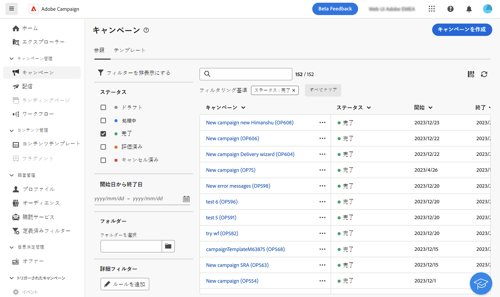

# フィルターリスト {#filter-lists}

オブジェクトのリストをフィルタリングすると、特定のコンテキスト条件に基づいて情報をフィルタリングできます。

## フィルターの適用 {#apply}

リストにフィルターを適用するには、リストの左上隅の検索バーの横にある「**[!UICONTROL フィルターを表示]**」ボタンをクリックします。

フィルターペインが開き、選択したリストで使用可能なフィルターが表示されます。

{zoomable="yes"}{width="70%" align="left" zoomable="yes"}

独自の条件に基づいてリストをフィルタリングするには、カスタムフィルターを作成します。これを行うには、フィルターパネルの下部を参照し、「**ルールを追加**」ボタンをクリックします。[カスタムフィルターの作成方法を学ぶ](#custom)

リストに適用すると、検索バーの下にフィルターが表示されます。個別のフィルターはいつでも削除できます。また、「**すべてクリア**」ボタンをクリックしてすべてのフィルターを削除することもできます。

## カスタムフィルターの作成 {#custom}

カスタムフィルターを使用すると、独自の条件に基づいてリストを絞り込むことができます。これらは、クエリモデラーを使用して設計されています。 カスタムフィルターを作成するには、次の手順に従います。

1. フィルターパネルを開き、パネルの下部にある「**ルールを追加**」ボタンをクリックします。

1. クエリモデラーが開きます。ニーズに応じて、フィルター条件を定義して組み合わせます。クエリモデラーの使用方法について詳しくは、[この節](../query/query-modeler-overview.md)を参照してください。

1. カスタムフィルターを設定したら、「**[!UICONTROL 確認]**」をクリックしてリストに適用します。
