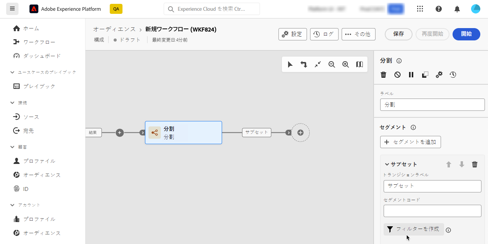

# クエリモデラーの概要 {#query-modeler}

>[!CONTEXTUALHELP]
>id="dc_orchestration_querymodeler_querymessage"
>title="クエリモデラー"
>abstract="データベースから、受信者またはその他のスキーマ（ターゲティングディメンションとも呼ばれる）のフィルタリング条件を定義します。"

クエリモデラーは、様々な条件に基づいてデータベースをフィルタリングするプロセスを簡素化します。また、クエリモデラーは非常に複雑で長いクエリを効率的に管理できるので、柔軟性と精度が向上します。さらに、条件内で定義済みフィルターをサポートしているので、包括的なオーディエンスのターゲティングとセグメント化戦略に高度な式と演算子を利用しながら、クエリを簡単に絞り込むことができます。

## クエリモデラーへのアクセス

クエリモデラーは、データをフィルタリングするルールを定義する必要があるすべてのコンテキストで使用できます。

| 用途 | 例 |
|  ---  |  ---  |
| **オーディエンスを定義**：構成でターゲットにする母集団を指定し、ニーズに合わせて新しいオーディエンスを簡単に作成します。 | {zoomable="yes"}{width="200" align="center" zoomable="yes"} |
| **アクティビティをカスタマイズ**：特定の要件に合わせて、**分割**&#x200B;や&#x200B;**紐付け**&#x200B;などの構成アクティビティ内にルールを適用します。[構成アクティビティの詳細情報](../compositions/activities.md) | {zoomable="yes"}{width="200" align="center" zoomable="yes"} |

## クエリモデラーインターフェイス {#interface}

クエリモデラーは、クエリを作成する中央のキャンバスと、クエリに関する情報を示す右側のパネルを提供します。

{zoomable="yes"}

### 中央のキャンバス {#canvas}

クエリモデラーの中央のキャンバスでは、クエリを作成する様々なコンポーネントを追加して組み合わせます。[クエリの作成方法を学ぶ](build-query.md)

キャンバスの右上隅にあるツールバーには、クエリコンポーネントを簡単に操作し、キャンバス内を移動するオプションが表示されます。

* **[!UICONTROL 複数選択モード]**：複数のフィルタリングコンポーネントを選択して、選択した場所にコピー＆ペーストします。
* **[!UICONTROL 回転]**：キャンバスを垂直方向に切り替えます。
* **[!UICONTROL 画面に合わせる]**：キャンバスのズームレベルを画面に合わせて調整します。
* **[!UICONTROL ズームアウト]**／**[!UICONTROL ズームイン]**：キャンバスをズームアウトまたはズームインします。
* **[!UICONTROL マップを表示]**：現在の位置を示すキャンバスのスナップショットを開きます。

### ルールのプロパティパネル {#rule-properties}

右側にある&#x200B;**[!UICONTROL ルールのプロパティ]**&#x200B;パネルには、クエリに関する情報が表示されます。これにより、様々な操作を実行してクエリを確認し、要件に合っていることを確認できます。このパネルは、オーディエンスを作成するクエリを作成する際に表示されます。[クエリを確認および検証する方法を学ぶ](build-query.md#check-and-validate-your-query)
