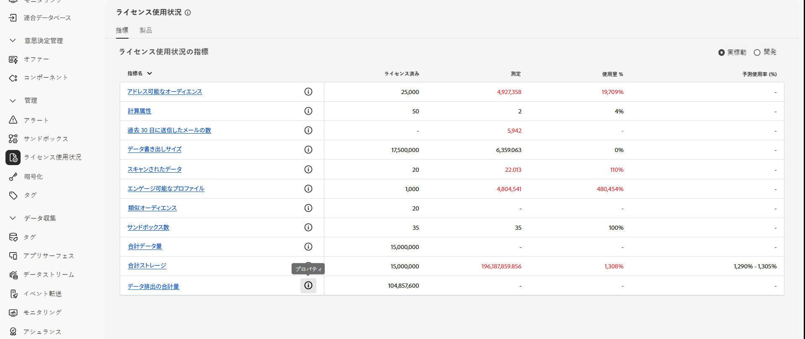
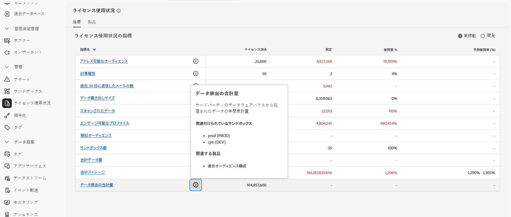

# 前提条件とガードレール {#fac-access}

連合オーディエンス構成には、Adobe Real-time Customer Data Platform や Adobe Journey Optimizer **Prime** または **Ultimate** パッケージが必要です。この機能にアクセスするには、連合オーディエンス構成アドオンを購入しておく必要があります。

>[!AVAILABILITY]
>
>アドビからウェルカムメール通知を受信した後、インターフェイスが更新され、機能が使用可能になるまで、さらに数時間かかる場合があります。

## サポートされているシステム {#supported-systems}

連合オーディエンス構成は、次のクラウドウェアハウスをサポートしています。

* Amazon Redshift
* Azure Synapse
* Databricks
* Google BigQuery
* Snowflake
* Vertica Analytics
* Microsoft Fabric

これらのシステムとの接続を作成する方法について詳しくは、[このページ](../connections/connections.md)を参照してください。

## サンドボックス

Federated Audience Composition を購入する場合、2 つのサンドボックスを使用できます。 その他のサンドボックスプロビジョニングリクエストについて詳しくは、アドビ担当者にお問い合わせください。

アクティブな Federated Audience Composition サンドボックスのリストを表示するには、次の手順に従います。

1. Federated Audience Composition から、**[!UICONTROL 管理]** の下の **[!UICONTROL ライセンスの使用]** メニューにアクセスします。

1. **[!UICONTROL データ出力の合計量]** の  アイコンをクリックして、サンドボックスのプロパティにアクセスします。

   

1. サンドボックスに関する情報がプロパティポップオーバーに表示されます。

   

## 権限 {#permissions}

連合オーディエンス構成にアクセスするには、購入時に作成されたサンドボックス固有の製品プロファイルにユーザーを追加し、**[!UICONTROL 連合データを管理]**&#x200B;権限を割り当てる必要があります。[詳細情報](feature-access.md)

## IP 許可リスト {#ip}

連合オーディエンス構成でデータベースに安全にアクセスできるようにするには、データベースにアクセスする連合オーディエンス構成サーバーの IP アドレスを承認する必要があります。これらの IP アドレスは、Adobe Experience Platform ユーザーインターフェイスで連合データベースを追加する際に表示されます。[詳細情報](../connections/connections.md)

連合オーディエンス構成のアクセス権を付与するには、これらの IP アドレスを許可リストに追加します。

## ガードレールと制限 {#fac-guardrails}

* 連合オーディエンス構成は現在、[正常性データを取り込み中の](https://experienceleague.adobe.com/ja/docs/events/customer-data-management-voices-recordings/governance/healthcare-shield)お客様は利用できません{target="_blank"}。[詳細情報](https://experienceleague.adobe.com/ja/docs/journey-optimizer/using/audiences-profiles-identities/audiences/about-audiences){target="_blank"}

<!--
* Federated Audience Composition is compatible with Privacy & Security Shield and can be used in all verticals except for healthcare industries. Currently, Federated Audience Composition cannot be licensed to customers looking to ingest health data. [Learn more](https://experienceleague.adobe.com/en/docs/events/customer-data-management-voices-recordings/governance/healthcare-shield){target="_blank"}-->

* [Adobe Real-Time Customer Data Platform ドキュメントにリストされているエンタイトルメント、製品の制限、パフォーマンスガードレールは ](https://experienceleague.adobe.com/ja/docs/experience-platform/profile/guardrails){target="_blank"}Federated Audience Composition に適用されます。

<!--* Federated Audience Composition supports the export of large audiences, with file sizes greater than 1 GB. For optimal performance, the maximum recommended file size is up to 20 GB.
-->

