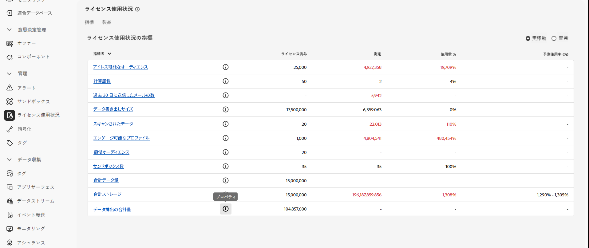
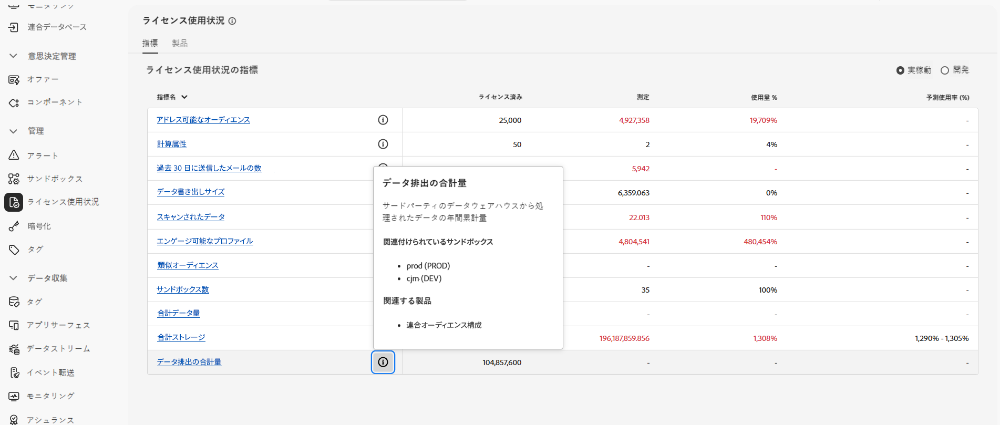

# 前提条件とガードレール {#fac-access}

連合オーディエンス構成には、Adobe Real-time Customer Data Platform や Adobe Journey Optimizer **Prime** または **Ultimate** パッケージが必要です。 この機能にアクセスするには、連合オーディエンス構成アドオンを購入しておく必要があります。

>[!AVAILABILITY]
>
>アドビからウェルカムメール通知を受信した後、インターフェイスが更新され、機能が使用可能になるまで、さらに数時間かかる場合があります。

## サポートされているシステム {#supported-systems}

連合オーディエンス構成は、次のクラウドウェアハウスをサポートしています。

* Amazon Redshift
* Azure Synapse
* Databricks
* Google BigQuery
* Snowflake
* Vertica Analytics
* Microsoft Fabric

これらのシステムとの接続を作成する方法について詳しくは、[接続の概要](../connections/home.md)を参照してください。

## サンドボックス

連合オーディエンス構成を購入すると、2 つのサンドボックスを使用できます。 その他のサンドボックスプロビジョニングリクエストについて詳しくは、アドビ担当者にお問い合わせください。

アクティブな連合オーディエンス構成サンドボックスのリストを表示するには、次の手順に従います。

1. 連合オーディエンス構成から、**[!UICONTROL 管理]**&#x200B;の下にある&#x200B;**[!UICONTROL ライセンス使用状況]**&#x200B;メニューにアクセスします。

1. **[!UICONTROL データ取り出しの合計量]**&#x200B;の  アイコンを選択して、サンドボックスのプロパティにアクセスします。

   

1. サンドボックスに関する情報がプロパティポップオーバーに表示されます。

   

## 権限 {#permissions}

連合オーディエンス構成にアクセスするには、購入時に作成されたサンドボックス固有の製品プロファイルにユーザーを追加し、**[!UICONTROL 連合データを管理]**&#x200B;権限を割り当てる必要があります。 [詳細情報](/help/governance-privacy-security/access-control.md)

## IP 許可リスト {#ip}

連合オーディエンス構成でデータベースに安全にアクセスできるようにするには、データベースにアクセスする連合オーディエンス構成サーバーの IP アドレスを承認する必要があります。 これらの IP アドレスは、Adobe Experience Platform ユーザーインターフェイスで連合データベースを追加する際に表示されます。 [詳細情報](../connections/home.md)

連合オーディエンス構成のアクセス権を付与するには、これらの IP アドレスを許可リストに追加します。

## 結合ポリシー {#merge-policies}

サンドボックスで&#x200B;**データセットの優先順位**&#x200B;結合ポリシーを使用している場合は、アドビカスタマーケアに連絡して、`Halos UPS` のデータセットを結合ポリシーに追加してください。

結合ポリシーについて詳しくは、[結合ポリシーの概要](https://experienceleague.adobe.com/ja/docs/experience-platform/profile/merge-policies/overview)を参照してください。

## ガードレールと制限 {#fac-guardrails}

* 連合オーディエンス構成に適用されるエンタイトルメント、製品の制限、パフォーマンスガードレールの一覧について詳しくは、[Adobe Real-time Customer Data Platform ドキュメント](https://experienceleague.adobe.com/ja/docs/experience-platform/profile/guardrails){target="_blank"}を参照してください。

* 連合オーディエンス構成は、ファイルサイズが 1 GB を超える大規模なオーディエンスのエクスポートをサポートしています。 最適なパフォーマンスを得るために、推奨される最大ファイルサイズは 20 GB までです。
