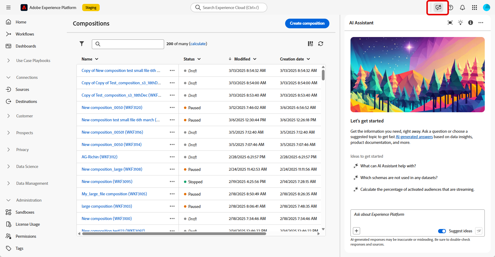

# AI アシスタントの操作 {#ai-assistant}

AI アシスタントは、アドビの概念をナビゲートして理解するために設計されたユーザーインターフェイス機能です。連合オーディエンス構成を含む Adobe Experience Cloud 全体の複数の製品の製品知識ユースケースで使用できます。

>[!CAUTION]
>
>AI アシスタントを使用するには、Adobe Experience Cloud 生成 AI ユーザーガイドラインに同意する必要があります。契約について詳しくは、[このページ](https://experienceleague.adobe.com/ja/docs/experience-platform/ai-assistant/home){target="_blank"}を参照してください。

連合オーディエンス構成では、プロセスの様々な部分に関連するアドビの概念について説明する製品知識にアクセスできます。AI アシスタントは、**オープン検出**（Experience League ドキュメントに基づいて製品の概念を探索）と&#x200B;**ターゲットを絞った学習とトラブルシューティング**（特定の機能について質問）の 2 つのタイプの製品知識をサポートします。

このような質問には、例えば次のものがあります。

* 連合オーディエンス構成とは何ですか？
* Snowflake 連合データベースアカウントを設定するにはどうすればよいですか？
* 連合構成を作成するにはどうすればよいですか？

質問するには：

1. 上部バーのアイコンを選択して、AI アシスタントにアクセスします。

   画面の右側のセクションに AI アシスタントが表示されます。 を選択して、AI アシスタントウィンドウを展開できます。

   

1. 画面下部にあるフィールドに入力し、Enter キーを押します。

   

1. 回答を確認し、「**ソースを表示**」ボタンを使用して製品ドキュメントへの直接リンクを取得し、詳細を確認してください。

   

1. サムアップまたはサムダウンを使用して回答を評価します。

AI アシスタントの使用方法、AI アシスタントを使用して達成できる目標の例、AI アシスタントの仕組みについて詳しくは、[Adobe Experience Platform ドキュメント](https://experienceleague.adobe.com/ja/docs/experience-platform/ai-assistant/home){target="_blank"}を参照してください。
