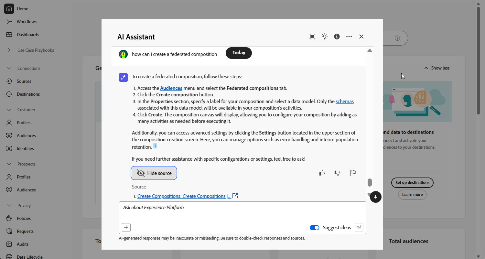

# AI アシスタントを使用する {#ai-assistant}

AI アシスタントは、Adobeの概念をナビゲートして理解し、特定の環境の運用に関するインサイトを取得するのに役立つように設計されたユーザーインターフェイス機能です。 連合オーディエンス構成を含む Adobe Experience Cloud 全体の複数の製品で使用できます。

AI アシスタントにアクセスするには、上部バーのアイコンをクリックします。 AI アシスタントが画面の右側のセクションに表示されます。

>[!CAUTION]
>
>AI アシスタントを使用するには、Adobe Experience Cloud ジェネレーティブ AI ユーザーガイドラインに同意する必要があります。 契約について詳しくは、[ このページ ](https://experienceleague.adobe.com/ja/docs/experience-platform/ai-assistant/home){target="_blank"} を参照してください。

連合オーディエンス構成では、プロセスの様々な側面に関連するアドビの概念に関する製品知識の質問にアクセスできます。このような質問には、例えば次のものがあります。

* Snowflake と Adobe Experience Platform 間の連合接続を確立するために必要な設定は何ですか？
* 連合オーディエンス構成で構成を設定するにはどうすればよいですか？
* クエリモデラーで定義済みフィルターを使用してオーディエンスの選択を絞り込むにはどうすればよいですか？

質問するには：

1. 画面下部にあるフィールドに入力し、Enter キーを押します。

   

1. 回答を確認し、「**ソースを表示**」ボタンを使用して製品ドキュメントへの直接リンクを取得し、詳細を確認してください。

   

1. サムアップまたはサムダウンを使用して回答を評価します。

AI アシスタントの使用方法については、AI アシスタントを使用して達成できる目標の例や、AI アシスタントの仕組みを参照してください。[Adobe Experience Platformのドキュメント ](https://experienceleague.adobe.com/ja/docs/experience-platform/ai-assistant/home){target="_blank"}。
