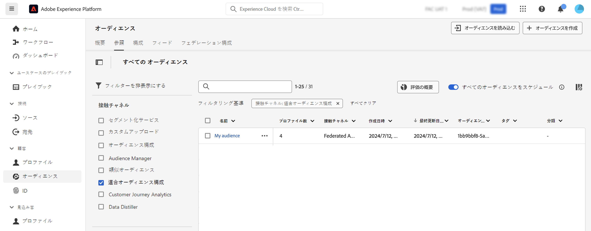

# オーディエンスの操作 {#gs-audiences}

Experience Platformの Federated Audience コンポジションを使用すると、様々なアクティビティをビジュアルキャンバスに活用してオーディエンスを作成し、Adobe Experience Platform Audience Portal に保存できる [ コンポジションを作成 ](../compositions/gs-compositions.md) できます。

その後、これらのオーディエンスをJourney Optimizerでターゲットにするか、Adobe Experience Platformでサポートされる任意の宛先に対してアクティブ化できます。

## コンポジションを使用したオーディエンスの作成 {#creation}

Federated Audience コンポジションを使用してオーディエンスを作成するには、**[!UICONTROL オーディエンスを保存]** アクティビティを含むコンポジションを作成する必要があります。 このアクティビティを使用すると、オーディエンスをオーディエンスポータルに保存したり、外部データベースからフィールドを選択してオーディエンスに含めたりできます。 [「オーディエンスを保存」アクティビティの設定方法の詳細情報](../compositions/activities/save-audience.md)

Adobeの Federated Data Composition を使用して作成されたオーディエンスには、**[!UICONTROL オーディエンスを保存]** アクティビティで選択されたすべてのフィールドが含まれ、すべてのAdobe Experience Platform オーディエンスと共に Audience Portal に保存されます。

コンポジションを実行すると、結果のオーディエンスが外部オーディエンスとしてAdobe Experience Platformに保存され、Adobeの Real-time Customer Data Platform やAdobe Journey Optimizerで使用できるようになります。

これらのオーディエンスは、Adobe Experience Platformでサポートされている任意の宛先に対してアクティブ化できます。 [Adobe Experience Platform](https://experienceleague.adobe.com/en/docs/experience-platform/destinations/home){target="_blank"} の宛先を操作する方法を説明します

>[!NOTE]
>
>アドビの連合オーディエンス構成を使用して作成されたオーディエンスは編集できません。これらのオーディエンスのいずれかを変更するには、構成を使用して新しいオーディエンスを作成する必要があります。

## Adobe Experience Platformでのオーディエンスへのアクセス {#access-audience}

Federated Audience コンポジションを使用して作成されたオーディエンスは、Audience Portal でアクセス可能になります。このポータルには、**オーディエンス** メニューからアクセスできます。

「**[!UICONTROL 参照]**」タブには、Adobe Experience Platform に保存されている既存のオーディエンスがすべて表示されます。**[!UICONTROL 接触チャネル]**&#x200B;列または左パネルで使用可能なフィルターを使用して、リスト内の連合オーディエンス構成オーディエンスを特定できます。

Adobe Experience Platformでのオーディエンスの操作方法について詳しくは、[Audience Portal ドキュメント ](https://experienceleague.adobe.com/ja/docs/experience-platform/segmentation/ui/audience-portal){target="_blank"} を参照してください。

<!-- add link to this donc once published: https://jira.corp.adobe.com/browse/PLAT-198674-->